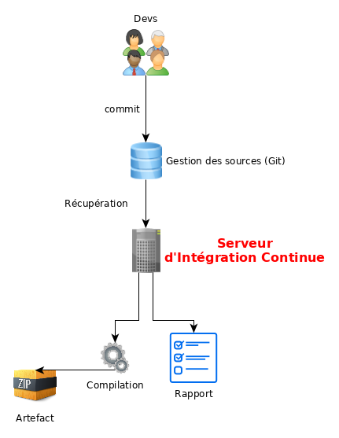

= Généralités devops

Le mouvement *indexterm2:[devops]* cherche à optimiser le travail de toutes les équipes intervenant sur un système d'information.

* Les développeurs (les **dev**) cherchent à ce que leurs applications soient déployées le plus souvent et le plus rapidement possible.

* Les administrateurs systèmes, réseaux ou de bases de données (les **ops**) cherchent à garantir la stabilité, la sécurité de leurs systèmes et leur disponibilité.

Les objectifs des *dev* et des *ops* sont donc bien souvent opposés, la communication entre les équipes parfois difficile : les dev et les ops n'utilisent pas toujours les mêmes éléments de langage.

* Il n'y a rien de plus frustrant pour un développeur que de devoir attendre la disponibilité d'un administrateur système pour voir la nouvelle fonctionnalité de son application être mise en ligne ;

* Quoi de plus frustrant pour un administrateur système de devoir déployer une nouvelle mise à jour applicative manuellement alors qu'il vient de finir la précédente ?

La philosophie devops regroupe l'ensemble des outils des deux mondes, offre un langage commun, afin de faciliter le travail des équipes avec comme objectif la performance économique pour l'entreprise.

Le travail des développeurs et des administrateurs doit être simplifié afin d'être automatisé avec des outils spécifiques.

== Le vocabulaire DEVOPS

* le *build* : concerne la conception de l'application ;
* le *run* : concerne la maintenance de l'application ;
* le *change* : concerne l'évolution de l'application.
* l'**intégration continue** (Continuous Integration CI) : chaque modification d'un code source entraîne une vérification de non-régression de l'application.

.Schéma de fonctionnement de l'intégration continue

* *automation* (automatisation) : fonctionnement d'un système sans intervention humaine, automatisation d'une suite d'opération.

* **idempotence** : une opération est idempotente si elle a le même effet qu'on l'applique une ou plusieurs fois. Les outils de gestion de configuration sont généralement idempotent.

* **orchestration** : processus automatique de gestion d'un système informatique.

* **provisionning** : processus d'allocation automatique des ressources.

== Pourquoi scripter en Bash n'est pas considéré comme de l'automatisation ? 

Ou les langages impératifs contre les languages déclaratifs...

Même si la connaissance du *Bash* est une exigence de base pour un administrateur système, celui-ci est un langage de programmation interprété "**impératif**". Il exécute les instructions les unes à la suite des autres.

Les langages dédiés au domaine (**DSL** Domain Specific Language) comme Ansible ou Puppet, quant à eux, ne spécifient pas les étapes à réaliser mais l'état à obtenir.

Parce qu'Ansible ou Puppet utilisent un langage déclaratif, ils sont très simples. Il suffit de leur dire "Fais cette action" ou "Met le serveur dans cet état". Ils considéreront l'état désiré indépendamment de l'état initial ou du contexte. Peu importe dans quel état le serveur se situe au départ, les étapes à franchir pour arriver au résultat, le serveur est mis dans l'état désiré avec un rapport de succès (avec ou sans changement d'état) ou d'échec.

La même tâche d'automatisation en bash nécessiterait de vérifier tous les états possibles, les autorisations, etc. afin de déterminer la tâche à accomplir avant de lancer l'exécution de la commande, souvent en imbriquant de nombreux "si", ce qui complique la tâche, l'écriture et la maintenance du script.

== Les outils devops

* Outils de gestion de configuration

** Puppet
** Ansible
** Saltstack
** Chef

* Intégration continue

** Jenkins
** Gitlab-ci

* Orchestration des tâches

** Rundeck