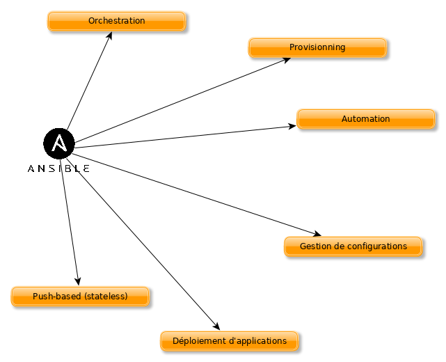

////
Les supports de Formatux sont publiés sous licence Creative Commons-BY-SA et sous licence Art Libre.
Vous êtes ainsi libre de copier, de diffuser et de transformer librement les œuvres dans le respect des droits de l’auteur.

    BY : Paternité. Vous devez citer le nom de l’auteur original.
    SA : Partage des Conditions Initiales à l’Identique.

Licence Creative Commons-BY-SA : https://creativecommons.org/licenses/by-sa/3.0/fr/
Licence Art Libre : http://artlibre.org/

Auteurs : Patrick Finet, Xavier Sauvignon, Antoine Le Morvan
////

= Ansible

Ansible centralise et automatise les tâches d'administration. Il est sans agent (il ne nécessite pas de déploiements spécifiques sur les clients), idempotent (effet identique à chaque exécution) et utilise le protocole SSH pour configurer à distance les clients Linux. 

L'interface graphique web Ansible Tower est payante.

.Les fonctionnalités d'Ansible

[IMPORTANT]
====
L'ouverture des flux SSH vers l'ensemble des clients depuis le serveur Ansible font de lui un elément critique de l'architecture qu'il faudra attentivement surveiller.
====

== Le vocabulaire ansible

* Le *poste de gestion* : la machine sur laquelle Ansible est installé. Ansible étant **agentless**, aucun logiciel n'est déployé sur les serveurs gérés.
* L'**inventaire** : un fichier contenant les informations concernant les serveurs gérés.
* Les *tâches* (tasks) : une tâche est un bloc définissant une procédure à exectuer (par exemple créer un utilisateur ou un groupe, installer un paquet logiciel, etc.)
* Un *module* : un module rend abstrait une tâche. Il existe de nombreux modules fournis par Ansible.
* Les *playbooks* : un fichier simple au format yaml définissant les serveurs cibles et les tâches devant être effectuées.
* Un *rôle* : un rôle permet d'organiser les playbooks et tous les autres fichiers nécessaires (modèles, scripts, etc.) pour faciliter le partage et la réutilisation du code.
* Les *facts* : ce sont des variables globales contenant des informations à propos du système (nom de la machine, version du système, interface et configuration réseau, etc.)
* les **handlers**: il sont utilisés pour provoquer un arrêt ou un redémarrage d'un service en cas de changement.

== Installation sur le serveur de gestion

Ansible est disponible dans le dépôt EPEL :

* Installation d'EPEL :
[source,bash]
----
$ sudo yum install epel-release
----

La configuration du serveur se situe sous /etc/ansible.

Deux fichiers de configuration :

* Le fichier de configuration principal __ansible.cfg__ : commandes, modules, plugins, configuration ssh ;
* Le fichier inventaire de gestion des machines clientes  __hosts__ : déclaration des clients, des groupes.

.Le fichier /etc/ansible/hosts
[source,bash]
----
# This is the default ansible 'hosts' file.
#
# It should live in /etc/ansible/hosts
#
#   - Comments begin with the '#' character
#   - Blank lines are ignored
#   - Groups of hosts are delimited by [header] elements
#   - You can enter hostnames or ip addresses
#   - A hostname/ip can be a member of multiple groups

# Ex 1: Ungrouped hosts, specify before any group headers.

## green.example.com
## blue.example.com
## 192.168.100.1
## 192.168.100.10

# Ex 2: A collection of hosts belonging to the 'webservers' group

## [webservers]
## alpha.example.org
## beta.example.org
## 192.168.1.100
## 192.168.1.110

# If you have multiple hosts following a pattern you can specify
# them like this:

## www[001:006].example.com

# Ex 3: A collection of database servers in the 'dbservers' group

## [dbservers]
##
## db01.intranet.mydomain.net
## db02.intranet.mydomain.net
## 10.25.1.56
## 10.25.1.57

# Here's another example of host ranges, this time there are no
# leading 0s:

## db-[99:101]-node.example.com
----

Par exemple, un groupe "centos7" est créé en insérant le bloc suivant dans ce fichier :

.Le fichier /etc/ansible/hosts
[source,]
----
[centos7]
172.16.1.217
172.16.1.192
----

== Utilisation en ligne de commande

La commande ansible lance une tâche sur un ou plusieurs hôtes cibles.

.Syntaxe de la commande ansible
[source,bash]
----
ansible <host-pattern> [-m module_name] [-a args] [options]
----

Exemples :

* Lister les hôtes appartenant à un groupe :

[source,bash]
----
ansible {{group}} --list-hosts
----

* Pinger un groupe d'hôtes avec le module ping :

[source,bash]
----
ansible {{group}} -m ping
----

* Afficher des facts d'un groupe d'hôtes avec le module setup :

[source,bash]
----
ansible {{group}} -m setup
----

* Exécuter une commande sur un groupe d'hôtes en invoquant le module command avec des arguments :

[source,]
----
ansible {{group}} -m command -a '{{commande}}'
----

* Exécuter une commande avec les privilèges d'administrateur :

[source,bash]
----
ansible {{group}} --become --ask-become-pass -m command -a '{{commande}}'
----

* Exécuter une commande en utilisant un fichier d'inventaire personnalisé :

[source,bash]
----
ansible {{group}} -i {{inventory_file}} -m command -a '{{commande}}'
----

.Options principales de la commande ansible
[cols="1,4",width="100%",options="header"]
|====================
| Option | 	Information
| -a 'arguments'| 	 Les arguments à passer au module.
| -b -K| 	Demande un mot de passe et lance la commande avec des privilèges supérieurs.
|  --user=utilisateur | Utilise cet utilisateur pour se connecter à l'hôte cible au lieu d'utiliser l'utilisateur courant.
|  --become-user=utilisateur | Exécute l'opération en tant que cet utilisateur (défaut : root).
| -C | Simulation. Ne fait pas de changement sur la cible mais la teste pour voir ce qui devrait être changé.
| -m module | Exécute le module appelé
|====================

=== Tester avec le module ping

Par défaut la connexion par mot de passe n'est pas autorisée par Ansible.

Décommenter la ligne suivante de la section [defaults] dans le fichier de configuration /etc/ansible/ansible.cfg :

[source,bash]
----
ask_pass      = True
----

Lancer un ping sur chacun des serveurs du groupe CentOS 6 : 

[source,bash]
----
# ansible centos7 -m ping
SSH password:
172.16.1.192 | SUCCESS => {
    "changed": false,
    "ping": "pong"
}
172.16.1.217 | SUCCESS => {
    "changed": false,
    "ping": "pong"
}
----

[NOTE]
====
Le mot de passe root des serveurs distants vous est demandé, ce qui pose un problème de sécurité...
====

=== Authentification par clef
L'authentification par mot de passe va être remplacée par une authentification par clefs privée/publique beaucoup plus sécurisée.

==== Création d'une clef SSH
La bi-clefs va être générée avec la commande *ssh-keygen* :

[source,bash]
----
# ssh-keygen
Generating public/private rsa key pair.
Enter file in which to save the key (/root/.ssh/id_rsa):
Enter passphrase (empty for no passphrase):
Enter same passphrase again:
Your identification has been saved in /root/.ssh/id_rsa.
Your public key has been saved in /root/.ssh/id_rsa.pub.
The key fingerprint is:
SHA256:RpYuJzkkaeZzve8La8Xd/8kTTE8t43DeS+L7WB26WF8 root@ansible-srv
The key's randomart image is:
+---[RSA 2048]----+
|                 |
|     .   .       |
|    = . +       .|
|   + o *    . +.o|
|    o * S. . *o*.|
|     o * .o ..=+=|
|        o.  .oooE|
|        .+  o.*o+|
|       ...+o +o=+|
+----[SHA256]-----+

----

La clef publique peut être copiée sur les serveurs :

[source,]
----
# ssh-copy-id root@172.16.1.192
# ssh-copy-id root@172.16.1.217
----

Re-commenter la ligne suivante de la section [defaults] dans le fichier de configuration /etc/ansible/ansible.cfg pour empêcher l'authentification par mot de passe :

[source,bash]
----
#ask_pass      = True
----

==== Test d'authentification par clef privée

Pour le prochain test, le module shell, permettant l'exécution de commandes à distance, est utilisé :

[source,]
----
# ansible centos7 -m shell -a "uptime"
172.16.1.192 | SUCCESS | rc=0 >>
 12:36:18 up 57 min,  1 user,  load average: 0.00, 0.00, 0.00

172.16.1.217 | SUCCESS | rc=0 >>
 12:37:07 up 57 min,  1 user,  load average: 0.00, 0.00, 0.00
----

Aucun mot de passe n'est demandé, l'authentification par clé privée/publique fonctionne !

=== Exemple de connexion à une instance Cloud Amazon ECS

Lors de la création d'une instance Amazon, une clef privée est créée et téléchargée sur le poste local.

Ajout de la clef dans l'agent SSH :
[source,bash]
----
ssh-add path/to/fichier.pem
----

Lancement des facts sur les serveurs aws :

[source,]
----
ansible aws --user=ec2-user --become -m setup
----

Pour une image ubuntu, il faudra utiliser l'utilisateur ubuntu :

[source,]
----
ansible aws --user=ubuntu --become -m setup
----

== Utilisation

Ansible peut être utilisé depuis l'interpréteur de commandes ou via des playbooks.

=== Les modules

La liste des modules classés par catégories se trouve à l'adresse http://docs.ansible.com/ansible/modules_by_category.html. Ansible en propose plus de 750 !

Un module s'invoque avec l'option -m de la commande ansible

Il existe un module pour chaque besoin ou presque ! Il est donc conseillé, au lui d'utiliser le module shell, de chercher un module adapté au besoin.

Chaque catégorie de besoin dispose de son module. En voici une liste non exhaustive :

.Catégories de modules
[width="100%",options="header"]
|====================
| Type | Exemples
| Gestion du système | user (création des utilisateurs), group (gestion des groupes), etc. 
| Gestion des logiciels | yum, apt, pip, npm 
| Gestion des fichiers | copy, fetch, lineinfile, template, archive 
| Gestion des bases de données | mysql, postgresql, redis 
| Gestion du cloud | amazon S3, cloudstack, openstack
| Gestion d'un cluster |  consul, zookeeper
| Envoyer des commandes |  shell, script, expect
| Gestion des messages |  
| Gestion du monitoring |  
| Gestion du réseau |  get_url
| Gestion des notifications |  
| Gestion des sources |  git, gitlab
|====================

==== Exemples d'installation logiciel

Le module yum permet d'installer des logiciels sur les clients cibles :

[source,]
----
# ansible centos7 -m yum -a name="httpd"
172.16.1.192 | SUCCESS => {
    "changed": true,
    "msg": "",
    "rc": 0,
    "results": [
      ...
      \n\nComplete!\n"
    ]
}
172.16.1.217 | SUCCESS => {
    "changed": true,
    "msg": "",
    "rc": 0,
    "results": [
      ...
    \n\nComplete!\n"
    ]
}     
----

Le logiciel installé étant un service, il faut maintenant le démarrer avec le module service (CentOS 6) ou systemd (CentOS 7) :

[source,]
----
# ansible centos7 -m systemd -a "name=httpd state=started"
172.16.1.192 | SUCCESS => {
    "changed": true,
    "name": "httpd",
    "state": "started"
}
172.16.1.217 | SUCCESS => {
    "changed": true,
    "name": "httpd",
    "state": "started"
}
----

=== Les playbooks

Les playbooks ansible décrivent une politique à appliquer à des systèmes distants, pour forcer leur configuration. Les playbooks sont écrits dans un format texte facilement compréhensible regroupant un ensemble de tâches : le format yaml.

[NOTE]
====
En savoir plus sur le yaml : http://docs.ansible.com/ansible/YAMLSyntax.html
====

.Syntaxe de la commande ansible-playbook
[source,bash]
----
ansible-playbook <fichier.yml> ... [options]
----

Les options sont identiques à la commande ansible.

La commande renvoi les codes d'erreurs suivants :

.Codes de sortie de la commande ansible-playbook
[cols="1,4",width="100%",options="header"]
|====================
| 0 | OK ou aucun hôte correspondant
| 1 | Erreur
| 2 | Un ou plusieurs hôtes sont en échecs
| 3 | Un ou plusieurs hôtes ne sont pas joignables
| 4 | Erreur d'analyse
| 5 | Mauvaises options ou options incomplètes
| 99 | Execution interrompue par l'utilisateur
| 250 | Erreur inattendue
|====================

==== Exemple de playbook Apache et MySQL

Le playbook suivant permet d'installer Apache et MySQL sur nos serveurs cibles :

[source,yaml]
----
---
- hosts: centos7
  remote_user: root

  tasks:
  - name: ensure apache is at the latest version
    yum: name=httpd,php,php-mysqli state=latest
  - name: ensure httpd is started
    systemd: name=httpd state=started
  - name: ensure mysql is at the latest version
    yum: name=mysql-server state=latest
  - name: ensure mysqld is started
    systemd: name=mysqld state=started
----

L'exécution du playbook s'effectue avec la commande *ansible-playbook* : 

[source,bash]
----
$ ansible-playbook test

PLAY [centos7] ****************************************************************

TASK [setup] ******************************************************************
ok: [172.16.1.192]
ok: [172.16.1.217]

TASK [ensure apache is at the latest version] *********************************
ok: [172.16.1.192]
ok: [172.16.1.217]

TASK [ensure httpd is started] ************************************************
changed: [172.16.1.192]
changed: [172.16.1.217]

TASK [ensure mysql is at the latest version] **********************************
changed: [172.16.1.192]
changed: [172.16.1.217]

TASK [ensure mysqld is started] ***********************************************
changed: [172.16.1.192]
changed: [172.16.1.217]

PLAY RECAP *********************************************************************
172.16.1.192             : ok=5    changed=3    unreachable=0    failed=0
172.16.1.217             : ok=5    changed=3    unreachable=0    failed=0
----

==== Exemple de préparation d'un noeud MySQL

Dans ce playbook, deux serveurs Cloud vont être préparés pour devenir des serveurs Multi-Maître MySQL (voir cours MySQL Multi-Maître).

Le playbook utilise :

* Des variables ;
* Ajoute des lignes dans le fichier /etc/hosts ;
* Installe et démarre MariaDB ;
* Créer une base de données, un utilisateur et lui donne tous les droits sur les bases de données.

[source,]
----
---

- hosts: aws
  remote_user: ec2-user
  become: yes
  vars:
    mysqlpackage: "mariadb-server,MySQL-python"
    mysqlservice: "mariadb"
    mysql_port: "3306"
    dbuser: "synchro"
    dbname: "mabase"
    upassword: "M!rro!r"

  tasks:
    - name: configurer le noeud 1 dans /etc/hosts
      lineinfile:
              dest: /etc/hosts
              line: "13.59.197.48 mirroir1.local.lan mirroir1"
              state: present
    - name: configurer le noeud 2 dans /etc/hosts
      lineinfile:
              dest: /etc/hosts
              line: "52.14.125.109 mirroir2.local.lan mirroir2"
              state: present
    - name: mariadb installe et a jour
      yum: name="{{ mysqlpackage }}" state=latest
    - name: mariadb est demarre
      service: name="{{ mysqlservice }}" state=started
    - name: creer la base de donnee
      mysql_db: name="{{ dbname }}" state=present
    - name: creer un utilisateur
      mysql_user: name="{{ dbuser }}" password="{{ upassword }}" priv=*.*:ALL host='%' state=present
    - name: restart mariadb
      service: name="{{ mysqlservice }}" state=restarted
...

----

== La gestion des boucles

Il existe plusieurs type de boucles sous Ansible :

* with_items
* with_file
* with_fileglob
* ...

Exemple d'utilisation : création de 3 utilisateurs :

[source,]
----
- name: ajouter des utilisateurs
  user:
    name: "{{ item }}"
    state: present
    groups: "users"
  with_items:
     - antoine
     - xavier
     - patrick
----

== Les rôles

Un rôle Ansible est une unité favorisant la réutilisabilité des playbooks.

Un squelette de rôle, servant comme point de départ du développement d'un rôle personnalisé, peut être généré par la commande **ansible-galaxy** :

[source,]
----
$ ansible-galaxy init formatux
----

La commande aura pour effet de générer l'arborescence suivante pour contenir le rôle formatux :

[source,]
----
$ tree formatux
formatux/
├── defaults
│   └── main.yml
├── handlers
│   └── main.yml
├── meta
│   └── main.yml
├── README.md
├── tasks
│   └── main.yml
├── tests
│   ├── inventory
│   └── test.yml
└── vars
    └── main.yml
----

=== La commande ansible-galaxy

La commande *ansible-galaxy* gère des rôles en utilisant le site http://galaxy.ansible.com[galaxy.ansible.com].

.Syntaxe de la commande ansible-galaxy
[source,]
----
ansible-galaxy [import|init|install|login|remove|...]
----

.Sous-commandes de la commande ansible-galaxy
[cols="1,4",width="100%",options="header"]
|====
| Sous-commandes  |  Observations
| install   |  installe un rôle
| remove    |  retire un ou plusieurs rôles
| init | génère un squelette de nouveau rôle
| import | importe un rôle depuis le site web galaxy. Nécessite un login au préalable.
|====
