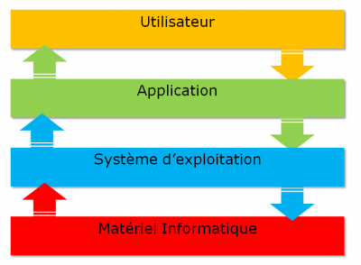
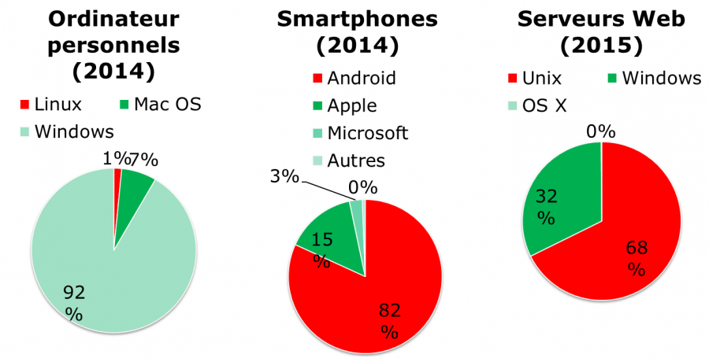
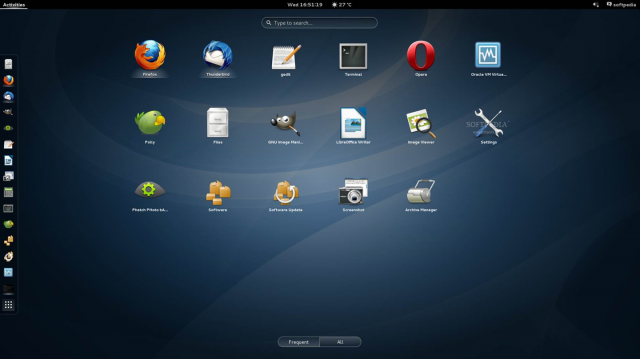
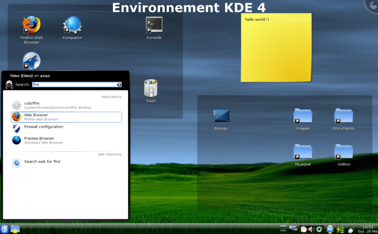
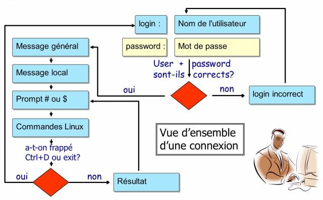

////
Les supports de Formatux sont publiés sous licence Creative Commons-BY-SA et sous licence Art Libre.
Vous êtes ainsi libre de copier, de diffuser et de transformer librement les œuvres dans le respect des droits de l’auteur.

    BY : Paternité. Vous devez citer le nom de l’auteur original.
    SA : Partage des Conditions Initiales à l’Identique.

Licence Creative Commons-BY-SA : https://creativecommons.org/licenses/by-sa/3.0/fr/
Licence Art Libre : http://artlibre.org/

Auteurs : Patrick Finet, Xavier Sauvignon, Antoine Le Morvan
////
= Introduction

== Qu'est-ce qu'un système d'exploitation ?

Linux est un **système d'exploitation**.

Un système d'exploitation est un **ensemble de programmes permettant la gestion des ressources disponibles d'un ordinateur**.

Parmi cette gestion des ressources, le système d'exploitation est amené à :

*  Gérer la mémoire physique ou virtuelle.
** La **mémoire physique** est composée des barrettes de mémoires vives et de la mémoire cache du processeur, qui sert pour  l'exécution des programmes.
** La **mémoire virtuelle** est un emplacement sur le disque dur (la partition **swap**) qui permet de décharger la mémoire physique et de sauvegarder l'état en cours du système durant l'arrêt électrique de l'ordinateur (hibernation du système).
* Intercepter les **accès aux périphériques**.
Les logiciels ne sont que très rarement autorisés à accéder directement au matériel (à l'exception des cartes graphiques pour des besoins très spécifiques).
* Offrir aux applications une **gestion correcte des tâches**.
Le système d'exploitation est responsable de l'ordonnancement des processus pour l'occupation du processeur.
* **Protéger les fichiers** contre tout accès non autorisé.
* **Collecter les informations** sur les programmes utilisés ou en cours d'utilisation.

.Fonctionnement d'un système d'exploitation

== Généralités UNIX - GNU/Linux

=== Historique

==== UNIX

* De **1964 à 1968** :
MULTICS (MULTiplexed Information and Computing Service) est développé pour le compte du MIT, des laboratoires Bell Labs (AT&T) et de General Electric.

*   **1969** : Après le retrait de Bell (1969) puis de General Electric du projet, deux développeurs (Ken Thompson et Dennis Ritchie), rejoints plus tard par Brian Kernighan, jugeant MULTICS trop complexe, lancent le développement d'UNIX (UNiplexed Information and Computing Service). 
À l'origine développé en assembleur, les concepteurs d'UNIX ont développé le langage B puis le langage C (1971) et totalement réécrit UNIX. Ayant été développé en 1970,  la date de référence des systèmes UNIX/Linux est toujours fixée au 01 janvier 1970.

Le langage C fait toujours partie des langages de programmation les plus populaires aujourd'hui ! Langage de bas niveau, proche du matériel, il permet l'adaptation du système d'exploitation à toute architecture machine disposant d'un compilateur C.

UNIX est un système d'exploitation ouvert et évolutif ayant joué un rôle primordial dans l'histoire de l'informatique. Il a servi de base pour de nombreux autres systèmes : Linux, BSD, Mac OSX, etc.

UNIX est toujours d'actualité (HP-UX, AIX, Solaris, etc.)

==== Minix

* **1987** : Minix. A.S. Tanenbaum développe MINIX, un UNIX simplifié, pour enseigner les systèmes d'exploitation de façon simple. M. Tanenbaum rend disponible les sources de son système d'exploitation.

==== Linux

.Linus Torvald, créateur du noyau Linux
image::./images/0101-linux-presentation-linus-torvald.png["Linus Torvald",scaledwidth="30%"]

* **1991** : Linux. Un étudiant finlandais, indexterm2:[Linus Torvalds], crée un système d'exploitation dédié à son ordinateur personnel et le nomme Linux. Il publie sa première version 0.02, sur le forum de discussion Usenet et d'autres développeurs viennent ainsi l'aider à améliorer son système. Le terme Linux est un jeu de mot entre le prénom du fondateur, Linus, et UNIX.

* **1993** : La distribution Debian est créée. Debian est une distribution non commerciale a gestion associative. À l'origine développée pour une utilisation sur des serveurs, elle est particulièrement bien adaptée à ce rôle, mais elle se veut être un système universel et donc utilisable également sur un ordinateur personnel. Debian est utilisée comme base pour de nombreuses autres distributions, comme Mint ou Ubuntu.

*   **1994** : La distribution commerciale RedHat est créée par la société RedHat, qui est aujourd'hui le premier distributeur du système d'exploitation GNU/Linux. RedHat soutient la version communautaire Fedora et depuis peu la distribution libre CentOS.

* **1997** : L'environnement de bureau KDE est créé. Il est basé sur la bibliothèque de composants Qt et sur le langage de développement C++.

* **1999** : L'environnement de bureau Gnome est créé. Il est quant à lui basé sur la bibliothèque de composants GTK+.

* **2002** : La distribution Arch est créée. Sa particularité est d'être diffusée en Rolling Release (mise à jour en continue).

* **2004** : Ubuntu est créée par la société Canonical (Mark Shuttleworth). Elle se base sur Debian, mais regroupe des logiciels libres et privateurs.

=== Parts de marché

.Les parts de marché de Linux

Linux est finalement encore peu connu du grand public, alors que ce dernier l'utilise régulièrement. En effet, Linux se cache dans les **smartphones**, les **téléviseurs**, les **box internet**, etc. Presque **70% des pages web** servies dans le monde le sont par un serveur Linux ou UNIX !

Linux équipe un peu plus d'**1,5% des ordinateurs personnels** mais plus de **82% des smartphones**. **Android** étant un système d'exploitation dont le kernel est un Linux.

=== Architecture

* Le noyau (ou indexterm2:[kernel]) est le premier composant logiciel.
** Il est le cœur du système UNIX.
** C’est lui qui gère les ressources matérielles du système.
** Les autres composants logiciels passent obligatoirement par lui pour accéder au matériel.
*   Le Shell indexterm:[shell] est un utilitaire qui interprète les commandes de l’utilisateur et assure leur exécution.
** Principaux shell : Bourne shell, C shell, Korn shell et Bourne Again shell (bash).
* Les applications regroupent les programmes utilisateurs comme :
** le navigateur internet ;
** le traitement de texte ;
** …

==== Multitâche

Linux fait partie de la famille des systèmes d'exploitation à temps partagé. Il partage le temps d'utilisation processus entre plusieurs programmes, passant de l'un à l'autre de façon transparente pour l'utilisateur. Cela implique :

* exécution simultanée de plusieurs programmes ;
* distribution du temps CPU par l'ordonnanceur ;
* réduction des problèmes dus à une application défaillante ;
* diminution des performances lorsqu'il y a trop de programmes lancés.

==== Multiutilisateurs

La finalité de Multics était de permettre à plusieurs utilisateurs de travailler à partir de plusieurs terminaux (écran et clavier) sur un seul ordinateur (très coûteux à l'époque). Linux étant un descendant de ce système d'exploitation, il a gardé cette capacité à pouvoir fonctionner avec plusieurs utilisateurs simultanément et en toute indépendance, chacun ayant son compte utilisateur, son espace de mémoire et ses droits d'accès aux fichiers et aux logiciels.

==== Multiprocesseur

Linux est capable de travailler avec des ordinateurs multiprocesseurs ou avec des processeurs multicœurs.

==== Multiplateforme

Linux est écrit en langage de haut niveau pouvant s’adapter à différents types de plate-formes lors de la compilation. Il fonctionne donc sur :

* les ordinateurs des particuliers (le PC ou l'ordinateur portable) ;
* les serveurs (données, applications,…) ;
* les ordinateurs portables (les smartphones ou les tablettes) ;
* les systèmes embarqués (ordinateur de voiture) ;
* les éléments actifs des réseaux (routeurs, commutateurs) ;
* les appareils ménagers (téléviseurs, réfrigérateurs,…).

==== Ouvert

Linux se base sur des standards reconnus (http://fr.wikipedia.org/wiki/POSIX[posix], TCP/IP, NFS, Samba …) permettant de partager des données et des services avec d'autres systèmes d'applications.

=== La philosophie UNIX

* Tout est fichier.
* Portabilité.
* Ne faire qu'une seule chose et la faire bien.
* KISS : Keep It Simple and Stupid.
* “UNIX est simple, il faut juste être un génie pour comprendre sa simplicité” (__Dennis Ritchie__)
* “UNIX est convivial. Cependant UNIX ne précise pas vraiment avec qui.” (__Steven King__)

== Les distributions GNU/LINUX

Une indexterm2:[distribution] Linux est un **ensemble cohérent de logiciels** assemblés autour du noyau Linux et prêt à être installé. Il existe des distributions **associatives ou communautaires** (Debian, CentOS) ou **commerciales** (RedHat, Ubuntu). 

Chaque distribution propose un ou plusieurs **environnements de bureau**, fournit un ensemble de logiciels pré-installés et une logithèque de logiciels supplémentaires. Des options de configuration (options du noyau ou des services par exemple) sont propres à chacune.

Ce principe permet d'avoir des distributions orientées **débutants** (Ubuntu, Linux Mint …) ou d'une approche plus complexe (Gentoo, Arch), destinées à faire du **serveur** (Debian, RedHat, …) ou dédiées à des **postes de travail**.

=== Les environnements de bureaux

Les environnements graphiques sont nombreux : **Gnome**, **KDE**, LXDE, XFCE, etc. Il y en a pour tous les goûts, et leurs **ergonomies** n'ont pas à rougir de ce que l'on peut retrouver sur les systèmes Microsoft ou Apple !

Alors pourquoi si peu d'engouement pour Linux, alors qu'il n**'existe pas (ou presque pas) de virus pour ce système** ? Parce que tous les éditeurs (Adobe) ou constructeur (NVidia) ne jouent pas le jeu du libre et ne fournissent pas de version de leurs logiciels ou de leurs drivers pour GNU/Linux. Trop peu de jeux également sont (mais plus pour longtemps) distribués sous Linux.

La donne changera-t-elle avec l'arrivée de la steam-box qui fonctionne elle aussi sous Linux ?

.L'environnement de bureau Gnome

L'environnement de bureau **Gnome 3** n'utilise plus le concept de Bureau mais celui de Gnome Shell (à ne pas confondre avec le shell de la ligne de commande). Il sert à la fois de bureau, de tableau de bord, de zone de notification et de sélecteur de fenêtre. L'environnement de bureau Gnome se base sur la bibliothèque de composants GTK+.

.L'environnement de bureau KDE

L'environnement de bureau **KDE** se base sur la bibliothèque de composants **Qt**.  

Il est traditionnellement plus conseillé aux utilisateurs venant d'un monde Windows.

.Tux, la mascotte Linux
image::./images/0101-linux-presentation-tux.png["Tux, la masquotte du système Linux",scaledwidth="30%"]

=== Libre / Open source

Un utilisateur de système d'exploitation Microsoft ou Mac doit s'affranchir d'une licence d'utilisation du système d'exploitation. Cette licence a un coût, même s'il est généralement transparent (le prix de la licence étant inclus dans le prix de l'ordinateur).

Dans le monde GNU/Linux, le indexterm2:[mouvement du Libre] permet de fournir des distributions gratuites.

Libre ne veut pas dire gratuit !

Open source : les codes sources sont disponibles, il est donc possible de les consulter, de les modifier et de le diffuser.

==== Licence GPL (General Public License)

La indexterm2:[Licence GPL] garantit à l’auteur d’un logiciel sa propriété intellectuelle, mais autorise la modification, la rediffusion ou la revente de logiciels par des tiers, sous condition que les codes sources soient fournis avec le logiciel. La licence GPL est la licence issue du projet indexterm2:[GNU] (GNU is Not UNIX), projet déterminant dans la création de Linux.

Elle implique :

* la liberté d'exécuter le programme, pour tous les usages ;
* la liberté d'étudier le fonctionnement du programme et de l'adapter aux besoins ;
* la liberté de redistribuer des copies ;
* la liberté d'améliorer le programme et de publier vos améliorations, pour en faire profiter toute la communauté.

Par contre, même des produits sous licences GPL peuvent être payants. Ce n'est pas le produit en lui-même mais la garantie qu'une équipe de développeurs continue à travailler dessus pour le faire évoluer et dépanner les erreurs, voire fournir un soutien aux utilisateurs.

== Les domaines d'emploi

Une distribution Linux excelle pour  :

* **Un serveur** : HTTP, messagerie, groupware, partage de fichiers, etc.
* **La sécurité** : Passerelle, pare-feu, routeur, proxy, etc.
* **Ordinateur central** : Banques, assurances, industrie, etc.
* **Système embarqué** : Routeurs, Box Internet, SmartTV, etc.

Linux est un choix adapté pour l'hébergement de base de données ou de sites web, ou comme serveur de messagerie, DNS, pare-feu. Bref Linux peut à peu près tout faire, ce qui explique la quantité de distributions spécifiques.

== Shell

=== Généralités

Le indexterm2:[shell], interface de commandes en français, permet aux utilisateurs d'envoyer des ordres au système d'exploitation. Il est moins visible aujourd'hui, depuis la mise en place des interfaces graphiques, mais reste un moyen privilégié sur les systèmes Linux qui ne possèdent pas tous des interfaces graphiques et dont les services ne possèdent pas toujours une interface de réglage.

Il offre un véritable langage de programmation comprenant les structures classiques : boucles, alternatives et les constituants courants : variables, passage de paramètres, sous-programmes. Il permet donc la création de scripts pour automatiser certaines actions (sauvegardes, création d'utilisateurs, surveillance du système,…).

Il existe plusieurs types de Shell disponibles et configurables sur une plate-forme ou selon le choix préférentiel de l’utilisateur :

* sh, le shell aux normes POSIX ;
* csh, shell orienté commandes en C ;
* bash, Bourne Again Shell, shell de Linux.
* etc, ...

== Fonctionnalités

* Exécution de commandes (vérifie la commande passée et l'exécute) ;
* Redirections Entrées/Sorties (renvoi des données dans un fichier au lieu de l'inscrire sur l'écran) ;
* Processus de connexion (gère la connexion de l'utilisateur) ;
* Langage de programmation interprété (permettant la création de scripts) ;
* Variables d'environnement (accès aux informations propres au système en cours de fonctionnement).

=== Principe

.Principe de fonctionnement du SHELL

