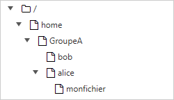
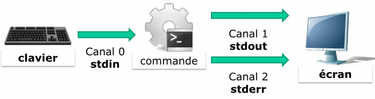
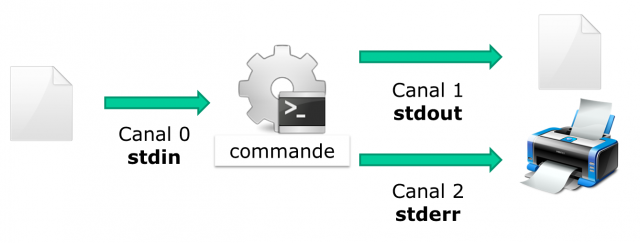
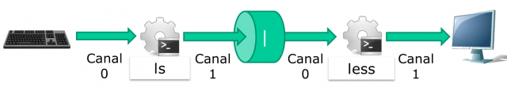

////
Les supports de Formatux sont publiés sous licence Creative Commons-BY-SA et sous licence Art Libre.
Vous êtes ainsi libre de copier, de diffuser et de transformer librement les œuvres dans le respect des droits de l’auteur.

    BY : Paternité. Vous devez citer le nom de l’auteur original.
    SA : Partage des Conditions Initiales à l’Identique.

Licence Creative Commons-BY-SA : https://creativecommons.org/licenses/by-sa/3.0/fr/
Licence Art Libre : http://artlibre.org/

Auteurs : Patrick Finet, Xavier Sauvignon, Antoine Le Morvan
////
= Commandes pour utilisateurs Linux

L'objectif de ce chapitre est d'apprendre aux futurs administrateurs à :

* se **déplacer** dans l'arborescence du système ;
* **créer** un fichier texte, **afficher** son contenu et le **modifier** ;
* utiliser les commandes les plus utiles de Linux.

== Généralités

Les systèmes Linux actuels possèdent des utilitaires graphiques dédiés au travail d'un administrateur. Toutefois, il est important d'être capable d'utiliser l'interface en mode ligne de commandes et cela pour plusieurs raisons :

*    La majorité des commandes du système sont communes à toutes les distributions Linux, ce qui n'est pas le cas des outils graphiques.
*   Il peut arriver que le système ne démarre plus correctement mais qu'un shell de secours reste accessible.
*   L'administration à distance se fait en ligne de commandes avec un terminal SSH.
*   Afin de préserver les ressources du
serveur, l'interface graphique n'est soit pas installée, soit lancée à la demande.
*   L'administration se fait par des scripts.

L'apprentissage de ces commandes permet à l'administrateur de se connecter à un terminal Linux, de gérer ses ressources, ses fichiers, d'identifier la station, le terminal et les utilisateurs connectés, etc.

=== Les utilisateurs

L’utilisateur du système Linux est défini (dans le fichier /etc/passwd) par :

*   un **nom de connexion**, plus communément appelé « login », ne contenant pas d’espace ;
*   un identifiant numérique : **indexterm2:[UID]** (User Identifier) ;
*   un identifiant de groupe : **indexterm2:[GID]** (Group Identifier) ;
*   un **mot de passe**, qui sera chiffré avant d’être stocké ;
*   un **interpréteur de commandes**, un Shell, qui peut être différent d’un utilisateur à l’autre ;
*   un **répertoire de connexion**, le « indexterm2:[home directory] » ;
*   un **indexterm2:[prompt] de connexion,** qui sera symbolisé par un # pour les administrateurs et un $ pour les autres utilisateurs.

En fonction de la politique de sécurité mise en œuvre sur le système, le mot de passe devra comporter un certain nombre de caractères et respecter des exigences de complexité.

Parmi les Shells existants, le **Bourne Again Shell** (/bin/bash) est le Shell le plus fréquemment utilisé. Il est affecté par défaut aux nouveaux utilisateurs. Pour diverses raisons, des utilisateurs avancés de Linux choisiront des Shells alternatifs parmi le Ksh, le Csh, etc.

Le répertoire de connexion de l’utilisateur est par convention stocké dans le répertoire /home du poste de travail. Il contiendra les données personnelles de l’utilisateur. Par défaut, à la connexion, le répertoire de connexion est sélectionné comme répertoire courant.

Une installation type poste de travail (avec interface graphique) démarre cette interface sur le terminal 1. Linux étant multi-utilisateurs, il est possible de connecter plusieurs utilisateurs plusieurs fois, sur des **terminaux physiques** (indexterm2:[TTY]) ou **virtuels** (indexterm2:[PTS]) différents. Les terminaux virtuels sont disponibles au sein d’un environnement graphique. Un utilisateur bascule d’un terminal physique à l’autre à l’aide des touches kbd:[Alt+Fx] depuis la ligne de commande ou à l’aide des touches kbd:[Ctrl+Alt+Fx].

=== Le Shell

Une fois que l’utilisateur est connecté sur une console, le Shell affiche le prompt. Il se comporte ensuite comme une boucle infinie, à chaque saisie d’instruction :

* affichage du prompt ;
* lecture de la commande ;
* analyse de la syntaxe ;
* substitution des caractères spéciaux ;
* exécution de la commande ;
* affichage du prompt ;
* etc.

La séquence de touche kbd:[Ctrl+C] permet d’interrompre une commande en cours d’exécution.

L’utilisation d’une commande respecte généralement cette séquence :

.Séquence d'une commande
[source,bash]
----
commande [option(s)] [arguments(s)]
----

Le nom de la commande est **toujours en minuscules**.

Un espace sépare chaque élément.

Les **options courtes** commencent par un tiret (-l), alors que les **options longues**
commencent par deux tirets (--list). Un double tiret (--) indique la fin de la liste d’options. Il est possible de regrouper certaines options courtes :

.Options courtes
[source,bash]
----
[root]# ls –l –i –a
----

est équivalent à :

.Regroupement d'options
[source,bash]
----
[root]# ls -lia
----

Il peut bien entendu y avoir plusieurs arguments après une option :

.Arguments d'une commande
[source,bash]
----
[root]# ls –lia /etc /home /var
----

Dans la littérature, le terme « option » est équivalent au terme « paramètre », plus utilisé dans le domaine de la programmation. Le côté optionnel d’une option ou d’un argument est symbolisé en le mettant entre crochets **[** et **]**. Lorsque plusieurs options sont possibles, une barre verticale appelée « pipe » les sépare [a**|**e**|**i].

== Les commandes générales

=== Les commandes indexterm2:[man] et indexterm2:[whatis]

Il est impossible pour un administrateur, quel que soit son niveau, de connaître toutes les commandes et options dans les moindres détails. Une commande a été spécialement conçue pour accéder en ligne de commande à un ensemble d’aides, sous forme d’un manuel : la commande man (« le man est ton ami »).

Ce manuel est divisé en 8 sections, regroupant les informations par thème, la section par défaut étant la section 1 :

1. Commande utilisateur ;
2. Appels système ;
3. Fonctions de bibliothèque C ;
4. Périphériques et fichiers spéciaux ;
5. Formats de fichiers ;
6. Jeux ;
7. Divers ;
8. Outils d'administration système et démons.

Des informations sur chaque section sont accessibles en saisissant man x intro, x indiquant le numéro de section.

La commande :

.Syntaxe de la commande man
[source,bash]
----
[root]# man passwd
----

informera l’administrateur sur la commande passwd, ses options, etc. Alors qu’un :

.Syntaxe de la commande man avec section
[source,bash]
----
[root]# man 5 passwd
----

l’informera sur les fichiers en relations avec la commande.

Toutes les pages du manuel ne sont pas traduites de l'anglais. Elles sont toutefois généralement très précises et fournissent toutes les informations utiles. La syntaxe utilisée et le découpage peut dérouter l’administrateur débutant, mais avec de la pratique, l’administrateur y retrouvera rapidement l’information qu’il recherche.

La navigation dans le manuel se fait avec les flèches « Haut » et « Bas ». Le manuel se quitte en appuyant sur la touche « q ».

La commande **whatis** permet de faire une recherche par mot clef au sein des pages de manuel :

.Syntaxe de la commande whatis
[source,bash]
----
[root]# whatis clear
----

=== La commande indexterm2:[shutdown]
La commande **shutdown** permet de **stopper électriquement**, immédiatement ou après un certain laps de temps, un serveur Linux.

.Syntaxe de la commande shutdown
[source,bash]
----
[root]# shutdown [–h] [-r] heure [message]
----

L’heure d’arrêt est à indiquer au format **hh:mm** pour une heure précise, ou **+mm** pour un délai en minutes.

Pour forcer un arrêt immédiat, le mot « **now** » remplacera l’heure. Dans ce cas, le message optionnel n’est pas envoyé aux autres utilisateurs du système.

==== Exemples

.Exemples de la commande shutdown
[source,bash]
----
[root]# shutdown -h 0:30 "Arrêt du serveur à 0h30"
[root]# shutdown -r +5
----

==== Options

.Options de la commande shutdown
[cols="1,4",width="100%",options="header"]
|====
| Options  |  Observations
| -h    |  Arrête le système électriquement
| -r    |  Redémarre le système 
|====

=== La commande indexterm2:[history]

La commande **history** permet d’afficher l’historique des commandes qui ont été saisies par l’utilisateur.

Les commandes sont mémorisées dans le fichier **.bash_history** du répertoire de connexion de l’utilisateur. 

.Exemple de commande history
[source,bash]
----
[root]# history
  147 man ls
  148 man history
----

.Options de la commande history
[cols="1,4"]
|====
| Options  |  Commentaires
|  -w  |  L’option –w permet d’y copier l’historique de la session en cours. 
|  -c  |  L’option –c effacera l’historique de la session en cours (mais pas le contenu du fichier .bash_history).
|====

==== Manipuler l'historique

Pour manipuler l’historique, des commandes permettent depuis le prompt de :

[cols="1,4",width="100%",options="header"]
|====
| Touches | Fonction
|  !!  |  Rappeler la dernière commande passée.
|  !n  |  Rappeler la commande par son numéro dans la liste.
|  !string  |  Rappeler la commande la plus récente commençant par la chaîne de caractères.
|  [↑]  | Remonter l’historique des commandes.
|  [↓]  |  Redescendre l’historique des commandes.
|====

==== L'auto-complétion

L’auto-complétion est également d’une aide précieuse.

* Elle permet de compléter les commandes, les chemins saisis ou les noms de fichiers.
* Un appui sur la touche **[TAB]** complète la saisie dans le cas d’une seule solution.
* Sinon, il faudra faire un deuxième appui pour obtenir la liste des possibilités.

Si un double appui sur la touche [TAB] ne provoque aucune réaction de la part du système, c’est qu’il n’existe aucune solution à la complétion en cours.

== Affichage et identification

=== La commande indexterm2:[clear]

La commande clear permet d’effacer le contenu de l’écran du terminal. En réalité, pour être plus précis, elle permet de décaler l’affichage de sorte que le prompt se retrouve en haut de l’écran sur la première ligne.

Dans un terminal, l’affichage sera définitivement masqué tandis que dans une interface graphique, un ascenseur permettra de remonter dans l’historique du terminal virtuel.

=== La commande indexterm2:[echo]

La commande echo permet d’afficher une chaîne de caractères.

Cette commande est plus particulièrement utilisée dans les scripts d’administration pour informer l’utilisateur pendant l’exécution.

L’option –n permet de ne pas revenir à la ligne après avoir affiché le texte (ce qui est le comportement par défaut de la commande).

Pour diverses raisons, le développeur du script peut être amené à utiliser des séquences spéciales (commençant par un caractère \). Dans ce cas, l’option –e sera stipulée, permettant l’interprétation des séquences.

Parmi les séquences fréquemment utilisées, nous citerons :

.Séquences spéciales de la commande echo
[cols="1,4",width="100%",options="header"]
|====================
| Séquence | Résultat 
| \a | Émet un bip sonore  
| \b | Retour en arrière
| \n | Ajoute un saut de ligne
| \t | Ajoute une tabulation horizontale
| \v | Ajoute une tabulation verticale
|====================

=== La commande indexterm2:[date]

La commande date permet d’afficher la date et l’heure. La commande respecte la syntaxe suivante :

.Syntaxe de la commande date
[source,bash]
----
[root]# date [-d AAAAMMJJ] [format]
----

Exemples :

[source,bash]
----
[root]# date
mer. Avril 17 16:46:53 CEST 2013
[root]# date –d 20150729 +%j
210
----

Dans ce dernier exemple, l’option –d affiche une date donnée. L’option +%j formate cette date pour n’afficher que le quantième.

Attention : Le format d’une date peut changer suivant la valeur de la langue définie dans la variable d’environnement $LANG.

L’affichage de la date peut suivre les formats suivants :

.Formats de la commande date
[cols="1,4",width="100%",options="header"]
|====================
| Option | 	Format
| +%A | 	Nom complet du jour
| +%B | 	Nom complet du mois
| +%c | 	Affichage complet de la date
| +%d | 	Numéro du jour
| +%F | 	Date au format AAAA-MM-JJ
| +%G | 	Année
| +%H | 	Heure
| +%j | 	Quantième du jour
| +%m | 	Numéro du mois
| +%M | 	Minute
| +%R | 	Heure au format hh:mm
| +%s | 	Secondes depuis le 1er janvier 1970
| +%T | 	Heure au format hh:mm:ss
| +%u | 	Jour de la semaine (1 pour lundi)
| +%V | 	Numéro de la semaine
| +%x | 	Date au format JJ/MM/AAAA
|====================

La commande date permet également de modifier la date et l’heure système. Dans ce cas, l’option –s sera utilisée.

[source,bash]
----
[root]# date –s "2013-04-17 10:19"
jeu. Avril 17 10:19:00 CEST 2013
----

Le format à respecter pour l’argument suivant l’option –s est celui-ci :
[source,bash]
----
date -s "[AA]AA-MM-JJ hh:mm:[ss]"
----

=== Les commandes indexterm2:[id], indexterm2:[who] et indexterm2:[whoami]

La commande id affiche le nom de l’utilisateur courant et ses groupes ou ceux d’un utilisateur, si le login de celui-ci est fourni comme argument.

[source,bash]
----
[root]# id util1 
uid=501(util1) gid=501(group1) groups=501(group1),502(group2)
----

Les options –g, -G, -n et –u affiche respectivement le GID du groupe principal, les GID des groupes secondaires, les noms au lieu des identifiants numériques et l’UID de l’utilisateur.

La commande whoami affiche le login de l’utilisateur courant.

La commande who seule affiche le nom des utilisateurs connectés :

[source,bash]
----
[root]# who
root	tty1	2014-09-15 10:30
root	pts/0	2014-09-15 10:31
----

Linux étant multi-utilisateurs, il est probable que plusieurs sessions soient ouvertes sur la même station, que ce soit physiquement ou à travers le réseau. Il est intéressant de savoir quels utilisateurs sont connectés, ne serait-ce que pour communiquer avec eux par l’envoi de messages.

* tty : représente un terminal.
* pts/ : représente une console virtuelle sous environnement graphique.

L’option « -r » affiche en plus le niveau d’exécution (voir chapitre « démarrage »).

== Arborescence de fichiers

Sous Linux, l’arborescence des fichiers se présente sous la forme d’un arbre inversé, appelé **arborescence hiérarchique unique**, dont la racine est le répertoire « / ».

Le **répertoire courant** est le répertoire où se trouve l’utilisateur.

Le **répertoire de connexion** est le répertoire de travail
 associé à l’utilisateur. Les répertoires de connexion sont, en 
standard, stockés dans le répertoire **/home**.

À la connexion de l’utilisateur, le répertoire courant est le répertoire de connexion.

Un **indexterm2:[chemin absolu]** référence un fichier depuis la racine en parcourant l’arborescence complète jusqu’au niveau du fichier :

*    /home/groupeA/alice/monfichier

Le **indexterm2:[chemin relatif]** référence ce même fichier en parcourant l’arborescence complète depuis le répertoire courant :

*   ../alice/monfichier

Dans l’exemple précèdent, les “**..**” font référence au répertoire parent du répertoire actuel.

Un répertoire, même s’il est vide, contiendra obligatoirement au minimum **deux références** :

*   « **.** » : référence sur lui-même.

*   « **..** » : référence le répertoire parent du répertoire actuel.

Un chemin relatif peut ainsi commencer par « ./ » ou par « ../ ». 
Lorsque le chemin relatif fait référence à un sous dossier ou à un 
fichier du répertoire courant, alors le « ./ » est souvent omis. 
Mentionner le premier « ./ » de l’arborescence ne sera réellement requis
 que pour lancer un fichier exécutable.

Les erreurs dans les chemins peuvent être la cause de nombreux problèmes
 : création de dossier ou de fichiers aux mauvais endroits, suppressions
 involontaires, etc. Il est donc fortement recommandé d’utiliser 
l’auto-complétion (cf. 2.2) 
lors des saisies de chemin.

.Notre arborescence exemple

////
[tree,file="./images/0101-presentation-pathabsolute.png",scaledwidth="100%"]
----
#/
##home
###GroupeA
####bob
####alice
#####monfichier
----
////

Dans l’exemple ci-dessus, nous cherchons à donner l’emplacement du fichier monfichier depuis le répertoire de bob.

*   Par un **chemin absolu**,
 le répertoire courant importe peu. Nous commençons par la racine, pour
descendre successivement dans les répertoires “home”, “groupeA”, “alice”
 et enfin le fichier “monfichier” : __/home/groupeA/alice/monfichier__.

*   Par un **chemin relatif**,
 notre point de départ étant le répertoire courant “bob”, nous remontons
 d’un niveau par “..” (soit dans le répertoire groupeA), puis nous
descendons dans le répertoire “alice”, et enfin le fichier “monfichier” :
 __../alice/monfichier__.

=== La commande indexterm2:[pwd]

La commande pwd (Print Working Directory) affiche le chemin absolu du répertoire courant.

[source,bash]
----
[root]# pwd
/root/instructeur
----

Pour se déplacer à l’aide d’un chemin relatif, il faut impérativement connaître son positionnement dans l’arborescence.

Selon le shell, le prompt peut également afficher le nom du répertoire courant.

=== La commande indexterm2:[cd]

La commande cd (Change Directory) permet de changer le répertoire courant, autrement dit, de se déplacer dans l’arborescence.

[source,bash]
----
[root]# cd /tmp
[root]# pwd
/tmp
[root]# cd ../
[root]# pwd
/
[root]# cd
[root]# pwd
/root
----

Comme vous pouvez le constater dans le dernier exemple ci-dessus, la commande cd sans argument permet de repositionner le répertoire courant sur le répertoire de connexion (home directory).

=== La commande indexterm2:[ls]

La commande ls affiche le contenu d’un répertoire.

.Syntaxe de la commande ls
[source,bash]
----
ls [-a] [-i] [-l] [repertoire1] [repertoire2] […]
----

Exemple :

[source,bash]
----
[root]# ls /home
.	..	STAGE
----

==== Options

Les options principales de la commande ls sont :

.Options principales de la commande ls
[cols="1,4",width="100%",options="header"]
|====================
| Option | 	Information
| -a | 	Affiche tous les fichiers, même ceux cachés. Les fichiers cachés sous Linux sont ceux qui commencent par un “.”.
| -i | 	Affiche les numéros d’inode.
| -l | 	Affiche sous forme de liste verticale la liste des fichiers avec des informations supplémentaires formatées par colonnes.
|====================

La commande ls offre toutefois de très nombreuses options (voir le man) :

.Options complémentaires de la commande ls
[cols="1,4",width="100%",options="header"]
|====================
| Option | 	Information
| -d | 	Affiche les informations d’un répertoire au lieu de lister son contenu.
| -g | 	Affiche les UID et GID plutôt que les noms des propriétaires.
| -h | 	Affiche les tailles de fichiers dans le format le plus adapté (octet, kilo-octet, méga-octet, giga-octet, …). h pour Human Readable.
| -s | 	Affiche la taille en octets (sauf si option k).
| -A | 	Affiche tous les fichiers du répertoire sauf “.” et “..”.
| -R | 	Affiche récursivement le contenu des sous répertoires.
| -F | 	Affiche le type des fichiers. Imprime un / pour un répertoire, * pour les exécutables, @ pour un lien symbolique, et rien pour un fichier texte.
|====================

==== Description des colonnes

[source,bash]
----
[root]# ls -lia /root
78489 drwxr-xr-x 4 root root 4096 25 oct. 08:10 STAGE
----

.Description des colonnes du résultat généré par la commande ls
[cols="1,4",width="100%",options="header"]
|====================
| Valeur | 	Information.
| 78489 | 	Numéro d’inode.
| drwxr-xr-x | 	Type de fichier (d) et droits (rwxr-xr-x).
| 4 | 	Nombre de sous-répertoires (“.” et “..” inclus). +
Pour un fichier de type lien physique : nombre de liens physiques.
| root | 	Utilisateur propriétaire.
| root | 	Groupe propriétaire.
| 4096 | 	Taille en octets.
| 25 oct. 08:10 | 	Date de dernière modification.
| STAGE | 	Nom du fichier (ou du répertoire).
|====================

==== Alias

Des indexterm2:[alias] sont fréquemment positionnés au sein des distributions courantes.

C'est le cas de l'alias ll :

.Alias de la commande ls -l
[source,bash]
----
alias ll='ls -l --color=auto'
----

==== Utilisations avancées

* Lister les fichiers de */etc* par ordre de dernière modification :

[source,bash]
----
[root]# ls -ltr /etc
total 1332
-rw-r--r--.  1 root root    662 29 aout   2007 logrotate.conf
-rw-r--r--.  1 root root    272 17 nov.   2009 mailcap
-rw-------.  1 root root    122 12 janv.  2010 securetty
...
-rw-r--r--.  2 root root     85 18 nov.  17:04 resolv.conf
-rw-r--r--.  1 root root     44 18 nov.  17:04 adjtime
-rw-r--r--.  1 root root    283 18 nov.  17:05 mtab
----

* Lister les fichiers de */var* plus gros qu'un mega-octet mais moins qu'un giga-octets :

[source,bash]
----
[root]# ls -Rlh /var | grep [0-9]M
...
-rw-r--r--. 1 apache apache 1,2M 10 nov.  13:02 XB RiyazBdIt.ttf
-rw-r--r--. 1 apache apache 1,2M 10 nov.  13:02 XB RiyazBd.ttf
-rw-r--r--. 1 apache apache 1,1M 10 nov.  13:02 XB RiyazIt.ttf
...
----

* Afficher les droits sur un dossier :

Pour connaître les droits sur un dossier, dans notre exemple /etc, la commande suivante ne conviendrait pas :

[source,bash]
----
[root]# ls -l /etc
total 1332
-rw-r--r--.  1 root root     44 18 nov.  17:04 adjtime
-rw-r--r--.  1 root root   1512 12 janv.  2010 aliases
-rw-r--r--.  1 root root  12288 17 nov.  17:41 aliases.db
drwxr-xr-x.  2 root root   4096 17 nov.  17:48 alternatives
...
----

puisque cette dernière liste par défaut le contenu du dossier et non le contenant.

Pour ce faire, il faut utiliser l'option -d :

[source,bash]
----
[root]# ls -ld /etc
drwxr-xr-x. 69 root root 4096 18 nov.  17:05 /etc
----

* Lister les fichiers par taille :

[source,bash]
----
[root]# ls -lhS
----

* Afficher la date de modification au format “timestamp” :

[source,bash]
----
[root]# ls -l --time-style="+%Y-%m-%d $newline%m-%d %H:%M"
total 12378
dr-xr-xr-x. 2 root root 4096 2014-11-23 11-23 03:13 bin
dr-xr-xr-x. 5 root root 1024 2014-11-23 11-23 05:29 boot
----

* Ajouter le “trailing slash” à la fin des dossiers :

Par défaut, la commande ls n'affiche pas le dernier slash d'un dossier.

Dans certains cas, comme pour des scripts par exemple, il est utile de les afficher :

[source,bash]
----
[root]# ls -dF /etc
/etc/
----

=== La commande indexterm2:[mkdir]

La commande mkdir crée un répertoire ou une arborescence de répertoire.

.Syntaxe de la commande mkdir
[source,bash]
----
mkdir [-p] repertoire [repertoire] […]
----

Exemple :

[source,bash]
----
[root]# mkdir /home/STAGE/travail
----

Le répertoire « STAGE » devra exister pour créer le répertoire « travail ».

Sinon, l’option « –p » devra être utilisée. L’option « –p » crée les répertoires parents s’ils n’existent pas.

[CAUTION]
====
Il est vivement déconseillé de donner des noms de commandes UNIX comme noms de répertoires ou fichiers. 
====

=== La commande indexterm2:[touch]

La commande touch modifie l’horodatage d’un fichier ou crée un fichier vide si le fichier n’existe pas.

.Syntaxe de la commande touch
[source,bash]
----
touch [-t date] fichier
----

Exemple :

[source,bash]
----
[root]# touch /home/STAGE/fichier
----

[cols="1,4",width="100%",options="header"]
|====================
| Option | Information  
| -t date |  Modifie la date de dernière modification du fichier avec la date précisée. + 
Date au format : [AAAA]MMJJhhmm[ss]
|====================

[TIP]
====
La commande touch est utilisée en priorité pour créer un fichier vide, mais elle peut avoir un intérêt dans le cadre de sauvegarde incrémentale ou différentielle. En effet, le fait d'exécuter un touch sur un fichier aura pour seul effet de forcer sa sauvegarde lors de la sauvegarde suivante. 
====

=== La commande indexterm2:[rmdir]

La commande rmdir supprime un répertoire vide.

Exemple :

[source,bash]
----
[root]# rmdir /home/STAGE/travail
----

[cols="1,4",width="100%",options="header"]
|====================
| Option | Information  
| -p  |  	Supprime le ou les répertoire(s) parent(s) à la condition qu’ils soient vides.
|====================

[TIP]
====
Pour supprimer à la fois un répertoire non-vide et son contenu, il faudra utiliser la commande rm.
====

=== La commande indexterm2:[rm]

La commande rm supprime un fichier ou un répertoire.

.Syntaxe de la commande rm
[source,bash]
----
rm [-f] [-r] fichier [fichier] […]
----

[CAUTION]
====
ATTENTION !!! Toute suppression de fichier ou de répertoire est définitive.
====

.Options de la commande rm
[cols="1,4",width="100%",options="header"]
|====================
| Options | 	Information
| -f | 	Ne demande pas de confirmation de la suppression.
| -i | 	Demande de confirmation de la suppression.
| -r | 	Supprime récursivement les sous-répertoires.
|====================

[NOTE]
====
La commande rm en elle-même ne demande pas de confirmation lors de la suppression de fichiers. Ce comportement est propre à la distribution RedHat/CentOS.

La commande rm est ici un alias de la commande rm -i. Ne soyez pas surpris sur une autre distribution, type Debian par exemple, de ne pas obtenir de demande de confirmation.
====

La suppression d’un dossier à l’aide de la commande rm, que ce dossier soit vide ou non, nécessitera l’ajout de l’option –r.

La fin des options est signalée au shell par un double tiret “--”.

Dans l'exemple :

[source,bash]
----
[root]# >-dur-dur # Creer un fichier vide appelé -dur-dur
[root]# rm -f -- -dur-dur
----

Le nom du fichier -dur-dur commence par un “-”. Sans l'usage du “--” le shell aurait interprété le “-d” de “-dur-dur” comme une option.

=== La commande indexterm2:[mv]

La commande mv déplace et renomme un fichier.

.Syntaxe de la commande mv
[source,bash]
----
mv fichier [fichier …] destination
----

Exemples :

[source,bash]
----
[root]# mv /home/fic1 /home/fic2
[root]# mv /home/fic1 /home/fic2 /tmp
----

.Options de la commande mv
[cols="1,4",width="100%",options="header"]
|====================
| Options | 	Information
| -f | 	Ne demande pas de confirmation si écrasement du fichier de destination.
| -i | 	Demande de confirmation si écrasement du fichier de destination (par défaut).
|====================

==== Cas concrets

[source,bash]
----
[root]# mv /home/fic1 /home/fic2
----
Permet de renommer “fic1” en “fic2”, si “fic2” existe déjà, il sera remplacé par “fic1”.

[source,bash]
----
[root]# mv /home/fic1 /home/fic2 /tmp
----

Permet de déplacer “fic1” et “fic2” dans le répertoire “/tmp”.

[source,bash]
----
[root]# mv fic1 /repexiste/fic2
----
« fic1 » est déplacé dans « /repexiste » et renommé « fic2 ».

[source,bash]
----
[root]# mv fic1 fic2
----
« fic1 » est renommé « fic2 ».

[source,bash]
----
[root]# mv fic1 /repexiste
----

Si le répertoire de destination existe, « fic1 » est déplacé dans « /repexiste ».

[source,bash]
----
[root]# mv fic1 /repexistepas
----

Si le répertoire de destination n’existe pas, « fic1 » est renommé « repexistepas » à la racine.

=== La commande indexterm2:[cp]

La commande cp copie un fichier.

.Syntaxe de la commande cp
[source,bash]
----
cp fichier [fichier …] destination
----

Exemple :
[source,bash]
----
[root]# cp –r /home/STAGE /tmp
----

.Options de la commande cp
[cols="1,4",width="100%",options="header"]
|====================
| Options | 	Information
| -i | 	Demande de confirmation si écrasement (par défaut).
| -f | 	Ne demande pas de confirmation si écrasement du fichier de destination.
| -p | 	Conserve le propriétaire, les permissions et l’horodatage du fichier copié.
| -r |	Copie un répertoire avec ses fichiers et sous-répertoires.
|====================

==== Cas concrets

[source,bash]
----
[root]# cp fic1 /repexiste/fic2
----

« fic1 » est copié dans « /repexiste » sous le nom « fic2 ».

[source,bash]
----
[root]# cp fic1 fic2
----
« fic1 » est copié sous le nom « fic2 » dans ce répertoire.

[source,bash]
----
[root]# cp fic1 /repexiste
----
Si le répertoire de destination existe, « fic1 » est copié dans « /repexiste ».

[source,bash]
----
[root]# cp fic1 /repexistepas
----
Si le répertoire de destination n’existe pas, « fic1 » est copié sous le nom « repexistepas ».

== Visualisation

=== La commande indexterm2:[file]

La commande file affiche le type d’un fichier.

.Syntaxe de la commande file
[source,bash]
----
file fichier [fichiers]
----

Exemple :

[source,bash]
----
[root]# file /etc/passwd /etc
/etc/passwd:	ASCII text
/etc:		directory
----

=== La commande indexterm2:[more]

La commande more affiche le contenu d’un ou de plusieurs fichiers écran par écran.

.Syntaxe de la commande more
[source,bash]
----
more fichier [fichiers]
----

Exemple :

[source,bash]
----
[root]# more /etc/passwd
root:x:0:0:root:/root:/bin/bash
...
----

En utilisant la touche [ENTREE], le déplacement se fait ligne par ligne. En utilisant la touche [ESPACE], le déplacement se fait page par page.

=== La commande indexterm2:[less]

La commande less affiche le contenu d’un ou de plusieurs fichiers. La commande less est interactive et possède des commandes d’utilisation qui lui sont propres.

.Syntaxe de la commande less
[source,bash]
----
less fichiers [fichiers]
----

Les commandes propres à less sont :

.Commandes internes à less
[cols="1,4",width="100%",options="header"]
|====================
| Commande | Action  
| h |  Aide.
| Flèches |  Monter, descendre d’une ligne ou pour aller à droite ou à gauche.
| Entrée |  Descendre d’une ligne.
| Espace |  Descendre d’une page.
| PgAR ou PgAV |  Monter ou descendre d’une page.
| Pos1 ou Fin  |  Se placer en début de fichier ou en fin de fichier.
| /texte  |  Rechercher le texte.
| q |  Quitter la commande less.
|====================

=== Les commandes indexterm2:[cat] et indexterm2:[tac]

==== La commande cat

La commande cat concatène (mettre bout à bout) le contenu de plusieurs fichiers et affiche le résultat sur la sortie standard.

.Syntaxe de la commande cat
[source,bash]
----
cat fichier [fichiers]
----

Exemple 1 - Afficher le contenu d'un fichier vers la sortie standard :

[source,bash]
----
[root]# cat /etc/passwd
----

Exemple 2 - Afficher le contenu de plusieurs fichiers vers la sortie standard :

[source,bash]
----
[root]# cat /etc/passwd /etc/group
----

Exemple 3 - Afficher le contenu de plusieurs fichiers et rediriger la sortie standard :

[source,bash]
----
[root]# cat /etc/passwd /etc/group > utilisateursEtGroupes.txt
----

Exemple 4 - Afficher la numérotation des lignes :

[source,basg]
----
[root]# cat -n /etc/passwd
 1 root:x:0:0:root:/root:/bin/bash
 2 bin:x:1:1:bin:/bin:/sbin/nologin
...
----

Exemple 5 - Affiche la numérotation des lignes non vides :

[source,bash]
----
[root]# cat -b /etc/openldap/ldap.conf
1 #
2 # LDAP Defaults
3 #

4 # See ldap.conf(5) for details
5 # This file should be world readable but not world writable
----

==== La commande tac

La commande tac fait quasiment l'inverse de la commande cat. Elle affiche le contenu d'un fichier en commencant par la fin (ce qui est particulièrement intéressant pour la lecture des logs !).

Exemple : Afficher un fichier de logs en affichant en premier la dernière ligne :

[source,bash]
----
[root]# tac /var/log/messages | less
----

=== La commande indexterm2:[head]

La commande head affiche le début d’un fichier.

.Syntaxe de la commande head
[source,bash]
----
head [-n x] fichier
----

.Options de la commande head
[cols="1,4",width="100%",options="header"]
|====================
|Option |	Observation
| -n x |	Affiche les x premières lignes du fichier
|====================

Par défaut (sans l’option –n), la commande head affichera les 10 premières lignes du fichier.

=== La commande indexterm2:[tail]

La commande tail affiche la fin d’un fichier.

.Syntaxe de la commande tail
[source,bash]
----
tail [-f] [-n x] fichier
----

.Options de la commande tail
[cols="1,4",width="100%",options="header"]
|====================
| Option |	Observation
| -n x |	Affiche les x dernières lignes du fichier
| -f |	Affiche les modifications du fichier en temps réel
|====================

Exemple :

[source,bash]
----
[root]# tail -n 3 /etc/passwd
sshd:x:74:74:Privilege-separeted sshd:/var/empty /sshd:/sbin/nologin
tcpdump::x:72:72::/:/sbin/nologin
user1:x:500:500:grp1:/home/user1:/bin/bash
----

Avec l'option -f, la commande tail ne rend pas la main et s'exécute tant que l'utilisateur ne l'interrompt pas par la séquence [CTRL] + [C]. Cette option est très fréquemment utilisée pour suivre les fichiers journaux (les logs) en temps réel.

Sans l'option -n, la commande tail affiche les 10 dernières lignes du fichier.

=== La commande indexterm2:[sort]

La commande sort trie les lignes d’un fichier.

Elle permet d'ordonner, ranger dans un ordre donné, le résultat d'une commande ou le contenu d'un fichier, selon un ordre numérique, alphabétique, par ordre de grandeur (Ko, Mo, Go) ou dans l'ordre inverse.

.Syntaxe de la commande sort
[source,bash]
----
sort [-kx] [-n] [–o fichier] [-ty] fichier
----

Exemple :

[source,bash]
----
[root]# sort -k3 -t: -n /etc/passwd
root:x:0:0:root:/root:/bin/bash
adm:x:3:4:adm:/var/adm/:/sbin/nologin
----

.Options de la commande sort
[cols="1,4",width="100%",options="header"]
|====================
| Option |	Observation
| -kx |	Précise la colonne x sur laquelle se fera le tri
| -n | 	Demande un tri numérique
| -o fichier |	Enregistre le tri dans le fichier précisé
| -ty | 	Précise le caractère séparateur de champs y
| -r |	Inverse l'ordre du résultat
|====================

La commande sort ne trie le fichier qu’à l’affichage écran. Le fichier n’est pas modifié par le tri. Pour enregistrer le tri, il faut utiliser l’option –o ou une redirection de sortie >.

Par défaut, le tri des nombres se fait selon leur caractère. Ainsi, “110” sera avant “20”, qui sera lui-même avant “3”. Il faut préciser l’option –n pour que les blocs caractères numériques soient bien triés par leur valeur.

==== Inverser l'ordre des résultats

La commande sort permet d'inverser l'ordre des résultats, avec l'option -r :

[source,bash]
----
[root]# sort -k3 -t: -n -r /etc/passwd
root:x:0:0:root:/root:/bin/bash
adm:x:3:4:adm:/var/adm/:/sbin/nologin
----

rangera cette fois-ci le contenu du fichier /etc/passwd du plus grand uid au plus petit.

==== Mélanger les valeurs

La commande sort permet également de mélanger les valeurs avec l'option -R :

[source,bash]
----
[root]# sort -R /etc/passwd
----

==== Trier des adresses IP

Un administrateur système est rapidement confronté au traitement des adresses IP issues des logs de ses services comme SMTP, VSFTP ou Apache. Ces adresses sont typiquement extraites avec la commande cut.

Voici un exemple avec le fichier client-dns.txt :

[source,bash]
----
192.168.1.10
192.168.1.200
5.1.150.146
208.128.150.98
208.128.150.99
----

[source,bash]
----
[root]# sort -nr client-dns.txt
208.128.150.99
208.128.150.98
192.168.1.200
192.168.1.10
5.1.150.146
----

Trier des tailles de fichiers

Sort sait reconnaître les tailles de fichiers, issues de commande comme ls avec l'option -h.

Voici un exemple avec le fichier taille.txt :

[source,bash]
----
1,7G
18M
69K
2,4M
1,2M
4,2G
6M
124M
12,4M
4G
----

[source,bash]
----
[root]# sort -hr taille.txt
4,2G
4G
1,7G
124M
18M
12,4M
6M
2,4M
1,2M
69K
----

=== La commande indexterm2:[wc]

La commande wc compte le nombre de lignes, mots ou octets d’un fichier.

.Syntaxe de la commande wc
[source,bash]
----
wc [-l] [-m] [-w] fichier [fichiers]
----

.Options de la commande wc
[cols="1,4",width="100%",options="header"]
|====================
| Option |	Observation
| -c |	Compte le nombre d’octets.
| -m | 	Compte le nombre de caractères.
| -l |	Compte le nombre de lignes.
| -w |	Compte le nombre de mots.
|====================

== Recherche

=== La commande indexterm2:[find]

La commande find recherche l’emplacement d’un fichier.

.Syntaxe de la commande find
[source,bash]
----
find repertoire [-name nom] [-type type] [-user login] [-date date]
----

Les options de la commande find étant très nombreuses, il est préférable de se référer au man.

Si le répertoire de recherche n’est pas précisé, la commande find cherchera à partir du répertoire courant.

.Options de la commande find
[cols="1,4",width="100%",options="header"]
|====================
| Option |	Observation
| -perm permissions |	Recherche des fichiers selon leurs permissions.
| -size taille |	Recherche des fichiers selon leur taille.
|====================

==== L'option -exec

Il est possible d’utiliser l’option –exec pour exécuter une commande à chaque ligne de résultat :

[source,bash]
----
[root]# find /tmp –name *.log –exec rm –f {} \;
----

La commande précédente recherche tous les fichiers du répertoire /tmp nommés *.log et les supprime.

====== Comprendre l'option -exec

Dans l'exemple ci-dessus, la commande find va construire une chaîne de caractères représentant la commande à exécuter.

Si la commande find trouve trois fichiers nommés log1.log, log2.log et log3.log, alors la commande find va construire la chaîne en remplaçant dans la chaîne “rm -f {} \;” les accolades par un des résultats de la recherche, et cela autant de fois qu'il y a de résultats.

Ce qui nous donnera :

[source,bash]
----
rm -f /tmp/log1 ; rm -f /tmp/log2 ; rm -f /tmp/log3 ;
----

Le caractère “;” est un caractère spécial du Shell qui doit être protégé par un “\” pour éviter son interprétation trop tôt par la commande find (et non plus dans le exec).

=== La commande indexterm2:[whereis]

La commande whereis recherche des fichiers liés à une commande.

.Syntaxe de la commande whereis
[source,bash]
----
whereis [-b] [-m] [-s] commande
----

Exemple :

[source,bash]
----
[root]# whereis –b ls
ls: /bin/ls
----

.Options de la commande whereis
[cols="1,4",width="100%",options="header"]
|====================
| Option | 	Observation
| -b |	Ne recherche que le fichier binaire.
| -m |	Ne recherche que les pages de manuel.
| -s |	Ne recherche que les fichiers sources.
|====================

=== La commande indexterm2:[grep]

La commande grep recherche une chaîne de caractères dans un fichier.

.Syntaxe de la commande grep
[source,bash]
----
grep [-w] [-i] [-v] "chaîne" fichier
----

Exemple :

[source,bash]
----
[root]# grep –w "root:" /etc/passwd
root:x:0:0:root:/root:/bin/bash
----

.Options de la commande grep
[cols="1,4",width="100%",options="header"]
|====================
|Option |	Observation
|-i |	Ignore la casse de la chaîne de caractères recherchée.
|-v |	Inverse le résultat de la recherche.
|-w |	Recherche exactement la chaîne de caractères précisée.
|====================

La commande grep retourne la ligne complète comprenant la chaîne de caractères recherchée.

* Le caractère spécial ^ permet de rechercher une chaîne de caractères placée en début de ligne.
* Le caractère spécial $ permet de rechercher une chaîne de caractères placée en fin de ligne.

[source,bash]
----
[root]# grep -w "^root" /etc/passwd
----

[NOTE]
====
Cette commande est très puissante et il est fortement conseillé de consulter son manuel. Elle a de nombreux dérivés, 
====

===== Recherche récursive 

Il est possible de rechercher une chaîne de caractères dans une arborescence de fichiers avec l'option -R.

[source,bash]
----
[root]# grep -R "Virtual" /etc/httpd
----

=== Les méta-caractères

Les méta-caractères se substituent à un ou plusieurs caractères (voire à une absence de caractère) lors d'une recherche.

Ils sont combinables.

Le caractère * remplace une chaîne composée de plusieurs caractères quelconques. Le caractère * peut également représenter une absence de caractère.

[source,bash]
----
[root]# find /home -name test*
/home/test
/home/test1
/home/test11
/home/tests
/home/test362
----

Les méta-caractères permettent des recherches plus complexes en remplaçant tout ou partie d'un mot. Il suffit de remplacer les inconnues par ces caractères spéciaux.

Le caractère “?” remplace un unique caractère, quel qu'il soit.

[source,bash]
----
[root]# find /home -name test?
/home/test1
/home/tests
----

Les crochets “[ ]” permettent de spécifier les valeurs que peut prendre un unique caractère.

[source,bash]
----
[root]# find /home -name test[123]*
/home/test1
/home/test11
/home/test362
----

[CAUTION]
====
Il ne faut pas confondre les méta-caractères du shell et ceux des expressions régulières. La commande grep utilise les méta-caractères des expressions régulières. 
====

== Redirections et tubes

=== L'entrée et les sorties standards

Sur les systèmes UNIX et Linux, les flux standards sont aux nombres de trois. Ils permettent aux programmes, via la bibliothèque stdio.h de faire entrer ou sortir des informations.

Ces flux sont appelés canal X ou descripteur X de fichier.

Par défaut :

* le clavier est le périphérique d'entrée pour le canal 0, appelé indexterm2:[stdin] ;
* l'écran est le périphérique de sortie pour les canaux 1 et 2, appelés indexterm2:[stdout] et indexterm2:[stderr].

stderr reçoit les flux d'erreurs renvoyés par une commande. Les autres flux sont dirigés vers stdout.

Ces flux pointent vers des fichiers périphériques, mais comme tout est fichier sous UNIX, les flux d'entrées/sorties peuvent facilement être détournés vers d'autres fichiers. Ce principe fait toute la force du shell. 

==== La redirection d'entrée

Il est possible de rediriger le flux d'entrée depuis un autre fichier avec le caractère inférieur "<" ou "<<". La commande lira le fichier au lieu du clavier :

[source,bash]
----
[root]# ftp -in serverftp << cdes-ftp.txt
----

[NOTE]
====
Seules les commandes demandant une saisie au clavier pourront gérer la redirection d'entrée.
====

La redirection d'entrée peut également être utilisée pour simuler une interactivité avec l'utilisateur. La commande lira le flux d'entrée jusqu'à rencontrer le mot clef défini après la redirection d'entrée. 

Cette fonctionnalité est utilisée pour scripter des commandes interactives :

[source,bash]
----
[root]# ftp -in serverftp << FIN
user alice password
put fichier
bye
FIN
----

Le mot clef FIN peut être remplacé par n'importe quel mot.

[source,bash]
----
[root]# ftp -in serverftp << STOP
user alice password
put fichier
bye
STOP
----

Le shell quitte la commande ftp lorsqu'il reçoit une ligne ne contenant que le mot clef.

La redirection de l’entrée standard est peu utilisée car la plupart des commandes acceptent un nom de fichier en argument.

La commande wc pourrait s'utiliser ainsi :

[source,bash]
----
[root]# wc -l .bash_profile
27 .bash_profile # le nombre de lignes est suivi du nom du fichier
[root]# wc -l < .bash_profile
27 # le nombre de lignes est seul
----

==== Les redirections de sortie

Les sorties standards peuvent être redirigées vers d'autres fichiers grâce aux caractères ">" ou ">>".

La redirection simple ">" écrase le contenu du fichier de sortie :

[source,bash]
----
[root]# date +%F > fic_date
----

alors que la redirection double ">>" ajoute (concatène) au contenu du fichier de sortie.

[source,bash]
----
[root]# date +%F >> fic_date
----

Dans les deux cas, le fichier est automatiquement créé lorsqu'il n'existe pas.

La sortie d'erreur standard peut être également redirigée vers un autre fichier. Cette fois-ci, il faudra préciser le numéro du canal (qui peut être omis pour les canaux 0 et 1) :

[source,bash]
----
[root]# ls -R / 2> fic_erreurs
[root]# ls -R / 2>> fic_erreurs
----

==== Exemples

Redirection de 2 sorties vers 2 fichiers :

[source,bash]
----
[root]# ls -R / >> fic_ok 2>> fic_nok
----

Redirection des 2 sorties vers un fichier unique :

[source,bash]
----
[root]# ls -R / >> fic_log 2>&1
----

Redirection de *stderr* vers un "puit sans fond" (/dev/null) :

[source,bash]
----
[root]# ls -R / 2>> /dev/null
----

Redirection vers la ou les consoles actives :

[source,bash]
----
[root]# ls -R / 2>> /dev/console
----

[NOTE]
====
L'exemple précédent utilisant une redirection vers */dev/console* est utilisé lors du TP sur les tâches planifiées (crontab).
====

Lorsque les 2 flux de sortie sont redirigés, aucune information n'est affichée à l'écran. Pour utiliser à la fois la redirection de sortie et conserver l'affichage, il faudra utiliser la commande tee.

=== Les indexterm2:[tubes] (indexterm2:[pipe])

Un tube (pipe en anglais) est un mécanisme permettant de relier la sortie standard d'une première commande vers l'entrée standard d'une seconde.

Cette communication est monodirectionnelle et se fait grâce au symbole |. Le symbole pipe "|" est obtenu en appuyant simultanément sur les touches kbd:[AltGR + 6].

Toutes les données envoyées par la commande à gauche du tube à travers le canal de sortie standard sont envoyées au canal d'entrée standard de la commande placée à droite.

Les commandes particulièrement utilisées après un pipe sont des filtres.

==== Exemples

[source,bash]
----
# N'afficher que le début :
[root]# ls -lia / | head
 
# N'afficher que la fin :
[root]# ls -lia / | tail
 
# Trier le résultat
[root]# ls -lia / | sort
 
# Compter le nombre de mots / caractères
[root]# ls -lia / | wc
 
# Chercher une chaîne de caractères dans le résultat :
[root]# ls -lia / | grep fichier
----

== Points particuliers

=== La commande indexterm2:[tee]

La commande tee permet de rediriger la sortie standard d'une commande vers un fichier tout en maintenant l'affichage à l'écran.

Elle est combinée avec le pipe “|” pour recevoir en entrée la sortie de la commande à rediriger.

[source,bash]
----
[root]# ls -lia / | tee fic
----

L'option -a permet d'ajouter au fichier au lieu de l'écraser.

=== Les commandes indexterm2:[alias] et indexterm2:[unalias]

Utiliser les alias est un moyen pour demander au shell de se souvenir d'une commande particulière avec ses options et lui donner un nom.

Par exemple :

[source,bash]
----
[root]# ll
----

remplacera la commande :

[source,bash]
----
root]# ls -l
----

La commande alias liste les alias de la session en cours. Des alias sont positionnés par défaut sur les distributions linux. Ici, les alias d'un serveur centos :

[source,bash]
----
[root]# alias
alias
alias cp='cp -i'
alias l.='ls -d .* --color=auto'
alias ll='ls -l --color=auto'
alias ls='ls --color=auto'
alias mv='mv -i'
alias rm='rm -i'
alias which='alias | /usr/bin/which --tty-only --read-alias --show-dot --show-tilde'
----

Les alias ne sont définis que de façon temporaire, le temps de la session utilisateur.

Pour une utilisation permanente, il faut les créer dans le fichier :

* .bashrc du répertoire de connexion de l'utilisateur ;
* /etc/profile.d/alias.sh pour tous les utilisateurs.

[WARNING]
====
Une attention particulière doit être portée lors de l'usage d'alias qui peuvent potentiellement s'avérer dangereux ! Par exemple, un alias mis en place à l'insu de l'administrateur :

alias cd='rm -Rf'
====

La commande unalias permet de supprimer les alias.

[source,bash]
----
[root]# unalias ll

# Pour supprimer tous les alias :
root]# unalias -a
----

==== Alias et fonctions utiles

===== grep

Colorise le résultat de la commande grep :

[source,bash]
----
alias grep='grep --color=auto'
----

===== mcd

Il est fréquent de créer un dossier puis de se déplacer dedans :

[source,bash]
----
mcd() { mkdir -p "$1"; cd "$1"; }
----

===== cls

Se déplacer dans un dossier et lister son contenu :

[source,bash]
----
cls() { cd "$1"; ls; }
----

===== backup

Créer une copie de sauvegarde d'un fichier :

[source,bash]
----
backup() { cp "$1"{,.bak}; }
----

===== extract

Extrait tout type d'archive :

[source,bash]
----
extract () {
  if [ -f $1 ] ; then
    case $1 in
      *.tar.bz2) tar xjf $1 ;;
      *.tar.gz) tar xzf $1 ;;
      *.bz2) bunzip2 $1 ;;
      *.rar) unrar e $1 ;;
      *.gz) gunzip $1 ;;
      *.tar) tar xf $1 ;;
      *.tbz2) tar xjf $1 ;;
      *.tgz) tar xzf $1 ;;
      *.zip) unzip $1 ;;
      *.Z) uncompress $1 ;;
      *.7z) 7z x $1 ;;
      *)
        echo "'$1' cannot be extracted via extract()" ;;
    esac
  else
    echo "'$1' is not a valid file"
  fi
}
----

===== cmount

[source,bash]
----
alias cmount="mount | column -t"

[root]# cmount
/dev/simfs  on  /                                          type  simfs        (rw,relatime,usrquota,grpquota)
proc        on  /proc                                      type  proc         (rw,relatime)
sysfs       on  /sys                                       type  sysfs        (rw,relatime)
none        on  /dev                                       type  devtmpfs     (rw,relatime,mode=755)
none        on  /dev/pts                                   type  devpts       (rw,relatime,mode=600,ptmxmode=000)
none        on  /dev/shm                                   type  tmpfs        (rw,relatime)
none        on  /proc/sys/fs/binfmt_misc                   type  binfmt_misc  (rw,relatime)
----

=== Le caractère ;

Le caractère '*;*' chaîne les commandes.

Les commandes s'exécuteront toutes séquentiellement dans l'ordre de saisie une fois que l'utilisateur aura appuyé sur [ENTREE].

[source,bash]
----
[root]# ls /; cd /home; ls -lia; cd /
----
