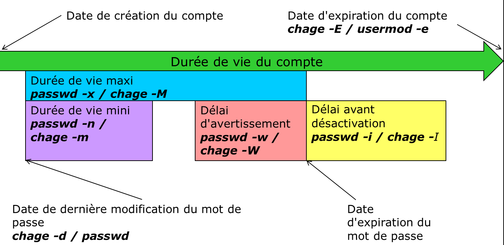

////
Les supports de Formatux sont publiés sous licence Creative Commons-BY-SA et sous licence Art Libre.
Vous êtes ainsi libre de copier, de diffuser et de transformer librement les œuvres dans le respect des droits de l’auteur.

    BY : Paternité. Vous devez citer le nom de l’auteur original.
    SA : Partage des Conditions Initiales à l’Identique.

Licence Creative Commons-BY-SA : https://creativecommons.org/licenses/by-sa/3.0/fr/
Licence Art Libre : http://artlibre.org/

Auteurs : Patrick Finet, Xavier Sauvignon, Antoine Le Morvan
////

= La gestion des utilisateurs

== Généralités

Chaque utilisateur est membre d'au moins un groupe : **c'est son groupe principal**.

Plusieurs utilisateurs peuvent faire partie d'un même groupe.

Les utilisateurs peuvent appartenir à d'autres groupes. Ces utilisateurs sont invités dans ces **groupes secondaires**.

[NOTE]
====
Chaque utilisateur possède un groupe principal et peut être invité dans un ou plusieurs groupes secondaires.

Les groupes et utilisateurs se gèrent par leur identifiant numérique unique indexterm2:[GID] et indexterm2:[UID].

Les fichiers de configuration se trouvent dans "/etc".
====

* *UID* : User IDentifier. Identifiant unique d'utilisateur.
* *GID* : Group IDentifier. Identifiant unique de groupe.

[CAUTION]
====
Il est recommandé d'utiliser les commandes d'administration au lieu de modifier manuellement les fichiers.
====

== Gestion des groupes

Fichiers modifiés, ajout de lignes :

* /etc/group
* /etc/gshadow

=== Commande indexterm2:[groupadd]

La commande groupadd permet d'ajouter un groupe au système.

[source,bash]
.Syntaxe de la commande groupadd
----
groupadd [-f] [-g GID] groupe
----

Exemple :

[source,bash]
----
[root]# groupadd -g 512 GroupeB
----

.Options de la commande groupadd
[cols="1,4",width="100%",options="header"]
|====================
|Option |	Description
|-g GID |	GID du groupe à créer.
|-f |	Le système choisit un GID si celui précisé par l'option -g existe déjà.
|-r |	Crée un groupe système avec un GID compris entre *SYS_GID_MIN* et *SYS_GID_MAX* définies dans **/etc/login.defs**.
|====================

Règles de nommage des groupes :

* Pas d'accents, ni caractères spéciaux ;
* Différents du nom d'un utilisateur ou fichier système existant.

[NOTE]
====
Sous **Debian**, l'administrateur devrait privilégier, sauf dans des scripts ayant la vocation d'être portables vers toutes les distributions Linux, les commandes addgroup/delgroup comme précisé dans le man :

[source,bash]
----
[root] # man addgroup
DESCRIPTION
    adduser et addgroup ajoutent des utilisateurs ou des groupes au système en fonction des options fournies en ligne de commande et des informations contenues dans le fichier de configuration /etc/adduser.conf. Ce sont des interfaces plus conviviales que les programmes useradd et groupadd. Elles  permettent de choisir par défaut des UID ou des GID conformes à la charte Debian, de créer un répertoire personnel configuré suivant un modèle (squelette), d'utiliser un script sur mesure, et d'autres fonctionnalités encore.
----
====

=== Commande indexterm2:[groupmod]

La commande groupmod permet de modifier un groupe existant sur le système.

[source,bash]
.Syntaxe de la commande groupmod
----
groupmod [-g GID] [-n nom] groupe
----

Exemple :

[source,bash]
----
[root]# groupmod -g 516 GroupeP
[root]# groupmod -n GroupeC GroupeB
----

.Options de la commande groupmod
[cols="1,4",width="100%",options="header"]
|====================
|Option |	Description
|-g GID |	Nouveau GID du groupe à modifier.
|-n nom |	Nouveau nom.
|====================

Il est possible de modifier le nom d'un groupe, son GID ou les deux simultanément.

Après modification, les fichiers appartenant au groupe ont un GID inconnu. Il faut leur réattribuer le nouveau GID.

[source,bash]
----
[root]# find / -gid 502 -exec chgrp 516 {} \;
----

=== Commande indexterm2:[groupdel]

La commande groupdel permet de supprimer un groupe existant sur le système.

[source,bash]
.Syntaxe de la commande groupdel
----
groupdel groupe
----

Exemple :

[source,bash]
----
[root]# groupdel GroupeC
----

[IMPORTANT]
====
Pour être supprimé, un groupe ne doit plus contenir d'utilisateurs.
====

La suppression du dernier utilisateur d'un groupe éponyme entrainera la suppression de ce groupe par le système.

[TIP]
====
Chaque groupe possède un indexterm2:[GID] unique. Un groupe peut être dupliqué. Par convention, les GID des groupes systèmes vont de 0 (root) à 499.
====

[TIP]
====
Un utilisateur faisant obligatoirement partie d'un groupe, il est nécessaire de créer les groupes avant d'ajouter les utilisateurs. Par conséquent, un groupe peut ne pas avoir de membres.
====

=== Fichier /etc/group

Ce fichier contient les informations de groupes (séparées par ' : ').

[source,bash]
----
[root]# tail -1 /etc/group
GroupeP:x:516:stagiaire
   1    2  3          4  
----

* 1 : Nom du groupe.
* 2 : Mot de passe (x si défini dans /etc/gshadow).
* 3 : GID.
* 4 : Membres invités (séparés par des virgules, ne contient pas les membres principaux).

[NOTE]
====
Chaque ligne du fichier /etc/group correspond à un groupe. Les utilisateurs dont ce groupe est leur groupe principal ne sont pas listés à ce niveau.

Cette information d'appartenance est en fait déjà fournie par le fichier /etc/passwd...
====

==== Fichier /etc/gshadow

Ce fichier contient les informations de sécurité sur les groupes (séparées par ' : ').

[source,bash]
----
[root]# grep GroupeA /etc/gshadow
GroupeA:$6$2,9,v...SBn160:alain:stagiaire
   1           2            3      4  
----

* 1 : Nom du groupe.
* 2 : Mot de passe chiffré.
* 3 : Administrateur du groupe.
* 4 : Membres invités (séparés par des virgules, ne contient pas les membres principaux).

[IMPORTANT]
====
Pour chaque ligne du fichier /etc/group doit correspondre une ligne du fichier /etc/gshadow.
====

Un *!* au niveau du mot de passe indique que celui-ci est bloqué.
Ainsi aucun utilisateur ne peut utiliser le mot de passe pour accéder au groupe (sachant que les membres du groupe n'en ont pas besoin).

== Gestion des utilisateurs

=== Définition

Un utilisateur se définit comme suit dans le fichier */etc/passwd* :

1. Login ;
2. Mot de passe ;
3. UID ;
4. GID du groupe principal ;
5. Commentaire ;
6. Répertoire de connexion ;
7. Interpréteur de commandes (/bin/bash, /bin/nologin,…).

Il existe trois types d'utilisateurs :

* *indexterm2:[root]* : Administrateur du système ;
* **utilisateur système** :	Utilisé par le système pour la gestion des droits d'accès des applications ;
* *utilisateur ordinaire* :	Autre compte permettant de se connecter au système.

Fichiers modifiés, ajout de lignes :

* /etc/passwd
* /etc/shadow

=== Commande indexterm2:[useradd]

La commande useradd permet d'ajouter un utilisateur.

[source,bash]
.Syntaxe de la commande useradd
----
useradd [-u UID] [-g GID] [-d répertoire] [-s shell] login
----

Exemple :

[source,bash]
----
[root]# useradd -u 1000 -g 513 -d /home/GroupeC/carine carine
----

.Options de la commande useradd
[cols="1,4",width="100%",options="header"]
|====================
| Option |	Description
|-u UID |	UID de l'utilisateur à créer.
|-g GID |	GID du groupe principal.
|-d répertoire |	Répertoire de connexion.
|-s shell |	Interpréteur de commandes.
|-c |	Ajoute un commentaire.
|-U |	Ajoute l'utilisateur à un groupe portant le même nom créé simultanément.
|-M |	Ne crée pas le répertoire de connexion.
|====================

À la création, le compte ne possède pas de mot de passe et est verrouillé.
Il faut assigner un mot de passe pour déverrouiller le compte.

Règles de nommage des comptes :

* Pas d'accents, de majuscules ni caractères spéciaux ;
* Différents du nom d'un groupe ou fichier système existant ;
* Définir les options -u, -g, -d et -s à la création.

[WARNING]
====
L'arborescence du répertoire de connexion doit être créée à l'exception du dernier répertoire.
Le dernier répertoire est créé par la commande useradd qui en profite pour y copier les fichiers du "indexterm2:[skel]".
====

*Un utilisateur peut faire partie de plusieurs groupes en plus de son groupe principal.*

Pour les groupes secondaires, il faut utiliser l'option -G.

Exemple :

[source,bash]
----
[root]# useradd -u 500 -g GroupeA -G GroupeP,GroupeC albert
----

[NOTE]
====
Sous **Debian**, il faudra spécifier l'option *-m* pour forcer la création du répertoire de connexion ou positionner la variable CREATE_HOME du fichier login.defs. Dans tous les cas, l'administrateur devrait privilégier, sauf dans des scripts ayant la vocation d'être portables vers toutes les distributions Linux, les commandes adduser/deluser comme précisé dans le man :

[source,bash]
----
[root] # man useradd
DESCRIPTION
    **useradd** is a low level utility for adding users. On Debian, administrators should usually use **adduser(8)** instead. 
----
====

==== Valeur par défaut de création d'utilisateur.

Modification du fichier **/etc/default/useradd**.

[source,bash]
----
useradd -D [-b répertoire] [-g groupe] [-s shell]
----

Exemple :

[source,bash]
----
[root]# useradd -D -g 500 -b /home -s /bin/bash
----

.Options de la commande useradd pour modifier les valeurs par défaut
[cols="1,4",width="100%",options="header"]
|====================
| Option | 	Description
| -D | 	Définit les valeurs par défaut de création d'utilisateur.
| -b répertoire | 	Définit le répertoire de connexion par défaut.
| -g groupe | 	Définit le groupe par défaut.
| -s shell | 	Définit le shell par défaut.
| -f | 	Nombre de jours suivant l'expiration du mot de passe avant que le compte ne soit désactivé.
| -e | 	Date à laquelle le compte sera désactivé.
|====================

=== Commande indexterm2:[usermod]

La commande usermod permet de modifier un utilisateur.

[source,bash]
.Syntaxe de la commande usermod
----
usermod [-u UID] [-g GID] [-d répertoire] [-m] login
----

Exemple :

[source,bash]
----
[root]# usermod -u 544 carine
----

Options identiques à la commande useradd.

.Options de la commande usermod
[cols="1,4",width="100%",options="header"]
|====================
| Option |	Description
|-m |	Associé à l'option -d, déplace le contenu de l'ancien répertoire de connexion vers le nouveau.
|-l login |	Nouveau nom.
|-e AAAA-MM-JJ |	Date d'expiration du compte.
|-L |	Verrouille le compte.
|-U |	Déverrouille le compte.
|-a |	Empêche la suppression de l'utilisateur d'un groupe secondaire lors de l'ajout dans un autre groupe secondaire.
|-G |	Précise plusieurs groupes secondaires lors de l'ajout.
|====================

Avec la commande **usermod**, le verrouillage d'un compte se traduit par l'ajout de ! devant le mot de passe dans le fichier **/etc/shadow**.

[TIP]
====
Pour être modifié un utilisateur doit être déconnecté et ne pas avoir de processus en cours.
====

Après modification de l'identifiant, les fichiers appartenant à l'utilisateur ont un UID inconnu. Il faut leur réattribuer le nouvel UID.

[source,bash]
----
[root]# find / -uid 1000 -exec chown 544: {} \;
----

Il est possible d'inviter un utilisateur dans un ou plusieurs groupes secondaires avec les options -a et -G.

Exemple :

[source,bash]
----
[root]# usermod -aG GroupeP,GroupeC albert
----

La commande **usermod** agit en modification et non en ajout.

Pour un utilisateur invité dans un groupe par l’intermédiaire de cette commande et déjà positionné comme invité dans d’autres groupes secondaires, il faudra indiquer dans la commande de gestion de groupe tous les groupes dont il fait partie sinon il disparaîtra de ceux-ci.

L'option -a empêche ce problème.

Exemples :

* Invite albert dans le groupe GroupeP

[source,bash]
----
[root]# usermod -G GroupeP albert
----

* Invite albert dans le groupe GroupeG, mais le supprime de la liste des invités de GroupeP.

[source,bash]
----
[root]# usermod -G GroupeG albert
----

* Donc soit :
[source,bash]
----
[root]# usermod -G GroupeP,GroupeG albert
----

* Soit :
[source,bash]
----
[root]# usermod -aG GroupeG albert
----

=== Commande indexterm2:[userdel]

La commande userdel permet de supprimer le compte d'un utilisateur.

[source,bash]
.Syntaxe de la commande userdel
----
[root]# userdel -r carine
----

.Options de la commande userdel
[cols="1,4",width="100%",options="header"]
|====================
| Option |	Description
| -r |	Supprime le répertoire de connexion et les fichiers contenus.
|====================

[IMPORTANT]
====
Pour être supprimé, un utilisateur doit être déconnecté et ne pas avoir de processus en cours.
====

userdel supprime la ligne de l'utilisateur dans les fichiers /etc/passwd et /etc/gshadow
       

[IMPORTANT]
====
Chaque utilisateur possède un UID unique. Par convention, les UID des utilisateurs 'système' vont de 0 (root) à 499.
====

[WARNING]
====
Un utilisateur est obligatoirement membre d'un groupe. Il est donc nécessaire de créer les groupes avant d'ajouter les utilisateurs.
====

=== Fichier /etc/passwd

Ce fichier contient les informations des utilisateurs (séparées par ' : ').

[source,bash]
----
[root]# head -1 /etc/passwd
root:x:0:0:root:/root:/bin/bash
 1   2 3 4   5    6       7
----

* 1 : Login.
* 2 : Mot de passe (x si défini dans /etc/shadow).
* 3 : UID.
* 4 : GID du groupe principal.
* 5 : Commentaire.
* 6 : Répertoire de connexion.
* 7 : Interpréteur de commandes.

=== Fichier /etc/shadow

Ce fichier contient les informations de sécurité des utilisateurs (séparées par ' : ').

[source,bash]
----
[root]# tail -1 /etc/shadow
root:$6$...:15399:0:99999:7:::
   1    2     3   4   5   6,7,8,9  
----

* 1 : Login.
* 2 : Mot de passe chiffré.
* 3 : Date du dernier changement.
* 4 : Durée de vie minimale du mot de passe.
* 5 : Durée de vie maximale du mot de passe.
* 6 : Nombre de jours avant avertissement.
* 7 : Délai avant désactivation du compte après expiration.
* 8 : Délai d'expiration du compte.
* 9 : Réservé pour une utilisation future.

[CAUTION]
====
Pour chaque ligne du fichier /etc/passwd doit correspondre une ligne du fichier /etc/shadow.
====

== Propriétaires des fichiers

[IMPORTANT]
====
Tous les fichiers appartiennent forcément à un utilisateur et à un groupe.
====

Le groupe principal de l'utilisateur qui crée le fichier est, par défaut, le groupe propriétaire du fichier.

=== Commandes de modifications :

==== Commande indexterm2:[chown]

La commande chown permet de modifier les propriétaires d'un fichier.

[source,bash]
.Syntaxe de la commande chown
----
chown [-R] [-v] login[:groupe] fichier
----

Exemples :

[source,bash]
----
[root]# chown root fichier
[root]# chown albert:GroupeA fichier
----

.Options de la commande chown
[cols="1,4",width="100%",options="header"]
|====================
|Option |	Description
|-R |	Modifie les propriétaires du répertoire et de son contenu.
|-v |	Affiche les modifications exécutées.
|====================

Pour ne modifier que l'utilisateur propriétaire :

[source,bash]
----
[root]# chown albert fichier
----

Pour ne modifier que le groupe propriétaire :
[source,bash]
----
[root]# chown :GroupeA fichier
----

Modification de l'utilisateur et du groupe propriétaire :

[source,bash]
----
[root]# chown albert:GroupeA fichier
----

Dans l'exemple suivant le groupe attribué sera le groupe principal de l'utilisateur précisé.

[source,bash]
----
[root]# chown albert: fichier
----

=== Commande indexterm2:[chgrp]

La commande chgrp permet de modifier le groupe propriétaire d'un fichier.

[source,bash]
.Syntaxe de la commande chgrp
----
chgrp [-R] [-v] groupe fichier
----

Exemple :

[source,bash]
----
[root]# chgrp groupe1 fichier
----

.Options de la commande chgrp
[cols="1,4",width="100%",options="header"]
|====================
|Option |	Description
|-R |	Modifie les groupes propriétaires du répertoire et de son contenu (récursivité).
|-v |	Affiche les modifications exécutées. 
|====================

[TIP]
====
Il est possible d'appliquer à un fichier un propriétaire et un groupe propriétaire en prenant comme référence ceux d'un autre fichier : 

[source,bash]
----
chown [options] --reference=RRFILE FILE
----

Par exemple :

[source,bash]
----
chown --reference=/etc/groups /etc/passwd
----

====

== Gestion des invités

=== Commande indexterm2:[gpasswd]

La commande gpasswd permet de gérer un groupe.

[source,bash]
.Syntaxe de la commande gpasswd
----
gpasswd [-a login] [-A login] [-d login] [-M login] groupe
----

Exemples :

[source,bash]
----
[root]# gpasswd -A alain GroupeA
[alain]$ gpasswd -a patrick GroupeA
----

.Options de la commande gpasswd
[cols="1,4",width="100%",options="header"]
|====================
| Option  |	Description
|-a login |	Ajoute l'utilisateur au groupe.
|-A login |	Définit l'administrateur du groupe.
|-d login |	Retire l'utilisateur du groupe.
|-M login |	Définit la liste exhaustive des invités.
|====================

La commande gpasswd -M agit en modification et non en ajout.

[source,bash]
----
# gpasswd GroupeA
New Password :
Re-enter new password :
----

=== Commande indexterm2:[id]

La commande id affiche les noms des groupes d'un utilisateur.

[source,bash]
.Syntaxe de la commande id
----
id login
----

Exemple :

[source,bash]
----
[root]# id alain
uid=500(alain) gid=500(GroupeA) groupes=500(GroupeA),516(GroupeP)
----

=== Commande indexterm2:[newgrp]

La commande newgrp permet d'utiliser temporairement un groupe secondaire pour la création de fichiers.

[source,bash]
.Syntaxe de la commande newgrp
----
newgrp [groupesecondaire]
----

Exemple :

[source,bash]
----
[alain]$ newgrp GroupeB
----

[TIP]
====
Après utilisation de cette commande, les fichiers seront créés avec le GID de son groupe secondaire.

La commande newgrp sans paramètre réaffecte le groupe principal. 
====

== Sécurisation

=== Commande indexterm2:[passwd]

La commande passwd permet de gérer un mot de passe.

[source,bash]
.Syntaxe de la commande passwd
----
passwd [-d] [-l] [-S] [-u] [login]
----

Exemples :

[source,bash]
----
[root]# passwd -l albert
[root]# passwd -n 60 -x 90 -w 80 -i 10 patrick
----

.Options de la commande passwd
[cols="1,4",width="100%",options="header"]
|====================
| Option | 	Description
| -d | 	Supprime le mot de passe.
| -l | 	Verrouille le compte.
| -S | 	Affiche le statut du compte.
| -u | 	Déverrouille le compte.
| -e | 	Fait expirer le mot de passe.
| -n jours | 	Durée de vie minimale du mot de passe.
| -x jours | 	Durée de vie maximale du mot de passe.
| -w jours | 	Délai d'avertissement avant expiration.
| -i jours | 	Délai avant désactivation lorsque le mot de passe expire.
|====================

Avec la commande passwd, le verrouillage d'un compte se traduit par l'ajout de !! devant le mot de passe dans le fichier /etc/shadow.

L'utilisation de la commande usermod -U ne supprime qu'un seul des !. Le compte reste donc verrouillé.

[TIP]
====
Cette commande est accessible aux utilisateurs pour modifier leur mot de passe (l'ancien mot de passe est demandé).

L'administrateur peut modifier les mots de passe de tous les utilisateurs sans restriction.
====

Exemple :

* Alain change son mot de passe :

[source,bash]
----
[alain]$ passwd
----

* root change le mot de passe d'alain :
[source,bash]
----
[root]# passwd alain
----

[TIP]
====
La commande passwd est accessible aux utilisateurs pour modifier leur mot de passe (l'ancien mot de passe est demandé). L'administrateur peut modifier les mots de passe de tous les utilisateurs sans restriction.
====

Ils devront se soumettre aux restrictions de sécurité.

Lors d'une gestion des comptes utilisateurs par script shell, il peut être utile de définir un mot de passe par défaut après avoir créé l'utilisateur.

Ceci peut se faire en passant le mot de passe à la commande passwd.

Exemple :

[source,bash]
----
[root]# echo "azerty,1" | passwd --stdin philippe
----

[WARNING]
====
Le mot de passe est saisi en clair, passwd se charge de le chiffrer.
====

== Commande indexterm2:[chage]

La commande chage permet de gérer la stratégie de compte.

[source,bash]
.Syntaxe de la commande chage
----
chage [-d date] [-E date] [-I jours] [-l] [-m jours] [-M jours] [-W jours] [login]
----

Exemple :

[source,bash]
----
[root]# chage -m 60 -M 90 -W 80 -I 10 alain
----

.Options de la commande chage
[cols="1,4",width="100%",options="header"]
|====================
| Option | 	Description
| -I jours | 	Délai avant désactivation, mot de passe expiré (i majuscule).
| -l | 	Affiche le détail de la stratégie (l minuscule).
| -m jours | 	Durée de vie minimale du mot de passe.
| -M jours | 	Durée de vie maximale du mot de passe.
| -d AAA-MM-JJ | 	Dernière modification du mot de passe.
| -E AAA-MM-JJ | 	Date d'expiration du compte.
| -W jours | 	Délai d'avertissement avant expiration.
|====================

La commande chage propose également un mode interactif.

L'option -d force la modification du mot de passe à la connexion.

Exemples :

[source,bash]
----
[root]# chage philippe
[root]# chage -d 0 philippe
----

[NOTE]
====
En l'absence d'utilisateur précisé, la commande concernera l'utilisateur qui la saisit. 
====

.Gestion des comptes utilisateurs avec chage

== Gestion avancée

Fichiers de configuration :

* /etc/default/useradd
* /etc/login.defs
* /etc/skel

[TIP]
====
L'édition du fichier /etc/default/useradd se fait grâce à la commande useradd.
====

Les autres fichiers sont à modifier avec un éditeur de texte.

=== Fichier /etc/default/useradd

Ce fichier contient le paramétrage des données par défaut.

[TIP]
====
Lors de la création d'un utilisateur, si les options ne sont pas précisées, le système utilise les valeurs par défaut définies dans /etc/default/useradd.
====

Ce fichier est modifié par la commande **useradd -D** (*useradd -D* saisie sans autre option affiche le contenu du fichier **/etc/default/useradd**).

.Contenu du fichier /etc/default/useradd
[cols="2,5",width="100%",options="header"]
|====================
| Valeur | Commentaire
|GROUP |	Groupe par défaut.
|HOME |	Chemin dans lequel le répertoire de connexion du nom de l'utilisateur sera créé.
|INACTIVE |	Nombre de jours suivant l'expiration du mot de passe avant que le compte ne soit désactivé.
|EXPIRE |	Date d'expiration du compte.
|SHELL |	Interpréteur de commandes.
|SKEL |	Répertoire squelette du répertoire de connexion.
|CREATE_MAIL_SPOOL |	Création de la boîte aux lettres dans /var/spool/mail.
|====================

[WARNING]
====
Sans l'option **-g**, la commande *useradd* crée un groupe du nom de 
l'utilisateur et l'y place.
====

Pour que la commande *useradd* récupère la valeur du champ *GROUP* du fichier **/etc/default/useradd**, il faut préciser l'option **-N**.

Exemple :

[source,bash]
----
[root]# useradd -u 501 -N GroupeA
----

=== Fichier /etc/login.defs

Ce fichier contient de nombreux paramètres par défaut utiles aux commandes de création ou de modification d'utilisateurs. Ces informations sont regroupées par paragraphe en fonction de leur utilisation :

* Boites aux lettres ;
* Mots de passe ;
* UID et GID ;
* Umask ;
* Connexions ;
* Terminaux.

=== Fichier /etc/skel

Lors de la création d'un utilisateur, son répertoire personnel et ses fichiers d'environnement sont créés.

Ces fichiers sont copiés automatiquement à partir du répertoire /etc/skel.

* .bash_logout
* .bash_profile
* .bashrc

Tous les fichiers et répertoires placés dans ce répertoire seront copiés dans l'arborescence des utilistateurs lors de leur création.

== Changement d'identité

=== Commande indexterm2:[su]

La commande su permet de modifier l'identité de l'utilisateur connecté.

[source,bash]
.Syntaxe de la commade su
----
su [-] [-c commande] [login]
----

Exemples :

[source,bash]
----
[root]# su - alain
[albert]$ su -c "passwd alain"
----

.Options de la commande su
[cols="1,4",width="100%",options="header"]
|====================
| Option |	Description
| - |	Charge l'environnement complet de l'utilisateur.
| -c commande |	Exécute la commande sous l'identité de l'utilisateur.
|====================

Si le login n'est pas spécifié, ce sera root.

Les utilisateurs standards devront taper le mot de passe de la nouvelle identité.

[TIP]
====
Il y a création de couches successives. Pour passer d'un utilisateur à un autre, il faut d'abord taper la commande exit pour reprendre son identité puis la commande su pour prendre une autre identité.
====

==== Chargement du profil

root endosse alain avec su :

[source,bash]
----
...
/home/GroupeA/alain/bash_rc
/etc/bashrc
...
----

root endosse alain avec su - :

[source,bash]
----
...
/home/GroupeA/alain/bash_profile
/home/GroupeA/alain/bash_rc
/etc/bashrc
...
----

Un utilisateur peut endosser temporairement (pour une autre commande ou une session entière) l'identité d'un autre compte.

Si aucun utilisateur n'est précisé, la commande concernera root su -.

Il est nécessaire de connaitre le mot de passe de l'utilisateur dont l'identité est endossé sauf si c'est root qui exécute la commande.

Un administrateur peut ainsi travailler sur un compte utilisateur standard et n'utiliser les droits du compte root que ponctuellement. 
