////
Les supports de Formatux sont publiés sous licence Creative Commons-BY-SA et sous licence Art Libre.
Vous êtes ainsi libre de copier, de diffuser et de transformer librement les œuvres dans le respect des droits de l’auteur.

    BY : Paternité. Vous devez citer le nom de l’auteur original.
    SA : Partage des Conditions Initiales à l’Identique.

Licence Creative Commons-BY-SA : https://creativecommons.org/licenses/by-sa/3.0/fr/
Licence Art Libre : http://artlibre.org/

Auteurs : Patrick Finet, Xavier Sauvignon, Antoine Le Morvan
////

= Système de fichiers

== Partitionnement

Le partitionnement va permettre l'installation de plusieurs systèmes d'exploitation car il est impossible d'en faire cohabiter plusieurs sur un même lecteur logique. Le partitionnement permet également de cloisonner des données (sécurité, optimisation d'accès, …).

Le découpage du disque physique en volumes partitionnés est inscrit dans la table des partitions stockée dans le premier secteur du disque (MBR : Master Boot Record).

Un même disque physique peut être découpé en 4 partitions maximum :

* *Primaire* (ou principale)
* *Étendue*

[WARNING]
====
Il ne peut y avoir qu'une seule partition étendue par disque physique. Afin de bénéficier de lecteur supplémentaire, la partition étendue peut être découpée en partitions logiques
====

.Découpage en quatre partitions principales seulement
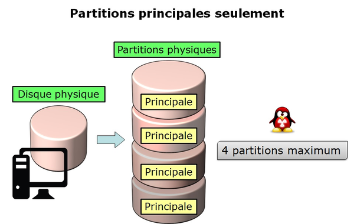

.Découpage en trois partitions principales et une partition étendue
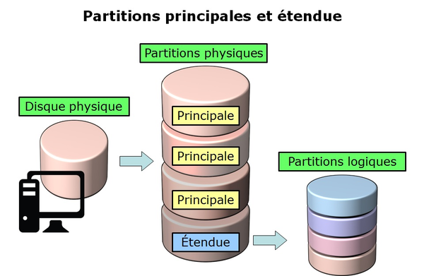

Les devices, ou périphériques, sont les fichiers identifiant les différents matériels détectés par la carte mère. Ces fichiers sont stockés sans */dev*. Le service qui détecte les nouveaux périphériques et leur donne des noms s'appelle “udev”.

Ils sont identifiés en fonction de leur type.  

Les périphériques de stockage se nomment *hd* pour les disques durs IDE et *sd* pour les autres supports. Vient ensuite une lettre qui commence par *a* pour le premier périphérique, puis *b*, *c*, …  

Enfin nous allons trouver un chiffre qui définit le volume partitionné : *1* pour la première partition primaire, …

[WARNING]
====
Attention, la partition étendue, qui ne supporte pas de système de fichier, porte quand même un numéro.
====

.Identification des partitions
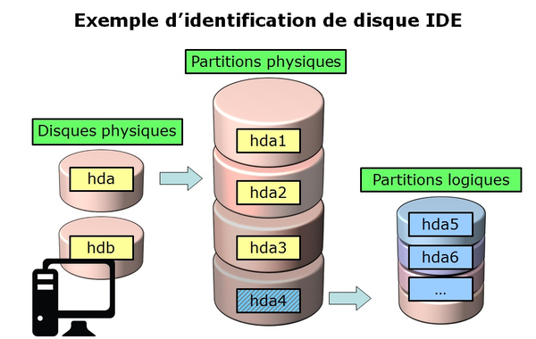

Il existe deux commandes permettant le partitionnement d'un disque : indexterm2:[*fdisk*] et indexterm2:[*cfdisk*]. Ces deux commandes possèdent un menu interactif. *cfdisk* étant plus fiable et mieux optimisée, il est préférable de l'utiliser.

La seule raison d'utiliser *fdisk* est lorsqu'on souhaite lister tous les périphériques logiques avec l'option *-l*.

[source,bash]
----
[root]# fdisk -l
[root]# fdisk -l /dev/sdc
[root]# fdisk -l /dev/sdc2
----

=== Commande cfdisk

La commande *indexterm2:[cfdisk]* permet de gérer les partitions

[source,bash]
.Syntaxe de la commande cfdisk
----
cfdisk device
----

Exemple :

[source,bash]
----
[root]# cfdisk /dev/sda
             cfdisk (util-linux-ng 2.17.2)
               Unité disque : /dev/sda
         Taille: 10737418240 octets, 10.7 Go
   Têtes: 255 Secteurs par piste: 63 Cylindres: 1305
    Nom  Fanions  Part Type Sys.Fic  Étiq. Taille
    ----------------------------------------------
                     ...
[aide] [nouvelle] [afficher] [quitter] [unités] [ecrire]
----

La préparation, sans LVM, du support physique passe par cinq étapes :

* Mise en place du disque physique ;
* Partitionnement des volumes (découpage géographique du disque, possibilité d'installer plusieurs systèmes, …) ;
* Création des systèmes de fichiers (permet au système d'exploitation de gérer les fichiers, l'arborescence, les droits, …) ;
* Montage des systèmes de fichiers (inscription du système de fichiers dans l'arborescence) ;
* Gérer l'accès aux utilisateurs.

== Logical Volume Manager (LVM)

**L**ogical **V**olume **M**anager (**indexterm2:[LVM]**)

La gestion de volume crée une couche abstraite sur un stockage physique offrant des avantages par rapport à l'utilisation directe du stockage physique :

* Capacité du disque plus flexible ;

* Déplacement des données en ligne ;

* Disques en mode “stripe” (découpage) ;

* Volumes miroirs (recopie) ;

* Instantanés de volumes (snapshot).

L'inconvénient est que si un des volumes physiques devient HS, alors c'est l'ensemble des volumes logiques qui utilisent ce volume physique qui sont perdus. Il faudra utiliser LVM sur des disques raid.

Le LVM est disponible sous Linux à partir de la version 2.4 du noyau.

[NOTE]
====
LVM est uniquement géré par le système d'exploitation. Par conséquent le BIOS a besoin d'au moins une partition sans LVM pour démarrer.
====

=== Les groupes de volume
Les volumes physiques *PV* (issus des partitions) sont combinés en des groupes de volumes *VG*.
Chaque *VG* représente un espace disque pouvant être découpé en volumes logiques *LV*.
*L'extension* est la plus petite unité d'espace de taille fixe pouvant être allouée.

* **PE** : Physical Extension
* **LE** : Logical Extension

.Groupe de volumes, taille de PE égale à 4Mo
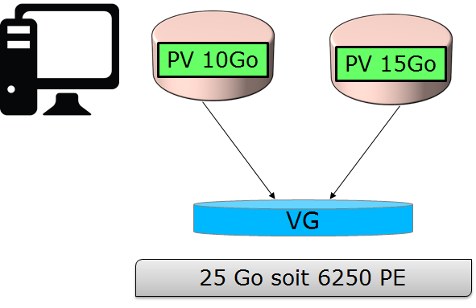

=== Les volumes logiques
Un groupe de volume *VG* est divisé en volumes logiques *LV* offrant différents modes de fonctionnement :

* Volumes linéaires ;
* Volumes en mode stripe ;
* Volumes en miroirs.

.Volumes linéaires
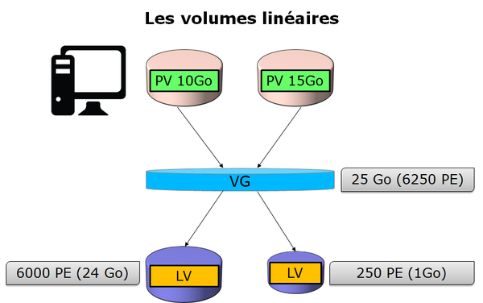
.Volumes en mode stripe
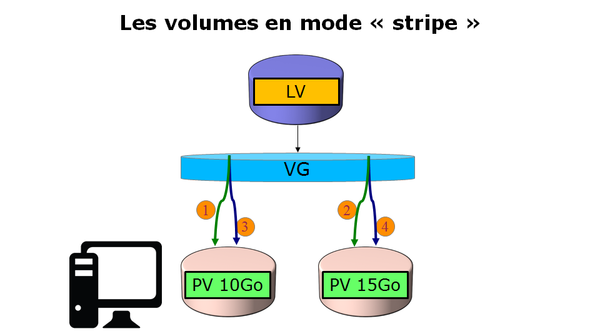

[TIP]
====
Le “striping” améliore les performances en écrivant des données sur un nombre prédéterminé de volumes physiques avec une technique de round-robin.
====

.Volumes en miroirs
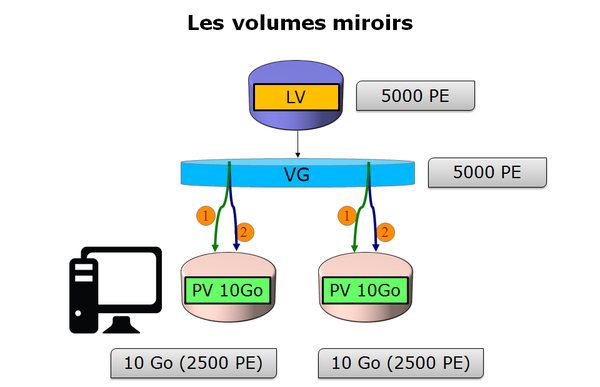

=== Commandes LVM pour la gestion des volumes

==== Commande pvcreate

La commande *indexterm2:[pvcreate]* permet de créer des volumes physiques. Elle transforme des partition Linux en volumes physiques.

[source,bash]
.Syntaxe de la commande pvcreate
----
pvcreate [-options] partition
----

Exemple :

[source,bash]
----
[root]# pvcreate /dev/hdb1
pvcreate -- physical volume « /dev/hdb1 » successfuly created
----

.Option de la commande pvcreate
[cols="1,4",width="100%",options="header"]
|====================
|Option |	Description
|-f |  Force la création du volume (disque déjà transformé en volume physique).
|====================

==== Commande vgcreate

La commande *indexterm2:[vgcreate]* permet de créer des groupes de volumes. Elle regroupe un ou plusieurs volumes physiques dans un groupe de volumes.

[source,bash]
.Syntaxe de la commande vgcreate
----
vgcreate volume physical_volume [PV...]
----

Exemple :

[source,bash]
----
[root]# vgcreate volume1 /dev/hdb1
…
vgcreate – volume group « volume1 » successfuly created and activated
----

==== Commande lvcreate

La commande *indexterm2:[lvcreate]* permet de créer des volumes logiques. Le système de fichiers est ensuite créé sur ces volumes logiques.

[source,bash]
.Syntaxe de la commande lvcreate
----
lvcreate -L taille [-n nom] nom_VG
----

Exemple :

[source,bash]
----
[root]# lvcreate –L 600M –n VolLog1 volume1
lvcreate -- logical volume « /dev/volume1/VolLog1 » successfuly created
----

.Options de la commande lvcreate
[cols="1,4",width="100%",options="header"]
|====================
|Option |	Description
|-L taile |  Taille du volume logique en K, M ou G
|-n nom |   Nom du LV. Fichier spécial créé dans */dev/nom_volume* portant ce nom
|====================

=== Commandes LVM pour visualiser les informations concernant les volumes

==== Commande pvdisplay

La commande *indexterm2:[pvdisplay]* permet de visualiser les informations concernant les volumes physiques.

[source,bash]
.Syntaxe de la commande pvdisplay
----
pvdisplay /dev/nom_PV
----

Exemple :

[source,bash]
----
[root]# pvdisplay /dev/nom_PV
----

==== Commande vgdisplay

La commande *indexterm2:[vgdisplay]* permet de visualiser les informations concernant les groupes de volumes.

[source,bash]
.Syntaxe de la commande vgdisplay
----
vgdisplay nom_VG
----

Exemple :

[source,bash]
----
[root]# vgdisplay volume1
----

==== Commande lvdisplay

La commande *indexterm2:[lvdisplay]* permet de visualiser les informations concernant les volumes logiques.

[source,bash]
.Syntaxe de la commande lvdisplay
----
lvdisplay /dev/nom_VG/nom_LV
----

Exemple :

[source,bash]
----
[root]# lvdisplay /dev/volume1/VolLog1
----

=== Préparation du support physique
La préparation avec LVM du support physique se décompose comme suit :

* Mise en place du disque physique
* Partitionnement des volumes
* *Volume physique LVM*
* *Groupes de volumes LVM*
* *Volumes logiques LVM*
* Création des systèmes de fichiers
* Montage des systèmes de fichiers
* Gérer l'accès aux utilisateurs

== Structure d'un système de fichiers

Un système de fichiers *SF* peut se nommer système de gestion de fichiers *SGF* mais également file system *FS*.

Un système de fichiers est en charge des actions suivantes :

* Sécuriser les droits d'accès et de modification des fichiers ;
* Manipuler des fichiers : créer, lire, modifier et supprimer ;
* Localiser les fichiers sur le disque ;
* Gérer l'espace mémoire.

Le système d'exploitation Linux est capable d'exploiter différents systèmes de fichiers (ext2, ext3, ext4, FAT16, FAT32, NTFS, HFS, BtrFS, JFS, XFS, …).

=== Commande mkfs

La commande indexterm2:[mkfs] permet de créer un système de fichiers Linux.

[source,bash]
.Syntaxe de la commande mkfs
----
mkfs [-t fstype] filesys
----

Exemple :

[source,bash]
----
[root]# mkfs -t ext4 /dev/sda1
----

.Option de la commande mkfs
[cols="1,4",width="100%",options="header"]
|====================
|Option |	Description
|-t |  Indique le type de système de fichiers à utiliser
|====================

[WARNING]
====
Sans système de fichiers il n'est pas possible d'utiliser l'espace disque.
====

Chaque système de fichiers possède une structure qui est identique sur chaque partition. Un Bloc de Boot et un Super Bloc initialisés par le système puis une Table des Inodes et une Zone de Données initialisées par l'administrateur.

[NOTE]
====
La seule exception est concernant la partition *swap*.
====

=== Bloc de boot

Le indexterm2:[bloc de boot] occupe le premier bloc sur le disque et est présent sur toutes les partitions. Il contient le programme assurant le démarrage et l'initialisation du système et n'est donc renseigné que pour la partition de démarrage.

=== Super bloc

La taille de la table du *indexterm2:[super bloc]* est définie à la création. Il est présent sur chaque partition et contient les éléments nécessaires à l'exploitation de celle-ci.  

Il décrit le Système de Fichiers :

* Nom du Volume Logique ;
* Nom du Système de Fichiers ;
* Type du Système de Fichiers ;
* État du Système de Fichiers ;
* Taille du Système de Fichiers ;
* Nombre de blocs libres ;
* Pointeur sur le début de la liste des blocs libres ;
* Taille de la liste des inodes ;
* Nombre et la liste des inodes libres.

Une copie est chargée en mémoire centrale dès l'initialisation du système. Cette copie est mise à jour dès modification et le système la sauvegarde périodiquement (commande sync).
Lorsque le système s'arrête, il recopie également cette table en mémoire vers son bloc.

=== Table des inodes
La taille de la indexterm2:[table des inodes] est définie à sa création et est stockée sur la partition. Elle se compose d'enregistrements, appelés inodes, correspondant aux fichiers créés. Chaque enregistrement contient les adresses des blocs de données constituant le fichier.

[NOTE]
====
Un numéro d'inode est unique au sein d'un système de fichiers.
====

Une copie est chargée en mémoire centrale dès l'initialisation du système. Cette copie est mise à jour dès modification et le système la sauvegarde périodiquement (commande sync).
Lorsque le système s'arrête, il recopie également cette table en mémoire vers son bloc. Un fichier est géré par son numéro d'inode.

[NOTE]
====
La taille de la table des inodes détermine le nombre maximum de fichiers que peut contenir le SF.
====

Informations présentes dans la table des inodes :

*   Numéro d'inode ;
*   Type de fichier et permissions d’accès ;
*   Numéro d’identification du propriétaire ;
*   Numéro d’identification du groupe propriétaire ;
*   Nombre de liens sur ce fichier ;
*   Taille du fichier en octets ;
*   Date du dernier accès au fichier ;
*   Date de la dernière modification du fichier ;
*   Date de la dernière modification de l’inode (= création) ;
*   Tableau de plusieurs pointeurs (table de blocs) sur les blocs logiques contenant les morceaux du fichier.

=== Zone de données
Sa taille correspond au reste de l'espace disponible de la partition. Cette zone contient les catalogues correspondant à chaque répertoire ainsi que les blocs de données correspondant aux contenus des fichiers.

*Afin de garantir la cohérence du système de fichiers*, une image du super-bloc et de la table des inodes est chargée en mémoire (RAM) lors du chargement du système d'exploitation afin que toutes les opérations d'E/S se fassent à travers ces tables du système. Lorsque l'utilisateur crée ou modifie des fichiers, c'est en premier lieu cette image mémoire qui est actualisée. Le système d'exploitation doit donc régulièrement actualiser le super-bloc du disque logique (commande sync).  

Ces tables sont inscrites sur le disque dur lors de l’arrêt du système. 

[CAUTION]
====
En cas d’arrêt brutal, le système de fichiers peut perdre sa cohérence et provoquer des pertes de données.
====

=== Réparation du système de fichiers
Il est possible de vérifier la cohérence d'un système de fichiers à l'aide de la commande *fsck*.  

En cas d'erreurs, des solutions sont proposées afin de réparer les incohérences. Après réparation, les fichiers restant sans entrées dans la table des inodes sont rattachés au dossier */lost+found* du lecteur logique.

==== Commande fsck

La commande *indexterm2:[fsck]* est un outil en mode console de contrôle d'intégrité et de réparation pour les systèmes de fichiers Linux.

[source,bash]
.Syntaxe de la commande fsck
----
fsck [-sACVRTNP] [ -t fstype ] filesys
----

Exemple :

[source,bash]
----
[root]# fsck /dev/sda1
----

Pour vérifier la partition racine, il est possible de créer un fichier forcefsck et de redémarrer ou de faire un shutdown avec l'option -F.

[source,bash]
----
[root]# touch /forcefsck
[root]# reboot
ou
[root]# shutdown –r -F now
----

[WARNING]
====
La partition devant être vérifiée doit impérativement être démontée.
====

== Organisation d'un système de fichiers

Par définition, un Système de Fichiers est une structure arborescente de répertoires construite à partir d'un répertoire racine (un périphérique logique ne peut contenir qu'un seul système de fichiers).

.Organisation du système de fichiers
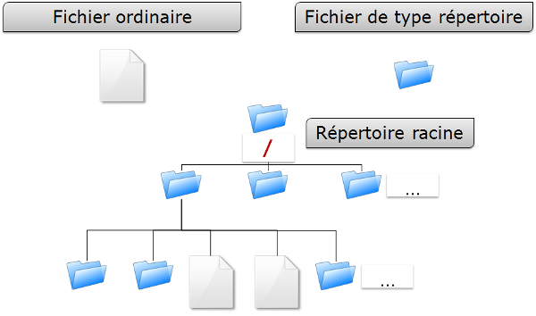

[NOTE]
====
Sous Linux, tout est fichier.
====
Document texte, répertoire, binaire, partition, ressource réseau, écran, clavier, noyau Unix, programme utilisateur, …

Linux répond à la norme indexterm2:[FHS] (Filesystems Hierarchy Standard) qui définit le nom des dossiers et leurs rôles.

.Organisation standard du système de fichiers
[cols="1,4,1",width="100%",options="header"]
|====================
|Répertoire |	Observation | Abréviation
|/ |  Contient les répertoires spéciaux | 
|/boot |   Fichiers relatifs au démarrage du système | 
|/sbin |   Commandes indispensables au démarrage système | system binaries
|/bin |   Exécutables des commandes de base du système  | binaries
|/usr/bin |   Commandes d'administration système  |
|/lib |   Librairies partagées et modules du noyau  | libraries
|/usr |   Tout ce qui n'est pas nécessaire au fonctionnement minimal du système |  UNIX System Resources 
|/mnt |   Pour le montage de SF temporaires  | mount
|/media |   Pour le montage de médias amovibles  | 
|/root |   Répertoire de connexion de l'administrateur  |
|/home |   Données utilisateurs   |
|/tmp |   Fichiers temporaires  | temporary
|/dev |   Fichiers spéciaux des périphériques  | device
|/etc |   Fichiers de configuration et de scripts | editable text configuration
|/opt |   Spécifiques aux applications installées  | optional
|/proc | Système de fichiers virtuel représentant les différents processus | processes
|/var | Fichiers variables divers | variables
|====================

Montage, démontage…quelques affirmations : 

* Pour effectuer un montage ou démontage, au niveau de l'arborescence, il ne faut pas se trouver sous le point de montage.
* Le montage sur un répertoire non vide n'efface pas le contenu. Il est seulement masqué.
* Seul l'administrateur peut effectuer des montages.
* Les points de montage devant être montés automatiquement au démarrage doivent être inscrit dans */etc/fstab*.

=== Le fichier /etc/fstab
Ce fichier est lu au démarrage du système et contient les montages à effectuer. Chaque système de fichiers à monter est décrit sur une seule ligne, les champs étant séparés pas des espaces ou des tabulations.

[NOTE]
====
Les lignes sont lues séquentiellement (fsck, mount, umount).
====

.Structure du fichier */etc/fstab*
[source,bash]
----
/dev/mapper/VolGroup-lv_root   /         ext4    defaults        1   1
UUID=46….92                    /boot     ext4    defaults        1   2
/dev/mapper/VolGroup-lv_swap   swap      swap    defaults        0   0
tmpfs                          /dev/shm  tmpfs   defaults        0   0
devpts                         /dev/pts  devpts  gid=5,mode=620  0   0
sysfs                          /sys      sysfs   defaults        0   0
proc                           /proc     proc    defaults        0   0

  1                              2         3        4            5   6
----

[cols="1,4",width="100%",options="header"]
|====================
|Champ |	Description
|1 |  Périphérique du système de fichiers (/dev/sda1, UUID=…, …)
|2 |  Nom du point de montage, *chemin absolu* (excepté *swap*) 
|3 |  Type de système de fichiers (ext4, swap, …)  
|4 |  Options particulières pour le montage (defaults, ro, …) 
|5 |  Active ou non la gestion des sauvegardes (0:non sauvegardé, 1:sauvegardé)  
|6 |  Ordre de vérification lors du contrôle du SF par la commande *fsck* (0:pas de contrôle, 1:prioritaire, 2:non prioritaire) 
|====================

La commande *mount -a* permet de prendre en compte les nouveaux montages sans redémarrage.
Ils sont ensuite inscrits dans le fichier */etc/mtab* qui contient les montages actuels.

[WARNING]
====
Seuls les points de montages inscrits dans */etc/fstab* seront montés au redémarrage.
====

Il est possible de faire une copie du fichier **/etc/mtab** ou de copier son contenu vers */etc/fstab*.

=== Commandes de gestion des montages

==== Commande mount

La commande *indexterm2:[mount]* permet de monter et de visualiser les lecteurs logiques dans l'arborescence.

[source,bash]
.Syntaxe de la commande mount
----
mount [-option] [device] [directory]
----

Exemple :

[source,bash]
----
[root]# mount /dev/sda7 /home
----

.Options de la commande mount
[cols="1,4",width="100%",options="header"]
|====================
|Option |	Description
|-n |  Monte sans écrire dans /etc/fstab
|-t |  Indique le type de système de fichiers à utiliser
|-a |  Monte tous les systèmes de fichiers mentionnés dans /etc/fstab
|-r |  Monte le système de fichiers en lecture seule (équivalent *-o ro*)
|-w |  Monte le système de fichiers en lecture/écriture, par défaut (équivalent *-o rw*)
|-o |  Argument suivi d'une liste d'option(s) séparée(s)  par des virgules (remount, ro, ...)
|====================

[NOTE]
====
La commande *mount* seule permet de visualiser tous les systèmes de fichiers montés.
====

==== Commande umount

La commande *indexterm2:[umount]* permet de démonter les lecteurs logiques.

[source,bash]
.Syntaxe de la commande umount
----
umount [-option] [device] [directory]
----

Exemple :

[source,bash]
----
[root]# umount /home
[root]# umount /dev/sda7
----

.Options de la commande umount
[cols="1,4",width="100%",options="header"]
|====================
|Option |	Description
|-n |  Démonte sans écrire dans /etc/fstab
|-r |  Si le démontage échoue, remonte en lecture seule
|-f |  Force le démontage
|-a |  Démonte tous les systèmes de fichiers mentionnés dans /etc/fstab
|====================

[NOTE]
====
Pour le démontage, il ne faut pas rester en dessous du point de montage. Sinon, le message d'erreur suivant s'affiche : *“device is busy”*.
====

== Types de fichiers

Comme dans tout système, afin de pouvoir se retrouver dans l'arborescence et la gestion des fichiers, il est important de respecter des règles de nommage des fichiers.

* Les fichiers sont codés sur 255 caractères ;
* Tous les caractères ASCII sont utilisables ;
* Les majuscules et minuscules sont différenciées ;
* Pas de notion d'extension.

Les groupes de mots séparés par des espaces doivent être encadrés par des guillemets :
[source,bash]
----
[root]# mkdir "repertoire travail"
----

[NOTE]
====
Le  *.*  sert seulement à cacher un fichier quand il débute le nom.
====

[WARNING]
====
Sous Linux, la notion d'extension n'existe pas. Cependant, elle peut être utilisée mais fait alors partie intégrante du nom du fichier.
====

Exemples de conventions d'extension :

* .c : fichier source en langage C ;
* .h : fichier d'en-tête C et Fortran ;
* .o : fichier objet en langage C ;
* .tar : fichier de données archivées avec l'utilitaire tar ;
* .cpio : fichier de données archivées avec l'utilitaire cpio ;
* .gz : fichier de données compressées avec l'utilitaire gzip ;
* .html : page web.

=== Détails du nom d'un fichier
[source,bash]
----
[root]# ls -liah /usr/bin/passwd
18 -rwxr-xr-x. 1 root root 26K 22 févr. 2012 /usr/bin/passwd
1  2    3      4  5    6    7       8               9  
----

[cols="1,4",width="100%",options="header"]
|====================
|Champ |	Description
|1 |  Numéro d'inode
|2 |  Type de fichiers
|3 |  Droits d'accès
|4 |  Nombre de liens (ordinaire) ou sous-répertoires (répertoires)
|5 |  Nom du propriétaire
|6 |  Nom du groupe
|7 |  Taille (octet, kilo, méga)
|8 |  Date de la dernière mise à jour
|9 |  Nom du fichier 
|====================

=== Différents types de fichiers
On retrouve sur un système les types de fichiers suivants :

* Ordinaires (textes, binaires, …) ;
* Répertoires ;
* Spéciaux (imprimantes, écrans, …) ;
* Liens ;
* Communications (tubes et socket).

==== Fichiers ordinaires
Ce sont des fichiers textes, programmes (sources), exécutables (après compilation) ou fichiers de données (binaires, ASCII) et multimédias.

[source,bash]
----
[root]# ls -l fichier
-rwxr-xr-x   1   root  root  26  nov  31  15:21 fichier
----

Le tiret *-* au début du groupe de droits indique qu'il s'agit d'un fichier de type ordinaire.

==== Fichiers répertoires
Les fichiers de type répertoire contiennent des références à d'autres fichiers.

Par défaut dans chaque répertoire sont présents   *.*   et   *..*  .

Le   *.*   représente la position dans l'arborescence.

Le   *..*   représente le père de la position courante.

[source,bash]
----
[root]# ls -l repertoire
drwxr-xr-x   1   root  root  26  nov  31  15:21 repertoire
----

La lettre *d* au début du groupe de droits indique qu'il s'agit d'un fichier de type répertoire.

==== Fichiers spéciaux
Afin de communiquer avec les périphériques (disques durs, imprimantes, …), Linux utilise des fichiers d'interface appelés fichiers spéciaux (device file ou special file). Ils permettent donc d'identifier les périphériques.

Ces fichiers sont particuliers car ils ne contiennent pas de données mais spécifient le mode d'accès pour communiquer avec le périphérique.

Ils sont déclinés en deux modes :

* mode *bloc* ;
* mode *caractère*.

Le fichier spécial *mode bloc* permet en utilisant les buffers système de transférer des données vers le périphérique.

[source,bash]
----
[root]# ls -l /dev/sda
brw-------   1   root  root  8, 0 jan 1 1970 /dev/sda
----

La lettre *b* au début du groupe de droits indique qu'il s'agit d'un fichier spécial bloc.

Le fichier spécial *mode caractère* est utilisé pour transférer des données vers le périphérique sous forme de flux un caractère à la fois sans utiliser de buffer. Ce sont les périphériques comme l'imprimante, l'écran ou les bandes DAT, …  

La sortie standard est l'écran.

[source,bash]
----
[root]# ls -l /dev/tty0
crw-------   1   root  root  8, 0 jan 1 1970 /dev/tty0
----

La lettre *c* au début du groupe de droits indique qu'il s'agit d'un fichier spécial caractère.

==== Fichiers de communication
Il s'agit des fichiers tubes (pipes) et des fichiers sockets.

*Les fichiers tubes* passent les informations entre processus par FIFO (First In First Out).
Un processus écrit de informations transitoires dans un fichier __pipe__ et un autre les lit. Après lecture, les informations ne sont plus accessibles.  

*Les fichiers sockets* permettent la communication bidirectionnelle inter-processus (sur système local ou distant). Ils utilisent un inode du système de fichiers.

==== Fichiers liens
Ces fichiers donnent la possibilité de donner plusieurs noms logiques à un même fichier physique. Un nouveau point d'accès au fichier est par conséquent créé.

On distingue deux types de fichiers lien :

* Les liens physiques ;
* Les liens symboliques.

===== Le lien physique
Le fichier lien et le fichier source ont le même numéro d'inode et le compteur de lien est incrémenté. Il est impossible de lier des répertoires et des fichiers de système de fichiers différents.

[WARNING]
====
Si le fichier source est détruit, le compteur est décrémenté et le fichier lien accède toujours au fichier.
====

====== Commande ln

La commande *indexterm2:[ln]* permet de créer des liens

[source,bash]
----
[root]# ls –li lettre
666 –rwxr--r-- 1 root root … lettre

[root]# ln /home/paul/lettre /home/jack/lire

[root]# ls –li /home/*/l*
666 –rwxr--r-- 2 root root … lettre
666 –rwxr--r-- 2 root root … lire
----

.Représentation d'un lien physique
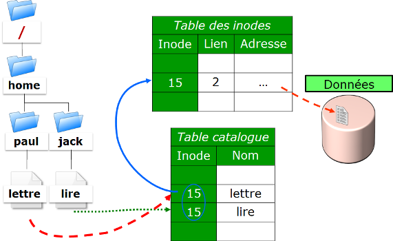

===== Le lien symbolique

Contrairement au lien physique, le lien symbolique implique la création d'un nouvel *inode*. Au niveau du lien symbolique, seul un chemin d'accès est stocké dans la table des inodes.

Le fichier créé ne contient qu'une indication sur le chemin permettant d'atteindre le fichier. Cette notion n'a plus les limitations des liens physiques et il est désormais possible de lier des répertoires et des fichiers appartenant à des systèmes de fichiers différents.

[WARNING]
====
Si le fichier source est détruit, le fichier lien ne peut plus accéder au fichier.
====

[source,bash]
----
[root]# ls –li lettre
666 –rwxr--r--- 1 root root … lettre

[root]# ln –s /home/paul/lettre /tmp/lire

[root]# ls –li /home/paul/lettre /tmp/lire 
666 –rwxr--r--- 1 root root … lettre
678 lrwxrwxrwx 1 root root … lire -> lettre
----

.Représentation d'un lien symbolique
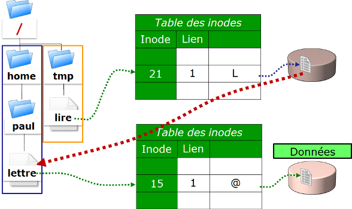

== Attributs des fichiers
Linux est système d'exploitation multi-utilisateurs où l'accès aux fichiers est contrôlé.

Ces contrôles sont fonctions :

* des permissions d'accès au fichier ;
* des utilisateurs (ugo).

La commande *ls -l* permet afficher les attributs.

Il existe 4 droits d'accès aux fichiers :

* **r**ead (lecture) ;
* **w**rite (écriture) ;
* e**x**ecution (exécution) ;
* **-** aucun droit.

[WARNING]
====
Les droits associés aux fichiers diffèrent de ceux associés aux répertoires (voir ci-dessous).
====

Les types d'utilisateurs associés aux droits d'accès des fichiers sont :

* **u**ser (propriétaire) ;
* **g**roup (groupe propriétaire) ;
* **o**thers (les autres) ;

Dans certaines commandes, il est possible de désigner tout le monde avec **a** (all).  

**a = ugo**

=== Droits associés aux fichiers ordinaires
* **r**ead : Permet la lecture d'un fichier (cat, less, …) et autorise la copie (cp, …).
* **w**rite : Autorise la modification du contenu du fichier (cat, », vim, …).
* e**x**ecute : Considère le fichier comme une commande (binaire, script).
* **-** : Aucune permission.

[NOTE]
====
Déplacer ou renommer un fichier dépend des droits du répertoire cible. Supprimer un fichier dépend des droits du répertoire parent.
====

=== Droits associés aux répertoires
* **r**ead : Permet la lecture du contenu d'un répertoire (ls -R).
* **w**rite : Autorise la modification du contenu d'un répertoire (touch) et permet la **création et suppression de fichiers** si la permission **x** est activée.
* e**x**ecute : Permet de descendre dans le répertoire (cd).
* **-** : Aucun droit.

=== Gestion des attributs
L'affichage des droits se fait à l'aide de la commande *ls -l*

[source,bash]
----
[root]# ls -l /tmp/fichier
-rwxrw-r-x  1  root  sys  ... /tmp/fichier
  1  2  3       4     5 
----

[cols="1,4",width="100%",options="header"]
|====================
|Champ |	Description
|1 |  Permissions du propriétaire (**u**ser), ici *rwx*
|2 |  Permissions du groupe propriétaire (**g**roup), ici *rw-*
|3 |  Permissions des autres utilisateurs (**o**thers), ici *r-x*
|4 |  Propriétaire du fichier 
|5 |  Groupe propriétaire du fichier 
|====================

[NOTE]
====
Les permissions s'appliquent sur **u**ser, **g**roup et **o**ther (**ugo**) en fonction du propriétaire et du groupe.
====

Par défaut, le propriétaire d'un fichier est celui qui le crée. Le groupe du fichier est le groupe du propriétaire qui a créé le fichier. Les autres sont ceux qui ne sont pas concernés par les cas précédents.

La modification des attributs s'effectue à l'aide de la commande *chmod*  

Seuls l'administrateur et le propriétaire d'un fichier peuvent modifier les droits d'un fichier.

==== Commande chmod

La commande *indexterm2:[chmod]* permet de modifier les autorisations d'accès à un fichier.

[source,bash]
----
chmod [option] mode fichier
----

L'indication de mode peut être une représentation octale (ex : 744) ou une représentation symbolique ([ugoa][+=-][rwxst]).

Plusieurs opérations symboliques peuvent être séparées par des virgules

Exemple : 

[source,bash]
----
[root]# chmod -R u+rwx,g+wx,o-r /tmp/fichier1
[root]# chmod g=x,o-r /tmp/fichier2
[root]# chmod -R o=r /tmp/fichier3

[root]# ls -l /tmp/fic*
-rwxrwx--- 1 root root … /tmp/fichier1
-rwx--x--- 1 root root … /tmp/fichier2
-rwx--xr-- 1 root root … /tmp/fichier3
----

[source,bash]
----
[root]# chmod 741 /tmp/fichier1
[root]# chmod -R 744 /tmp/fichier2

[root]# ls -l /tmp/fic*
-rwxr----x 1 root root … /tmp/fichier1
-rwxr--r-- 1 root root … /tmp/fichier2
----

[cols="1,4",width="100%",options="header"]
|====================
|Option |	Observation
|-R |  Modifier récursivement les autorisations des réper­toires et de leurs contenus 
|====================

Il existe deux méthodes pour effectuer les changements de droits :

* La méthode *octale* ;
* La méthode *symbolique*.

[WARNING]
====
Les droits des fichiers et des répertoires ne sont pas dissociés. Pour certaines opérations, il faudra connaître les droits du répertoire contenant le fichier.  

Un fichier protégé en écriture peut être supprimé par un autre utilisateur dans la mesure où les droits du répertoire qui le contient autorisent cet utilisateur à effectuer cette opération.
====

==== Principe de la méthode octale
Chaque droit possède une valeur.

.Méthode octale

[source,bash]
----
[root]# ls -l /tmp/fichier
-rwxrwxrwx  1  root  root  ... /tmp/fichier
----

.Droits 777

[source,bash]
----
[root]# chmod 741 /tmp/fichier
-rwxr----x  1  root  root  ... /tmp/fichier
----

.Droits 741
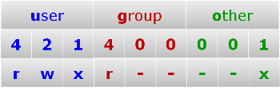

==== Principe de la méthode symbolique
Cette méthode peut être considérée comme une association “littérale” entre un type d'utilisateur, un opérateur et des droits.

.Méthode symbolique
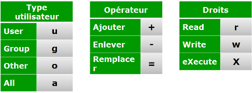

[source,bash]
----
[root]# chmod u+rwx,g+wx,o-r /tmp/fichier
[root]# chmod g=x,o-r /tmp/fichier
[root]# chmod o=r /tmp/fichier
----

[source,bash]
----
[root]# ls -l /tmp/fichier
----r--r-- 1 root root … /tmp/fichier

[root]# chmod u+rwx,g+wx,o-r /tmp/fichier

[root]# ls -l /tmp/fichier
-rwxrwx--- 1 root root … /tmp/fichier
----

=== Les droits particuliers
En complément des droits fondamentaux (rwx), il existe les droits particuliers :

* set-user-ID (SUID)
* set-group-ID (SGID)
* sticky-bit

Comme pour les droits fondamentaux, les droits particuliers possèdent chacun une valeur. Celle-ci se place avant l'ensemble de droits **ugo**.

.Les droits particuliers
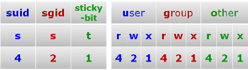

[CAUTION]
====
**S, S** et **T** en majuscules **si le droit n'existe pas**.
====

==== Le Sticky-bit

Une des particularités des droits sous Linux est que le droit d'écrire sur un répertoire permet également de supprimer **tous** les fichiers, propriétaire ou non.

Le indexterm2:[sticky-bit] positionné sur le répertoire ne permettra aux utilisateurs d'effacer que les fichiers dont ils sont propriétaires.

La mise en place du sticky-bit peut s'effectuer comme ci-dessous :  

Méthode octale :
[source,bash]
----
[root]# chmod 1777 repertoire
----

Méthode symbolique :
[source,bash]
----
[root]# chmod o+t repertoire
----

[source,bash]
----
[root]# ls -l
drwxrwxrwt … repertoire
----

==== SUID et SGID

Ces droits permettent d'exécuter une commande suivant les droits positionnés sur la commande et non plus suivant les droits de l'utilisateur.  

La commande s'exécute avec l'identité du propriétaire (**indexterm2:[suid]**) ou du groupe (**indexterm2:[sgid]**) de la commande.

[NOTE]
====
L'identité de l'utilisateur demandant l'exécution de la commande n'est plus prise en compte.
====

Il s'agit d'une possibilité supplémentaire de droits d'accès attribués à  un utilisateur lorsqu'il est nécessaire qu'il dispose des mêmes droits que ceux du propriétaire d'un fichier ou ceux du groupe concerné.

En effet, un utilisateur peut avoir à exécuter un programme (en général un utilitaire système) mais ne pas avoir les droits d'accès nécessaires. En positionnant les droits adéquats ( “**s**” au niveau du propriétaire et/ou au niveau du groupe), l'utilisateur du programme possède, pour le temps d'exécution de celui-ci, l'identité du propriétaire (ou celle du groupe) du programme.

Exemple :  

Le fichier */usr/bin/passwd* est un fichier exécutable (une commande) qui porte un *SUID*.  

Lorsque l'utilisateur bob va le lancer, ce dernier devra accéder au fichier */etc/shadow*, or les droits sur ce fichier ne permettent pas à bob d'y accéder.

Ayant un *SUID* cette commande sera exécutée avec l'UID de root et le GID de root. Ce dernier étant le propriétaire du fichier */etc/shadow*, il aura les droits en lecture.

.Fonctionnement du SUID
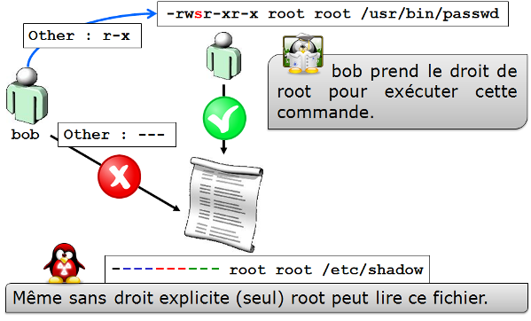

La mise en place du SUID et SGID peut s'effectuer comme ci-dessous :  

Méthode octale :

[source,bash]
----
[root]# chmod 4777 commande1
[root]# chmod 2777 commande2
----

Méthode symbolique :

[source,bash]
----
[root]# chmod u+s commande1
[root]# chmod g+s commande2
----

[source,bash]
----
[root]# ls -l
-rwsrwxrwx … commande1
-rwxrwsrwx … commande2
----

== Droits par défaut et masque
Lors de sa création, un fichier ou un répertoire possède déjà des permissions.

* Pour un répertoire : *rwxr-xr-x* soit *755*
* Pour un fichier : *rw-r–r–* soit *644*

Ce comportement est défini par le **masque par défaut**.

Le principe est d'enlever la valeur définit du masque aux droits maximums.

Pour un répertoire :

.Droits par défaut d'un répertoire
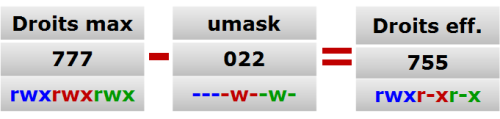

Pour un fichier, les droits d'exécution sont retirés :

.Droits par défaut d'un fichier
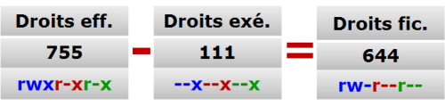

=== Commande umask

La commande *indexterm2:[umask]* permet d'afficher et de modifier le masque.

[source,bash]
----
umask [option] [mode]
----

Exemple : 

[source,bash]
----
[root]# umask
0033
[root]# umask 025
[root]# umask
0025
----

.Options de la commande umask
[cols="1,4",width="100%",options="header"]
|====================
|Option |	Description
|-S |  Affichage symbolique
|====================

[WARNING]
====
*umask* n'affecte pas les fichiers existants.
====

[NOTE]
====
*umask* modifie le masque jusqu'à la déconnexion. Pour garder la valeur, il faut modifier les fichiers de profile suivants :
====

Pour tous les utilisateurs :

* /etc/profile
* /etc/bashrc

Pour un utilisateur en particulier :

* ~/.bashrc
