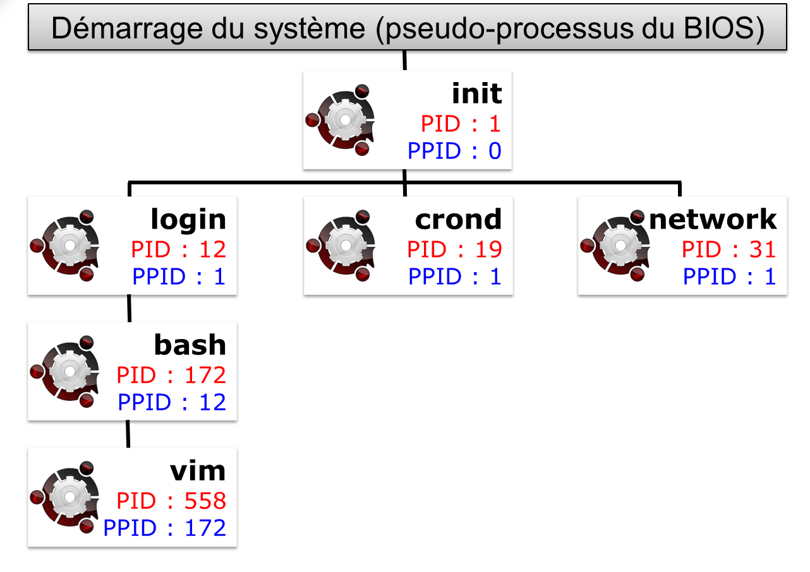

////
Les supports de Formatux sont publiés sous licence Creative Commons-BY-SA et sous licence Art Libre.
Vous êtes ainsi libre de copier, de diffuser et de transformer librement les œuvres dans le respect des droits de l’auteur.

    BY : Paternité. Vous devez citer le nom de l’auteur original.
    SA : Partage des Conditions Initiales à l’Identique.

Licence Creative Commons-BY-SA : https://creativecommons.org/licenses/by-sa/3.0/fr/
Licence Art Libre : http://artlibre.org/

Auteurs : Patrick Finet, Xavier Sauvignon, Antoine Le Morvan
////

= Gestion des processus

== Généralités

Un système d’exploitation se compose de processus. Ces derniers,sont exécutés dans un ordre bien précis et observent des liens de parenté entre eux. On distingue deux catégories de processus, ceux axés sur l’environnement utilisateur et ceux sur l’environnement matériel.

Lorsqu’un programme s’exécute, le système va créer un processus en plaçant les données et le code du programme en mémoire et en créant **une pile d’exécution**. Un
processus est donc une instance d’un programme auquel est associé un environnement processeur (Compteur Ordinal, registres, etc.) et un environnement mémoire.

Chaque processus dispose :

* d'un **indexterm2:[PID]** : Process IDentifiant, identifiant unique de processus ;
* d'un **indexterm2:[PPID]** : Parent Process IDentifiant, identifiant unique de processus parent.

Par filiations successives, le processus **indexterm2:[init]** est le père de tous les processus.

* Un processus est toujours créé par un processus père ;
* Un processus père peut avoir plusieurs processus fils.

Il existe une relation père / fils entre les processus, un processus fils est le résultat de l’appel système de la primitive fork() par le processus père qui duplique son propre code pour créer un fils. Le PID du fils est renvoyé au processus père pour qu’il puisse dialoguer avec. Chaque fils possède l’identifiant de son père, le **PPID**.

Le numéro PID représente le processus au moment de son exécution. À la fin de celui-ci, le numéro est de nouveau disponible pour un autre processus. Exécuter plusieurs fois la même commande produira à chaque fois un PID différent.

.Filiation des processus

[NOTE]
====
Les processus ne sont pas à confondre avec les threads. Chaque processus possède son propre contexte mémoire (ressources et espace d’adressage) alors que les threads issus d’un même processus partagent ce même contexte.
====

== Visualisation des processus

La commande **indexterm2:[ps]** affiche l'état des processus en cours.

.Syntaxe de la commande ps
[source,bash]
----
ps [-e] [-f] [-u login]
----

Exemple :

[source,bash]
----
[root]# ps -fu root
----

.Options principales de la commande ps
[cols="1,4",width="100%",options="header"]
|====
|  Option  |  Description 
| -e | Affiche tous les processus. 
| -f | Affiche des informations supplémentaires. 
| -u login | Affiche les processus de l'utilisateur. 
|====

Quelques options supplémentaires :

.Options supplémentaires de la commande ps
[cols="1,4",width="100%",options="header"]
|====
|  Option  |  Description 
|  -g | Affiche les processus du groupe. 
|  -t tty | Affiche les processus exécutés à partir du terminal. 
|  -p PID | Affiche les informations du processus. 
| -H |  Affiche les informations sous forme d'arborescence. 
| -I | Affiche des informations supplémentaires. 
|====

Sans option précisée, la comme ps n'affiche que les processus exécutés à partir du terminal courant.

Le résultat est affiché par colonnes :

[source,bash]
----
[root]# ps -ef
UID  PID PPID C STIME  TTY TIME      CMD
root 1   0    0 Jan01  ?   00:00/03  /sbin/init
----

.Descriptions des colonnes du résultat de la commande ps -ef
[cols="1,4",width="100%",options="header"]
|====
|  Colonne  |  Description 
|  UID | Utilisateur propriétaire. 
|  PID | Identifiant du processus. 
|  PPID | Identifiant du processus parent. 
|  C | Priorité du processus. 
|  STIME |Date et heure d'exécution. 
|  TTY | Terminal d'exécution. 
|  TIME | Durée de traitement. 
|  CMD | Commande exécutée. 
|====

== Types de processus

Le processus utilisateur :

* il est démarré depuis un terminal associé à un utilisateur ;
* il accède aux ressources via des requêtes ou des démons.

Le processus système (démon) :

* il est démarré par le système ;
* il n'est associé à aucun terminal et son propriétaire est un utilisateur système (souvent root) ;
* il est chargé lors du démarrage, il réside en mémoire et est en attente d'un appel ;
* il est généralement identifié par la lettre “d” associé au nom du processus.

Les processus système sont donc appelés démons de l'anglais **indexterm2:[daemon]** (Disk And Execution MONitor).

== Permissions et droits

À l'exécution d'une commande, les identifiants de l'utilisateur sont transmis au processus créé. 

Par défaut, les **UID** et **GID** effectifs (du processus) sont donc identiques aux **UID et GID réels** (les UID et GID de l'utilisateur qui a exécuté la commande).

Lorsqu'un **indexterm2:[SUID]** (et/ou un **indexterm2:[SGID]**) est positionné sur une commande, les UID (et/ou GID) effectifs deviennent ceux  du propriétaire (et/ou du groupe propriétaire) de la commande et non plus celui de l'utilisateur ou du groupe utilisateur qui a lancé la commande. **UID effectifs et réels** sont donc **différents**.

À chaque accès à un fichier, le système vérifie les droits du processus en fonction de ses identifiants effectifs.

== Gestion des processus

Un processus ne peut pas être exécuté indéfiniment, cela se ferait au détriment des autres processus en cours et empêcherait de faire du multitâche.

Le temps de traitement total disponible est donc divisé en petites plages et chaque processus (doté d'une priorité) accède au processeur de manière séquencée. Le processus prendra plusieurs états au cours de sa vie parmi les états :

*   prêt : attend la disponibilité du processus ;
*   en exécution : accède au processeur ;
*   suspendu : en attente d'une E/S (entrée/sortie) ;
*   arrêté : en attente d'un signal d'un autre processus ;
*   zombie : demande de destruction ;
*   mort : le père du processus tue son fils.

Le séquencement de fin de processus est le suivant :

1.  Fermeture des fichiers ouverts ;
2.  Libération de la mémoire utilisée ;
3.  Envoi d'un signal au processus père et aux processus fils.

Lorsqu'un processus meurt, ses processus fils sont dits orphelins. Ils sont alors adoptés par le processus **init** qui se chargera de les détruire. 

=== La priorité d'un processus

Le processeur travaille en temps partagé, chaque processus occupe un quantum de temps du processeur.

Les processus sont classés par priorité dont la valeur varie de -20 (la priorité la plus élevée) à +20 (la priorité la plus basse).

La priorité par défaut d'un processus est 0.

=== Modes de fonctionnements

Les processus peuvent fonctionner de deux manières :

* **indexterm2:[synchrone]** : l'utilisateur perd l'accès au shell durant l'exécution de la commande. L'invite de commande réapparaît à la fin de l'exécution du processus.
* **indexterm2:[asynchrone]** : le traitement du processus se fait en arrière-plan, l'invite de commande est ré-affichée immédiatement.

Les contraintes du mode asynchrone :

* la commande ou le script ne doit pas attendre de saisie au clavier ;
* la commande ou le script ne doit pas retourner de résultat à l'écran ;
* quitter le shell termine le processus.

== Les commandes de gestion des processus

=== La commande kill

La commande indexterm2:[kill] envoie un signal d'arrêt à un processus.

.Syntaxe de la commande kill
[source,bash]
----
kill [-signal] PID
----

Exemple : 

[source,bash]
----
[root]# kill -9 1664
----

.Codes numériques des principaux signaux d'arrêt des processus
[cols="1,1,3",width="100%",options="header"]
|====
|  Code  |  Signal  |  Description 
|  2 | SIGINT   |  Interruption du processus (CTRL + D) 
|  9 | SIGKILL  |  Terminaison immédiate du processus 
|  15 | SIGTERM  |  Terminaison propre du processus 
|  18 | SIGCONT  |  Reprise du processus 
|  19 | SIGSTOP  |  Suspension du processus 
|====

Les signaux sont les moyens de communication entre les processus. La commande kill permet d'envoyer un signal à un processus.
[TIP]
====
La liste complète des signaux pris en compte par la commande kill est disponible en tapant la commande : 

[source,bash]
----
[root]# man 7 signal
----
====

=== La commande nohup

La commande **indexterm2:[nohup]** permet de lancer un processus indépendant d'une connexion.

.Syntaxe de la commande nohup
[source,bash]
----
nohup commande
----

Exemple :

[source,bash]
----
[root]# nohup MonProgramme.sh 0</dev/null &
----

Nohup ignore le signal SIGHUP envoyé lors de la déconnexion d'un utilisateur.

[IMPORTANT]
====
Nohup gère les sorties et erreur standards, mais pas l'entrée standard, d'où la redirection de cette entrée vers /dev/null.
====

==== [CTRL] + [Z]

En appuyant simultanément sur les touches kbd:[CTRL+Z], le processus synchrone est temporairement suspendu. L'accès au prompt est rendu après affichage du numéro du processus venant d'être suspendu.

=== Instruction &
L'instruction **indexterm2:[&]** exécute la commande en mode asynchrone (la commande est alors appelée job) et affiche le numéro de job. L'accès au prompt est ensuite rendu.

Exemple :

[source,bash]
----
[root]# time ls -lR / > list.ls 2> /dev/null &
[1] 15430
[root]#
----

Le numéro de **indexterm2:[job]** est obtenu lors de la mise en tâche de fond et est affiché entre crochets, suivi du numéro de PID.

=== Les commandes fg et bg
La commande **indexterm2:[fg]** place le processus au premier plan : 

[source,bash]
----
[root]# time ls -lR / > list.ls 2>/dev/null &
[root]# fg 1
time ls -lR / > list.ls 2/dev/null
----

tandis que la commande **indexterm2:[bg]** le place à l'arrière plan :

[source,bash]
----
[CTRL]+[Z]
^Z
[1]+ Stopped
[root]# bg 1
[1] 15430
[root]#
----

Qu'il ait été mis à l'arrière plan lors de sa création grâce à l'argument **&** ou plus tard avec les touches **kbd:[CTRL+Z]**, un processus peut être ramené au premier plan grâce à la commande **fg** et à son numéro de job.

=== La commande jobs

La commande indexterm2:[jobs] affiche la liste des processus tournant en tâche de fond et précise leur numéro de job.

Exemple : 

[source,bash]
----
[root]# jobs
[1]- Running    sleep 1000
[2]+ Running    find / > arbo.txt
----

Les colonnes représentent :

1. le numéro de job ;
2. ordre de passage des processus
- un *+* : le processus est le prochain processus à s'exécuter par défaut avec fg ou bg ;
- un *-* : le processus est le prochain processus qui prendra le + ;
3.  Running (en cours de traitement) ou Stopped (processus suspendu).
4.  la commande

=== Les commandes nice/renice

La commande indexterm2:[nice] permet d'exécuter une commande en précisant sa priorité.

.Syntaxe de la commande nice
[source,bash]
----
nice priorité commande
----

Exemple :

[source,bash]
----
[root]# nice -n+15 find / -name "fichier"
----

Contrairement à root, un utilisateur standard ne peut que réduire la 
priorité d'un processus. Seules les valeurs entre +0 et +19 seront 
acceptées.

La commande **indexterm2:[renice]** permet de modifier la priorité d'un processus en cours d'exécution.

.Syntaxe de la commande renice
[source,bash]
----
renice priorité [-g GID] [-p PID] [-u UID]
----

Exemple :

----
[root]# renice +15 -p 1664
----

.Options principales de la commande renice
[cols="1,4",width="100%",options="header"]
|====
|  Option  |  Description 
|  -g |GID du groupe propriétaire du processus. 
|  -p |PID du processus. 
|  -u |UID du propriétaire du processus. 
|====

La commande **renice** agit sur des processus déjà en cours  d'exécution. Il est donc possible de modifier la priorité d'un processus précis, mais aussi de plusieurs processus appartenant à un utilisateur ou à un groupe.

=== La commande top

La commande indexterm2:[top] affiche les processus et leur consommation en ressources.

[source,bash]
----
[root]# top
PID  USER PR NI ... %CPU %MEM  TIME+    COMMAND
2514 root 20 0       15    5.5 0:01.14   top
----

.Descriptions des colonnes du résultat de la commande top
[cols="1,4",width="100%",options="header"]
|====
|  Colonne  |  Description 
|  PID | Identifiant du processus. 
|  USER | Utilisateur propriétaire. 
|  PR | Priorité du processus. 
|  NI | Valeur du nice. 
|  %CPU | Charge du processeur. 
|  %MEM | Charge de la mémoire. 
|  TIME+ | Temps d'utilisation processeur. 
|  COMMAND | Commande exécutée. 
|====

La commande **top** permet de contrôler les processus en temps réel et en mode interactif.