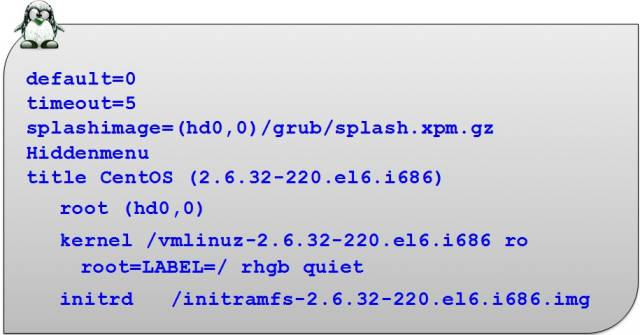
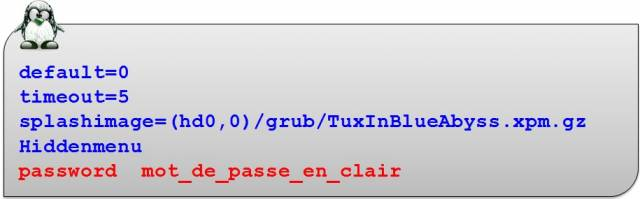
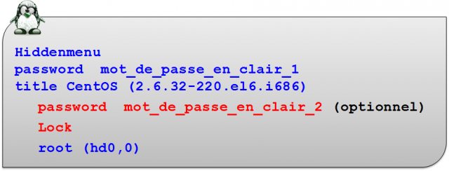

////
Les supports de Formatux sont publiés sous licence Creative Commons-BY-SA et sous licence Art Libre.
Vous êtes ainsi libre de copier, de diffuser et de transformer librement les œuvres dans le respect des droits de l’auteur.

    BY : Paternité. Vous devez citer le nom de l’auteur original.
    SA : Partage des Conditions Initiales à l’Identique.

Licence Creative Commons-BY-SA : https://creativecommons.org/licenses/by-sa/3.0/fr/
Licence Art Libre : http://artlibre.org/

Auteurs : Patrick Finet, Xavier Sauvignon, Antoine Le Morvan
////
= Démarrage du système 

== Démarrage de l'ordinateur

=== Séquence de démarrage

La séquence de démarrage du système est variable en fonction du système mais peut d'une manière générale être découpée selon les étapes définies ci-dessous.

* démarrage de l'ordinateur ou amorçage ;
* exécution du chargeur de démarrage ;
* démarrage du noyau ;
* lancement du processus **init** ;
* lancement des scripts de démarrage.

=== Amorçage matériel

Après la mise sous tension, un programme stocké en mémoire morte sur la carte mère prend le contrôle. Sur  les  PC, ce programme est appelé le BIOS ou UEFI pour les dernières générations de carte mère. Pour la suite du cours nous ne verrons que le BIOS.

* **indexterm2:[BIOS]** : Basic Input Output System ;
* **indexterm2:[UEFI]** : Unified Extensible Firmware Interface ;
* **indexterm2:[POST]** : Power On Self Test.

**Séquence d'amorçage matériel** :

* mise sous tension de l'ordinateur ;
* lecture **BIOS/UEFI** stocké en mémoire morte ;
* BIOS effectue un autotest : **POST** ;
* lecture des paramètres (périphériques de boot, …) ;
* lancement du chargeur de démarrage trouvé.

=== Le chargeur de démarrage

Le chargeur de démarrage **localise** le **noyau du système d'exploitation** sur le disque, le **charge** et l'**exécute**.  

La majorité des chargeurs sont interactifs, ils permettent :  

* de **spécifier un noyau** ;  
* de positionner des **paramètres optionnels**.  

[TIP]
====
Spécification d'un noyau alternatif : un noyau de sauvegarde dans le cas où la dernière version compilée ne fonctionne pas.
====

=== Types de chargeurs

On peut retrouver généralement sous Linux :  

* **indexterm2:[Grub]** : GRand Unified Bootloader (le plus répandu) ;  
* **indexterm2:[Lilo]** : LInux LOader (délaissé par les développeurs) ;  
* **indexterm2:[Elilo]** : pour UEFI.  

[CAUTION]
====
Pour la suite du cours nous utiliserons GRUB.
====

== Le chargeur GRUB

Le chargeur GRUB est un  programme de **multiboot** permettant de choisir entre plusieurs systèmes d'exploitation lors du démarrage.  

La technique du **chain-loading** lui permet de démarrer une grande variété de systèmes d'exploitation. Il peut donc aussi bien charger des systèmes compatibles avec le multiboot que des systèmes non compatibles.

**La configuration du GRUB est lue au démarrage du système.**

[NOTE]
====
Le **Chain-loading** est une technique qui permet à un chargeur de lancer un autre chargeur en l’encapsulant.
====

GRUB reconnait nativement divers systèmes de fichiers.  

Il fournit un interpréteur de commandes permettant le chargement manuel d'un système d'exploitation et le changement de la configuration au boot.

GRUB permet d'agir en interactif sur le démarrage.

GRUB peut être utilisé avec différentes interfaces. Beaucoup de distributions GNU/Linux utilisent le support graphique de GRUB pour afficher au démarrage de l'ordinateur un menu avec une image de fond et parfois un support de la souris.

GRUB peut télécharger des images de systèmes d'exploitations depuis un réseau et supporte donc les ordinateurs sans disques. Il peut donc décompresser ces images pour les charger ensuite.

=== Choix du système

GRUB fournit une interface avec menu à partir de laquelle vous pouvez choisir un système d'exploitation qui sera ensuite amorcé.  

Ce menu est basé sur le fichier de configuration **grub.conf** qui se trouve dans le répertoire **/boot/grub/**.  

En fonction des distributions, **/etc/grub.conf** peut être un lien symbolique vers ce fichier.

[IMPORTANT]
====
Lors des sélections dans le GRUB, le clavier est en **qwerty**.
====

[cols="1,4",width="100%",options="header"]
.Les touches de sélection du menu de Grub
|====
| Touche | Action
|  [ENTREE]  |  Démarre le système sélectionné. 
|  [e]  |  Édite la configuration du système. 
|  [a]  |  Permet de modifier les arguments. 
|  [c]  |  Permet d'utiliser l'interface Shell de GRUB. 
|====

La touche **[ENTREE]** permet de lancer l'initialisation du serveur.

Une fois le démarrage terminé, le système affiche les messages placés dans le fichier **/etc/issue** et propose de saisir un login puis un mot de passe pour se connecter.

La touche **[e]** permet d'éditer la configuration avant de démarrer. Il est alors possible de modifier les lignes en les éditant une à une avec la touche **[e]**.

Après avoir édité la ligne sélectionnée, procéder à la modification puis valider la ligne modifiée en utilisant la touche **[ENTREE]**.

Pour initialiser le système en tenant compte de ces modifications, utiliser la touche **[b]** (comme 'boot‘).

La touche **[a]** / **[q]** permet de modifier les arguments du noyau.

La touche **[c]** permet d' obtenir l'interface Shell de Grub.

=== Fichier /boot/grub/grub.conf

La première partie est constituée de lignes de commentaires décrivant la structure du fichier.  

Aucune compilation de ce fichier de configuration ne sera nécessaire.

**Explications des options :**

.Variables du fichier /boot/grub/grub.conf
[cols="1,4",width="100%",options="header"]
|====================
| Variable | Observation
| default=0 | Correspond au système d'exploitation lancé par défaut. La première rubrique **title** porte le numéro 0. 
| timeout=5 | GRUB amorcera automatiquement le système par défaut au bout de 5 secondes, à moins d'être interrompu. 
| indexterm2:[splashimage] | Déclaration de l'image qui s'affiche avec le chargeur Grub. Il faut indiquer l'emplacement de cette image. 

Les systèmes de fichiers n'étant pas encore montés, indiquer le disque et la partition de /boot **(hd0,0)**, le chemin jusqu'à l'image **grub/** et enfin le nom de votre image **splash.xpm.gz**. 
| hiddenmenu | Sert à masquer le menu Grub et après le délai du timeout, le système se lancera automatiquement en fonction de l’option **default**. 
| title | Il s'agit en fait du nom qui apparaitra dans le menu Grub (exemple “ma distrib Linux préférée”). En règle général, le nom du système est choisi : exemple Fedora, Suse, Ubuntu, Vista, Xp, Frugal, etc,… et éventuellement la version du noyau.

Un seul nom par rubrique **title**, il faut donc déclarer autant de lignes 'title' qu'il y a d'options de démarrage ou de systèmes installés.
| root |  Indique le disque puis la partition (hdx,y) où se trouvent les fichiers permettant l'initialisation du système (exemple : (hd0,0), correspondant à la partition /boot) pour ce "title". 
| kernel | Indique le nom du noyau à charger, son emplacement et les options utiles à son démarrage pour ce "title".
| initrd | initrd (INITial RamDisk) charge un ramdisk initial pour une image de démarrage au format Linux et définit les paramètres adéquats dans la zone de configuration de Linux en mémoire pour ce "title".
|====================

== Sécuriser GRUB

GRUB est par défaut très permissif. Certaines opérations interactives ne nécessitent pas d'authentification. Ainsi, il est possible d'exécuter des commandes root sans s'être authentifié !

[WARNING]
====
L'accès au menu interactif doit être protégé.
====

=== Définir un mot de passe

Il faut définir un mot de passe avec la directive **password** dans le fichier **/boot/grub/grub.conf**.

La directive **password** est ajoutée dans la partie globale avant la directive **title** .  

Quand la directive **password** est saisie dans **/boot/grub/grub.conf**, GRUB interdit tout contrôle interactif, jusqu'à ce que la touche **[p]** soit pressée et qu'un mot de passe correct soit entré. 

=== Chiffrer le mot de passe

Le mot de passe peut être chiffré.

À l'aide d'un shell traditionnel :

----
[root]# grub-crypt >> /boot/grub/grub.conf
----

Dans le fichier **grub.conf** l’option **[--encrypted]** devra être ajoutée entre la directive **password** et le mot de passe chiffré.

Vous pouvez chiffrer votre mot de passe avec la commande **indexterm2:[grub-crypt]**.  

Copiez le mot de passe chiffré dans votre fichier de configuration et indiquez dans la rubrique qu'il est chiffré.

[source,bash]
----
[root]#  grub-crypt 
Password : mdpauser1
Retype password : mdpauser1
$6$uK6Bc/$90LR/0QW.14G4473EaENd
----

[NOTE]
====
Le hash du mot de passe fourni par la commande grub-crypt commence par un $6$ car l'algorythme utilisé est le SHA-512.

.Liste des algorythme de hashage des mots de passe
[width="100%",options="header"]
|====================
| Préfixe | Algorythme utilisé
|  | DES 
| $1$ | MD5 
| $2$, $2a$, $2x$, $2y$ | bcrypt
| $3$ | NTHASH
| $5$ | SHA-256 
| $6$ | SHA-512 
|====================

====

Dans le but de récupérer ce mot de passe et de l'insérer directement dans le fichier **grub.conf**, utilisez la commande suivante :

----
[root]# grub-crypt >>/boot/grub/grub.conf
----

=== Menu interactif verrouillé

Pour agir sur l'interactivité du démarrage, utiliser la touche **[p]** pour saisir le mot de passe et ensuite disposer des options permettant d'agir sur le lancement du noyau.

=== Lancement verrouillé

Le lancement d’un système peut être verrouillé avec la directive **lock** positionnée en dessous de la ligne **title** à verrouiller.

*   Le mot de passe sera systématiquement demandé.
*   Pourquoi verrouiller le lancement d'un système ? L'administrateur peut prévoir une rubrique qui lancera son système en mode **single**. Aucun utilisateur ne devra donc utiliser cette rubrique.
*   Il est possible d’affecter un mot de passe différent pour chaque menu. Pour cela il suffira de remettre une directive **password** avec un nouveau mot de passe dans chaque rubrique **title**.

== Démarrage du noyau

Au démarrage du système, GRUB apparait.  

**[ENTREE]** active la configuration par défaut.  

Une autre touche fait apparaître le menu du GRUB.

=== Niveaux de démarrage
[cols="2,5"]
.Les 6 niveaux de démarrage
|====
|  s ou indexterm2:[single]  |  Le processus **init** démarre le système en mode mono-utilisateur. Par défaut l’utilisateur est connecté en tant que **root** sans fournir de mot de passe. 
|  1 - 5  |  Le processus **init** démarre le système avec le niveau demandé. 
|====

=== Étapes du démarrage

Principales étapes du démarrage :

* chargement du noyau (processus 0) ;
* installation des périphériques via leur pilote ;
* démarrage du gestionnaire de swap ;
* montage du système de fichiers racine ;
* création par le noyau du premier processus qui porte le numéro 1 ;
* ce processus exécute le programme **/sbin/init** en lui passant les paramètres qui ne sont pas déjà gérés par le noyau.

== Le processus init (généralités)

=== Les différents niveaux d'exécution
[cols="1,4"]
.Les 8 niveaux d'exécution (détaillés)
|====
|  0  |  Arrête le système. 
|  1  |  Mode mono-utilisateur (console). 
|  2  |  Mode multi-utilisateurs. Les systèmes de fichiers sont montés. Le service réseau est démarré. 
|  3  |  Sur-ensemble du niveau 2. Il est associé au démarrage des services de partage à distance. 
|  4  |  Mode multi-utilisateurs spécifique au site informatique. 
|  5  |  Sur-ensemble du niveau 3. Interface X-Window (graphique). 
|  6  |  Redémarre le système. 
|  s, S, single  |  Mode 
mono-utilisateur (single). Les systèmes de fichiers sont montés. Seuls 
les processus fondamentaux pour le bon fonctionnement du système sont 
activés. Un shell en mode **root** est activé sur une console. Le répertoire **/etc** n'est pas indispensable. 
|====

Il n'y a qu'un niveau d'exécution actif à la fois.

=== La commande indexterm2:[init]

La commande init permet de changer le niveau d'exécution courant .

.Syntaxe de la commande init
[source,bash]
----
init [-options] [0123456Ss]
----

Exemple :

----
[root]# init 5
----

=== La commande indexterm2:[runlevel]

La commande runlevel permet de connaitre le niveau d'exécution courant.

.Syntaxe de la commande runlevel
[source,bash]
----
runlevel
----

Exemple :

[source,bash]
----
[root]# runlevel
N 3
----

Dans cet exemple, le système se trouve au niveau d'exécution 3 - Multi-users.

Le N indique que le niveau d'exécution précédent était le démarrage du système. Après un init 5, le résultat de la commande serait alors :

[source,bash]
----
[root]# runlevel
3 5
----

Il n'y a qu'un niveau d'exécution actif à la fois.

=== Le fichier /etc/inittab

Lors du démarrage, à la création du processus **init**, le niveau est celui défini dans **GRUB** ou sinon celui dans **/etc/inittab**.

Le niveau défini dans **GRUB** est prioritaire à celui défini dans **inittab**.

[source,bash]
.Aperçu du fichier **/etc/inittab**
----
# For information on how to write upstart event handlers, or how
# upstart works, see init(5), init(8), and initctl(8).
# Default runlevel. The runlevels used are:
# 0 - halt (Do NOT set initdefault to this)
# 1 - Single user mode
# 2 - Multiuser, without NFS (The same as 3, if you do not have networking)
# 3 - Full multiuser mode
# 4 – unused
# 5 - X11
# 6 - reboot (Do NOT set initdefault to this)
id:5:initdefault:
----

=== Changement de niveau

Lorsqu'un changement de niveau est effectué, le processus **init** envoie un signal **SIGTERM (15)** à tous les processus non concernés par le nouveau niveau.

Un délai de 5 secondes est accordé afin que les processus se terminent correctement. Après ce délai, le processus **init** envoie un deuxième signal **SIGKILL (9)** à tous les processus non terminés.

**init** démarre ensuite les processus concernés par le nouveau niveau d'exécution. 

=== Activer ou désactiver les terminaux

Pour activer ou désactiver les terminaux, il faut modifier la variable **ACTIVE_CONSOLES** dans le fichier **/etc/sysconfig/init**.

Exemples :

[source,bash]
----
ACTIVE_CONSOLES="/dev/tty[1-6]" #Active les terminaux de 1 à 6

ACTIVE_CONSOLES="/dev/tty[1-6] /dev/tty8 /dev/tty9" #Active les terminaux de 1 à 6, le 8 et le 9
----

Ne pas oublier les **“ “**.

Le système doit être redémarré pour la prise en compte.

[IMPORTANT]
====
Au niveau de démarrage 5, le système ne prend pas en compte le fichier /etc/sysconfig/init.

En cas d'erreur de manipulation dans ce fichier, un moyen de redémarrer un serveur est de force le redémarrage en init 5 !
====

=== Autoriser à root l'accès aux terminaux

Par défaut, une console déclarée dans **/etc/sysconfig/init** n’est accessible que par les utilisateurs.

Il faut renseigner le fichier **/etc/securetty** en ajoutant le nom de ce nouveau terminal pour autoriser root à s’y connecter.

Exemple suivant, à la dernière ligne (tty6) le **#** est retiré permettant l'accès à root sur ce terminal.

[source,bash]
----
console
#vc/1
#vc/2
#vc/3
#vc/4
#vc/5
#vc/6
#tty1
#tty2
#tty3
#tty4
#tty5
tty6
----

== Le processus indexterm2:[init] (démon)

=== Démarrage des démons

**Init** lance le script  **/etc/rc.d/rc.sysinit** quelque soit le niveau.  

**Init** exécute ensuite le script **/etc/rc.d/rc** en lui passant en paramètre le niveau d’exécution demandé

=== Script de démarrage des services

Pour chaque service, il y a un script de  démarrage stocké dans **/etc/rc.d/init.d**.

Chaque script accepte au minimum en argument :  

*   stop : pour arrêter le service ;
*   start : pour démarrer le service ;
*   restart : pour redémarrer le service ;
*   status : pour connaitre l'état du service.

=== Répertoires d'ordonnancement

Pour chaque niveau d'exécution, il existe un répertoire correspondant : **/etc/rc.d/rc[0-6].d/**.

Ces répertoires contiennent les liens symboliques vers les scripts placés dans **/etc/rc.d/init.d**.

L’avantage du lien : il n’existe qu’un seul exemplaire du script du service.

=== Nom des liens

Mise en route (**S**tart) : **S**XXnom  

Arrêt (**K**ill) : **K**YYnom

**XX** et **YY** : nombre de 00 à 99 qui guide l'ordre d'exécution (Start ou Kill).  

**nom** : nom exact du service à démarrer ou à arrêter tel qu'écrit dans /etc/rc.d/init.d/.

La somme des nombres est un complément à 100 : XX + YY = 100.  

Cette méthode permet d'ordonnancer le démarrage et l'arrêt des services.
 Un service qui est démarré en premier doit être le dernier à s'arrêter.
 La liste étant lue dans l'ordre alphabétique.

Exemple :

Dans /etc/rc.d/rc3.d/, nous avons :

*  K15httpd
*  S10network
*  S26acpid 

Donc,  pour le niveau d'exécution 3 (rc3.d) :

*  le service httpd doit être arrêté (lettre K),
*  les services network et acpid doivent être lancés (lettre S) dans cet ordre (numéro du service  network 10 plus petit que celui de acpid 26)

=== Le programme /etc/rc.d/rc

Ce programme est lancé par **init** avec le niveau d’exécution en paramètre.  

**Il comporte deux boucles.**

**Init** lance le script **rc** avec le niveau **X** en paramètre.

Première boucle : lecture des scripts d'arrêt **K…** présents dans **rcX.d**.  

Deuxième boucle : lecture des scripts de démarrage **S…**  présents dans **rcX.d**.

=== Architecture de démarrage

.Synthèse de l'arborescence système liée au démarrage
image::./images/FON-070-004.png[scaledwidth="75%"]

== La gestion des services

Comme il n’existe qu’un seul exemplaire du fichier script par service sous **/etc/rc.d/init.d**, leur gestion est facilitée.
La gestion des liens s'effectue soit :

* manuellement avec la commande ln ;
* avec la commande de gestion des services chkconfig.

=== La commande ln

Créer un lien symbolique manuellement.

.Syntaxe de la commande ln
[source,bash]
----
ln -s source destination
----

Exemple :

[source,bash]
----
[root]# cd /etc/rc.d/rc2.d
[root]# ln –s ../init.d/numlock S85numlock
----

Il faut alors créer tous les liens (**K** ou **S**) pour **chaque niveau de démarrage**.

=== La commande indexterm2:[chkconfig]

La commande chkconfig permet de gérer un service.

Il faut les deux lignes suivantes au début de chaque script.

[source,bash]
----
# chkconfig: [niveau_exécution] [num_start] [num_kill]
# description: [descriptif du script] 
----

Exemple 1 :

[source,bash]
----
# chkconfig: 2345 10 90
# description: Commentaires libres
----

Exemple 2 : 

[source,bash]
----
# chkconfig: - 
# description: Commentaires libres
----

Le **-** après **chkconfig:** signifie que le service ne doit jamais être démarré.

==== Gérer et visualiser l'état d'un service

.Syntaxe de la commande chkconfig
[source,bash]
----
chkconfig [--options] [service]
chkconfig --level service on|off|reset
----

Exemple :

[source,bash]
----
[root]# chkconfig --list network
network 0:arrêt 1:arrêt 2:arrêt 3:arrêt 4:arrêt 5:arrêt 6:arrêt
----

.Options de la commande chkconfig
[cols="1,4",width="100%",options="header"]
|====
| Option longue | Description
|  --list  |  Visualise l'état des services (--list seul liste tous les services créés). 
|  --add  |  Crée des liens symboliques. 
|  --del  |  Supprime des liens symboliques. 
|  --level  |  Modifie les liens symboliques. 
|====

La commande **chkconfig --list** lit les niveaux définis dans l’en-tête du service et affiche la configuration de démarrage du service.

Cette commande ne donne pas un état actuel du service.  

**Arrêt** ne signifie pas que le service est arrêté, mais qu’il ne sera pas démarré au niveau spécifié.

Un autre moyen de visualiser les liens symboliques en une seule commande :

----
[root]# ls -l /etc/rc.d/rc*.d/*
----

==== Créer les liens symboliques

----
chkconfig --add service
----

Exemple :

[source,bash]
----
[root]# chkconfig --add network
[root]# chkconfig --list network
network 0:arrêt 1:arrêt 2:marche 3:marche 4:marche 5:marche 6:arrêt
----

chkconfig --add lit les niveaux définis dans l’en-tête du service et crée les liens correspondants.

Exemple :

[source,bash]
.Fichier /etc/rc.d/init.d/nomduservice
----
# chkconfig: 235 90 10
----

chkconfig crée les liens **S90…** dans les répertoires définis /etc/rc.d/rc2.d, rc3.d et rc5.d et les liens **K10…** dans les répertoires restants /etc/rc.d/rc0.d, rc1.d, rc4.d et rc6.d

Afin d'éviter les incohérences, faire un **chkconfig --del nomduservice** avant le **chkconfig --add**.

==== Supprimer des liens symboliques

----
chkconfig --del nomduservice
----

Exemple :

[source,bash]
----
[root]# chkconfig --del network
[root]# chkconfig --list network
network 0:arrêt 1:arrêt 2:arrêt 3:arrêt 4:arrêt 5:arrêt 6:arrêt
----

==== Modifier des liens symboliques

.Syntaxe de la commande chkconfig
----
chkconfig [--level niveaux] service <on | off>
----

Exemple :

[source,bash]
----
[root]# chkconfig –-level 235 atd on
[root]# chkconfig –-level 0146 atd off
----

[cols="1,4"]
|====
|  --level  |  Spécification du niveau auquel est créé le lien symbolique. 
|  on  |  Le lien permettant de lancer le service est créé (Sxx…). 
|  off  |  Le lien permettant d'arrêter le service est créé (Kxx…). 
|====

==== Démarrage d'un service

Manuellement :

*    Avec un **script** de lancement :

----
/chemin/script  [status|start|stop|restart]
----

Exemple :

[source,bash]
----
[root]#/etc/rc.d/init.d/crond start
Démarrage de crond :		[ OK ]
[root]#/etc/rc.d/init.d/crond status
crond (pid 4731) en cours d'exécution
----

*   Avec la commande **indexterm2:[service]** :

.Syntaxe de la commande service
----
service script  [status|start|stop|restart]
----

Exemple :

[source,bash]
----
[root]# service  crond  start
Démarrage de crond :		[ OK ]
[root]# service  crond  status
crond (pid 4731) en cours d'exécution
----

La commande **service** prend en compte tous les scripts placés dans **/etc/rc.d/init.d**.

[CAUTION]
====
La commande **service** n'existe que dans le monde des distributions RHEL !
====

== Arrêt du système

Les opérations de maintenance, diagnostics, modifications de logiciels, ajouts et retraits de matériel, taches administratives, coupures électriques, … nécessitent parfois l’arrêt du système.  

Cet arrêt peut être planifié, périodique ou impromptu et demander une réactivité immédiate.

Tous les systèmes Unix, y compris ceux fonctionnant sur PC doivent être mis hors service en utilisant les commandes décrites dans cette section.  

Ceci garantit **l'intégrité** du disque et la **terminaison propre** des différents services du système.

**Arrêt programmé du système :**

*   utilisateurs prévenus de l'arrêt ;
*   applications arrêtées proprement ;
*   intégrité des systèmes de fichiers assurée ;
*   sessions utilisateurs stoppées.

En fonction des options, le système :

*   passe en mode mono-utilisateur ;
*   est arrêté ;
*   est redémarré.

Commandes de mise hors service :

*   init ;
*   shutdown ;
*   halt ;
*   reboot.

=== Commande indexterm2:[shutdown]

.Syntaxe de la commande shutdown
----
shutdown [-t sec] [options] heure [message-avertissement]
----

Exemples :

[source,bash]
----
[root]# shutdown –r +2 "arrêt puis reboot dans 2 minutes"
[root]# shutdown –r 10:30 "arrêt puis reboot à 10h30"
[root]# shutdown –h now "arrêt électrique"
----

.Options de la commande shutdown
[cols="1,5"]
|====
| Options  | Commentaires 
|  -t sec  |  Attendre **sec** entre le message d'avertissement et le signal de fin aux processus 
|  -r  |  Redémarrer la machine après l'arrêt du système 
|  -h  |  Arrêter la machine après l'arrêt du système 
|  -P  |  Éteindre l'alimentation 
|  -f  |  Ne pas effectuer de fsck en cas de redémarrage 
|  -F  |  Forcer l'utilisation de fsck en cas de redémarrage 
|  -c  |  Annuler un redémarrage en cours 
|====

**heure** : Quand effectuer le shutdown (soit une heure fixe **hh:mm**, soit un délai d'attente en minute **+mm**).  

**message-avertissement** : Message à envoyer à tous les utilisateurs.

=== Commande indexterm2:[halt]

Arrêt immédiat

----
[root]# halt
----

Cette commande appelle le processus **init**  

**halt => init 0**

=== Commande indexterm2:[reboot]

Redémarrage immédiat

----
[root]# reboot
----

Cette commande appelle le processus **init**  

**reboot => init 6**
