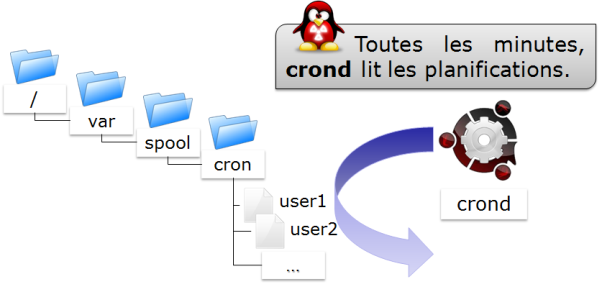
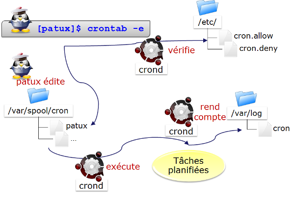

////
Les supports de Formatux sont publiés sous licence Creative Commons-BY-SA et sous licence Art Libre.
Vous êtes ainsi libre de copier, de diffuser et de transformer librement les œuvres dans le respect des droits de l’auteur.

    BY : Paternité. Vous devez citer le nom de l’auteur original.
    SA : Partage des Conditions Initiales à l’Identique.

Licence Creative Commons-BY-SA : https://creativecommons.org/licenses/by-sa/3.0/fr/
Licence Art Libre : http://artlibre.org/

Auteurs : Patrick Finet, Xavier Sauvignon, Antoine Le Morvan
////

= Gestion des tâches

== Généralités
La planification des tâches est gérée avec l'utilitaire **cron**. Il permet l'exécution périodique des tâches.

Il est réservé à l'administrateur et sous réserve aux utilisateurs et n'utilise qu'une commande : *crontab*.

Le service **cron** sert notamment pour :

* Les opérations d'administration répétitives ;
* Les sauvegardes ;
* La surveillance de l'activité du système ;
* L'exécution de programme.

indexterm2:[**crontab**] est le diminutif de **chrono table** : table de planification.

[CAUTION]
====
Pour mettre en place une planification, il faut que le système soit à l'heure.
====

== Fonctionnement du service
Le fonctionnement du service indexterm2:[**cron**] est assuré par un démon indexterm2:[**crond**] présent en mémoire.

Pour vérifier son statut :

[source,bash]
----
[root]# service crond status
----

[TIP]
====
Si le démon **crond** n'est pas en cours de fonctionnement, il faudra l'initialiser manuellement et/ou automatiquement au démarrage. En effet, même si des taches sont planifiées, elles ne seront pas lancées.
====

Initialisation du démon **crond** en manuel :

Depuis l'arborescence /etc/rc.d/init.d :
[source,bash]
----
[root]# ./crond {status|start|restart|stop}
----

Avec la commande service :
[source,bash]
----
[root]# service crond {status|start|restart|stop}
----

Initialisation du démon **crond** au démarrage :

Lors du chargement du système, il est lancé dans les niveaux d’exécution **2** à **5**.

[source,bash]
----
[root]# chkconfig --list crond
crond 0:arrêt 1:arrêt 2:marche 3:marche 4:marche 5:marche 6:arrêt
----

== La sécurité
Afin de mettre en oeuvre une planification, un utilisateur doit avoir la permission de se servir du service **cron**.

Cette permission varie suivant les informations contenues dans les fichiers ci-dessous :

*   **/etc/cron.allow**
*   **/etc/cron.deny**

[CAUTION]
====
Si aucun des deux fichiers n’est présent, tous les utilisateurs peuvent utiliser **cron**.
====

=== Autorisations
**/etc/cron.allow**  

Seuls les utilisateurs contenus dans ce fichier sont autorisés à utiliser **cron**.  

S’il est vide, aucun utilisateur ne peut utiliser **cron**.
[CAUTION]
====
Si cron.allow  est présent, cron.deny  est **ignoré**.
====

**/etc/cron.deny**  

Les utilisateurs contenus dans ce fichier ne sont pas autorisés à utiliser **cron**.  

S’il est vide, tous les utilisateurs peuvent utiliser **cron**.

=== Autoriser un utilisateur
Seul **user1** pourra utiliser **cron**

[source,bash]
----
[root]# vi /etc/cron.allow
user1
----

=== Interdire un utilisateur
Seul **user2** ne pourra pas utiliser **cron**

[source,bash]
----
[root]# vi /etc/cron.deny
user2
----

**cron.allow** ne doit pas être présent.

== La planification des tâches

Lorsqu’un utilisateur planifie une tâche, un fichier portant son nom est créé sous **/var/spool/cron/**.

Ce fichier contient toutes les informations permettant au démon **indexterm2:[crond]** de savoir quelle commande ou quel programme lancer et à quel moment le faire (heure, minute, jour …).

.Arborescence de cron

=== Commande crontab

La commande *indexterm2:[crontab]* permet de gérer le fichier de planification.
[source,bash]
----
crontab [-u utilisateur] [-e | -l | -r]
----
Exemple : 
[source,bash]
----
[root]# crontab –u user1 –e
----
.Options de la commande crontab
[cols="1,4",width="100%",options="header"]
|====================
|Option |	Description
|-e | Edite le fichier de planification avec vi
|-l | Affiche le contenu du fichier de planification
|-u | Nom de l’utilisateur dont le ficher de planification doit être manipulé
|-r | Efface le fichier de planification
|====================

[CAUTION]
====
**crontab** sans option efface l'ancien fichier de planification et attend que l'utilisateur rentre de nouvelles lignes. Il faut taper [ctrl] + [d] pour quitter ce mode d'édition.  

Seul **root** peut utiliser l’option **-u utilisateur** pour gérer le fichier de planification d'un autre utilisateur.

L'exemple proposé ci-dessus permet à root de planifier une tâche pour l'utilisateur user1.
====

=== Intérêts de la planification
Les intérêts de la planification sont multiples et notamment :

*   Modifications des fichiers de planification prises en compte immédiatement ;
*   Redémarrage inutile.

En revanche, il faut faire attention aux points suivants :

*   Le programme doit être autonome ;
*   Prévoir des redirections (stdin, stdout, stderr) ;
*   Il n’est pas pertinent de lancer des commandes faisant appel à des demandes d’entrée/sortie sur un terminal.

[NOTE]
====
Il faut bien comprendre que le but de la planification est d'effectuer des tâches de façon automatique, donc sans avoir besoin d'une intervention externe.
====

== Le fichier de planification
Le fichier de planification est structuré est respecte les règles suivantes.

*   Chaque ligne de ce fichier correspond à une planification ;
*   Chaque ligne comporte six champs, 5 pour le temps et 1 pour la commande ;
*   Chaque champs est séparé par un espace ou une tabulation ;
*   Chaque ligne se termine par un retour chariot ;
*   Un **#** en début de ligne commente celle-ci.

[source,bash]
----
[root]# crontab –e
10 4 1 * * /root/scripts/backup.sh
1  2 3 4 5       6
----
.Champs du fichier de planification
[cols="1,2,2",width="100%",options="header"]
|====================
| Champ | Description | Détail 
|1 | Minute(s) | De 0 à 59
|2 | Heure(s) | De 0 à 23 
|3 | Jour(s) du mois | De 1 à 31
|4 | Mois de l'année | De 1 à 12 
|5 | Jour(s) de la semaine | De 0 à 7 (0=7=dimanche)
|6 | Tâche à exécuter | Commande complète ou script 
|====================

[CAUTION]
====
Les tâches à exécuter doivent utiliser des chemins absolus et si possible utiliser des redirections.
====

Afin de simplifier la notation pour la définition du temps, il est conseillé d'utiliser les symboles spéciaux.

.Métacaractères utilisables
[cols="1,4",width="100%",options="header"]
|====================
|Métacaractère | Description
|* | Toutes les valeurs possibles du champs
|- | Indique un intervalle de valeurs
|, | Indique une liste de valeurs
|/ | Définit un pas
|====================

Exemples :

Script exécuté le 15 avril à 10h25 :
[source,bash]
----
25 10 15 04 * /root/scripts/script > /log/… 
----

Exécution à 11h puis à 16h tous les jours :
[source,bash]
----
00 11,16 * * * /root/scripts/script > /log/… 
----

Exécution toutes les heures de 11h à 16h tous les jours :
[source,bash]
----
00 11-16 * * * /root/scripts/script > /log/… 
----

Exécution toutes les 10 minutes aux heures de travail :
[source,bash]
----
*/10 8-17 * * 1-5 /root/scripts/script > /log/… 
----

=== Processus d'exécution d'une tâche
Un utilisateur, Patux, veut éditer son fichier de planification :  

1 ) crond vérifie s'il est autorisé (/etc/cron.allow et /etc/cron.deny ).  

2 ) Si c'est le cas, il accède à son fichier de planification  ( /var/spool/cron/Pierre ).  

Toutes les minutes crond lit les fichiers de planification.  

3 ) Il y exécute les tâches planifiées.  

4 ) Il rend compte systématiquement dans un fichier journal ( /var/log/cron ).

.Processus d'exécution d'une tâche
