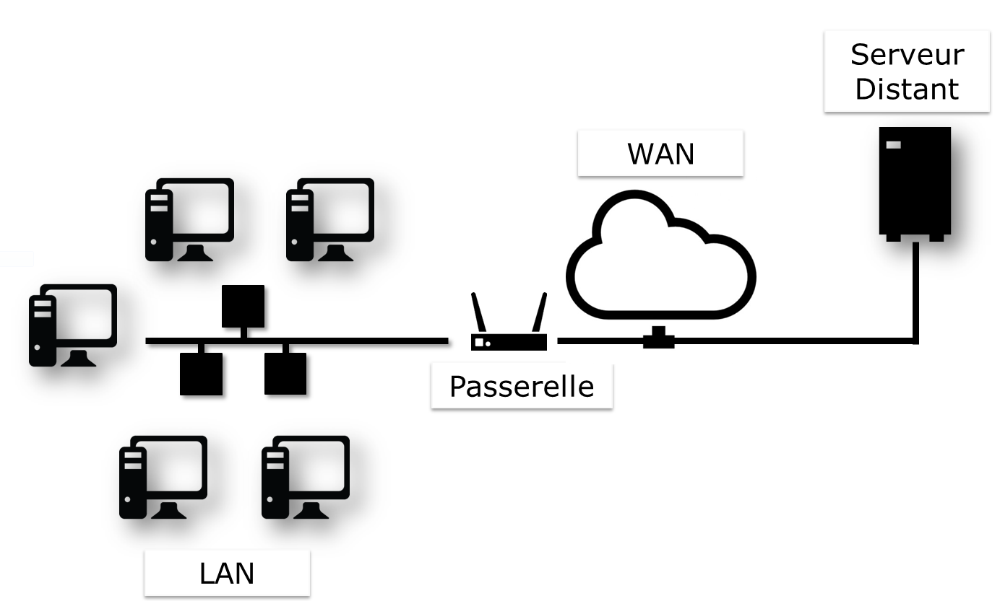
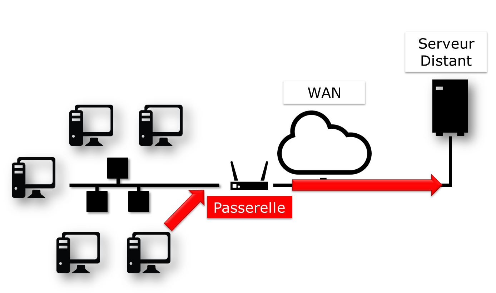
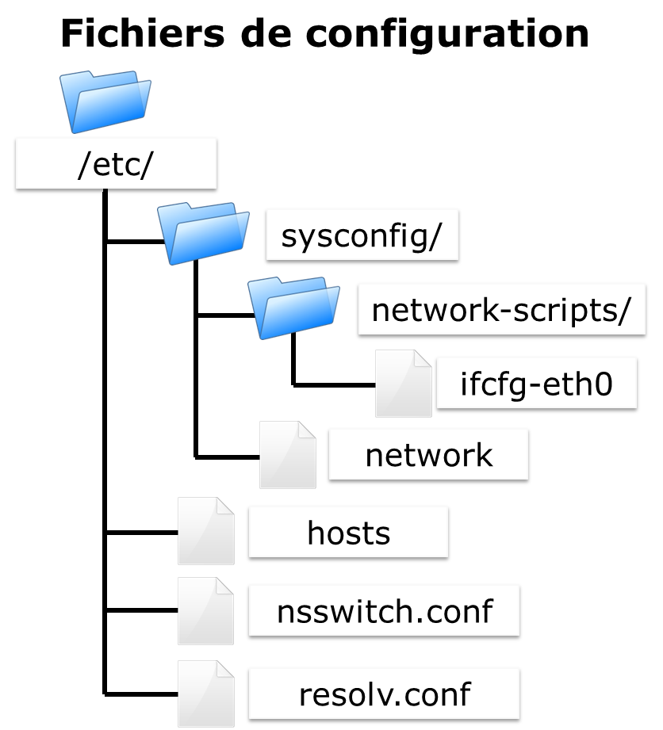
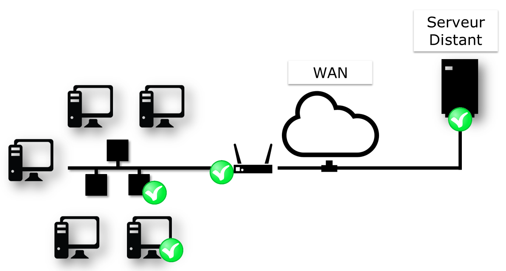

////
Les supports de Formatux sont publiés sous licence Creative Commons-BY-SA et sous licence Art Libre.
Vous êtes ainsi libre de copier, de diffuser et de transformer librement les œuvres dans le respect des droits de l’auteur.

    BY : Paternité. Vous devez citer le nom de l’auteur original.
    SA : Partage des Conditions Initiales à l’Identique.

Licence Creative Commons-BY-SA : https://creativecommons.org/licenses/by-sa/3.0/fr/
Licence Art Libre : http://artlibre.org/

Auteurs : Patrick Finet, Xavier Sauvignon, Antoine Le Morvan
////

= Mise en oeuvre du réseau

== Généralités

Pour illustrer ce cours, nous allons nous appuyer sur l’architecture suivante.

.Illustration de notre architecture réseau

Elle nous permettra de considérer :

*   l'intégration dans un LAN (local area network, ou réseau local) ;
*   la configuration d’une passerelle pour joindre un serveur distant ;
*   la configuration d’un serveur DNS puis mettre en œuvre la résolution de nom.

Les paramètres minimum à définir propres à la machine sont :

*   le nom de la machine ;
*   l'adresse IP ;
*   le masque de sous-réseau.

Exemple :

*   pc-tux ;
*   192.168.1.10 ;
*   255.255.255.0.

La notation appelée CIDR est de plus en plus fréquente : 192.168.1.10/24

Les adresses IP servent au bon acheminement des messages. Elles sont fractionnées en deux parties :

*   la partie fixe, identifiant le réseau ;
*   l'identifiant de l’hôte dans le réseau.

Le masque de sous-réseau est un ensemble de **4 octets** destiné à isoler :

*   l'adresse de réseau (**NetID** ou **SubnetID**) en effectuant un ET logique bit à bit entre l'adresse IP et le masque ;
*   l'adresse de l'hôte (**HostID**) en effectuant un ET logique bit à bit entre l'adresse IP et le complément du masque.

Il existe également des adresses spécifiques au sein d'un réseau, qu'il faut savoir identifier. La première adresse d'une plage ainsi que la dernière ont un rôle particulier :

*   La première adresse d'une plage est l'**adresse du réseau**. Elle permet d’identifier les réseaux et de router les informations d'un réseau à un autre.

*   La dernière adresse d'une plage est l'**adresse de broadcast**. Elle permet de faire de la diffusion à toutes les machines du réseau.

=== Adresse MAC / Adresse IP

Une **adresse MAC** est un identifiant physique inscrit en usine dans une mémoire. Elle est constituée de 6 octets souvent donnée sous forme hexadécimale (par exemple 5E:FF:56:A2:AF:15). 
Elle se compose de : 3 octets de l'identifiant constructeur et 3 octets du numéro de série. 

[CAUTION]
====
Cette dernière affirmation est aujourd'hui un peu moins vraie avec la virtualisation. Il existe également des solutions pour changer logiciellement l'adresse MAC.
====

Une **adresse IP** (Internet Protocol) est un numéro d'identification attribuée de façon permanente ou provisoire à chaque appareil connecté à un réseau informatique utilisant l'Internet Protocol.
Une partie définit l'adresse du réseau (NetID ou SubnetID suivant le cas), l'autre partie définit l'adresse de l'hôte dans le réseau (HostID). La taille relative de chaque partie varie suivant le masque de (sous) réseau. 
 
 Une adresse IPv4  définit une adresse sur 4 octets. Le nombre d'adresse disponible étant proche de la saturation un nouveau standard a été créé, l'IPv6 définie sur 16 octets.
 L'IPv6 est souvent représenté par 8 groupes de 2 octets séparés par un signe deux-points. Les zéro non significatifs peuvent être omis, un ou plusieurs groupes de 4 zéros consécutifs peuvent être remplacés par un double deux-points. 
Les masques de sous-réseaux ont de 0 à 128 bits.
(par exemple 21ac:0000:0000:0611:21e0:00ba:321b:54da/64 ou 21ac::611:21e0:ba:321b:54da/64)

 Dans une adresse web ou URL (Uniform Resource Locator), une adresse ip peut être suivi de deux-points, l'adresse de port (qui indique l'application à laquelle  les données sont destinées). Aussi pour éviter toute confusion dans une URL, l'adresse IPv6 s'écrit entre crochets [ ], deux-points, adresse de port.

    
Les adresses IP et MAC doivent être uniques sur un réseau !

[NOTE]
====
Sous VMWare, choisir l’option « I copied it » au lancement d’une VM génère une nouvelle adresse MAC.
====

=== Domaine DNS

Les postes clients peuvent faire partie d’un domaine indexterm2:[DNS] (**Domain Name System**, système de noms de domaine, par exemple mondomaine.lan).

Le nom de machine pleinement qualifié (indexterm2:[FQDN]) devient pc-tux.mondomaine.lan.

Un ensemble d’ordinateurs peut être regroupé dans un ensemble logique, permettant la résolution de nom, appelé domaine DNS. Un domaine DNS n’est pas, bien entendu, limité à un seul réseau physique.

Pour qu’un ordinateur intègre un domaine DNS, il faudra lui spécifier un suffixe DNS (ici mondomaine.lan) ainsi que des serveurs qu’il pourra interroger.

=== Rappel du modèle OSI

[TIP]
====
Aide mémoire :
Pour se souvenir de l’ordre PLRTSPA, retenir la phrase suivante : __Pour Les Réseaux Tu Seras Pas Augmenté__.
====

.Les 7 couches du indexterm2:[modèle OSI]
[cols="2,4",width="100%",options="header"]
|====
|  Couche  |  Protocoles 
|  7 - Application  |  POP, IMAP, SMTP, SSH, SNMP, HTTP, FTP, …  
|  6 - Présentation  |  ASCII, MIME, … 
|  5 - Session       |  TLS, SSL, NetBIOS, … 
|  4 - Transport     |  TLS, SSL, TCP, UDP,… 
|  3 - Réseau        |  IPv4, IPv6, ARP,… 
|  2 - Liaison       |  Ethernet, WiFi, Token Ring,… 
|  1 - Physique      |  Câbles, fibres optiques, ondes radio,… 
|====

*La couche 1* (Physique) prend en charge la transmission sur un canal de communication (Wifi, Fibre optique, câble RJ, etc.). 
Unité : le bit.

*La couche 2* (Liaison) prend en charge la topologie du réseau 
(Token-ring, étoile, bus, etc.), le fractionnement des données et les 
erreurs de transmissions. Unité : la tramme.

*La couche 3* (Réseau) prend en charge la transmission de bout en bout des données (routage IP = Passerelle). Unité : le paquet.

*La couche 4* (Transport) prend en charge le type de service (connecté ou 
non connecté), le chiffrement et le contrôle de flux. Unité : le segment ou le datagramme.

*La couche 7* (Application) représente le contact avec l’utilisateur. 
Elle apporte les services offerts par le réseau : http, dns, ftp, imap, 
pop, smtp, etc.

== Le nommage des interfaces

*lo* est l'interface “**loopback**” qui permet à des programmes TCP/IP de communiquer entre eux sans sortir de la machine locale. Cela permet de tester si le *module « réseau » du système fonctionne bien* et aussi de faire un ping localhost. Tous les paquets qui entrent par localhost ressortent par localhost. Les paquets reçus sont les paquets envoyés.

Le noyau Linux attribue des noms d'interfaces composés d'un préfixe précis selon le type. Sur des distributions Linux RHEL 6, toutes les interfaces **Ethernet**, par exemple, commencent par **eth**. Le préfixe est suivi d'un chiffre, le premier étant 0 (eth0, eth1, eth2…). Les interfaces wifi se voient attribuées un préfixe wlan.

== Utiliser la commande IP

Oubliez l’ancienne commande **ifconfig** ! Pensez **indexterm2:[ip]** !

[NOTE]
====
Commentaire à destination des administrateurs d’anciens systèmes Linux :

La commande historique de gestion du réseau est **ifconfig**. Cette commande a tendance a être remplacée par la commande **ip**, déjà bien connue des administrateurs réseaux.

La commande **ip** est la commande unique pour gérer l’adresse **IP, ARP, le routage, etc.**

La commande ifconfig n’est plus installée par défaut sous RHEL 7. Il est
 important de prendre des bonnes habitudes dès maintenant.
====

== Le nom de machine

La commande indexterm2:[hostname] affiche ou définit le nom d’hôte du système

.Syntaxe de la commande hostname
----
hostname [-f] [hostname]
----

.Options principales de la commande hostname
[cols="1,4",width="100%",options="header"]
|====
|  Option  |  Description 
|  -f | Affiche le FQDN 
|  -i | Affiche les adresses IP du système 
|====

[IMPORTANT]
====
Cette commande est utilisée par différents programmes réseaux pour identifier la machine.
====

Pour affecter un nom d’hôte, il est possible d'utiliser la commande hostname, mais les changements ne seront pas conservés au prochain démarrage. La commande sans argument permet d’afficher le nom de l’hôte.

Pour fixer le nom d'hôte, il faut modifier le fichier **__/etc/sysconfig/network__** :

.Le fichier /etc/sysconfig/network
[source,bash]
----
NETWORKING=yes
HOSTNAME=stagiaire.mondomaine.lan
----

Le script de démarrage sous RedHat consulte également le fichier **/etc/hosts** pour résoudre le nom d’hôte du système.

Lors du démarrage du système, Linux vient évaluer la valeur **HOSTNAME** du fichier **/etc/sysconfig/network**.

Il utilise ensuite le fichier **/etc/hosts** pour évaluer l’adresse IP principale du serveur et son nom d’hôte. Il en déduit le nom de domaine DNS.

Il est donc primordiale de bien renseigner ces deux fichiers avant toute configuration de services réseaux.

[IMPORTANT]
====
Pour savoir si cette configuration est bien faîte, les commandes hostname et hostname –f doivent répondre les bonnes valeurs attendues.
====

== Le fichier /etc/hosts 

Le fichier **/etc/hosts** indexterm:[hosts] est une table de correspondance statique des noms d’hôtes, qui respecte le format suivant :

.Syntaxe du fichier /etc/hosts
----
@IP <nom d'hôte>  [alias]  [# commentaire]
----

Exemple de fichier /etc/hosts :

.Exemple de fichier /etc/hosts
[source,bash]
----
127.0.0.1 	localhost localhost.localdomain
::1 		localhost localhost.localdomain
192.168.1.10 	stagiaire.mondomaine.lan stagiaire
----

Le fichier **/etc/hosts** est encore employé par le système, notamment lors du démarrage durant lequel le FQDN du système est déterminé.

[IMPORTANT]
====
RedHat préconise qu’au moins une ligne contenant le nom du système soit renseignée.
====

Si le service indexterm2:[DNS] (Domain Name Service) n’est pas en place, vous devez renseigner tous les noms dans le fichier hosts de chacune de vos machines.

Le fichier /etc/hosts contient une ligne par entrée, comportant l’adresse IP, le FQDN, puis le nom d’hôte (dans cet ordre) et une suite d’alias (alias1 alias2 …). L’alias est une option.

== Le fichier /etc/nsswitch.conf

 Le Name Service Switch (NSS) permet de substituer des fichiers de configuration (par exemple /etc/passwd, /etc/group, /etc/hosts) par une ou plusieurs bases de données centralisées
 
Le fichier /etc/nsswitch.conf indexterm:[nsswitch] permet de configurer les bases de données du service de noms.

.Le fichier /etc/nsswitch.conf
[source,bash]
----
passwd: files
shadow: files
group: files

hosts: files dns
----

Dans le cas présent, Linux cherchera en premier une correspondance de noms d'hôtes (ligne hosts:) dans le fichier /etc/hosts (valeur files) avant d’interroger le DNS (valeur dns)! Ce comportement peut simplement être changé en éditant le fichier /etc/nsswitch.conf.

Bien évidemment, il est possible d’imaginer interroger un serveur LDAP, Mysql ou autre en configurant le service de noms pour répondre aux requêtes du systèmes sur les hosts, les utilisateurs, les groupes, etc.

La résolution du service de noms peut être testée avec la commande getent que nous verrons plus loin dans ce cours.

== Le fichier /etc/resolv.conf

Le fichier /etc/resolv.conf contient la configuration de la résolution de nom DNS.

./etc/resolv.conf
[source,bash]
----
#Generated by NetworkManager
domain mondomaine.lan
search mondomaine.lan
nameserver 192.168.1.254
----

[IMPORTANT]
====
Ce fichier est historique. Il n’est plus renseigné directement !
====

Les nouvelles générations de distributions ont généralement intégré le service NetworkManager. Ce service permet de gérer plus efficacement la configuration, que ce soit en mode graphique ou console.

Il permet notamment de configurer les serveurs DNS depuis le fichier de configuration d’une interface réseau. Il se charge alors de renseigner dynamiquement le fichier /etc/resolv.conf qui ne devrait jamais être édité directement, sous peine de perdre les changements de configuration au prochain démarrage du service réseau.

== La commande indexterm2:[IP]

La commande ip du paquet iproute2 permet de configurer une interface et sa table routage.

Afficher les interfaces :

[source,bash]
----
[root]# ip link
----

Afficher les informations des interfaces :

[source,bash]
----
[root]# ip addr show
----

Afficher les informations d’une interface :

[source,bash]
----
[root]# ip addr show eth0
----

Afficher la table ARP:

[source,bash]
----
[root]# ip neigh
----

Toutes les commandes historiques de gestion du réseau ont été regroupées sous la commande IP, bien connue des administrateurs réseaux.

== Configuration indexterm2:[DHCP]

Le protocole DHCP (Dynamic Host Control Protocol) permet d’obtenir via le réseau une configuration IP complète. C’est le mode de configuration par défaut d’une interface réseau sous Redhat, ce qui explique qu’un système branché sur le réseau d’une box internet puisse fonctionner sans configuration supplémentaire.

La configuration des interfaces sous RHEL 6 se fait dans le dossier **/etc/sysconfig/network-scripts/**.

Pour chaque interface ethernet, un fichier **ifcfg-ethX** permet de configurer l’interface associée.

./etc/sysconfig/network-scripts/ifcfg-eth0
[source,bash]
----
DEVICE=eth0
ONBOOT=yes
BOOTPROTO=dhcp
HWADDR=00:0c:29:96:32:e3
----

*  Nom de l’interface : (doit être dans le nom du fichier)

[source,bash]
----
DEVICE=eth0
----

*   Démarrer automatiquement l’interface :

[source,bash]
----
ONBOOT=yes
----

*  Effectuer une requête DHCP au démarrage de l’interface :

[source,bash]
----
BOOTPROTO=dhcp
----

*  Spécifier l’adresse MAC (facultatif mais utile lorsqu’il y a plusieurs interfaces) :

[source,bash]
----
HWADDR=00:0c:29:96:32:e3
----

[TIP]
====
Si indexterm2:[NetworkManager] est installé, les modifications sont prises en compte automatiquement. Sinon, il faut redémarrer le service réseau.
====

Redémarrer le service réseau :

[source,bash]
----
[root]# service network restart
----

et sous RHEL 7 :

[source,bash]
----
[root]# systemctl restart network
----

== Configuration statique

La configuration statique nécessite à minima :

./etc/sysconfig/network-scripts/ifcfg-eth0
[source,bash]
----
DEVICE=eth0
ONBOOT=yes
BOOTPROTO=none
IPADDR=192.168.1.10
NETMASK=255.255.255.0
----

*    Ne pas utiliser DHCP = configuration statique

[source,bash]
----
BOOTPROTO=none
----

*   Adresse IP :

[source,bash]
----
IPADDR=192.168.1.10
----

*   Masque de sous-réseau :

[source,bash]
----
NETMASK=255.255.255.0
----

*   Le masque peut être spécifié avec un préfixe :

[source,bash]
----
PREFIX=24
----

[CAUTION]
====
Il faut utiliser NETMASK OU PREFIX - Pas les deux !
====

[TIP]
====
Pensez à redémarrer le service network !
====

== Routage

.Architecture réseau avec une passerelle

./etc/sysconfig/network-scripts/ifcfg-eth0
[source,bash]
----
DEVICE=eth0
ONBOOT=yes
BOOTPROTO=none
HWADDR=00:0c:29:96:32:e3
IPADDR=192.168.1.10
NETMASK=255.255.255.0
GATEWAY=192.168.1.254
----

[TIP]
====
Pensez à redémarrer le service network !
====

.La commande indexterm2:[ip route]
[source,bash]
----
[root]# ip route show
192.168.1.0/24 dev eth0 […] src 192.168.1.10 metric 1
default via 192.168.1.254 dev eth0 proto static
----

Il est judicieux de savoir lire une table de routage, surtout dans un environnement disposant de plusieurs interfaces réseaux.

*   Dans l'exemple présenté, le réseau 192.168.1.0/24 est directement accessible depuis le périphérique eth0, il y a donc une métrique à 1 (ne traverse pas de routeur).

*   Tous les autres réseaux que le réseau
 précédent seront joignables, toujours depuis le périphérique eth0, mais cette fois-ci les paquets seront adressés à une passerelle 192.168.1.254. Le protocole de routage est un protocole statique (bien qu’il soit possible d’ajouter un protocole de routage dynamique sous Linux).

== Résolution de noms

Un système a besoin de résoudre :

*    des FQDN en adresses IP

[source,bash]
----
www.free.fr = 212.27.48.10
----

*   des adresses IP en noms

[source,bash]
----
212.27.48.10 = www.free.fr
----

*   ou d’obtenir des informations sur une zone :

[source,bash]
----
MX de free.fr = 10 mx1.free.fr + 20 mx2.free.fr
----

./etc/sysconfig/network-scripts/ifcfg-eth0
[source,bash]
----
DEVICE=eth0
ONBOOT=yes
BOOTPROTO=none
HWADDR=00:0c:29:96:32:e3
IPADDR=192.168.1.10
NETMASK=255.255.255.0
GATEWAY=192.168.1.254
DNS1=172.16.1.2
DNS2=172.16.1.3
DOMAIN=mondomaine.lan
----

Dans ce cas, pour joindre les DNS, il faut passer par la passerelle.

./etc/resolv.conf
[source,bash]
----
 #Generated by NetworkManager
 domain mondomaine.lan
 search mondomaine.lan
 nameserver 172.16.1.2
 nameserver 172.16.1.3
----

Le fichier a bien été mis à jour par NetworkManager.

== Dépannage

La commande indexterm2:[ping] permet d'envoyer des datagrammes à une autre machine et attend une réponse.

C'est la commande de base pour tester le réseau car elle vérifie la connectivité entre votre interface réseau et une autre.

.La syntaxe de la commande ping
[source,bash]
----
ping [-c numérique] destination  
----

L'option -c (count) permet de stoper la commande au bout du décompte exprimé en seconde.

Exemple :

[source,bash]
----
[root]# ping –c 4 localhost
----

[TIP]
====
Validez la connectivité du plus proche au plus lointain
====

1) Valider la couche logicielle TCP/IP

[source,bash]
----
[root]# ping localhost
----

« Pinguer » la boucle interne ne permet pas de détecter une panne matérielle sur l’interface réseau. Elle permet simplement de déterminer si la configuration logicielle IP est correcte.

2) Valider la carte réseau

[source,bash]
----
[root]# ping 192.168.1.10
----

Pour déterminer que la carte réseau est fonctionnelle, il faut maintenant faire un « ping » de son adresse IP. La carte réseau, si le câble réseau n’est pas connecté, devrait être dans un état « down ». 

Si le ping ne fonctionne pas, vérifier dans un premier temps le câble réseau vers votre le commutateur réseau et remonter l’interface (voir la commande if up), puis vérifiez l’interface elle-même.

3) Valider la connectivité de la passerelle

[source,bash]
----
[root]# ping 192.168.1.254
----

4) Valider la connectivité d’un serveur distant

[source,bash]
----
[root]# ping 172.16.1.2
----

5) Valider le service DNS

[source,bash]
----
[root]# ping www.free.fr
----

=== La commande indexterm2:[dig]

La commande dig (dig : en francer miner, chercher en profondeur) permet d'interroger le serveur DNS.

.Syntaxe de la commande dig
[source,bash]
----
dig [-t type] [+short] [name]
----

Exemples :

[source,bash]
----
[root]# dig +short www.formatux.fr
46.19.120.31
[root]# dig –t MX +short formatux.fr 
10 smtp.formatux.fr.
----

La commande **DIG** permet d’interroger les **serveurs DNS**. Elle est par défaut très verbeuse, mais ce comportement peut être changé grâce à l’option **+short**.

Il est également possible de spécifier un **type d’enregistrement** DNS à résoudre, comme par exemple un **type MX** pour obtenir des renseignements sur les serveurs de messagerie d’un domaine.

Pour plus d’informations à ce sujet, voir le cours « DNS avec Bind9 »

=== La commande indexterm2:[getent]

La commande **getent** (get entry) permet d'obtenir une entrée de NSSwitch (hosts + dns)

.Syntaxe de la commande getent
[source,bash]
----
getent hosts name
----

Exemple :

[source,bash]
----
[root]# getent hosts www.formatux.fr
  46.19.120.31 www.formatux.fr
----

Interroger uniquement un serveur DNS peut renvoyer un résultat erroné qui ne prendrait pas en compte le contenu d’un fichier hosts, bien que ce cas de figure devrait être rare aujourd’hui.

Pour prendre en compte également le fichier **/etc/hosts**, il faut interroger le service de noms NSSwitch, qui se chargera d’une éventuelle résolution DNS.

=== La commande indexterm2:[ipcalc]

La commande ipcalc (ip calcul) permet de calculer l’adresse d'un réseau ou d’un broadcast depuis une adresse IP et un masque.

.Syntaxe de la commande ipcalc
[source,bash]
----
ipcalc  [options] IP <netmask>
----

Exemple :

[source,bash]
----
[root]# ipcalc –b 172.16.66.203 255.255.240.0
BROADCAST=172.16.79.255
----

[TIP]
====
Cette commande est intéressante suivie d'une redirection pour renseigner automatiquement les fichiers de configuration de vos interfaces :
[source,bash]
----
[root]# ipcalc –b 172.16.66.203 255.255.240.0 >> /etc/sysconfig/network-scripts/ifcfg-eth0
----
====

[cols="1,4",options="header"]
|====
|  Option  |  Description 
|  -b |Affiche l’adresse de broadcast. 
|  -n | Affiche l’adresse du réseau et du masque. 
|====

**ipcalc** permet de calculer simplement les informations IP d'un hôte. Les diverses options indiquent quelles informations ipcalc doit afficher sur la sortie standard. Des options multiples peuvent être indiquées.  Une adresse IP sur laquelle opérer doit être spécifiée. La plupart des opérations nécessitent aussi un masque réseau ou un préfixe CIDR. 

.Options principales de la commande ipcalc
[cols="1,2,4",width="100%",options="header"]
|====
|  Option courte  |  Option longue  |  Description 
| -b  |--broadcast  |  Affiche l'adresse de diffusion de l'adresse IP donnée et du masque réseau.  
| -h |--hostname   |  Affiche le nom d'hôte de l'adresse IP donnée via le DNS.  
| -n  |--netmask    |  Calcule le masque réseau de l'adresse IP donnée. Suppose que l'adresse 
IP fait partie d'un réseau de classe A, B, ou C complet. De nombreux 
réseaux n'utilisent pas les masques réseau par défaut, dans ce cas une 
valeur incorrecte sera retournée.  
| -p  |--prefix     |  Indique le préfixe de l'adresse masque/IP.  
| -n |--network    |  Indique l'adresse réseau de l'adresse IP et du masque donné.  
| -s |--silent     |  N'affiche jamais aucun message d'erreur.  
|====

=== La commande indexterm2:[ss]

La commande ss (socket statistics) affiche les ports en écoute sur le réseau

.Syntaxe de la commande ss
[source,bash]
----
ss [-tuna]
----

Exemple :

[source,bash]
----
[root]# ss –tuna
tcp   LISTEN   0   128   *:22   *:*
----

Les commande *SS* et *NETSTAT* (à suivre) vont se révéler très importantes pour la suite de votre cursus Linux.

Lors de la mise en œuvre des services réseaux, il est très fréquent de vérifier avec l’une de ces deux commandes que le service est bien en écoute sur les ports attendus.

=== La commande indexterm2:[netstat]

La commande netstat (network statistics) affiche les ports en écoute sur le réseau

.Syntaxe de la commande netstat
[source,bash]
----
netstat -tapn
----

Exemple :

[source,bash]
----
[root]# netstat –tapn
tcp  0  0  0.0.0.0:22  0.0.0.0:*  LISTEN 2161/sshd
----

=== Les conflits d'adresses IP ou d'adresses MAC

Un défaut de configuration peut amener plusieurs interfaces à utiliser la même adresse IP. Cette situation peut se produire lorsqu'un réseau dispose de plusieurs serveurs DHCP ou lorsque la même adresse IP est manuellement assignée plusieurs fois.

Lorsque le réseau fonctionne mal, que des dysfonctionnements ont lieu, et qu'un conflit d'adresses IP pourrait en être à l'origine, il est possible d'utiliser le logiciel indexterm2:[arp-scan] (nécessite le dépot EPEL) :

[source,bash]
----
$ yum install arp-scan
----

Exemple :
[source,bash]
----
$ arp-scan -I eth0 -l

172.16.1.104  00:01:02:03:04:05       3COM CORPORATION
172.16.1.107  00:0c:29:1b:eb:97       VMware, Inc.
172.16.1.250  00:26:ab:b1:b7:f6       (Unknown)
172.16.1.252  00:50:56:a9:6a:ed       VMWare, Inc.
172.16.1.253  00:50:56:b6:78:ec       VMWare, Inc.
172.16.1.253  00:50:56:b6:78:ec       VMWare, Inc. (DUP: 2)
172.16.1.253  00:50:56:b6:78:ec       VMWare, Inc. (DUP: 3)
172.16.1.253  00:50:56:b6:78:ec       VMWare, Inc. (DUP: 4)
172.16.1.232   88:51:fb:5e:fa:b3       (Unknown) (DUP: 2)
----

[TIP]
====
Comme l'exemple ci-dessus le démontre, il est également possible d'avoir des conflits d'adresses MAC ! Ces problématiques sont apportées par les technologies de virtualisation et la recopie de machines virtuelles.
====

== Configuration à chaud

La commande ip peut ajouter à chaud une adresse IP à une interface

[source,bash]
----
ip addr add @IP dev DEVICE
----

Exemple :

[source,bash]
----
[root]# ip addr add 192.168.2.10 dev eth1
----

La commande ip permet d'activer ou désactiver une interface :

[source,bash]
----
ip link set DEVICE up
ip link set DEVICE down
----

Exemple : 

[source,bash]
----
[root]# ip link set eth1 up
[root]# ip link set eth1 down
----

La commande ip permet d'ajouter une route :

[source,bash]
----
ip route add [default|netaddr] via @IP [dev device]
----

Exemple :

[source,bash]
----
[root]# ip route add default via 192.168.1.254 
[root]# ip route add 192.168.100.0/24 via 192.168.2.254 dev eth1
----

== En résumé

Les fichiers mis en oeuvre durant ce chapitre sont :

.Synthèse des fichiers mis en oeuvre dans la partie réseau

Une configuration complète d'une interface pourrait être celle-ci :

./etc/sysconfig/network-scripts/ifcfg-eth0
[source,bash]
----
 DEVICE=eth0
 ONBOOT=yes
 BOOTPROTO=none
 HWADDR=00:0c:29:96:32:e3
 IPADDR=192.168.1.10
 NETMASK=255.255.255.0
 GATEWAY=192.168.1.254
 DNS1=172.16.1.1
 DNS2=172.16.1.2
 DOMAIN=formatux.fr
----

La méthode de dépannage doit aller du plus proche au plus lointain :

1.  ping localhost (test logiciel)

2.  ping adresseIP (test matériel)

3.  ping passerelle (test connectivité)

4.  ping serveur-distant (test routage)

5.  Interrogation DNS (dig ou ping)

.Méthode de dépannage ou de validation du réseau
