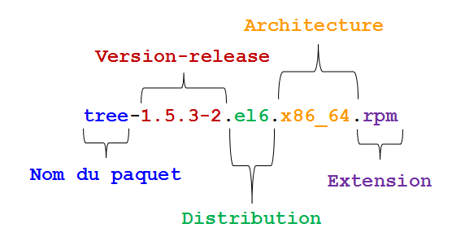

////
Les supports de Formatux sont publiés sous licence Creative Commons-BY-SA et sous licence Art Libre.
Vous êtes ainsi libre de copier, de diffuser et de transformer librement les œuvres dans le respect des droits de l’auteur.

    BY : Paternité. Vous devez citer le nom de l’auteur original.
    SA : Partage des Conditions Initiales à l’Identique.

Licence Creative Commons-BY-SA : https://creativecommons.org/licenses/by-sa/3.0/fr/
Licence Art Libre : http://artlibre.org/

Auteurs : Patrick Finet, Xavier Sauvignon, Antoine Le Morvan
////

= Gestion des logiciels 

== Généralités

Sur un système Linux, il est possible d'installer un logiciel de deux façons :

* en utilisant un paquet d'installation ;
* en compilant les fichiers sources.

**Le paquet** : Il s'agit d'un unique fichier comprenant toutes les données utiles à l'installation du programme. Il peut être exécuté directement sur le système à partir d'un dépôt logiciel.

**Les fichiers sources** : Certains logiciels ne sont pas fournis dans des paquets prêts à être installés mais via une archive contenant les fichiers sources. Charge à l'administrateur de préparer ces fichiers et de les compiler pour installer le programme.

== RPM : RedHat Package Manager

indexterm2:[*RPM*] (RedHat Package Manager) est un système de gestion des logiciels. Il est possible d'installer, de désinstaller, de mettre à jour ou de vérifier des logiciels contenus dans des paquets.

*RPM* est le format utilisé par toutes les distributions à base RedHat (Fedora, CentOS, SuSe, Mandriva, ...). Son équivalent dans le monde de Debian est DPKG (Debian Package).

Le nom d'un paquet RPM répond à une nomenclature précise :

.nom-version-edition.architecture.rpm

=== Commande rpm

La commande rpm permet d'installer un paquet.

[source,bash]
.Syntaxe de la commande rpm
----
rpm [-i][-U] paquet.rpm [-e] paquet
----

Exemple :

[source,bash]
----
[root]# rpm -ivh paquet.rpm
----

.Options de la commande rpm
[cols="1,4",width="100%",options="header"]
|====================
|Option |	Description
|-i __paquet.rpm__ |	Installe le paquet.
|-U __paquet.rpm__ |	Met à jour un paquet déjà installé.
|-e __paquet.rpm__ |	Désinstalle le paquet.
|-h |	Affiche une barre de progression.
|-v |   Informe sur l'avancement de l'opération.
|--test |	Teste la commande sans l'exécuter.
|====================

La commande rpm permet aussi d'interroger la base de données des paquets du système en ajoutant l'option *-q*.

Il est possible d'exécuter plusieurs types de requêtes pour obtenir différentes informations sur les paquets installés.
La base de donnée RPM se trouve dans le répertoire */var/lib/rpm* .

Exemple :

[source,bash]
----
[root]# rpm -qa
----
Cette commande interroge tous les paquets installés sur le système.

[source,bash]
.Syntaxe de la commande rpm pour interrogation
----
rpm -q [-a][-i][-l] paquet [-f] fichier
----

Exemple :

[source,bash]
----
[root]# rpm -qil paquet
[root]# rpm -qf /chemin/fichier
----

.Options de la commande rpm  pour interrogation
[cols="1,4",width="100%",options="header"]
|====================
|Option |	Description
|-a |	Liste tous les paquets installés sur le système.
|-i __paquet__ |	Affiche les informations du paquet.
|-l __paquet__ |	Liste les fichiers contenus dans le paquet.
|-f |	Affiche le nom du paquet contenant le fichier précisé.
| --last | La liste des paquets est donnée par date d'installation (les derniers paquetages installés  apparaissent  en  premier).
|====================

[CAUTION]
====
Après l'option *-q*, le nom du paquet doit être exact. Les métacaractères ne sont pas gérés.
====

[TIP]
====
Il est cependant possible de lister tous les paquets installés et de filtrer avec la commande *grep*.
====

Exemple : lister les derniers paquets installés :

[source,bash]
----
sudo rpm -qa --last | head
kernel-devel-3.10.0-514.21.2.el7.x86_64       mar. 27 juin 2017 14:52:21 CEST
webmin-1.850-1.noarch                         mar. 27 juin 2017 14:51:59 CEST
kernel-3.10.0-514.21.2.el7.x86_64             mar. 27 juin 2017 14:51:32 CEST
sudo-1.8.6p7-23.el7_3.x86_64                  mar. 27 juin 2017 14:51:23 CEST
python-perf-3.10.0-514.21.2.el7.x86_64        mar. 27 juin 2017 14:51:22 CEST
kernel-tools-3.10.0-514.21.2.el7.x86_64       mar. 27 juin 2017 14:51:22 CEST
glibc-headers-2.17-157.el7_3.4.x86_64         mar. 27 juin 2017 14:51:22 CEST
glibc-devel-2.17-157.el7_3.4.x86_64           mar. 27 juin 2017 14:51:22 CEST
kernel-headers-3.10.0-514.21.2.el7.x86_64     mar. 27 juin 2017 14:51:21 CEST
kernel-tools-libs-3.10.0-514.21.2.el7.x86_64  mar. 27 juin 2017 14:51:20 CEST
----

Exemple : lister l'historique d'installation du kernel :

[source,bash]
----
sudo rpm -qa --last kernel 
kernel-3.10.0-514.21.2.el7.x86_64             mar. 27 juin 2017 14:51:32 CEST
kernel-3.10.0-514.21.1.el7.x86_64             mar. 20 juin 2017 10:31:38 CEST
kernel-3.10.0-514.16.1.el7.x86_64             lun. 17 avril 2017 09:41:52 CEST
kernel-3.10.0-514.10.2.el7.x86_64             lun. 27 mars 2017 07:07:10 CEST
kernel-3.10.0-514.6.1.el7.x86_64              dim. 05 févr. 2017 18:40:50 CET
----

== YUM : Yellow dog Updater Modified

indexterm2:[YUM] est un gestionnaire de paquets logiciels. Il fonctionne avec des paquets RPM regroupés dans un dépôt (un répertoire de stockage des paquets) local ou distant.

La commande *yum* permet la gestion des paquets en comparant ceux installés sur le système à ceux présents dans les dépôts définis sur le serveur. Elle permet aussi d'installer automatiquement les dépendances, si elles sont également présentes dans les dépôts.

*YUM* est le gestionnaire utilisé par de nombreuses distributions à base RedHat (Fedora, CentOS, ...). Son équivalent dans le monde Debian est APT (Advanced Packaging Tool).

=== Commande yum

La commande yum permet d'installer un paquet en ne spécifiant que le nom court.

[source,bash]
.Syntaxe de la commande yum
----
yum [install][remove][list all][search][info] paquet
----

Exemple :

[source,bash]
----
[root]# yum install tree
----
Seul le nom court du paquet est nécessaire.

.Options de la commande yum
[cols="2,5",width="100%",options="header"]
|====================
|Option |	Description
| __install__ |	Installe le paquet.
| __remove__ |	Désinstalle le paquet.
| __list all__ |	Liste les paquets déjà présents dans le dépôt.
| __search__ |	Recherche un paquet dans le dépôt.
| __provides */nom_cmde__ |   Recherche une commande.
| __info__ |	Affiche les informations du paquet.
|====================

La commande *yum list* liste tous les paquets installés sur le système et présents dans le dépôt. Elle accepte plusieurs paramètres :

.Paramètres de la commande yum list
[cols="1,4",width="100%",options="header"]
|====================
|Paramètre |	Description
| __all__ |	Liste les paquets installés puis ceux disponible sur les dépôts.
| __available__ |	Liste uniquement les paquets disponible pour installation.
| __updates__ |	Liste les paquets pouvant être mis à jour.
| __obsoletes__|	Liste les paquets rendus obsolètes par des versions supérieures disponibles.
| __recent__|	Liste les derniers paquets ajoutés au dépôt.
|====================

Exemple de recherche de la commande semanage :

[source,bash]
----
[root]# yum provides */semanage
----

=== Fonctionnement de YUM

Sur un poste client, le gestionnaire YUM s'appuie sur un ou plusieurs fichiers de configuration afin de cibler les dépôts contenant les paquets RPM.

Ces fichiers sont situés dans */etc/yum.repos.d/* et se terminent obligatoirement par *.repo* afin d'être exploités par YUM.

Exemple :

[source,bash]
----
/etc/yum.repos.d/MonDepotLocal.repo
----

Chaque fichier *.repo* se constitue au minimum des informations suivantes, une directive par ligne.
Exemple:

[source,bash]
----
[DepotLocal]    #Nom court du dépôt
name=Mon dépôt local    #Nom détaillé
baseurl=http://....... ou file:///......    #Adresse http ou local
enabled=1   #Activation =1, ou non activé =0"
gpgcheck=1  #Dépôt demandant une signature
gpgkey=file:///etc/pki/rpm-gpg/RPM-GPG-KEY-CentOS-6 #Chemin de la clef publique GPG
----

Par défaut, la directive *enabled* est absente ce qui signifie que le dépôt est activé. Pour désactiver un dépôt, il faut spécifier la directive *enabled=0*.

== Gérer son dépôt

La création d'un dépôt permet de disposer de sa propre banque de paquets. Celle-ci peut-être disponible par exemple par point de montage ou mise à disposition sur un serveur web.

Les étapes de la création d'un dépôt sur un serveur sont les suivantes :

* Créer un répertoire qui va accueillir tous les paquets rpm ;

[source,bash]
----
[root]# mkdir /MonDepot
----

* Copier tous les paquets rpm nécessaires dans ce dossier ;

[source,bash]
----
[root]# cp ../*.rpm /MonDepot/
----

* Créer la structure et générer le dépôt à l'aide de la commande indexterm2:[*createrepo*] ;

[source,bash]
----
[root]# createrepo /MonDepot
----

* Configurer les fichiers *.repo* des clients afin qu'ils puissent installer les paquets depuis ce serveur (réinitialiser le cache des clients si besoin avec *yum clean all*).
  
== Le dépôt EPEL

Le dépôt indexterm:[epel] *EPEL* (**E**xtra **P**ackages for **E**nterprise **L**inux) est un dépôt contenant des paquets logiciels supplémentaires pour Entreprise Linux, ce qui inclut RedHat Entreprise Linux (RHEL), CentOS, etc.

=== Installation

Télécharger et installer le rpm du dépôt :

Si vous êtes derrière le proxy internet de l'école

[source,bash]
----
[root]# export http_proxy=http://10.10.10.7:8080
----

* Pour une CentOS 6 :

[source,bash]
----
[root]# rpm -ivh http://dl.fedoraproject.org/pub/epel/6/x86_64/epel-release-6-8.noarch.rpm
----

Après avoir installé le paquet RPM du dépôt :

[source,bash]
----
[root]# yum update
----

