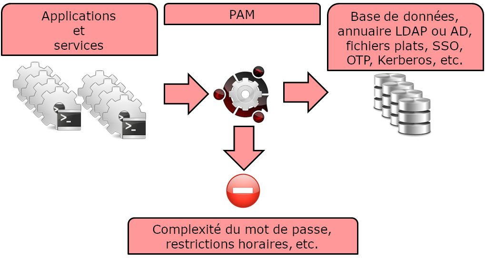
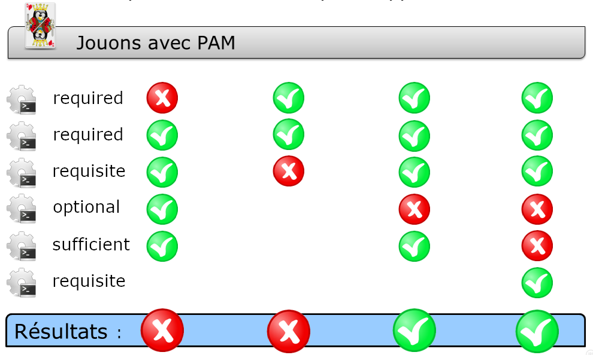

////
Les supports de Formatux sont publiés sous licence Creative Commons-BY-SA et sous licence Art Libre.
Vous êtes ainsi libre de copier, de diffuser et de transformer librement les œuvres dans le respect des droits de l’auteur.

    BY : Paternité. Vous devez citer le nom de l’auteur original.
    SA : Partage des Conditions Initiales à l’Identique.

Licence Creative Commons-BY-SA : https://creativecommons.org/licenses/by-sa/3.0/fr/
Licence Art Libre : http://artlibre.org/

Auteurs : Patrick Finet, Xavier Sauvignon, Antoine Le Morvan
////
= Les modules d'authentification PAM

indexterm2:[PAM] (*Pluggable Authentication Modules*) est le système sous GNU/Linux qui permet à de nombreuses applications ou services d’*authentifier* les utilisateurs de manière *centralisée*.

[quote,Définition de PAM par Wikipedia]
____
PAM est un mécanisme permettant d’intégrer différents schémas d’authentification de bas niveau dans une API de haut niveau, permettant de ce fait de rendre indépendants du schéma les logiciels réclamant une authentification.
____

== Généralités

L'authentification est la phase durant laquelle il est vérifié que vous êtes bien la personne que vous prétendez être. Il existe d'ailleurs d'autres formes d'authentification que l’utilisation des mots de passe.

La mise en place d’une nouvelle méthode d’authentification ne doit pas nécessiter de modifications dans la configuration ou dans le code source d’un programme ou d’un service.

C’est pourquoi les applications s’appuient sur PAM, qui va leur fournir les primitives nécessaires à l’authentification de leurs utilisateurs.

L’ensemble des applications d’un système peuvent ainsi mettre en œuvre en toute transparence des fonctionnalités complexes comme le *indexterm2:[SSO]* (Single Signe On), l’*indexterm2:[OTP]* (One Time Password) ou *indexterm2:[Kerberos]* de manière totalement transparente.

L’administrateur d’un système peut choisir exactement sa politique d’authentification pour une seule application (par exemple pour durcir le service SSH) indépendamment de celle-ci.

À chaque application ou service prenant en charge PAM correspondra un fichier de configuration dans le répertoire «/etc/pam.d». Par exemple, le processus «login» attribue le nom «/etc/pam.d/login» à son fichier de configuration.

[WARNING]
====
Une mauvaise configuration de PAM peut compromettre toute la sécurité de votre système.

PAM est un système d’authentification (gestion des mots de passe). Si PAM est vulnérable alors l’ensemble du système est vulnérable.
====

=== Syntaxe d’une directive

Une directive permet de paramétrer une application pour PAM.

.Syntaxe d'une directive
[source,bash]
----
mécanisme [contrôle] chemin-module [argument]
----

Par exemple :

.Le fichier /etc/pam.d/sudo
[source,bash]
----
#%PAM-1.0
auth 	    	include		system-auth
account	        include		system-auth
password     	include		system-auth
session 		optional	pam_keyinit.so revoke
session	    	required	pam_limits.so
----

Une *directive* (une ligne complète) est composée d'un *mécanisme* (auth, account, password ou session), d'un **contrôle de réussite** (include, optional, required, ...), du chemin d'accès au module et éventuellement d'arguments (comme revoke par exemple).

[IMPORTANT]
====
L’ordre des modules est très important !
====

Chaque fichier de configuration PAM comprend un ensemble de directives. 
Les directives des interfaces de modules peuvent être empilées ou placées les unes sur les autres. 

De fait, l'ordre dans lequel les modules sont répertoriés est très important au niveau du processus d'authentification.

== Les mécanismes

=== Le mécanisme auth - Authentification

Concerne l’authentification du demandeur et établit les droits du compte :

* Authentifie généralement avec un mot de passe en le comparant à une valeur stockée en base de données ou en s’appuyant sur un serveur d’authentification,
* Établit les paramètres du comptes : uid, gid, groupes et limites de ressources.

=== Le mécanisme account - Gestion de compte

Vérifier que le compte demandé est disponible :

* Concerne la disponibilité du compte pour des raisons autres que l’authentification (par exemple pour des restrictions d’horaire).

=== Le mécanisme session - Gestion de session

Concerne la mise en place et la terminaison de la session :

* Accomplir les tâches associées à la mise en place d’une session (par exemple enregistrement dans les logs),
* Accomplir les tâches associées à la terminaison d’une session.

=== Le mécanisme password - Gestion des mots de passe

Utilisé pour modifier le jeton d’authentification associé à un compte (expiration ou changement) :

* Modifie le jeton d’authentification et vérifie éventuellement qu’il est assez robuste ou qu’il n’a pas déjà été utilisé.

== Les indicateurs de contrôle

Les **mécanismes PAM** (*auth*, *account*, *session* et *password)* indiquent la réussite ou l'échec. Les **indicateurs de contrôle** (*required*, *requisite*, *sufficient*, *optional*) indiquent à PAM comment traiter ce résultat.

=== L’indicateur de contrôle required

La réussite de tous les modules *required* est nécessaire.

* Si le module réussit :

Le reste de la chaîne est exécuté. La requête est autorisée sauf si d’autres modules échouent.

* Si le module échoue :

Le reste de la chaîne est exécuté. Au final la requête est rejetée.

Le module doit être vérifié avec succès pour que l'authentification puisse se poursuivre. Si la vérification d'un module portant l'indication required échoue, l'utilisateur n'en est pas averti tant que tous les modules associés à cette interface n'ont pas été vérifiés. 

=== L'indicateur de contrôle requisite

La réussite de tous les modules *requisite* est nécessaire.

* Si le module réussit :

Le reste de la chaîne est exécuté. La requête est autorisée sauf si d’autres modules échouent.

* Si le module échoue :

La requête est immédiatement rejetée.

Le module doit être vérifié avec succès pour que l'authentification puisse se poursuivre. Cependant, si la vérification d'un module requisite échoue, l'utilisateur en est averti immédiatement par le biais d'un message lui indiquant l'échec du premier module required ou requisite. 

=== L'indicateur de contrôle sufficient

La réussite d’un seul module *sufficient* est suffisant.

* Si le module réussit :

La requête est immédiatement autorisée si aucun des précédents modules n’a échoué.

* Si le module échoue :

Le module est ignoré. Le reste de la chaîne est exécutée.

En cas d'échec, les vérifications de modules sont ignorées. Toutefois, si la vérification d'un module portant l'indication sufficient est réussie et qu'aucun module précédent portant l'indicateur required ou requisite n'a échoué, aucun autre module de ce type n'est nécessaire et l'utilisateur sera authentifié auprès du service. 

=== L'indicateur de contrôle optional

Le module est exécuté mais le résultat de la requête est ignoré.

Si tous les modules de la chaînes étaient marqués optional, toutes les requêtes seraient toujours acceptées.

=== En conclusion

== Les modules de PAM

Il existe de nombreux *modules* pour PAM. Voici les plus fréquents :

* pam_unix
* pam_ldap
* pam_wheel
* pam_cracklib
* pam_console
* pam_tally
* pam_securetty
* pam_nologin
* pam_limits
* pam_time
* pam_access

=== Le module pam_unix

Le module *indexterm2:[pam_unix]* permet de gérer la politique globale d’authentification.

.Fichier /etc/pam.d/system-auth
[source,bash]
----
password sufficient pam_unix.so sha512 nullok
----

Des arguments sont possibles pour ce module :

- *nullok* : dans le mécanisme auth autorise un mot de passe de connexion vide.
- *sha512* : dans le mécanisme password, définit l’algorithme de cryptage.
- *debug* : pour transmettre les informations à "syslog".
- *remember=n* : pour se souvenir des n derniers mots de passe utilisés (fonctionne conjointement avec le fichier "/etc/security/opasswd", qui est à créer par l’administrateur). 

=== Le module pam_cracklib

Le module *indexterm2:[pam_cracklib]* permet de tester les mots de passe.

.Fichier /etc/pam.d/password-auth
[source,bash]
----
password sufficient pam_cracklib.so retry=2
----

Ce module utilise la bibliothèque *cracklib* pour vérifier la solidité d'un nouveau mot de passe. Il peut également vérifier que le nouveau mot de passe n'est pas construit à partir de l'ancien. Il ne concerne que le mécanisme password. 

Par défaut ce module vérifie les aspects suivants et rejette si tel est le cas : 

* le nouveau mot de passe est-il issu du dictionnaire ? 
* le nouveau mot de passe est-il un palindrome de l’ancien (ex : azerty <> ytreza) ?
* seule la casse de(s) caractère(s) varie (ex : azerty <>AzErTy) ?

Des arguments possibles pour ce module :

* *retry=n* : impose n demandes (1 par défaut) du nouveau mot de passe.
* *difok=n* : impose au minimum n caractères (10 par défaut) différents de l’ancien mot de passe. De plus si la moitié des caractères du nouveau diffèrent de l’ancien, le nouveau mot de passe est validé.
* *minlen=n* : impose un mot de passe de n+1 caractères minimum non pris en compte en dessous de 6 caractères (module compilé comme tel !).

Autres arguments possibles :

* *dcredit=-n* : impose un mot de passe contenant au moins n chiffres,
* *ucredit=-n* : impose un mot de passe contenant au moins n majuscules,
* *credit=-n* : impose un mot de passe contenant au moins n minuscules,
* *ocredit=-n* : impose un mot de passe contenant au moins n caractères spéciaux.

=== Le module pam_tally

Le module *indexterm2:[pam_tally]* permet de verrouiller un compte en fonction d’un nombre de tentatives infructueuses de connexion.

.Fichier /etc/pam.d/system-auth
[source,bash]
----
auth required /lib/security/pam_tally.so onerr=fail no_magic_root
account required /lib/security/pam_tally.so deny=3 reset no_magic_root
----

* Le mécanisme *account* incrémente le compteur.
* Le mécanisme *auth*  accepte ou refuse l’authentification et réinitialise le compteur.

Quelques arguments du module pam_tally sont intéressants à utiliser :

* *onerr=fail* : incrémentation du compteur,
* *deny=n* : une fois le nombre n d’essais infructueux dépassé, le compte est verrouillé,
* *no_magic_root* : inclus ou non les démons gérés par root (éviter le verrouillage de root),
* *reset* : remet le compteur à 0 si l’authentification est validée,
* *lock_time=nsec* : le compte est verrouillé pour n secondes.

Ce module fonctionne conjointement avec le fichier par défaut des essais infructueux /var/log/faillog (qui peut être remplacé par un autre fichier avec l’argument file=xxxx )et la commande associée indexterm2:[faillog].

.Syntaxe de la commande faillog
[source,bash]
----
faillog[-m n] |-u login][-r]
----

Options :

* m : pour définir, dans l’affichage de la commande, le nombre maximum d’essais infructueux,
* u : pour spécifier un utilisateur,
* r : déverrouiller un utilisateur.

=== Le module pam_time
Le module *indexterm2:[pam_time]* permet de limiter les horaires d’accès à des services gérés par PAM.

.Fichier /etc/pam.d/system-auth
[source,bash]
----
account required /lib/security/pam_time.so
----

La configuration se fait via le fichier /etc/security/time.conf.

.Fichier /etc/security/time.conf
[source,bash]
----
login ; * ; users ;MoTuWeThFr0800-2000
http  ; * ; users ;Al0000-2400
----

La syntaxe d’une directive est la suivante : 

[source,bash]
----
services ; ttys ; users ; times
----

Dans les définitions suivantes, la liste logique utilise :

* *&* :	et logique,
* *|* :	ou logique,
* *!* :	négation = « tous sauf »,
* *** :	caractère « joker ».

Les colonnes correspondent à :

* *services* : liste logique de services gérés par PAM qui sont concernés,
* *ttys* : liste logique de périphériques concernés,
* *users* : liste logique d’utilisateurs gérés par la règle,
* *times* : liste logique de détermination de l’horaire (jour/plage) autorisé.

Comment gérer les créneaux horaires : 

* **les jours **: Mo Tu We Th Fr Sa Su Wk (du L au V)  Wd (S et D)  Al (du L au D),
* *la plage* : HHMM- HHMM,
* *une répétition annule l’effet* : WkMo = toutes les jours de la semaine (L-V) moins le lundi (répétition).

Exemples :

* Bob, peut se connecter via un terminal tous les jours entre 07h00 et 09h00, sauf le mercredi :
[source,bash]
----
login ; tty* ; bob ; alth0700-0900
----

* Pas d’ouvertures de sessions, terminal ou distantes, sauf root, tous les jours de la semaine entre 17h30 et 7h45 le lendemain :
[source,bash]
----
login ; tty* | pts/* ; !root ; !wk1730-0745
----

=== Le module pam_nologin

Le module *indexterm2:[pam_nologin]* permet de désactiver tous les comptes sauf root :

.Fichier /etc/pam.d/login :
[source,bash]
----
auth required	pam_nologin.so
----

Si le fichier /etc/nologin existe alors seul root pourra se connecter.

=== Le module pam_wheel
Le module *indexterm2:[pam_wheel]* permet de limiter l’accès à la commande su aux membres du groupes wheel.

.Fichier /etc/pam.d/su
[source,bash]
----
auth	required 	pam_wheel.so
----

L'argument *group=mon_group* limite l’usage de la commande su aux membres du groupe mon_groupe

[NOTE]
====
Si le groupe mon_groupe est vide, alors la commande su n'est plus disponible sur le système, ce qui force l'utilisation de la commande sudo.
====

=== Le module pam_mount
Le module *indexterm2:[pam_mount]* permet de monter un volume pour une session utilisateur.

.Fichier /etc/pam.d/system-auth
[source,bash]
----
auth		optional	pam_mount.so
password	optional	pam_mount.so
session	optional	pam_mount.so
----

Les points de montage sont configurés dans le fichier /etc/security/pam_mount.conf :

.Fichier /etc/security/pam_mount.conf
[source,bash]
----
<volume fstype="nfs" server="srv" path="/home/%(USER)" mountpoint="~" />
<volume user="bob" fstype="smbfs" server="filesrv" path="public" mountpoint="/public" />
----