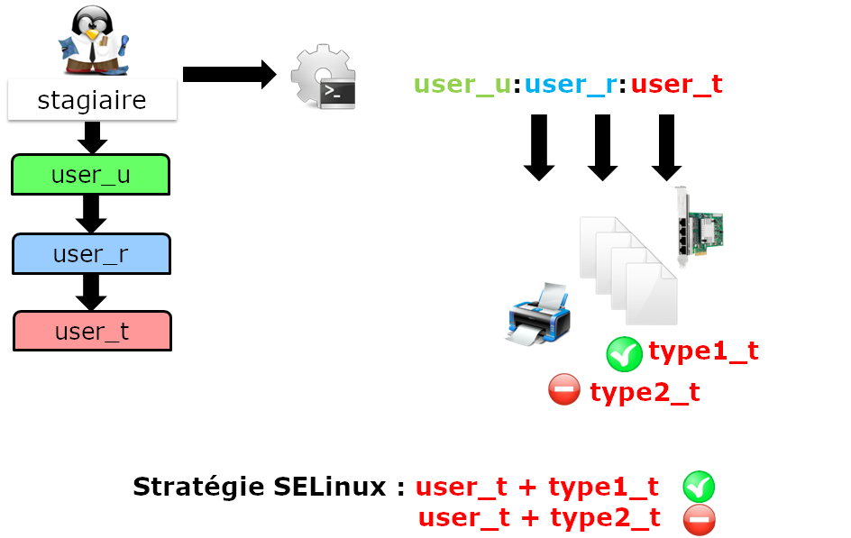

////
Les supports de Formatux sont publiés sous licence Creative Commons-BY-SA et sous licence Art Libre.
Vous êtes ainsi libre de copier, de diffuser et de transformer librement les œuvres dans le respect des droits de l’auteur.

    BY : Paternité. Vous devez citer le nom de l’auteur original.
    SA : Partage des Conditions Initiales à l’Identique.

Licence Creative Commons-BY-SA : https://creativecommons.org/licenses/by-sa/3.0/fr/
Licence Art Libre : http://artlibre.org/

Auteurs : Patrick Finet, Xavier Sauvignon, Antoine Le Morvan
////
= Sécurisation SELinux

Avec l’arrivée du noyau en version 2.6, un nouveau système de sécurité a été introduit pour fournir un mécanisme de sécurité supportant les stratégies de sécurité de contrôle d’accès.

Ce système s’appelle indexterm2:[SELinux] (Security Enhanced Linux) et a été créé par la NSA (National Security Administration) pour implémenter dans les sous-systèmes du noyau Linux une architecture robuste de type Mandatory Access Control (indexterm2:[MAC]).

Si, tout au long de votre carrière, vous avez soit désactivé ou ignoré SELinux, ce chapitre sera pour vous une bonne introduction à ce système qui travaille dans l’ombre de Linux pour limiter les privilèges ou supprimer les risques liés à la compromission d’un programme ou d’un démon.

Avant de débuter, sachez que SELinux est essentiellement à destination des distributions RHEL, bien qu’il soit possible de le mettre en œuvre sur d’autres distributions comme Debian (mais bon courage !). Les distributions de la famille Debian intègrent généralement le système AppArmor, qui pour sa part, fonctionne relativement différemment de SELinux.

== Généralités

SELinux (Security Enhanced Linux ou Amélioration de la Sécurité Linux) est un système de contrôle d’accès obligatoire (Mandatory Access Control).

Avant l’apparition des systèmes MAC, la sécurité standard de gestion d’accès reposait sur des systèmes indexterm2:[DAC] (Discretionary Access Control). Une application, ou un démon, fonctionnait avec des droits UID ou SUID (Set Owner User Id), ce qui permettait d’évaluer les permissions (sur les fichiers, les sockets, et autres processus…) en fonction de cet utilisateur. Ce fonctionnement ne permet pas de limiter suffisamment les droits d’un programme qui est corrompu, ce qui lui permet potentiellement d’accéder aux sous-systèmes du système d’exploitation.

Un système MAC renforce la séparation entre les informations sur la confidentialité  et l’intégrité du système pour obtenir un système de confinement. Le système de confinement est indépendant du système de droits traditionnels et il n’existe pas de notion de superutilisateur.

À chaque appel système, le noyau interroge SELinux pour savoir s’il autorise l’action a être effectuée.

SELinux utilise pour cela un ensemble de règles (en anglais policy). Un ensemble de deux jeux de règles standards (targeted et strict) est fourni et chaque application fournit généralement ses propres règles.

=== Le contexte SELinux

Le fonctionnement de SELinux est totalement différent des droits traditionnels Unix.

Le contexte de sécurité SELinux est défini par le trio **identité+rôle+domaine**.

L'identité d'un utilisateur dépend directement de son compte linux. Une identité se voit attribué un ou plusieurs rôles, mais à chaque rôle correspond un domaine et un seul.
C’est en fonction du domaine du contexte de sécurité (et donc du rôle…) que sont évalués les droits d’un utilisateur sur une ressource.

.Le contexte SELinux

 Les termes "domaine" et "type" sont similaires, typiquement "domaine" est utilisé lorsque l'on se réfère à un processus tandis que "type" réfère à un objet. 
 La convention de nommage est :  _u user ; _r  rôle ; _t type.

Le contexte de sécurité est attribué à un utilisateur au moment de sa connexion, en fonction de ses rôles. Le contexte de sécurité d’un fichier est quant à lui défini par la commande *chcon* (change context) que nous verrons plus tard dans la suite de ce chapitre.

Considérez les pièces suivantes du puzzle SELinux :

* Les sujets
* Les objets
* Les stratégies
* Le mode

Quand un sujet (une application par exemple) tente d’accéder à un objet (un fichier par exemple), la partie SELinux du noyau Linux interroge sa base de données de stratégies. En fonction du mode de fonctionnement, SELinux autorise l’accès à l’objet en cas de succès, sinon il enregistre l’échec dans le fichier /var/log/messages.

==== Le contexte SELinux des processus standards

Les droits d’un processus dépendent de son contexte de sécurité. 

Par défaut, le contexte de sécurité du processus est défini par le contexte de l’utilisateur (identité + rôle + domaine) qui le lance.

Un domaine étant un type (au sens SELinux) spécifique lié à un processus et hérité (normalement) de l’utilisateur qui l’a lancé, ses droits s’expriment en termes d’autorisation ou de refus sur des types (liés à des objets) :

Un processus dont le contexte a le domaine de sécurité D peut accéder aux objets de type T.

.Le contexte SELinux d'un processus standard

==== Le contexte SELinux des processus importants

La plupart des programmes importants se voient attribuer un domaine dédié.

Chaque exécutable est étiqueté avec un type dédié (ici **sshd_exec_t**) qui fait basculer le processus associé automatiquement dans le contexte *sshd_t* (au lieu de **user_t**).

Ce mécanisme est essentiel puisqu’il permet de restreindre au plus juste les droits d’un processus.

.Le contexte SELinux d'un processus important - exemple de sshd

== Gestion

La commande *indexterm2:[semanage]* (SE manage)permet d'administrer les règles SELinux.

.Syntaxe de la commande semanage
[source,bash]
----
semanage [type_d_objet] [options]
----

Exemple :

[source,]
----
[root]# semanage boolean -l
----

.Options de la commande semanage
[cols="1,4",width="100%",options="header"]
|====
| Options  |  Observations
| -a    |  Ajoute un objet
| -d    |  Supprime un objet
| -m    |  Modifie un objet
| -l    |  Liste les objets
|====

La commande *semanage* n'est pas installée par défaut sous CentOS.

Sans connaître le paquet qui fournit cette commande, il convient de rechercher son nom avec la commande :

[source,]
----
[root]# yum provides */semanage
----

puis l'installer :

[source,]
----
[root]# yum install policycoreutils-python
----

=== Administrer les objets de type booléens

Les booléens permettent le confinement des processus.

.Syntaxe de la commande semanage boolean
[source,bash]
----
semanage boolean [options]
----

Pour lister les booléens disponibles :

[source,bash]
----
[root]# semanage boolean –l 
Booléen SELinux    State Default  Description
…
httpd_can_sendmail (fermé,fermé)  Allow http 
  daemon to send mail
…
----

La commande *indexterm2:[setsebool]* permet de modifier l’état d’un objet de type booléen :

.Syntaxe de la commande setsebool
[source,bash]
----
setsebool [-PV] boolean on|off
----

Exemple :
[source,bash]
----
[root]# setsebool -P httpd_can_sendmail on
----

.Options de la commande setsebool
[cols="1,4",width="100%",options="header"]
|====
| Options  |  Observations
| -P    |  Modifie la valeur par défaut au démarrage (sinon uniquement jusqu’au reboot)
| -V    |  Supprime un objet
|====

La commande semanage permet d'administrer les objets de type port :

.Syntaxe de la commande semanage port
[source,bash]
----
semanage port [options]
----

Exemple : autoriser le port 81 aux processus du domaine httpd

[source,bash]
----
[root]# semanage port -a -t http_port_t -p tcp 81
----

== Mode de fonctionnement

SELinux propose trois modes de fonctionnement :

* indexterm2:[Enforcing] (Appliqué)

Mode par défaut pour les Linux RedHat. Les accès seront restreints en fonction des règles en vigueur.

* indexterm2:[Permissive] (Permissif)

Les règles sont interrogées, les erreurs d'accès sont journalisées, mais l'accès ne sera pas bloqué.

* Disabled (Désactivé)

Rien ne sera restreint, rien ne sera journalisé.

Par défaut, la plupart des systèmes d’exploitation sont configurés avec SELinux en mode Enforcing.

La commande *indexterm2:[getenforce]* retourne le mode de fonctionnement en cours

.Syntaxe de la commande getenforce
[source,]
----
getenforce
----

Exemple :
[source,bash]
----
[root]# getenforce
Enforcing
----

La commande *indexterm2:[sestatus]* retourne des informations sur SELinux

.Syntaxe de la commande sestatus
[source,]
----
sestatus
----

Exemple :
[source,bash]
----
[root]# sestatus
SELinux status:			enabled
SELinuxfs mount:			/selinux
Current mode:			enforcing
Mode from config file :	enforcing
Policy version:			24
Policy from config file:	targeted
----

La commande *indexterm2:[setenforce]* modifie le mode de fonctionnement en cours :

.Syntaxe de la commande setenforce
[source,]
----
setenforce 0|1
----

Passer SELinux en mode permissif :

[source,bash]
----
[root]# setenforce 0
----

=== Le fichier /etc/sysconfig/selinux

Le fichier /etc/sysconfig/selinux permet de modifier le mode de fonctionnement de SELinux.

[WARNING]
====
Désactiver SELinux se fait à vos risques et périls ! Il est préférable d’apprendre le fonctionnement de SELinux plutôt que de le désactiver systématiquement !
====

Modifier le fichier /etc/sysconfig/selinux
[source,]
----
SELINUX=disabled
----

Redémarrer le système :
[source,]
----
[root]# reboot
----

[IMPORTANT]
====
Attention au changement de mode SELinux !
====

En mode permissif ou désactivé, les nouveaux fichiers créés ne porteront aucune étiquette.

Pour réactiver SELinux, il faudra repositionner les étiquettes sur l'intégralité de votre système.

Labéliser le système entièrement :
[source,]
----
[root]# touch /.autorelabel 
[root]# reboot
----

== Les jeux de règles (Policy Type) :

SELinux fournit deux types de règles standards : 

* indexterm2:[Targeted] : seuls les démons réseaux sont protégés (dhcpd, httpd, named, nscd, ntpd, portmap, snmpd, squid et syslogd)
* indexterm2:[Strict] : tous les démons sont protégés

== Contexte

L’affichage des contextes de sécurité se fait avec l'option -Z. Elle est associée à de nombreuses commandes :

Exemples :
[source,]
----
[root]# id -Z	# le contexte de l'utilisateur
[root]# ls -Z	# ceux des fichiers courants
[root]# ps -eZ	# ceux des processus 
[root]# netstat –Z # ceux des connexions réseaux
[root]# lsof -Z	# ceux des fichiers ouverts
----

La commande *indexterm2:[matchpathcon]* retourne le contexte d’un répertoire.

.Syntaxe de la commande matchpathcon
[source,]
----
matchpathcon répertoire
----

Exemple :
[source,bash]
----
[root]# matchpathcon /root
 /root	system_u:object_r:admin_home_t:s0

[root]# matchpathcon /
 /		system_u:object_r:root_t:s0
----

La commande *indexterm2:[chcon]* modifie un contexte de sécurité :

.Syntaxe de la commande chcon
[source,]
----
chcon [-vR] [-u USER] [–r ROLE] [-t TYPE] fichier
----

Exemple :
[source,bash]
----
[root]# chcon -vR -t httpd_sys_content_t /home/SiteWeb
----

.Options de la commande chcon
[cols="1,4",width="100%",options="header"]
|====
| Options  |  Observations
| -v    |  Passe en mode verbeux
| -R    |  Applique la récursivité
| -u,-r,-t    |  S’applique à un utilisateur, un rôle ou un type
|====

La commande *indexterm2:[restorecon]* restaure le contexte de sécurité par défaut :

.Syntaxe de la commande restorecon
[source,]
----
restorecon [-vR] répertoire
----

Exemple :
[source,bash]
----
[root]# restorecon -vR /home/SiteWeb
----

.Options de la commande restorecon
[cols="1,4",width="100%",options="header"]
|====
| Options  |  Observations
| -v    |  Passe en mode verbeux
| -R    |  Applique la récursivité
|====

La commande *indexterm2:[audit2why]* indique la cause d’un refus SELinux :

.Syntaxe de la commande audit2why
[source,]
----
audit2why [-vw]
----

Exemple :
[source,bash]
----
[root]# less /var/log/audit/audit.log|grep AVC|grep denied|tail -1|audit2why
----

.Options de la commande audit2why
[cols="1,4",width="100%",options="header"]
|====
| Options  |  Observations
| -v    |  Passe en mode verbeux
| -w    |  Traduit la cause d’un rejet par SELinux et propose une solution pour y remédier (option par défaut)
|====

=== Aller plus loin avec SELinux

La commande *indexterm2:[audit2allow]* crée à partir d'une ligne d'un fichier "audit" un module pour autoriser une action SELinux :

.Syntaxe de la commande audit2allow
[source,bash]
----
audit2allow [-mM] 
----

Exemple :
[source,bash]
----
[root]# less /var/log/audit/audit.log|grep AVC|grep denied|tail -1|audit2allow -M MonModule_Local 
----

.Options de la commande audit2allow
[cols="1,4",width="100%",options="header"]
|====
| Options  |  Observations
| -m    |  Crée juste le module (*.te)
| -M    |  Crée le module, le compile et le met en paquet (*.pp) 
|====

==== Exemple de configuration

Après l'exécution d'une commande, le système vous rend la main mais le résultat attendu n'est pas visible : aucun message d'erreur à l'écran. 

* *Étape 1* : Lire le fichier journal sachant que le message qui nous intéresse est de type AVC (SELinux), refusé (denied) et le plus récent (donc le dernier).

[source,bash]
----
[root]# less /var/log/audit/audit.log|grep AVC|grep denied|tail -1
----

Le message est correctement isolé mais ne nous est d'aucune aide.

* *Étape 2* : Lire le message isolé avec la commande audit2why pour obtenir un message plus explicite pouvant contenir la solution de notre problème (typiquement un booléen à positionner).

[source,bash]
----
[root]# less /var/log/audit/audit.log|grep AVC|grep denied|tail -1|audit2why
----

Deux cas se présentent : soit nous pouvons placer un contexte ou renseigner un booléen, soit il faut passer à l'étape 3 pour créer notre propre contexte.

* **Étape 3 **: Créer son propre module.

[source,]
----
[root]# less /var/log/audit/audit.log|grep AVC|grep denied|tail -1|audit2allow -M MonModule_Local 
Generating type enforcement: MonModule_Local.te
Compiling policy: checkmodule -M -m -o MonModule_Local.mod MonModule_Local.te
Building package: semodule_package -o MonModule_Local.pp -m MonModule_Local.mod
	
[root]# semodule -i MonModule_Local.pp
----