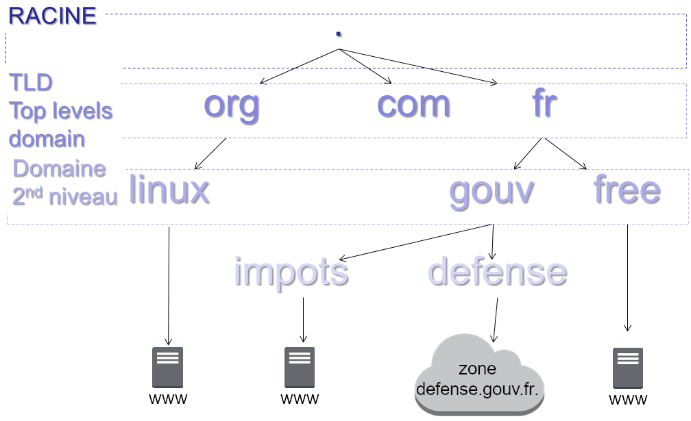
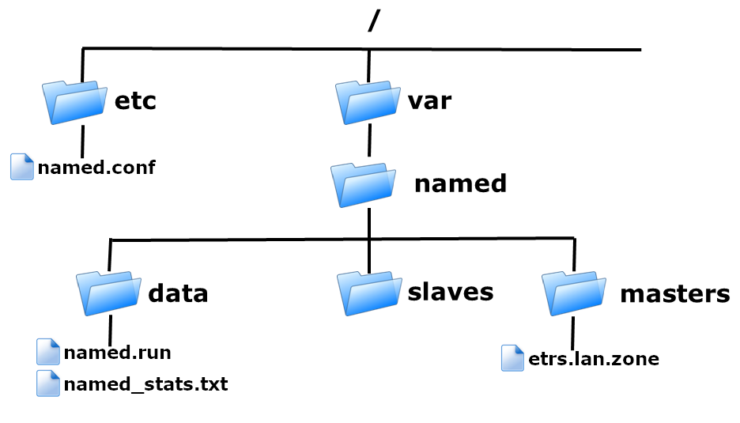
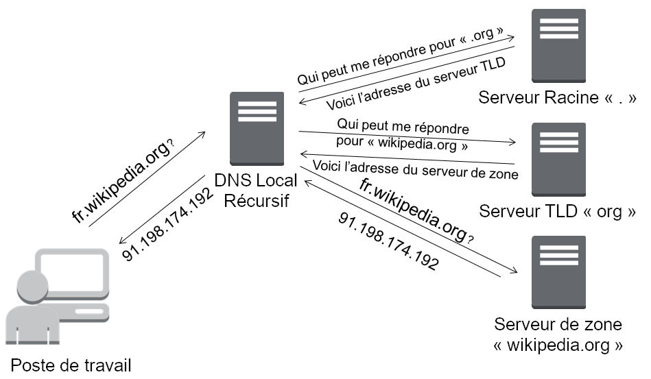
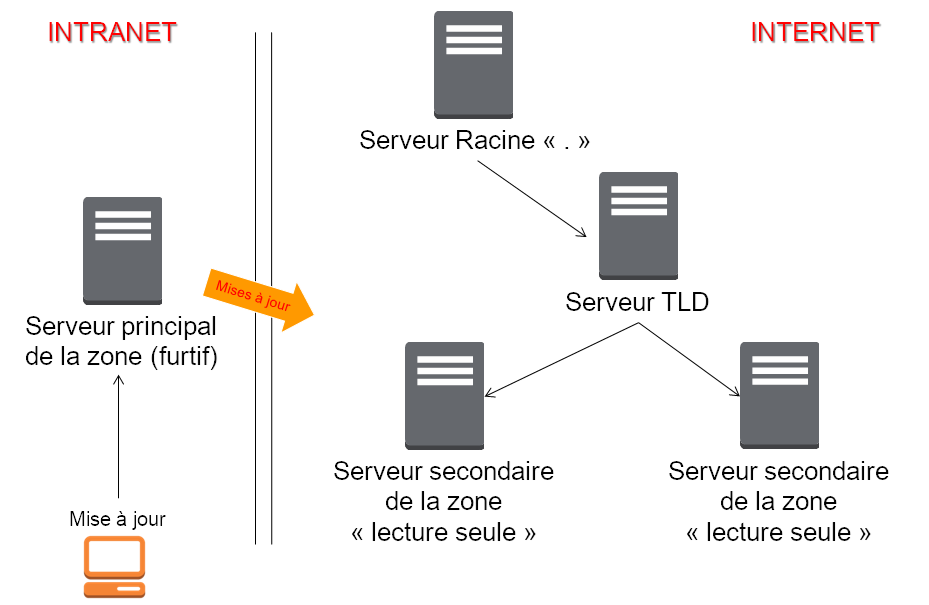

////
Les supports de Formatux sont publiés sous licence Creative Commons-BY-SA et sous licence Art Libre.
Vous êtes ainsi libre de copier, de diffuser et de transformer librement les œuvres dans le respect des droits de l’auteur.

    BY : Paternité. Vous devez citer le nom de l’auteur original.
    SA : Partage des Conditions Initiales à l’Identique.

Licence Creative Commons-BY-SA : https://creativecommons.org/licenses/by-sa/3.0/fr/
Licence Art Libre : http://artlibre.org/

Auteurs : Patrick Finet, Xavier Sauvignon, Antoine Le Morvan
////
= Serveur de noms DNS - Bind

Le indexterm2:[DNS] (Domain Name System) est un système de résolution de nom.

Il s’agit d’une base de données distribuée hiérarchique, dont la racine est symbolisée par un « . ».

L’interrogation de cette base se fait selon le principe de client-serveur.

L’URL www.formatux.lan est appelée indexterm2:[FQDN] (Fully Qualified Domain Name).

Une table de correspondances permet la traduction d’un FQDN en informations de plusieurs types qui y sont associées, comme par exemple son adresse IP.

== Généralités

Il existe 13 serveurs racines répartis dans le monde, dont une majorité se situe en Amérique du Nord.

La traduction d’un FQDN en adresse IP est le cas que l’on rencontre le plus fréquemment mais DNS permet également de renseigner le système sur les serveurs de messagerie, sur les services disponibles, de faire des alias de noms de service, etc.

Par exemple, il est possible de proposer un FQDN smtp.domain.tld sans qu’il y ait réellement de serveur nommé SMTP.

La résolution est possible en IPv4 comme en IPv6.

.Principe de fonctionnement du DNS

Les Top Levels Domain indexterm2:[TLD] sont gérés par des organismes bien défini. Les registraires (registars en anglais) de nom de domaine se chargent pour les clients d’enregistrer les noms de domaine auprès de ces organismes.

Le dialogue se fait en général via le protocole UDP (User Datagram Protocol) mais parfois aussi en TCP sur le port 53.

indexterm2:[BIND] (Berkeley Internet Name Daemon) est un serveur DNS populaire tournant sur système UNIX / Linux. 

Bind est disponible sur les serveurs RedHat :

* RHEL 5 : Version 9.3
* RHEL 6 : Version 9.8
* RHEL 7 : Version 9.9

[NOTE]
====
Le protocole peut aussi être utilisé en TCP (connecté) dans certains cas : transferts vers le ou les serveurs secondaires, requêtes dont la réponse est supérieure à la taille d’un paquet UDP, etc.
====

== Installation du service

Le serveur DNS BIND s'articule autour du service named.

Installation à partir d'un dépôt YUM :

[source,bash]
----
[root]# yum install bind
----

L'installation du service BIND ajoute un utilisateur named. Cet utilisateur sera le propriétaire des fichiers de configuration.

[source,bash]
----
[root]# grep named /etc/passwd
named:x:25:25:Named:/var/named:/sbin/nologin
----

BIND étant un service réseau, il faut le paramétrer pour un démarrage dans les niveaux 3 et 5, puis le démarrer :

[source,bash]
----
[root]# chkconfig --level 35 named on
[root]# service named start
----

[NOTE]
====
Il peut être utile d'installer le paquet bind-utils pour disposer d'outils de test DNS.
====

.Arborescence du service Bind

Le dossier /var/named/masters n’est pas créé par défaut. Il faudra le créer et ne pas oublier d’y attribuer les droits à l’utilisateur named.

Le fichier de statistiques est généré par la commande indexterm2:[rdnc] (voir en fin de chapitre).

En environnement de production, les logs des requêtes clientes seront séparés des logs du service lui-même.

=== Cache DNS

Par défaut, Bind est configuré pour faire office de serveur de proxy-cache DNS (mandataire). Un serveur proxy, ou mandataire, effectue une requête réseau au nom d’un client.

Lorsqu’il résout pour la première fois une requête DNS, la réponse est stockée dans son cache pour la durée de son indexterm2:[TTL] (Time To Live) restant. Si le même enregistrement est à nouveau demandé par un autre client DNS, le traitement de la requête sera plus rapide, puisque la réponse sera disponible depuis le cache du serveur.

Chaque enregistrement DNS dispose d’un TTL lorsqu’il est fourni par le serveur qui fait autorité pour la zone.
Ce TTL est décrémenté jusqu’à la fin de sa validité. Il est ensuite supprimé des caches.

[NOTE]
====
Lorsque l’enregistrement est mis en cache, le TTL qui lui est associé est le TTL restant.
====

=== Récursivité

Un serveur est configuré par défaut pour répondre de manière récursive aux requêtes de ses clients.

Il interroge tour à tour les serveurs DNS nécessaires à la résolution d’une requête jusqu’à obtenir la réponse.

Un serveur non-récursif déléguera la résolution du nom DNS à un autre serveur DNS.

[TIP]
====
Dans quel cadre utiliser un serveur non-récursif ?

Lorsque la latence entre le serveur DNS et le reste du réseau est trop forte, ou quand le débit est limité, il peut être intéressant de configurer un serveur DNS en non-récursif.

Ce sera par exemple le cas pour un site distant ou un élément mobile.

Le serveur DNS local fera autorité sur la zone locale, mais déléguera la résolution des FQDN des autres zones à un serveur distant, qui lui, prendra la requête en charge de manière récursive.
====

.Le mode récursif

=== Architecture DNS

Un serveur DNS principal dispose d’une copie en écriture de la zone.

Il peut être intéressant de ne le rendre accessible que depuis le domaine local, et ne permettre l’interrogation des DNS depuis l’extérieur que vers les serveurs secondaires. D’un point de vue architectural cela lui évite ainsi les attaques ou les surcharges.

Le serveur est alors appelé serveur furtif.

Un serveur DNS n’est pas nécessairement le serveur maître de toutes les zones pour lesquels il fait autorité.

Un serveur DNS  peut très bien être configurer pour être maître d’une zone et esclave d’une autre.

.Architecture avec serveur furtif

La mise à jour du serveur se fait depuis le réseau local. Le serveur principal n’est pas accessible depuis l’extérieur.

La mise à jour se propage vers les serveurs secondaires.

L’interrogation par les clients internet ne se fait que sur les serveurs secondaires, ce qui protège le serveur principal des attaques par déni de service.

Pour un réseau complexe, il existe de nombreuses solutions architecturales de l’infrastructure DNS qu’il est important de bien étudier.

== Configuration du serveur

=== Le fichier /etc/named.conf

Ce fichier contient les paramètres de configuration du service DNS.

[source,bash]
----
[root]# less /etc/named.conf
options {
    listen-on port 53 { 192.168.1.200; };
	directory "/var/named";
	allow-query { 192.168.1.0/24; };
};
----

[IMPORTANT]
====
Chaque ligne du fichier /etc/named.conf (même à l'intérieur des accolades) se termine par un point-virgule.

L’oublie de ce ";" est l’erreur la plus fréquente dans la configuration d’un serveur Bind.
====

[IMPORTANT]
====
Les noms, sous la forme FQDN (Fully Qualified Domain Name) doivent se terminer par ".". En l’absence de ce ".", Bind suffixera automatiquement avec le nom de domaine l’enregistrement.

Eg : www.formatux.lan -> www.formatux.lan.formatux.lan.
====

La rubrique options contient la configuration générale du serveur BIND via différentes directives :

* listen-on : Définit l'interface, l'adresse et le port du service sur le serveur.
* directory : Définit le répertoire de travail de BIND, contenant les fichiers de zone.
* allow-query : Définit les hôtes autorisés à faire des requêtes sur le serveur. Par adresse IP ou réseau.

Permettre qu’un serveur DNS résolve les requêtes de n’importe quel client est une très mauvaise idée. Il faut au moins restreindre les droits aux réseaux locaux.

Il est possible, pour cela, de créer des ACL pour simplifier l’administration du fichier de configuration.

Le fichier de configuration contient également les informations relatives aux fichiers de zone.

[source,bash]
----
[root]# less /etc/named.conf
zone "formatux.lan" IN {
	type master;
	file "masters/formatux.lan.direct";
	allow-update { 192.168.1.0/24; };
};

zone "1.168.192.in-addr.arpa" IN {
	type master;
	file "masters/formatux.lan.inverse";
};
----

Les rubriques **zone** contiennent les configurations des zones de résolution de nom, inverses ou directes :

* type : Définit le type de serveur pour cette zone :
** maître : possède la base de données en écriture
** esclave : possède la base en lecture seule
** forwarder : fait office de proxy-cache pour cette zone.
* file : Définit le chemin du fichier de zone.
* allow-update : Définit les hôtes ayant l'autorisation de mettre à jour les enregistrements DNS.

Les fichiers de zone inverse sont nommés en prenant l'adresse réseau de la zone (en inversant les octets) suivi du domaine in-addr.arpa.

=== Les rôles
Un serveur peut avoir le rôle de maître pour la zone, c’est-à-dire qu’il possède la zone en écriture.

[source,bash]
----
[root]# less /etc/named.conf
zone "formatux.lan" IN {
	type master;
	file "masters/formatux.lan.direct";
	allow-update { 192.168.1.0/24; };
};
----

Seuls les clients figurant dans la variable allow-update pourront mettre à jour la base de données du DNS.

Un serveur peut également être un serveur secondaire (slave) pour la zone, c’est-à-dire qu’il possède la zone en lecture.

[source,bash]
----
[root]# less /etc/named.conf
zone "formatux.lan" IN {
    type slave;
    file "slaves/formatux.lan.direct";
};
----

Un serveur peut enfin être expéditeur (forwarder) pour la zone, c’est-à-dire qu’il a connaissance de cette zone, et relaie les informations pour celle-ci.

[source,bash]
----
[root]# less /etc/named.conf
zone "unautredomaine.fr" IN {
	type forwarder;
	forwarders {221.10.12.1};
};
----

[NOTE]
====
Vous retrouverez cette notion sous Windows en tant que « redirecteur ».
====

== Fichiers de zone

[IMPORTANT]
====
Les fichiers présents dans le répertoire /var/named doivent appartenir à l'utilisateur système named.

SELinux ne permettra pas l’enregistrement des fichiers de zone en dehors de ce répertoire.
====

Ces fichiers contiennent des enregistrements (indexterm2:[RR] : Resource Records) DNS de différents types. Ils permettent la résolution directe de noms (du nom vers l'adresse IP), ou la résolution inverse (de l'adresse IP vers le nom).

En plus de contenir les adresses IP et les noms des machines, les fichiers contiennent les paramètres de durée de vie des enregistrements (Time To Live, TTL).

Lorsqu’un enregistrement DNS est mis en cache, le temps restant sur son TTL est également conservé. À la fin du TTL, l’enregistrement est supprimé des caches.

* Un TTL plus long réduit les échanges DNS.
* Un TTL plus court permet une reconfiguration du réseau plus rapide.

=== Les types d’enregistrements

.Les types d'enregistrements
[cols="1,4",options="header"]
|====
|  Type          | Description
|  A       | Nom attribué à une adresse de type IP V4
|  AAAA    | Nom attribué à une adresse de type IP V6
|  CNAME   | Alias d’un enregistrement A déjà défini
*Éviter de faire un alias vers un alias*
|  MX      | Serveur de messagerie destinataire pour la zone concernée
|  NS      | Le ou les serveurs de noms de la zone (type A)
|  PTR     | Enregistrement pointeur pour une zone inverse
|  SOA     | Démarre la configuration (cf: diapos suivantes)
|  SVR     | Service (protocole jabber,...)
|  TXT     | Informations
|====

* Champ indexterm2:[MX] : Le numéro précise la priorité, la plus faible étant la plus prioritaire. Ceci permet de définir un ou plusieurs serveurs de secours qui stockeront les mails en attendant le retour du serveur principal.

* Champ de type A : Enregistrement standard. Attribue un nom à une adresse IP.

Plusieurs enregistrements identiques de type A vers des adresses différentes permet de faire de l’équilibrage de charge par round-robin (indexterm2:[RR]).

Exemple :
[source,bash]
----
mail	A	192.168.1.10
    	A	192.168.1.11
----

* Champ indexterm2:[AAAA] : On utilise quatre A pour symboliser IPv6 car une adresse IPv6 est codée sur 16 octets, soit 4 fois plus qu’une adresse IPv4.

* CNAME : Permet d'attribuer un ou plusieurs alias à un enregistrement A déjà défini. Plusieurs enregistrements du même alias permettent également de faire de l’équilibrage de charge type RR.

[TIP]
====
On trouvera des enregistrements typiques, comme autoconfig, qui permet le mécanisme de configuration automatique d’un client de messagerie.
====

=== Fichier de zone directe

Ce fichier est nécessaire au fonctionnement du système DNS. C'est par lui que se fait la résolution d'un nom en adresse IP.

[source,bash]
----
[root]# less /var/named/formatux.lan.direct
$ORIGIN .
$TTL 3600
formatux.lan.  SOA  inf1-formatux.formatux.lan. contact.formatux.lan. (123; 14400; 3600; 604800; 3600; )

@   			IN	NS  	inf1-formatux.formatux.lan.
poste1  		IN	A   	192.168.1.10
inf1-formatux	IN	A   	192.168.1.200
formatux.lan.	MX	10  	192.168.1.201
inf3-formatux	IN	A   	192.168.1.202
www				IN	CNAME	inf1-formatux.formatux.lan.
----

* $ORIGIN : Définit la valeur par défaut du domaine courant pour les renseignements du fichier. Un . signifie la racine.

* $TTL : Durée de vie par défaut des enregistrements de la zone dans le cache, exprimée en secondes. Le TTL peut également être précisé enregistrement par enregistrement.

* indexterm2:[SOA] : Start Of Authority. La ligne démarre la configuration d'une zone. Définit :
** le nom du serveur maître principal, 
** l'email de l'administrateur de la zone (un . remplace le @ de l'adresse mail).
** Entre parenthèses, le numéro de série du fichier (incrémenté à chaque mise à jour) et les délais de mise à jour ou de rafraîchissement, exprimés en secondes.
*** Numéro de zone : Numéro incrémental (voir le paragraphe suivant)
*** Rafraîchissement : Durée en secondes avant une tentative de synchronisation avec le serveur maître
*** Réitération : Intervalle de temps avant réitération si l’essai précédent n’a pas fonctionné
*** Expiration : Durée en secondes avant l’expiration car le serveur maître est injoignable
*** Cache négatif (TTL) : Durée de vie en secondes des enregistrements

[NOTE]
====
Le @ a une signification particulière pour Bind. Il se représente lui même, raison pour laquelle le @ de l’adresse courriel d’administration est remplacée par un .
====

Le numéro de la zone sert à identifier la dernière modification du DNS maître. Tous les serveurs secondaires utilisent ce numéro pour savoir s’ils doivent se synchroniser.

Il existe deux méthodes d’incrémentation du numéro de zone :

* Incrémentale : 1, puis 2, puis 3 (pourquoi pas ?)
* Basée sur la date : AAAAMMJJXX, qui nous donne par exemple, pour la première modification du jour : 2017210101 (méthode à privilégier)

=== Le fichier de zone inverse

Bien que non obligatoire, ce fichier est fortement conseillé pour un fonctionnement optimal du système DNS. C'est par lui que se fait la résolution d'une adresse IP en nom.

[NOTE]
====
Des services comme SSH s’appuie sur la résolution inverse.
====

[source,bash]
----
[root]# more /var/named/formatux.lan.inverse
$ORIGIN 1.168.192.in-addr.arpa.
$TTL 259200
@				SOA inf1-formatux.formatux.lan. contact.formatux.lan. ( 123; 14400; 3600; 604800; 3600; )
@				NS		inf1-formatux.formatux.lan.
1	0			PTR		poste1.formatux.lan.
200		PTR		inf1-formatux.formatux.lan.
----

=== La commande nsupdate

[IMPORTANT]
====
L’usage de la commande indexterm2:[nsupdate] est exclusive. Il ne faut plus modifier les fichiers de zone manuellement, sous peine de pertes d’informations.
====

Syntaxe :
[source,bash]
----
nsupdate
----

Exemple:
[source,bash]
----
[root]# nsupdate
		> server 192.168.1.200
		> zone formatux.lan
		> update add poste2.formatux.lan 3600 A 192.168.1.11
		> update delete poste1
		> send
----

La commande nsupdate est interactive.

À la saisie, elle ouvre un prompt dans lequel il faut saisir les requêtes de mise à jour du fichier de zone.

Ces requêtes peuvent être :

* *server* : Précise le serveur BIND pour lequel les requêtes seront envoyées.
* *zone* : Précise la zone de résolution pour laquelle les requêtes seront envoyées.
* *prereq yxdomain nom* : L'existence de l'enregistrement nom est une condition de mise à jour.
* *update add nom TTL type @IP* : Ajoute l'enregistrement nom, en précisant son type, son adresse IP et son TTL.
* *update delete nom* : Supprime l'enregistrement nom.
* *send* : Valide et envoie les requêtes.

=== La commande rndc

La commande *indexterm2:[rndc]* permet de manipuler le serveur DNS à chaud.

.Syntaxe de la commande rndc
[source,bash]
----
rndc reload
rndc querylog on|off
----

* *reload* : Prend en compte les modifications apportées sans devoir relancer le service
* *querylog* : Active ou non la journalisation

Après modification d’un fichier de zone, il est nécessaire de faire prendre en compte les modifications au service. Les fichiers étant lus au démarrage du service, cela permet de prendre en compte les modifications, mais résulte en la perte des statistiques. Il faut donc privilégier la méthode reload.

=== Le suivi des logs

La fonction d’enregistrement des fichiers journaux est activée ou désactivée par la commande rndc.

Le fichier de logs est par défaut /var/named/data/named.run

Exemple :
[source,bash]
----
[root]# rndc querylog on
[root]# tail –f /var/named/data/named.run
----

Bind propose dans son fichier de configuration des options pour journaliser les informations :

* de transferts,
* de requêtes clients,
* d’erreurs,
* ...

== Configuration du client

NetworkManager est un outil de gestion du réseau. Sur un serveur dont le réseau est défini par cet outil, la configuration cliente de Bind est décrite dans le fichier de l’interface.

[source,bash]
----
[root]#less /etc/sysconfig/network-scripts/ifcfg-ethX
DOMAIN="formatux.lan"
DNS1=192.168.1.200
DNS2=192.168.1.201
----

indexterm2:[NetworkManager] modifiera lui-même le fichier /etc/resolv.conf à chaque relance du service réseau.

Avant de lancer une recherche DNS, le logiciel client vérifiera si la requête porte sur un FQDN ou non. Si le nom n’est pas pleinement qualifié, le client suffixera la requête avec le premier suffixe DNS fourni.

Si la résolution est impossible, le client émettra une nouvelle requête avec le suffixe suivant, ainsi de suite jusqu’à l’obtention d’une réponse.

Par exemple, il est possible de fournir deux suffixes :
[source,bash]
----
formatux.fr
formatux.lan
----

Lors d’une requête DNS portant sur, par exemple, portail, une première requête portail.formatux.fr sera faite. En l’absence de réponse positive, une seconde requête sera effectuée portant sur portail.formatux.lan. Pour éviter ce phénomène d’interrogation multiple, il est préférable de fournir une adresse pleinement qualifiée.

[TIP]
====
Veiller à spécifier au moins deux serveurs DNS pour assurer une redondance en cas de panne du serveur principal.
====

Sans outil de gestion du réseau, la configuration cliente de Bind est décrite dans le fichier /etc/resolv.conf.

[source,bash]
----
[root]# less /etc/resolv.conf
search "formatux.lan"
nameserver 192.168.1.200
nameserver 192.168.1.201
----

[IMPORTANT]
====
NetworkManager, si actif, écrasera les valeurs entrées manuellement dans ce fichier.
====

L’utilitaire *system-config-network-tui* (**nmtui** sous CentOS 7) permet une configuration graphique correcte du réseau par une interface ncurse.

=== La commande dig

La commande **indexterm2:[dig]** (Domain Information Groper) permet d'interroger des serveurs DNS.

[NOTE]
====
Dig doit être privilégié par rapport à NSLookup qui n'est plus maintenue.
====

.Syntaxe de la commande dig
[source,bash]
----
dig [name] [type] [options]
----

Exemple :
[source,bash]
----
[root]# dig centos65.formatux.lan A
…
;; QUESTION SECTION:
; centos65.formatux.lan.	IN	A

;; ANSWER SECTION:
centos65.formatux.lan.	86400	IN	A	192.168.253.131

;; AUTHORITY SECTION:
formatux.lan.		86400 IN	NS	centos65.formatux.lan.
…
----

[source,bash]
----
[root]# dig –t MX linux.fr 
----

[source,bash]
----
[root]# dig linux.fr MX +short
----

=== Mise en cache côté client

Le service indexterm2:[NSCD] est responsable de la mise en cache des requêtes réseaux type LDAP ou DNS. 

Pour profiter de la mise en cache local, il faudra veiller à ce que le service NSCD soit démarré.

[source,bash]
----
[root]# service nscd start
[root]# chkconfig nscd on	
----

Nscd n’est pas installé par défaut sur les RHEL 6. 

=== Mise à jour dynamique

Les clients peuvent s'enregistrer dynamiquement sur le serveur DNS, ce qui est intéressant dans le cadre d'une attribution de l'adressage IP dynamique avec DHCP.

== Configuration du pare-feu serveur

Les règles iptables a configurer en tcp et udp sont les suivantes :

[source,bash]
----
[root]# vi /etc/sysconfig/iptables
# Autoriser DNS
iptables –t filter –A INPUT –p tcp –dport 53 –j ACCEPT
iptables –t filter –A INPUT –p udp –dport 53 –j ACCEPT
----

[TIP]
====
system-config-firewall-tui est l’outil graphique permettant de configurer le pare-feu.
====

