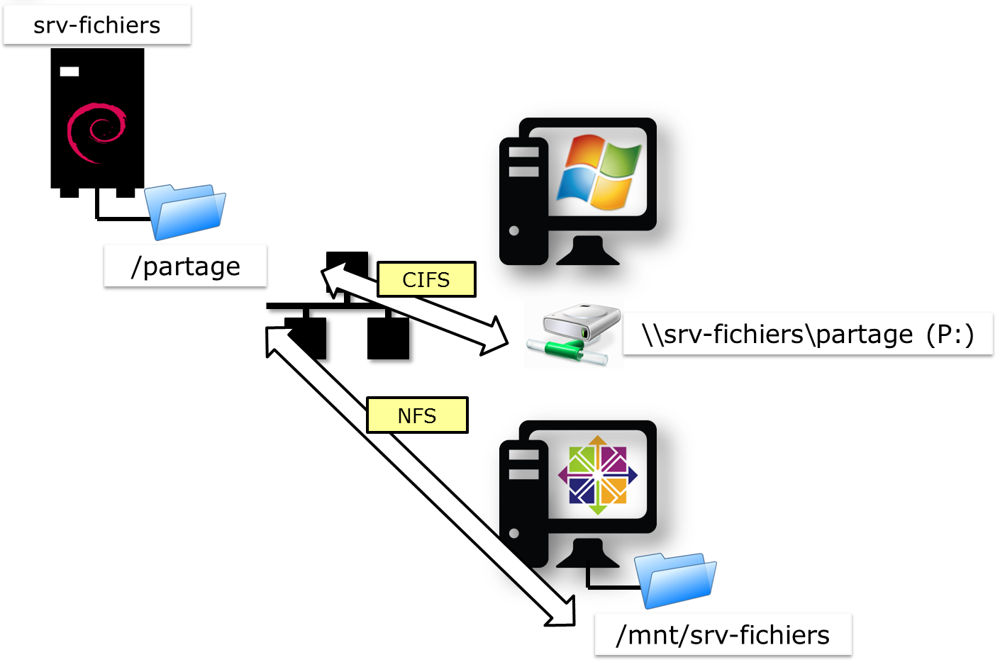
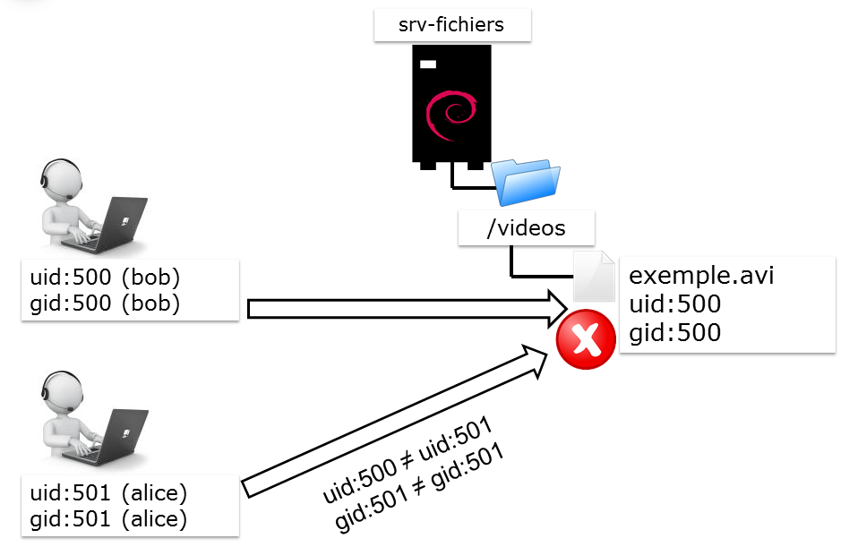
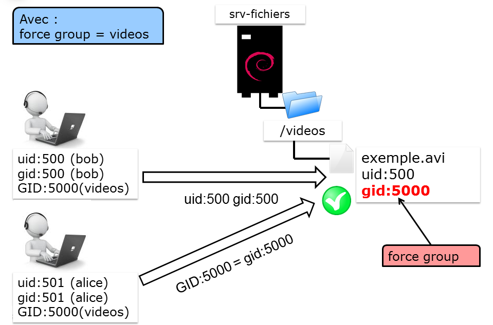

////
Les supports de Formatux sont publiés sous licence Creative Commons-BY-SA et sous licence Art Libre.
Vous êtes ainsi libre de copier, de diffuser et de transformer librement les œuvres dans le respect des droits de l’auteur.

    BY : Paternité. Vous devez citer le nom de l’auteur original.
    SA : Partage des Conditions Initiales à l’Identique.

Licence Creative Commons-BY-SA : https://creativecommons.org/licenses/by-sa/3.0/fr/
Licence Art Libre : http://artlibre.org/

Auteurs : Patrick Finet, Xavier Sauvignon, Antoine Le Morvan
////
= Serveur de fichiers Samba

indexterm2:[Samba] est un serveur de fichiers permettant l'interopérabilité entre divers systèmes, notamment les systèmes Linux et Microsoft. Il permet à des systèmes Linux de créer des partages utilisables par des machines Windows et vice-versa.

Le projet Samba a été initié dès 1992 sous licence GPL (et donc gratuit).

Un même dossier partagé par NFS et par Samba est ainsi accessible depuis toutes les plateformes clientes.

== Le protocole SMB

Le protocole indexterm2:[SMB] (Server Message Block) était une extension de Microsoft pour permettre la redirection des entrées/sorties vers NetBIOS (Network Basic Input/Output System).

SMB permettait : 

* le transfert de données entre machines Windows : partages de fichiers, impressions et messagerie électronique ;
* le parcours du voisinage réseau (browsing) ;
* la résolution de noms NetBIOS en adresses IP (Windows Internet Name Server) ;
* l'authentification centralisée (notion de domaine).

Le protocole indexterm2:[NetBIOS] était une interface permettant la mise en place de noms de machines, de groupes de travail, de domaines, etc. Il faisait fonctionner le voisinage réseau jusqu'à Windows 2000, mais son mode de fonctionnement induisait une charge réseau importante.

NetBIOS était le système de noms des réseaux SMB comme l'est aujourd'hui le service DNS.

Les diffusions NetBIOS ne passant pas les routeurs, la notion de voisinage réseau désigne l'ensemble des stations de travail utilisant le protocole NetBIOS sur un même segment de réseau IP. Le *maître explorateur* (master browser) est le poste client ou serveur tenant à jour la liste des ordinateurs utilisés par le service de voisinage réseau.

== Le protocole indexterm2:[CIFS]

Les améliorations apportées au protocole SMB ont permis de faire aboutir la suite de protocoles clients/serveurs CIFS (Common Internet File System) que le service Samba implémente.

== Installation de Samba

[source,bash]
----
[root]# yum install samba smbclient
----

La partie serveur de Samba est basée essentiellement sur 2 démons :

* Le démon *smb* est le serveur SMB : il répond aux requêtes des clients lorsque ceux-ci accèdent aux partages définis et il est le seul à accéder aux systèmes de fichiers Linux.
* Le démon *nmb* est le serveur de noms NetBIOS essentiel au fonctionnement de SMB. Il peut être configuré comme serveur WINS.
* Le fichier de configuration principal est **smb.conf**. 
C'est dans ce fichier que sont définis les paramètres de fonctionnement 
des 2 démons, ainsi que la définition des exports de ressources.

La partie cliente de samba (samba-client) contient les outils qui permettent le montage et le parcours des ressources Samba.

Le paquet **samba-client** fournit les binaires :

*   **findsmb** :  afficher de nombreuses informations sur les stations d'un sous-réseau qui répondent aux requêtes de noms SMB.

*   **nmblookup** : interroger le protocole NetBIOS et associe les noms Netbios à des adresses IP.

*   **sharesec** : manipuler les droits de partages de fichiers

*   **smbcacls** : manipuler les ACL NT sur les partages de fichiers

*   **smbclient** : offrir une interface FTP Like pour accèder à des partages de fichiers

*   **smbget** : télécharger des fichiers depuis un partage windows

*   **smbspool** : envoyer une impression à un serveur d'impression

*   **smbtree** : fournir un
 explorateur de fichier en mode texte similaire au “Voisinage réseau”
des ordinateurs Windows. Il affiche un arbre des domaines connus, desserveurs et des partages accessibles depuis les serveurs.

*   …

Le paquet **samba-common** fournit les binaires :

*   **net** : offrir les mêmes fonctionnalités que la commande net du monde Windows.

*   **pdbedit** : gérer de la base SAM

*   **smbcquotas** : manipuler les quotas NT d'un partage de fichiers

*   **smbpasswd** : changer le mot de passe des utilisateurs

*   **testparm** : tester la syntaxe d'un fichier de configuration smb.conf

*   …

[source,bash]
----
[root]# chkconfig smb on
[root]# chkconfig nmb on
[root]# service smb start
[root]# service nmb start
----

== Sécurité SELinux

Par défaut, la sécurité SELinux est active. Pour vérifier le contexte de sécurité en place sur des fichiers, il faut utiliser la commande :

[source,bash]
----
[root]# ls -Zd /export/
----

Le contexte de sécurité _samba_share_t_ doit être positionné sur les dossiers partagés :

[source,bash]
----
[root]# chcon -R -t samba_share_t /export/
----

Plus d'information sur la sécurité SELinux et Samba https://access.redhat.com/documentation/en-US/Red_Hat_Enterprise_Linux/6/html/Managing_Confined_Services/sect-Managing_Confined_Services-Samba-Booleans.html[sur le site de RedHat]. Pensez à stopper le parefeu ou à le configurer dans le fichier */etc/sysconfig/iptables* :

[source,bash]
----
-A INPUT -m state --state NEW -m udp -p udp --dport 137 -j ACCEPT
-A INPUT -m state --state NEW -m tcp -p tcp --dport 137 -j ACCEPT
-A INPUT -m state --state NEW -m udp -p udp --dport 138 -j ACCEPT
-A INPUT -m state --state NEW -m udp -p udp --dport 139 -j ACCEPT
-A INPUT -m state --state NEW -m udp -p udp --dport 445 -j ACCEPT
-A INPUT -m state --state NEW -m tcp -p tcp --dport 445 -j ACCEPT
----

Pour pouvoir utiliser Samba comme contrôleur de domaine et utiliser les 
commandes useradd et groupadd, il faudra mettre le booléen **samba_domain_controller** à on.

----
[root]# setsebool -P samba_domain_controller on
----

Pour rappel, il est possible d'obtenir tous les booléens SELinux concernant Samba avec la commande suivante :

[source,java]
----
[root]# getsebool -a | grep "samba"
samba_create_home_dirs --> off
samba_domain_controller --> off
samba_enable_home_dirs --> off
samba_export_all_ro --> off
samba_export_all_rw --> off
samba_portmapper --> off
samba_run_unconfined --> off
samba_share_fusefs --> off
samba_share_nfs --> off
sanlock_use_samba --> off
use_samba_home_dirs --> off
virt_use_samba --> off
----

Pour autoriser les partages via Samba des répertoires de connexions des utilisateurs, il faudra positionner le booléen **samba_enable_home_dirs** également à on.
----
[root]# setsebool -P samba_enable_home_dirs on
----

== La configuration de SAMBA

La partie serveur de Samba est basée sur 1 seul fichier de configuration */etc/samba/smb.conf* qui définit les paramètres de fonctionnement des 2 démons et des exports de ressources.

Chaque paramètre fait l'objet d'une ligne au format :

[source,bash]
----
nom = valeur
----

Les commentaires commencent par un '**;**' ou un '**#**' et se termine à la fin de la ligne.

Le caractère '**\**' permet de scinder une ligne logique sur plusieurs lignes physiques.

Ce fichier est constitué de 3 sections spéciales :

* *[global]* : paramètres généraux ;
* *[homes]* : paramètres des répertoires utilisateurs ;
* *[printers]* : paramètres des imprimantes.

Les autres sections, déclarées entre '**[ ]**' sont des déclarations de partage.

=== Les niveaux de sécurité

Il existe cinq niveaux de sécurité (option security), mais un seul peut être appliqué par serveur :

* *share* : le niveau dit de partage, lié à une ressource. Un mot de passe est associé à chaque partage (Déprécié : ne plus utiliser) ;
* *user* : le niveau de sécurité de l'utilisateur, lié à son authentification. C'est le niveau recommandé et par défaut ;
* *server* : l'authentification est réalisée par un autre serveur (Déprécié : ne plus utiliser) ;
* *domain* : l'authentification est réalisée par un autre serveur, mais le serveur Samba doit être membre du domaine ;
* *ads* : l'authentification est réalisée par un serveur Active Directory.

=== Les variables internes à Samba

.Les variables internes à Samba
[cols="1,4",width="100%",options="header"]
|====================
| Variable | 	Observation
| %a | 	Architecture du client
| %I | 	Adresse IP du client
| %M | 	Nom dns du client
| %m | 	Nom NetBios du client
| %u | 	Identité de l'utilisateur pour le partage concerné
| %U | 	Identité souhaitée par l'utilisateur du partage
| %H | 	Répertoire de connexion de l'utilisateur
| %u%g ou %G | 	Groupe principal de l'utilisateur
| %u ou %U%S | 	Nom du partage
| %P | 	Répertoire racine du partage concerné
| %d | 	PID du processus courant
| %h | 	Nom DNS du serveur Samba
| %L | 	Nom NetBIOS du serveur Samba
| %v | 	Version de samba
| %T | 	Date et heure système
| %$var | 	valeur de la variable d'environnement var
|====================

=== La commande testparm

La commande **testparm** teste la validité du fichier /etc/samba/smb.conf.

L'option -v affiche tous les paramètres applicables.

[source,bash]
----
[root]# testparm
Load smb config files from /etc/samba/smb.conf
...
Loaded services file OK.
Server role : ROLE_STANDALONE
...
----

Sans option, cette commande renvoie la configuration du serveur samba 
sans les commentaires et omet les paramètres positionnés à leur valeur 
par défaut, ce qui facilite sa lecture.

----
[root]# testparm
----

=== La section [global]

.Les directives de la section [global]
[width="100%",options="header"]
|====================
| Directive | 	Exemple | 	Explication
| workgroup | 	workgroup = FORMATUX | 	Définir le groupe de travail ou le  nom de domaine NetBIOS. (À mettre en majuscule). 
| netbios name | netbios name = inf1-formatux | 	Nom NetBIOS de la station +
Maximum 15 caractères +
Pas de rapport direct avec le nom de la machine Linux
| server string | server string = Samba version %v | Description du serveur apparaissant dans l'explorateur Windows
| hosts allow | hosts allow = 127. 172.16.1. | Permet de restreindre les clients du serveur aux seuls réseaux mentionnés. Notez la présence d'un point à la fin de l'adresse et l'absence du 0. 
| log file | 	log file = /var/log/samba/log.%m | 	Enregistrer les évènements dans un fichier +
%m représente le nom NetBIOS du client
| security | 	security = user | Modèle de sécurité du serveur
| passdb backend | 	passdb backend = tdbsam | Stockage des utilisateurs et des mots de passe. Le format tdbsam (Trivial Database) est le format par défaut, limité en 
performance à 250 utilisateurs. Au delà, il faudra passer au format 
ldapsam et stocker les utilisateurs et les groupes dans une base LDAP. 
|====================

=== La section [homes]

La section [homes] contient la configuration des partages utilisateurs. 

C'est une section réservée par Samba, qui lui applique un fonctionnement très particulier.
Ce nom de partage ne doit pas être utilisé pour un autre partage ni modifié.

[source,bash]
----
[homes]
    comment = Home Directories
    browseable = no
    writable = yes
----

Tous les utilisateurs verront le même partage “homes” mais le contenu sera personnalisé pour chacun.

Attention à bien configurer les booléens SELinux pour autoriser le partage des dossiers personnels.

=== La section [printers]

La section [printers] contient la configuration du serveur d'impression.

[source,bash]
----
[printers]
    comment = All Printers
    browseable = no
    writable = yes
    guest ok = no
    printable = yes
----

Samba peut ainsi faire office de serveur d'impressions, ce qui est une 
fonctionnalité intéressante (ne nécessite pas l'acquisition de licences 
clientes).

=== Partages personnalisés

Avant de paramétrer une nouvelle section du fichier smb.conf qui 
correspondra à un nouveau partage, il convient de se poser quelques 
questions :

*    Quel est le chemin du partage ?

*   Qui peut modifier le contenu ?

*   Le partage doit-il être visible sur le réseau ou au contraire sera-t-il masqué ?

*   Y aura-t-il un accès anonyme ?

Un nouveau partage est représenté par une section [nomdupartage] dans le fichier smb.conf. En voici un exemple :

[source,bash]
----
[partage]
    comment = Partage
    browseable = yes
    writable = yes
    path = /export/data
    valid users = @users
    read list = georges
    write list = bob, alice
    invalid users = maurice
    create mask = 0664
    directory mask = 0775
    force group = users
----

De nombreuses directives sont disponibles pour configurer les partages :

[width="100%",options="header"]
|====
| Directive  |  Exemple  |  Explication 
| comment | comment = Exemple de partage |  Affiche un commentaire dans l'explorateur de fichiers. 
|  browseable | browseable = yes           |  Affiche le partage dans le voisinage réseau. 
| writeable | writeable = yes            |  Le partage est en lecture seule ou en écriture. 
|  path | path = /export/data        |  Le chemin absolu à partager sur le réseau. Attention au contexte SELinux de ce dossier.
| valid users | valid users = @users      |  Liste les utilisateurs ou les groupes autorisés à accéder au partage. 
| invalid users | invalid users = alice   |  Liste les utilisateurs ou les groupes qui ne sont pas autorisés à accéder au partage. 
| read list | read list = bob            |  Liste les utilisateurs ou les groupes autorisés à accéder au partage en lecture. 
| write list |  write list = patrick, alain  |  Liste les utilisateurs ou les groupes autorisés à accéder au partage en écriture. 
| create mask | create mask = 0664        |  Les fichiers créés prendront les droits spécifiés. 
| directory mask | directory mask = 0775  |  Les dossiers créés prendront les droits spécifiés. 
| force group | force group = users       |  Les nouveaux fichiers et dossiers appartiendront au groupe spécifié. Dans ce cas, il n'y a pas d'@ devant le groupe !
|====

=== La directive force group

La directive **force group** permet de forcer l'appartenance d'un fichier créé à un groupe spécifique.

Cette directive est essentielle dans le fonctionnement de Samba, 
puisqu'elle assure que, quelque soit le groupe principal d'un 
utilisateur, celui-ci sera autorisé à accéder à un fichier sur le 
partage s'il fait parti, en tant qu'invité, du groupe spécifié dans la 
directive.

Les deux exemples ci-desous mettent en avant ce mécanisme :

Utilisation sans le mécanisme **force group** :

Utilisation avec le mécanisme **force group** :

== Commandes d'administration

=== La commande pdbedit

La commande pdbedit permet de gérer la base SAM des utilisateurs Samba, 
que le backend soit au format tdbsam ou ldapsam, contrairement à la 
commande smbpasswd qui est limitée au format tdbsam.

.Syntaxe de la commande pdbedit
----
pdbedit [-a|-r|-x|-L] [-u username] ...
----

Exemple :

[source,bash]
----
[root]# pdbedit -L
stagiaire:1000:Stagiaire SYS
----

.Options principales de la commande pdbedit
[cols="1,4",options="header"]
|====
| Option |  Observation 
|  -a  |  Ajouter un utilisateur 
|  -r  |  Modifier un utilisateur 
|  -x  |  Supprimer un utilisateur 
|  -L  |  Lister les utilisateurs 
|  -u  |  Spécifier le nom de l'utilisateur pour les options -a, -r, et -x 
|====

==== Ajouter un utilisateur

Le format de cryptage du mot de passe entre le monde Microsoft et le 
monde Linux étant différent, Samba doit soit tenir à jour une base de 
données contenant les mots de passe au bon format ou déléguer cette 
gestion au serveur LDAP, ce qui explique l'usage de la commande 
smbpasswd.

----
pdbedit -a -u username [-f description]
----

Exemple :

[source,bash]
----
[root]# pdbedit -a -u bob -f "Bob Leponge"
Unix username:     bob
User SID:          S-1-5-21-3024208064-2128810558-4043545969-1000
Full Name:         Bob Leponge
Home Directory:    \\srvfichiers\bob
Domain:            SRVFICHIERS
...
----

[cols="1,4",options="header"]
|====
| Option  |  Observation 
|  -a  |  Ajouter un utilisateur. L'utilisateur doit exister dans le fichier /etc/passwd. 
|  -u  |  Spécifier le nom de l'utilisateur à ajouter. 
|====

=== La commande smbpasswd

La commande smbpasswd permet de gérer les mots de passe des utilisateurs Samba.

.Syntaxe de la commande smbpasswd
----
smbpasswd [-d|-e] username
----

Exemple :

[source,bash]
----
[root]# smbpasswd bob
New SMB password:
Retype new SMB password:
----

[cols="1,4",options="header"]
|====
| Option |  Observation 
|  -e  |  Réactive un compte. 
|  -d  |  Désactive un compte. 
|====

Il est possible de synchroniser les mots de passe Unix et Samba :

[source,bash]
----
[global]
    unix password sync = yes
    obey pam restrictions = yes
----

[cols="1,2,3",options="header"]
|====
| Directive  |  Exemple  |  Explication 
| unix password sync | unix password sync = yes  |  Synchronise le mot de passe entre le compte unix et le compte samba. 
Fonctionne uniquement avec la commande smbpasswd. La directive n'est pas
 prise en compte par la commande tdbedit. 
|  obey pam restrictions| obey pam restrictions = yes  |  Applique les restrictions PAM. 
|====

=== La commande smbclient

La commande **smbclient** permet d'accéder à des ressources Windows (ou Samba) depuis le monde Unix.

.Syntaxe de la commande smbclient
----
smbclient '//serveur/partage' -U utilisateur
----

Exemple :

[source,java]
----
[root]# smbclient \\\\stat-wind\\partage-wind -U alain
smb: |> help
----

ou :

[source,bash]
----
[root]# smbclient '//stat-wind/partage-wind' -U alain
smb: |> help
----

Le programme smbclient est couramment utilisé pour créer un interpréteur de type 'ftp' permettant ainsi d'accéder à des ressources SMB réseau.

Lister les partages :

----
[root]# smbclient -L inf1-formatux
----

Se connecter à un partage data du serveur inf1-formatux avec l'utilisateur bob  :

[source,bash]
----
[root]#  smbclient -L //inf1-formatux/data -U bob
Enter bob's password:
----