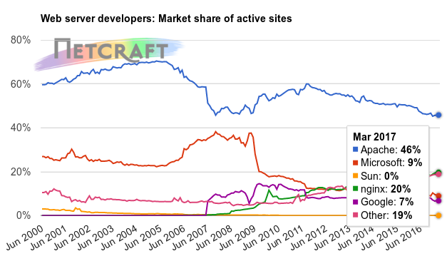
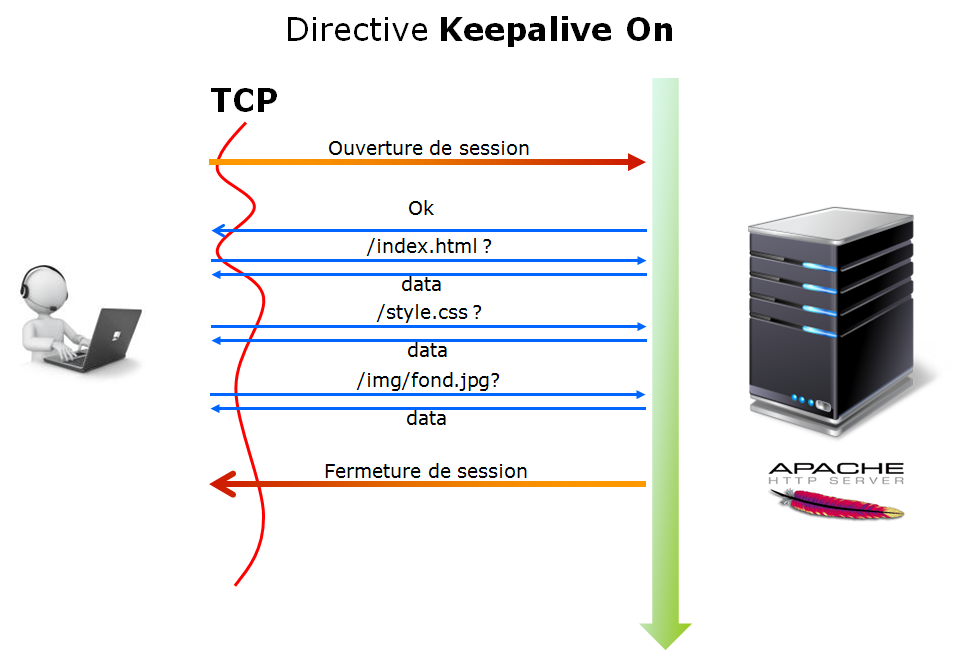

////
Les supports de Formatux sont publiés sous licence Creative Commons-BY-SA et sous licence Art Libre.
Vous êtes ainsi libre de copier, de diffuser et de transformer librement les œuvres dans le respect des droits de l’auteur.

    BY : Paternité. Vous devez citer le nom de l’auteur original.
    SA : Partage des Conditions Initiales à l’Identique.

Licence Creative Commons-BY-SA : https://creativecommons.org/licenses/by-sa/3.0/fr/
Licence Art Libre : http://artlibre.org/

Auteurs : Patrick Finet, Xavier Sauvignon, Antoine Le Morvan
////
= Serveur web indexterm2:[Apache]

Le serveur **HTTP Apache** est le fruit du travail d’un groupe de volontaires : The Apache Group. Ce groupe a voulu réaliser un serveur Web du même niveau que les produits commerciaux mais sous forme de **logiciel libre** (son code source est disponible).

L’équipe d’origine a été rejointe par des centaines d’utilisateurs qui, par leurs idées, leurs tests et leurs lignes de code, ont contribué à faire d’Apache le plus utilisé des serveurs Web du monde.

L’ancêtre d’Apache est le serveur libre développé par le National Center for Supercomputing Applications de l’université de l’Illinois. L’évolution de ce serveur s’est arrêtée lorsque le responsable a quitté le NCSA en 1994. Les utilisateurs ont continué à corriger les bugs et à créer des extensions qu’ils distribuaient sous forme de “patches” d’ou le nom “a patchee server”.

La version 1.0 de Apache a été disponible le 1 décembre 1995 (il y a plus de 20 ans !).

L’équipe de développement se coordonne par l’intermédiaire d’une liste de diffusion dans laquelle sont proposées les modifications et discutées les évolutions à apporter au logiciel. Les changements sont soumis à un vote avant d’être intégrés au projet. Tout le monde peut rejoindre l’équipe de développement, il suffit de contribuer activement au projet pour pouvoir être nommé membre de The Apache Group.

.Statistiques NetCraft : Market Share of Active Sites

Le serveur Apache est très présent sur l'Internet, puisqu'il représente encore environ 50% des parts de marché pour l'ensemble des sites actifs.

.Statistiques NetCraft : Top million busiest sites

Les parts de marché perdues par Apache sont prises par son plus grand challenger : le serveur nginx. Ce dernier, plus rapide pour délivrer les pages web, et moins complets fonctionnellement parlant que le géant Apache.

== Le protocole HTTP

Le protocole **HTTP** (HyperText Transfer Protocol) est le protocole le plus utilisé sur Internet depuis 1990. 

Ce protocole permet un transfert de fichiers (essentiellement au format HTML, mais aussi au format CSS, JS, AVI…) localisés grâce à une chaîne de caractères appelée URL entre un navigateur (le client) et un serveur Web (appelé d'ailleurs httpd sur les machines UNIX). 

indexterm2:[HTTP] est un protocole “requête - réponse” opérant au dessus de TCP (Transmission Control Protocol). 

1. Le client ouvre une connexion TCP vers le serveur et envoie une requête.
2. Le serveur analyse la requête et répond en fonction de sa configuration.

Le protocole HTTP est en lui même dit “**STATELESS**” : il ne conserve pas d’information sur l’état du client d’une requête à l’autre. Ce sont les langages dynamiques comme le php, le python ou le java qui vont permettre la conservation en mémoire des informations de session d'un client (comme dans le cadre d'un site de e-commerce par exemple).

Le protocole HTTP est en version 1.1. La version 2 est en cours de déploiement.

Une réponse HTTP est un ensemble de lignes envoyées au navigateur par le serveur. Elle comprend : 

* **Une ligne de statut** : c'est une ligne précisant la version du protocole utilisé et l'état du traitement de la requête à l'aide d'un code et d'un texte explicatif. La ligne comprend trois éléments devant être séparés par un espace :

** La version du protocole utilisé ;
** Le code de statut ;
** La signification du code .

* **Les champs d'en-tête de la réponse** : il s'agit d'un ensemble de lignes facultatives permettant de donner des informations supplémentaires sur la réponse et/ou le serveur. Chacune de ces lignes est composée d'un nom qualifiant le type d'en-tête, suivi de deux points (:) et de la valeur de l'en-tête.
*   **Le corps de la réponse** : il contient le document demandé.

Voici un exemple de réponse HTTP :

.Exemple de réponse HTTP
[source,http]
----
HTTP/1.1 200 OK
Date : Sat, 15 Jan 2016 14:37:12 GMT Server : Apache/2.17 
Content-Type : text/HTML
Content-Length : 1245 
Last-Modified : Fri, 14 Jan 2016 08:25:13 GMT 
----

Le rôle du serveur web consiste à traduire une URL en ressource locale. Consulter la page http://www.free.fr/[http://www.free.fr/], revient à envoyez une requête HTTP à cette machine. Le service DNS joue donc un rôle essentiel.

=== Les indexterm2:[URL]

Une URL (**Uniform Ressource Locator** - littéralement “identifiant uniforme de ressources”) est une chaîne de caractères ASCII utilisée pour désigner les ressources sur Internet. Elle est informellement appelée adresse web. 

Une URL est divisée en trois parties : 

.Composition d'une URL
----
<protocole>://<hôte>:<port>/<chemin>
----

* **Le nom du protocole** : il s'agit du langage utilisé pour communiquer sur le réseau. Le protocole le plus utilisé est le protocole HTTP (HyperText TransferProtocol), le protocole permettant d'échanger des pages Web au format HTML. De nombreux autres protocoles sont toutefois utilisables.

* **Identifiant et mot de passe** : permet de spécifier les paramètres d'accès à un serveur sécurisé. Cette option est déconseillée car le mot de passe est visible dans l'URL (dans le cadre de la sécurité).

* **L'hôte** : Il s'agit du nom de l'ordinateur hébergeant la ressource demandée. Notez qu'il est possible d'utiliser l'adresse IP du serveur, ce qui rend par contre l'URL moins lisible.

* **Le numéro de port** : il s'agit d'un numéro associé à un service permettant au serveur de savoir quel type de ressource est demandé. Le port associé par défaut au protocole est le port numéro 80. Ainsi, lorsque le service Web du serveur est associé au numéro de port 80, le numéro de port est facultatif.

* **Le chemin d'accès à la ressource** : Cette dernière partie permet au serveur de connaître l'emplacement auquel la ressource est située, c'est-à-dire de manière généralel'emplacement (répertoire) et le nom du fichier demandé. Si non renseignée, indique la première page de l'hôte. Sinon indique le chemin de la page à afficher.

=== Les ports

Une requête HTTP arrivera sur le port 80 (port par défaut pour http) du serveur fonctionnant sur l'hôte. L’administrateur peut toutefois choisir librement le port d’écoute du serveur.

Le protocole http se décline en une version sécurisée: le protocole https (port 443). Ce protocole chiffré s’implémente à partir du module mod-ssl.

D'autres ports peuvent être utilisés, comme le port 8080 (serveurs d'applications Java EE) ou le port 10 000 (Serveur webmin).

== Installation du serveur

Apache est **multiplateforme**. Il peut être utilisé sur Linux, Windows, Mac…

L'administrateur devra choisir entre deux méthodes d'installation :

* **Installation par paquets** : l'éditeur de la distribution fourni des versions **stables et soutenues** (mais parfois anciennes) ;

* **Installation depuis les sources** : le logiciel apache est compilé, l'administrateur peut spécifier les options qui l'intéressent ce qui permet l'optimisation du service. Apache fournissant une architecture modulaire, la re-compilation du logiciel apache n'est généralement pas nécessaire pour ajouter ou supprimer des fonctionnalités complémentaires (ajout/suppression de modules).

Le choix de la méthode d'installation par paquets est fortement **conseillé**. Des dépots complémentaires permettent d'installer des versions plus récentes d'apache sur des versions de distributions anciennes mais, en cas de problème, RedHat n'apportera pas son soutien.

Exemples de modules et de leurs rôles respectifs :

* *mod_access* : filtre l’accès des clients par leur nom d’hôte, adresse IP ou autre caractéristique
* *mod_alias* : permet la création d’alias ou répertoires virtuels
* *mod_auth* : authentifie les clients
* *mod_cgi* : exécute les scripts CGI
* *mod_info* : fournit des informations sur l’état du serveur
* *mod_mime* : associe les types de fichiers avec l’action correspondante
* *mod_proxy* : propose un serveur proxy (serveur mandataire)
* *mod_rewrite* : réécrit les URL
* …

=== Installation par rpm

Interroger la base de données des “rpm”  

[source,bash]
----
[root]# rpm –qa "http*"
----

Installez à partir de paquets liés à la distribution

[source,bash]
----
[root]# rpm –ivh httpd-xxx.rpm
----

Installer si nécessaire les dépendances demandées.

=== Installation par yum

Si vous avez à disposition un dépôt yum :

[source,bash]
----
[root]# yum install httpd
----

Lancer Apache au démarrage du serveur :

[source,bash]
----
[root]# chkconfig httpd on
----

Avant de se lancer dans une installation, il est important de savoir si une version du serveur Apache est installée :

[source,bash]
----
rpm –qa "http*" 
----

Lors de l'installation, un groupe apache et un utilisateur apache sont créés.

[source,bash]
----
[root]# grep apache /etc/group
apache:x:48

[root]# grep apache /etc/passwd
apache:x:48:48:Apache:/var/www:/sbin/nologin

[root]# grep apache /etc/shadow
apache:!!:14411::::::
----

Le serveur Apache travaille sous l'identité d'un utilisateur “apache” appartenant à un groupe “apache”. Lors de l'installation, ce groupe et cet utilisateur sont créés. L'utilisateur apache étant un utilisateur système, aucun mot de passe ne lui est attribué, ce qui  rend impossible la connexion au système avec cet utilisateur.

=== Les fichiers de configuration

Le répertoire _/etc/httpd/conf/_ contient le fichier de configuration principal d'Apache httpd.conf. Ce fichier est très bien commenté. En général, ces commentaires suffisent pour éclairer l’administrateur sur les options dont il dispose.

Il peut être judicieux de créer un fichier de configuration sans commentaires :

[source,bash]
----
[root]# egrep –v ‘^#|^$’ /etc/httpd/conf/httpd.conf > httpd.conf.lite
----

Le répertoire /etc/httpd/conf.d/ contient les fichiers de configuration des sites virtuels ou des modules installés (ssl, php, welcome.conf, phpmyadmin, etc.)

=== Manuel d'utilisation

Il existe un package contenant un site faisant office de manuel d’utilisation d’apache. Il s’agit du package **httpd-manual-xxx.noarch.rpm**.
Une fois ce package installé vous pourrez accéder au manuel simplement avec un navigateur web à cette adresse http://127.0.0.1/manual[http://127.0.0.1/manual].

=== Lancement du serveur

* Par le script d'init :

[source,bash]
----
[root]# /etc/rc.d/init.d/httpd {start|restart|status
----

* Avec la commande service :
[source,bash]
----
[root]# service httpd {start|restart|status}
----

* Avec la commande apachectl fourni par apache :
[source,bash]
----
[root]# apachectl {start|restart|stop}
----

Il est indispensable de lancer/relancer le serveur :

* après l'installation ;
* après toute modification de la configuration.

=== Parefeu

Le pare-feu “iptables” interdit l'accès aux ports 80 et 443. Pensez à le configurer (ou à désactiver ce service sur plateforme de test) !

[source,bash]
----
[root]# system-config-firewall-tui
----

Ou :

[source,bash]
----
[root]# service iptables stop
[root]# service ip6tables stop
----

La configuration d'un pare-feu fait l'objet d'un autre cours.

== Arborescence

.Arborescence d'Apache

L'arborescence peut varier en fonction des distributions.

* **/etc/httpd/** : Ce répertoire est la racine du serveur. Il contient l’ensemble des fichiers du serveur Apache.
* **/etc/httpd/conf/** : Ce répertoire contient l’ensemble des fichiers de configuration du serveur. Il possède des sous-dossiers pour des éléments de configuration précis.
* **/var/www/html/** : Ce répertoire est le répertoire de publication par défaut. Il contient les fichiers nécessaires à l’affichage de la page web par défaut du serveur Apache. Quand l’administrateur veut publier un site, il peut déposer ses fichiers dans ce répertoire.

D’autres répertoires existent sous /var/www :

* **cgi-bin** : contient les scripts CGI ;
* **icons** : contient des icônes, notamment celles pour identifier le type de fichier ;
* **error** : contient les messages d'erreur d'Apache, ce sont ces fichiers qu'il faudra modifier pour personnaliser les mesages d'erreur.

* **/var/log/httpd/** : Ce répertoire contient les fichiers de logs du serveur Apache.

** Le fichier access-log garde une trace des différents accès au serveur ;
** Le fichier error-log contient la liste des erreurs rencontrées pendant l’exécution du service ;
** Les fichiers logs sont personnalisables, l’administrateur peut aussi en créer de nouveaux.

* **/etc/httpd/modules** : Répertoire contenant les liens vers le répertoire “/usr/lib/httpd/modules” contenant les modules utilisables par Apache. Un module est une extension logicielle  d’Apache, lui permettant par exemple d'interpréter le PHP (ex: mod-php5.so).

* **/etc/rc.d/init.d/httpd** : Script de démarrage du serveur httpd.

== Configuration du serveur

La configuration globale du serveur se fait dans /etc/httpd/conf/httpd.conf.

Ce fichier est découpé en 3 sections qui permettent de configurer :

* en **section 1** l'environnement global ;
* en **section 2** le site par défaut et les paramètres par défaut des sites virtuels ;
* en **section 3** les hôtes virtuels.

L'**hébergement virtuel** permet de mettre en ligne **plusieurs sites virtuels** sur le même serveur. Les sites sont alors différenciés en fonction de leurs noms de domaines, de leurs adresses IP, etc.

La modification d’une valeur en section 1 ou 2 impacte l’ensemble des sites hébergés.

En environnement mutualisé, les modifications seront donc effectuées en section 3.

Pour faciliter les mises à jour futures, il est vivement recommandé de créer un fichier de configuration section 3 pour chaque site virtuel.

=== Section 1

Les différentes directives rencontrées en section 1 sont :

.Directives principales de la section 1
[cols="1,4",options="header"]
|====
|  Directives          | Observations 
| ServerTokens         | Cette directive sera vue dans le cours Apache – sécurité. 
| ServertRoot          | Indique le chemin du répertoire contenant l'ensemble des fichiers constituant le serveur Apache. 
| PidFile              | Le fichier cible de la directive contient le numéro de PID du serveur à son démarrage. 
| Timeout              | Le nombre de secondes avant le délai d'expiration d’une requête trop longue (entrante ou sortante). 
| KeepAlive            | Connexion persistante (plusieurs requêtes par connexion TCP). 
| MaxKeepAliveRequests | Nombre maximum de connexions persistantes. 
| KeepAliveTimeout     | Nombre de secondes à attendre la requête suivante du client avant fermeture de la connexion TCP. 
| Listen               | Permettre à apache d’écouter sur des adresses ou des ports spécifiques.  
| LoadModule           | Charger des modules complémentaires (moins de modules = plus de sécurité). 
| Include              | Inclure d'autres fichiers de configuration au serveur.  
| ExtendedStatus       | Afficher plus d’information sur le serveur dans le module server-status. 
| User et Group        | Permet de lancer les processus apache avec différents utilisateurs. Apache se lance toujours en tant que root puis change son propriétaire et son groupe. 
|====

Le serveur Apache a été conçu comme un serveur puissant et flexible, pouvant fonctionner sur une grande variété de plateformes.

Plateformes différentes et environnements différents signifient souvent fonctionnalités différentes, ou utilisation des méthodes méthodes pour implémenter la même fonctionnalité le plus efficacement possible.

La conception modulaire d’apache autorise l’administrateur à choisir quelles fonctionnalités seront incluses dans le serveur en choisissant les modules à charger soit à la compilation, soit à l’exécution.

Cette modularité comprend également les fonctions les plus élémentaires du serveur web.

Certains modules, les Modules Multi-Processus (MPM) sont responsables de l’association aux ports réseau de la machine, acceptent les requêtes, et se chargent de les répartir entre les différents processus enfants.

Pour la version d’Apache de Windows, le MPM utilisé sera mpm-winnt.

Sous Linux, les sites très sollicités utiliseront un MPM threadé comme worker ou event, tandis que les sites privilégiant la stabilité utiliseront prefork.

Voir la page http://httpd.apache.org/docs/2.2/fr/mpm.html[http://httpd.apache.org/docs/2.2/fr/mpm.html]

Configuration par défaut des modules prefork et worker :

.Configuration des modules dans /etc/http/conf/httpd.conf
[source,bash]
----
<IfModule prefork.c>
StartServers		8
MinSpareServers		5
MaxSpareServers		20
ServerLimit		256
MaxClients		256
MaxRequestPerChild	4000
</IfModule>

<IfModule worker.c>
StartServers		4
MaxClients		300
MinSpareThreads		25
MaxSpareThreads		75
ThreadsPerChild		25
MaxRequestsPerChild	0
</IfModule>
----

Le module Prefork, activé par défaut, s'appuie sur des processus. Il est donc plus stable mais nécessite plus de mémoire pour fonctionner. Le module Worker, quand à lui, s'appuie sur des threads, ce qui le rend 
plus performant, mais des modules comme le Php ne sont pas compatible.

Choisir un module plutôt qu'un autre est donc une tâche complexe, tout autant que l'optimisation du module MPM retenu (nombre de client, de requêtes, etc.).

Par défaut Apache est configuré pour un service moyennement sollicité (256 clients max).

La configuration minimal d'un serveur apache ressemble à ceci :

.Configuration d'apache minimal dans /etc/httpd/conf/httpd.conf
[source,bash]
----
ServerRoot /etc/httpd
KeepAlive On
Listen 80
Listen 160.210.150.50:1981
LoadModule ...
Include conf.d/*.conf
User apache
Group apache
----

==== indexterm2:[SELinux]

Attention par défaut la sécurité via SELinux est active. Elle empêche la lecture d’un site sur un autre répertoire que “/var/www/”. 

Le répertoire contenant le site doit posséder le contexte de sécurité httpd_sys_content_t.

Le contexte actuel se vérifie par la commande :

[source,bash]
----
[root]# ls –Z /rep
----

Rajouter le contexte via la commande :

[source,bash]
----
[root]# chcon -vR --type=httpd_sys_content_t /rep
----

Elle empêche également l’ouverture d’un port non standard. Il faut ouvrir manuellement le port désiré à l’aide de la commande semanage (non installée par défaut).

[source,bash]
----
[root]# semanage port -a -t http_port_t -p tcp 1664
----

==== Directives User et Group

Définir un compte et un groupe de gestion d’Apache

Historiquement, apache était lancé par root, ce qui posait des problèmes de sécurité. Apache est toujours lancé par root mais change ensuite son identité. Généralement User Apache et Group Apache.

[WARNING]
====
Attention jamais ROOT !!!
====

Le serveur Apache (processus httpd) est lancé par le compte de super-utilisateur root. Chaque requête d’un client déclenche la création d’un processus “fils”. Pour limiter les risques, il faut lancer ces 
processus enfants avec un compte moins privilégié.

Les directives User et Group servent à déclarer le compte et le groupe utilisés pour la création des processus enfants.

[source,bash]
----
User apache
Group apache
----

Ce compte et ce groupe doivent avoir été créés dans le système (par défaut cela est fait à l’installation). Par mesure de précaution supplémentaire, s’assurer que le compte n’est pas interactif (ne peut pas ouvrir de session).

image::./images/SVR-060-Apache-005.png[scaledwidth="100%"]

Avec la directive KeepAlive désactivée, chaque demande de ressource sur le serveur nécessite une ouverture de connexion TCP, ce qui est long à effectuer d’un point de vue réseau et gourmand en ressource système.

Avec la directive indexterm2:[KeepAlive] à On, le serveur conserve la connexion ouverte avec le client le temps du Keepalive.

Sachant qu’une page web est constituée de plusieurs fichiers (images, feuilles de styles, javascripts, etc.), cette stratégie est rapidement gagnante.

Il est toutefois nécessaire de bien paramétrer cette valeur au plus juste :

* Une valeur trop courte pénalise le client,
* Une valeur trop longue pénalise les ressources du serveur.

Des demandes de configuration spécifiques peuvent être faîtes par le client en hébergement mutualisé. Auquel cas, les valeurs de KeepAlive seront paramétrées directement dans le VirtualHost du client ou au niveau du mandataire (ProxyKeepalive et ProxyKeepaliveTimeout).

L’affichage de cette page prouve que le serveur est fonctionnel. Mais le serveur ne dispose pas encore de site à publier. Paramétrons la section 2.

=== Section 2

La section 2 paramètre les valeurs utilisées par le serveur principal. Le serveur principal répond à toutes les requêtes qui ne sont pas prises en charge par un des Virtualhosts de la sections 3.

Les valeurs sont également utilisées comme valeur par défaut pour les sites virtuels.

* **ServerAdmin** : spécifie une adresse de messagerie qui apparaîtra dans certaines pages auto-générées, comme dans les pages d’erreurs.
* **ServerName** : spécifie le nom qui servira d’identification pour le serveur. Peut être déterminé automatiquement, mais il est recommandé de le spécifier explicitement (adresse IP ou nom DNS).
* **DocumentRoot** : spécifie le répertoire contenant les fichiers à servir aux clients. Par défaut **/var/www/html/**.
* **ErrorLog** : spécifie le chemin vers le fichier d’erreurs.
* **LogLevel** : debug, info, notice, warn, error, crit, alert, emerg.
* **LogFormat** : définir un format spécifique de log à utiliser avec la directive CustomLog.
* **CustomLog** : spécifie le chemin vers le fichier d’accès.
* **ServerSignature** : vue dans le cours sécurité.
* **Alias** : spécifie un répertoire extérieur à l’arborescence et le rend accessible par un
contexte. La présence ou l’absence du dernier slash dans le contexte à son importance.
* **ScriptAlias** : spécifie le dossier contenant les scripts serveurs (idem alias) et les rend exécutables.
* **Directory** : spécifie des comportements et des droits d’accès par répertoire.
* **AddDefaultCharset** : spécifie le format d’encodage des pages envoyés (les caractères accentués peuvent être remplacés par des ?…).
* **ErrorDocument** : personnaliser les pages d’erreurs.
* **server-status** : rapport sur l’état du serveur.
* **server-info** : rapport sur la configuration du serveur.

==== La directive ErrorLog

La directive ErrorLog permet de définir le journal des erreurs.

Cette directive définit le nom du fichier dans lequel le serveur enregistre toutes les erreurs qu'il rencontre. Si le file-path n'est pas absolu, il est supposé être relatif à ServerRoot.

Syntaxe :

[source,bash]
----
ErrorLog file-path
----

Exemple :

[source,bash]
----
ErrorLog logs/error-log
----

==== La directive DirectoryIndex

La directive DirectoryIndex permet de définir la page d’accueil du site.

Cette directive indique le nom du fichier qui sera chargé en premier, qui fera office d’index du site ou de page d’accueil.

Syntaxe :

[source,bash]
----
DirectoryIndex page-à-afficher
----

Le chemin complet n'est pas précisé car le fichier est recherché dans le répertoire spécifié par DocumentRoot

Exemple :

[source,bash]
----
DocumentRoot	/var/www/html
DirectoryIndex	index.php, index.htm
----

Cette directive indique le nom du fichier index du site web. L’index est la page par défaut qui s’ouvre quand le client tape l’URL du site (sans avoir à taper le nom de cet index). Ce fichier doit se trouver dans le répertoire indiqué par la directive DocumentRoot.

La directive DirectoryIndex peut spécifier plusieurs noms de fichiers index séparés par des espaces. Par exemple, une page d’index par défaut au contenu dynamique et en deuxième choix une page statique.

==== La directive ServerAdmin

La directive ServerAdmin permet d’indiquer le mail de l'administrateur.

Syntaxe :

[source,bash]
----
ServerAdmin email-adresse
----

Exemple :

[source,bash]
----
ServerAdmin webmaster@formatux.fr
----

==== La balise Directory

La balise Directory permet de définir des directives propre à un répertoire.

Cette balise permet d’appliquer des droits à un ou plusieurs répertoires. Le chemin du répertoire sera saisi en absolu.

Syntaxe :

[source,bash]
----
<Directory directory-path> 
Définition des droits des utilisateurs 
</Directory> 
----

Exemple :

[source,bash]
----
<Directory /home/SitesWeb/SiteTest> 
Allow from all   # nous autorisons tout le monde
</Directory> 
----

La section Directory sert à définir un bloc de consignes s’appliquant à une partie du système de fichiers du serveur. Les directives contenues dans la section ne s’appliqueront qu’au répertoire spécifié (et ses 
sous-répertoires).

La syntaxe de ce bloc accepte les caractères génériques mais il faudra préfèrer alors utiliser le bloc DirectoryMatch.

Dans l’exemple suivant, nous allons refuser l’accès au disque dur local du serveur quelque soit le client. Le répertoire « / » représente la racine du disque dur.

[source,bash]
----
<Directory />
	Order deny, allow
	Deny from all
</Directory>
----

Dans l’exemple suivant, nous allons autoriser l’accès au répertoire de publication /var/www/html pour tous les clients.

[source,bash]
----
<Directory /var/www/html>
	Order allow, deny
	Allow from all
</Directory>
----

==== Prise en compte des modifications

La commande indexterm2:[apachectl] permet de tester la syntaxe du fichier de conf :

[source,bash]
----
[root]# service httpd configtest
----

ou :

[source,bash]
----
[root]# apachectl -t
----

puis :

[source,bash]
----
[root]# /etc/rc.d/init.d/httpd {start|restart|status}
----

ou : 

[source,bash]
----
[root]# service httpd {start|restart|status}
----

ou :

[source,bash]
----
[root]# apachectl {start|restart|stop}
----

Les commandes précédentes ont pour effet de couper les connexions en cours. Apache propose une solution plus élégante, qui lance de nouveaux serveurs et attends la fin du timeout pour détruire les anciens processus :

Ne pas couper les connexions TCP actives :

[source,bash]
----
[root]# service httpd graceful
----

== Configuration avancée du serveur

=== Le mod_status

Le mod_status permet d'afficher une page /server-status ou /server-info récapitulant l'état du serveur :

.Configuration des directives server-status et server-info
[source,bash]
----
<Location /server-status>
	SetHandler server-status
	Order allow,deny
	Allow from 127.0.0.1
</Location>

<Location /server-info>
	SetHandler server-info
	Order allow,deny
	Allow from 127.0.0.1
	Allow from 172.16.96.105
</Location>
----

La page /server-status :

La page /server-info :

=== Hébergement mutualisé (section 3)

Dans le cas d'un hébergement mutualisé, le client pense visiter plusieurs serveurs. En réalité, il n’existe qu’un seul serveur et plusieurs sites virtuels.

Pour mettre en place un hébergement mutualisé, il faut mettre en place des hôtes virtuels :

* en déclarant plusieurs ports d’écoute ;
* en déclarant plusieurs adresses IP d’écoute (hébergement virtuel par **IP**) ;
* en déclarant plusieurs noms de serveur (hébergement virtuel par **nom**);

Chaque site virtuel correspond à une arborescence différente.

La section 3 du fichier httpd.conf permet de déclarer ces hôtes virtuels.

Pour faciliter les mises à jour futures, il est vivement recommandé de créer un fichier de configuration section 3 pour chaque site virtuel.

Choisissez un hébergement virtuel “par IP” ou “par nom”. En production, il est déconseillé de mixer les deux solutions.

* Chaque site virtuel peut être configuré dans un fichier indépendant ;
* Les VirtualHosts sont stockés dans /etc/httpd/conf.d/ ;
* L’extension du fichier est .conf.

==== La balise VirtualHost

La balise VirtualHost permet de définir des hôtes virtuels.

Syntaxe: 

.Syntaxe d'un fichier virtualhostXXX.conf
[source,bash]
----
<VirtualHost adresse-IP[:port]>
	# si la directive "NameVirtualHost" est présente 
	# alors "adresse-IP" doit correspondre à celle saisie 
	# sous "NameVirtualHost" ainsi que pour le "port".
 ...
 </VirtualHost> 
----

Si nous configurons le serveur Apache avec les directives de base vues précédemment, nous ne pourrons publier qu’un seul site. En effet, nous ne pouvons pas publier plusieurs sites avec les paramètres par défaut : même adresse IP, même port TCP et absence de nom d’hôte ou nom d’hôte unique.

L’usage des sites virtuels va nous permettre de publier plusieurs sites web sur un même serveur Apache. Nous allons définir des blocs qui décriront chacun un site web. Ainsi chaque site aura sa propre configuration.

Pour des facilités de compréhension, nous associons souvent un site web à une machine unique. Les sites virtuels ou hôtes virtuels (virtual hosts) sont appelés ainsi parce qu’ils dématérialisent le lien entre 
machine et site web.

Exemple 1 :

[source,bash]
----
Listen 192.168.0.10:8080
<VirtualHost 192.168.0.10:8080>
  DocumentRoot /var/www/site1/
  ErrorLog /var/log/httpd/site1-error.log
</VirtualHost>
----

[source,bash]
----
Listen 192.168.0.11:9090
<VirtualHost 192.168.0.11:9090>
  DocumentRoot /var/www/site2/
  ErrorLog /var/log/httpd/site2-error.log
</VirtualHost>
----

L’hébergement virtuel basé sur IP est une méthode permettant d’appliquer certaines directives en fonction de l’adresse IP et du port sur lesquels la requête est reçue. En général, il s’agit de servir différents sites web sur des ports ou des interfaces différents.

==== La directive NameVirtualHost

La directive NameVirtualHost permet de définir des hôtes virtuels à base de nom.

Cette directive est obligatoire pour configurer des hôtes virtuels à base de nom. Nous spécifions avec cette directive l'adresse IP sur laquelle le serveur recevra des demandes des hôtes virtuels à base de nom.

Syntaxe :
----
NameVirtualHost adresse-IP[:port]
----

Exemple :
----
NameVirtualHost 160.210.169.6:80
----

Il faut placer la directive avant les blocs descriptifs de sites virtuels. Elle désigne les adresses IP utilisées pour écouter les requêtes des clients vers les sites virtuels. La syntaxe est la suivante :

Pour écouter les requêtes sur toutes les adresses IP du serveur il faut utiliser le caractère *.

== Exemple de publication de sites

.Fichier /etc/httpd/conf.d/80-site1.conf :
[source,bash]
----
<VirtualHost 160.210.69.6:80>
  # déclaration de l'arborescence du site
  DocumentRoot "/var/sitesweb/site1"
  # déclaration des index du site
  DirectoryIndex "Index1.htm"
  # déclaration des droits sur le site
  <Directory "/var/sitesweb/site1">
    Allow from all
  </Directory>
</VirtualHost>
----

.Fichier /etc/httpd/conf.d/1664-site2.conf :
[source,bash]
----
Listen 1664
<VirtualHost 160.210.69.6:1664>
  # déclaration de l'arborescence du site
  DocumentRoot "/var/sitesweb/site2"
  # déclaration des index du site
  DirectoryIndex "Index2.htm"
  # déclaration des droits sur le site
  <Directory "/var/sitesweb/site2">
    Allow from all
  </Directory>
</VirtualHost>
----

== Redirection des logs vers syslog

Il est possible, en passant par la commande *logger* de rediriger les logs d'apache vers le syslog local ou vers un serveur syslog distant avec le mot clé *apache*.

Modification des lignes **CustomLog** et **ErrorLogs** du fichier .conf correspondant au VHOST désiré :

.fichier .conf du vhost
[source,apache]
----
    ErrorLog "|usr/bin/logger -t apache -p local6.info"
    CustomLog "|usr/bin/logger -t apache -p local6.info" combined
----
