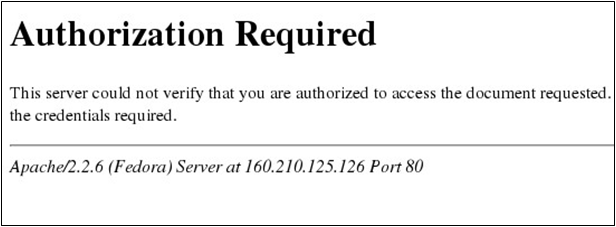

////
Les supports de Formatux sont publiés sous licence Creative Commons-BY-SA et sous licence Art Libre.
Vous êtes ainsi libre de copier, de diffuser et de transformer librement les œuvres dans le respect des droits de l’auteur.

    BY : Paternité. Vous devez citer le nom de l’auteur original.
    SA : Partage des Conditions Initiales à l’Identique.

Licence Creative Commons-BY-SA : https://creativecommons.org/licenses/by-sa/3.0/fr/
Licence Art Libre : http://artlibre.org/

Auteurs : Patrick Finet, Xavier Sauvignon, Antoine Le Morvan
////

= Sécurisation du serveur web Apache

== Introduction

La sécurisation d’une site internet nécessite la mise en place de trois mesures :

* La sécurité du service en lui-même.

Par défaut un serveur Apache va envoyer des informations avec ses pages web. Ces informations contiennent des détails sur sa version ou ses modules. Pour un pirate, ces informations vont lui permettre de cibler les attaques en fonction des failles connues. Il est donc impératif de masquer ces informations sur un serveur de production.

* La sécurité des accès aux données.

Pour empêcher l’accès aux données, il est nécessaire de mettre en place une authentification. Cette authentification peut être d’ordre applicative, et s’appuyer par exemple sur une base de données, ou être gérée par le service Apache.

* La sécurité des échanges (protocole https).

La mise en place d’un processus d’authentification sur le serveur pour protéger l’accès aux données n’empêche pas l’attaquant d’intercepter les requêtes sur le réseau, et d’ainsi obtenir les documents désirés voir les informations d’identification (utilisateur et mot de passe). L’authentification va donc de pair avec le chiffrement des échanges.

[TIP]
====
Moins d’informations = intrusion plus difficile = Masquer l’identité du serveur Apache.
====

== Masquage de l'identité d'Apache

=== Directive ServerSignature 

Afficher une ligne de bas de page pour les documents générés par le serveur (messages d'erreur)

.Syntaxe de la directive ServerSignature
[source,bash]
----
ServerSignature  On | Off | EMAil 
----

Exemple :
[source,bash]
----
ServerSignature  Off
----

La directive "ServerSignature" ajoute un pied de page aux documents générés par le serveur (messages d'erreur, liste des répertoires, ftp, etc.).

L'utilité d’ajouter ces informations apparaît par exemple lorsqu’une réponse à une requête traverse plusieurs proxys. Dans ces conditions, sans ces informations, il devient difficile pour l'utilisateur de déterminer quel élément de la chaîne de proxy a produit un message d'erreur.

Sur un serveur de production, pour des raisons de sécurité, il est préférable de positionner cette option à Off.

ServerSignature  On :

ServerSignature Off :

L’information fournie par cette page semble anodine mais pourtant est très précieuse pour un attaquant.

En effet, un éventuel attaquant apprend que le serveur apache, disponible à l’adresse IP 160.210.125.126 est un serveur Apache 2.2.6.
La version actuelle d’apache étant la version 2.2.29 (en décembre 2014).

L’attaquant peut donc utiliser le document situé à cette adresse : http://www.apache.org/dist/httpd/CHANGES_2.2 pour cibler ses attaques.

=== Directive ServerTokens 

Renseigner le champ "server" de l'entête http.

.Syntaxe de la directive ServerTokens
[source,]
----
ServerTokens  Prod[uctOnly] | Min[imal] | OS | Full 
----

Exemple :
[source,]
----
ServerTokens Prod
----

Dans un navigateur web, la page internet que nous consultons n’est que la partie visible par l’utilisateur du contenu d’une requête HTTP.
Les en-têtes HTTP fournissent de nombreuses informations, que ce soit du client vers le serveur ou du serveur vers le client.

Ces en-têtes peuvent être visualisée par exemple avec :

* la commande wget, qui  permet le téléchargement d’une URL en ligne de commande,
* avec le module "Développement Web" fourni en standard avec le navigateur Firefox.

En-têtes sans ServerTokens (full)

[source,]
----
[root]# wget –S  http://160.210.125.126

--14:30:07--  http://160.210.125.126/
=> `index.html' 
Connexion vers 160.210.125.126:80...connecté.
requête HTTP transmise, en attente de la réponse...
  HTTP/1.1 200 OK
  Date: Mon, 01 Mar 2010 13:30:07 GMT
  Server: Apache/2.2.6 (Fedora) DAV/2
  Last-Modified: Mon, 01 Mar 2010 08:26:10 GMT
  ETag: "16e9e-3c55-594c80"
  Accept-Ranges: bytes
  Content-Length: 15445
  Connection: close
  Content-Type: text/html; charset=UTF-8
  Longueur: 15445 (15K) [text/html]
  
  100%[====================================>] 15445         --.--K/s
  
  14:30:07 (86.86 MB/s) - « index.html » sauvegardé [15445/15445]
----

Pour les mêmes raisons que pour la directive ServerSignature vue précédemment, il est impératif de limiter les informations transmises par un serveur de production.

.La directive ServerTokens
[cols="1,4",width="100%",options="header"]
|====
| Valeur  |  Information
| Prod[uctOnly] |  Server : Apache
| Min[imal]    |  Server : Apache/1.3.0
| OS | Server : Apache/1.3.0 (Unix)
| Full | Server : Apache/1.3.0 (Unix) PHP/3.0 MyMod/1.2
|====

.En-têtes avec ServerTokens Prod
[source,]
----
[root]# wget –S  http://160.210.125.126

--14:30:07--  http://160.210.125.126/
=> `index.html' 
Connexion vers 160.210.125.126:80...connecté.
requête HTTP transmise, en attente de la réponse...
  HTTP/1.1 200 OK
  Date: Mon, 01 Mar 2010 13:30:07 GMT
  Server: Apache
  Last-Modified: Mon, 01 Mar 2010 08:26:10 GMT
  ETag: "16e9e-3c55-594c80"
  Accept-Ranges: bytes
  Content-Length: 15445
  Connection: close
  Content-Type: text/html; charset=UTF-8
  Longueur: 15445 (15K) [text/html]
  
  100%[====================================>] 15445         --.--K/s
  
  14:30:07 (86.86 MB/s) - « index.html » sauvegardé [15445/15445]
----

[TIP]
====
Le choix le plus judicieux est généralement de modifier le fichier /etc/httpd/conf/httpd.conf pour mettre la directive ServerTokens à Prod
====

== Gestion des authentifications

L'authentification est la procédure qui consiste à vérifier l’identité d’une personne ou d’un ordinateur afin d’autoriser l’accès de cette entité à des ressources (systèmes, réseaux, applications,…).

Il existe de nombreuses méthodes d’authentifications :

* Authentification classique (simple) ;
* Authentification LDAP ;
* Authentification via serveur de base de données ;
* Authentification via PAM ;
* Authentification via SSO.

Apache permet par défaut d’assurer ce processus, avec une authentification classique ou simple, qui s’appuie sur des fichiers de textes contenant les informations de connexion des utilisateurs.

Cette fonctionnalité basique peut être enrichie par des modules, et permettre à apache de s’appuyer sur :

* Une authentification via un serveur LDAP. Ce procédé permet de déléguer l’authentification des utilisateurs (et leur appartenance à des groupes) à un serveur LDAP, dont c’est la fonctionnalité première. Apache utilise alors le module mod_authnz_ldap, qui dépend du module Apache d’accès à LDAP, mod_ldap, qu’il faut aussi installer.

* Une authentification via un serveur de base de données. Ce procédé s’appuiera sur le langage SQL (Structured Query Language) pour la gestion des utilisateurs, de leurs mots de passe et leur appartenance à des groupes.

* Le module PAM (Pluggable Authentification Modules). Ce procédé permet de déléguer l’authentification au système d’exploitation. Pour mettre en place cette procédure, il faut installer deux modules : mod_auth_pam et pam_auth_external. 

Ces modules ne sont pas actifs par défaut mais sont présents dans les dépôts.

[NOTE]
====
Dans ce chapitre nous ne verrons que l'authentification classique (dite aussi « simple »).
====

=== Authentification classique

Authentification classique  : protéger l’accès à un site ou à un dossier d’un site par la mise en place d’une authentification par mot de passe.

L’activation du module d’authentification pour un site peut se faire :

* Soit dans la configuration globale du site, si l’administrateur du site est également administrateur du serveur, ou que l’administrateur lui en a laissé l’accès.

Les directives de configuration se positionne entre les balises <Directory> ou <Location>.

[NOTE]
====
C’est la méthode à privilégier.
====

* Si la modification du fichier de configuration globale n’est pas possible, ce qui est souvent le cas d’un serveur mutualisé, la protection se fera alors dans un fichier .htaccess directement dans le dossier à protéger.

Dans ce cas, l’administrateur du serveur aura explicitement configuré cette possibilité dans la configuration globale avec la directive AllowOverride à All ou à AuthConfig.

Ce fichier étant évalué à chaque accès, cela peut induire une petite perte au niveau des performances.

[IMPORTANT]
====
L’authentification sécurise l’accès aux données, mais la donnée transite toujours en clair durant la transmission au client.
====

=== Directive AuthType

Renseigner le type de contrôle des autorisations

Directives associées : AuthName, AuthUserFile

.Syntaxe de la directive AuthType
[source,bash]
----
AuthType Basic | Digest
----

Exemple :
[source,bash]
----
AuthType Basic
----

AuthType indique à Apache d’utiliser le protocole Basic ou Digest pour authentifier l’utilisateur :

* Authenfication Basic : Transmission du mot de passe client en clair

Pour mettre en place cette méthode, il faut utiliser la commande htpasswd qui permet de créer un fichier qui va contenir les logins (ou les groupes) et les mots de passe des utilisateurs (ou les groupes) habilités à accéder au dossier Web sécurisé (la commande étudiée plus loin).

* Authentification Digest : Hachage MD5 128 bits du mot de passe avant transmission

Ce module implémente l’authentification HTTP basée sur les condensés MD5, et fournit une alternative à mod_auth_basic en ne transmettant plus le mot de passe en clair.

Cependant, cela ne suffit pas pour améliorer la sécurité de manière significative par rapport à l’authentification basique. En outre, le stockage du mot de passe sur le serveur est encore moins sûr dans le cas d’une authentification à base de condensés que dans le cas d’une authentification basique.

C’est pourquoi l’utilisation de l’authentification basique associée à un chiffrement de la connexion via mod_ssl constitue une bien meilleure alternative.

Plus d’informations : http://httpd.apache.org/docs/2.2/fr/mod/mod_auth_digest.html.

[IMPORTANT]
====
Pour des raisons de sécurité, seul le mécanisme Basic sera utilisé par la suite.
====

Configuration du fichier /etc/httpd/conf/httpd.conf :

Dans les balises <Directory> ou <Location>, ajouter les directives d’authentification :

.Syntaxe Apache pour protéger l'accès à un dossier
[source,]
----
<Directory directory-path >
  	AuthType Basic | Digest
  	AuthName "text"
  	AuthUserFile directory-path/.PrivPasswd
  	Require user | group | valid-user
</Directory>
----

* AuthName est le message qui est affiché dans la boite de dialogue de saisie du login et du mot de passe.
* AuthUserFile indique le chemin et le nom du fichier contenant le nom des utilisateurs et leur mot de passe.
Pour une identification sur un groupe il faut travailler avec la directive AuthGroupFile. Ces deux directives font parties du module mod_auth .
* Require est la règle d’authentification à proprement parler. Elle indique à Apache qu’un utilisateur ayant réussi à s’authentifier à partir du fichier des mots de passe (spécifié dans la directive AuthUserFile) peut accéder au site Web sécurisé.

Exemple : 

[source,]
----
<VirtualHost www.monsite.com >
……
  <Directory /var/www/html/sitetest>
   # Type d’authentification
   AuthType Basic
   # texte affiché dans la boite de dialogue
   AuthName " Acces Securise "
   # fichier contenant les logins et mdp
   AuthUserFile /var/www/private/sitetest/.PrivPasswd
   # Accès par vérification du mot de passe
   require valid-user
  </Directory>
</VirtualHost>
----

Le fichier .PrivPasswd est créé avec la commande htpasswd, que nous verrons plus loin dans ce chapitre.

[WARNING]
====
Le fichier de gestion des logins et des mots de passe .PrivPasswd est un fichier sensible. Il ne faut pas le placer dans le répertoire de publication de votre site, mais plutôt dans un répertoire extérieur à l’arborescence de votre site suivi du nom du site.
====

Exemple
[source,]
----
[root]# mkdir -p /var/www/private/SiteTest
----

Le fichier .PrivPasswd" sera ensuite créé dans ce répertoire à l'aide de la commande htpasswd.

Le fichier .htaccess utilise les mêmes directives que précédemment, mais non encadrés par les balises Directory ou Location.

Syntaxe:

[source,]
----
AuthType Basic | Digest
AuthName "text"
AuthUserFile directory-path/.PrivPasswd
Require user | group | valid-user
----

Avec dans le fichier « /etc/httpd/conf/httpd.conf »
<Directory directory-path >
AllowOverride  AuthConfig
</Directory>

Un serveur web répond généralement pour plusieurs sites.
Dans ce cas, il est plus simple de configurer ce type de spécificité de configuration directement dans le dossier en question.

* Avantages : l’usage d’un fichier .htaccess a le mérite d’être simple et permet notamment de protéger un dossier Web racine ainsi que les sous-dossiers (sauf si un autre fichier .htaccess y contrevient), il est possible de déléguer la configuration ou la personnalisation du service à un administrateur du site.

* Inconvénients : il n’est pas simple de maintenir un nombre élevé de fichiers .htaccess. L’évaluation du fichier .htaccess par le serveur peut induire sur les performances.

Il ne faut pas oublier d’autoriser la configuration du module d'identification par fichier .htaccess à l'aide de la directive : AllowOverride  AuthConfig.

Sans cette directive, apache ne permettra pas au fichier .htaccess d’écraser la configuration définie dans la configuration globale.

[source,]
----
<VirtualHost www.monsite.com >
    <Directory /home/SitesWeb/SiteTest>
       # déclaration de l'utilisation de .htaccess
	  AllowOverride  AuthConfig
    </Directory>
</VirtualHost>
----

.Exemple de fichier .htaccess
[source,]
----
# Type d’authentification
AuthType Basic
# texte affiché dans la boite de dialogue
AuthName " Acces Securise "
# fichier contenant les logins et mdp
AuthUserFile /var/www/private/sitetest/.PrivPasswd
# Accès par vérification du mot de passe
require valid-user
----

Lors du traitement d’une requête, Apache cherche la présence du fichier .htaccess dans tous les répertoires du chemin menant au document depuis la directive DocumentRoot.

Exemple, avec une directive DocumentRoot à /home/sitesweb/ avant de retourner /home/sitesWeb/sitetest/indextest.htm Apache examine les fichiers :

* /home/sitesWeb/.htaccess
* /home/sitesWeb/sitetest/.htaccess

Mieux vaut désactiver cette fonctionnalité sur / (activé par défaut) :
<Directory />
    AllowOverride None
</Directory>

=== Commande htpasswd
La commande htpasswd permet de gérer les utilisateurs du site.

.Syntaxe de la commande htpasswd
[source,]
----
htpasswd [-options] passwordfile username [password]
----
 
Exemples :
[source,]
----
[root]# cd /var/www/private/sitetest
[root]# htpasswd -cb .PrivPasswd user1 mdpuser1
[root]# htpasswd –D .PrivPasswd  user
----

.La directive ServerTokens
[cols="1,4",width="100%",options="header"]
|====
| Option  |  Observation
| -c | Créer un nouveau fichier
| -b | Indiquer le mot de passe sur la ligne de commande
| -m | Chiffrer le mot de passe en md5
| -D | Supprimer un utilisateur de la liste d'accès
|====

La commande htpasswd met en place la liste des utilisateurs habilités à accéder au site sécurisé, dans le cas de l'utilisation de la directive « AuthType » avec la valeur « Basic » et vérifie les droits sur le répertoire, afin qu’au moins le groupe « apache » puisse y accéder.

Pour créer le fichier et définir le premier utilisateur :
[source,]
----
[root]# cd /var/www/private/siteTest
[root]# htpasswd –c .PrivPasswd user1
----
Puis saisir le mot de passe

Pour ajouter les autres utilisateurs dans le fichier :
[source,]
----
[root]# htpasswd  .PrivPasswd user2
----
Puis saisir le mot de passe

Pour ajouter un utilisateur et définir son mot de passe à la suite de la commande
[source,]
----
[root]# htpasswd  -b .PrivPasswd user3 mdpuser3
----

Ajouter un utilisateur avec un mot de passe chiffré en md5 :
[source,]
----
[root]# htpasswd  -bm .PrivPasswd user4 mdpuser4
----

Le résultat donne un fichier /var/www/private/sitetest/.PrivPasswd :
[source,]
----
user1:$1Pd$EsBY75M
user2:Mku4G$j4p£kl1
user3:Ng7Rd$5F$68f
...
----

== Utilisation du module SSL

Le protocole TLS (Transport Layer Security), successeur du protocole SSL (Secure Socket Layer) est un protocole de sécurisation des échanges sur Internet.

Le protocole SSL a été créé à l’origine par Netscape. Le principe de fonctionnement du TLS repose sur le recours à un tiers, l‘Autorité de Certification (CA/Certificate Authority).

C’est un protocole de niveau 4 sur lequel les protocoles des couches OSI supérieures s’appuient. Ils est donc commun pour les protocoles imaps, pops, ldaps, etc.

Le fichier openssl.cnf (/etc/pki/tls/openssl.cnf) peut être configuré de façon à minimiser les données à renseigner à chaque invocation des utilitaires openssl lors de la création des clefs de chiffrement.

Etant donné son caractère hautement critique, l’administrateur veillera à utiliser une version d’openssl à jour de correctifs.

Le protocole SSL/TLS existe en 5 versions :

* SSLv2
* SSLv3
* TLSv1
* TLSv1.1
* TLSv1.2

=== Prérequis

* Le port 443 (https) est-il ouvert sur les pare-feu ?
* Le logiciel OpenSSL est-il installé et à jour sur le serveur ? 
*  Le module mod_ssl est-il installé sur le serveur Apache et activé ?

=== Établissement d’une session TCP https (port 443)

Lors du ClientHello, le client se présente au serveur. Il lui soumet les méthodes de cryptologie, de compression, et les standards SSL qu'il connait.

Le serveur répond au client avec un message ServerHello. Les 2 parties se sont mises en accord sur le CypherSuite qu'ils allaient utiliser, par exemple avec un CypherSuite TLS_RSA_WITH_AES_128_MD5.

Ils doivent maintenant s'échanger un secret de session : le pre-master secret. Son chiffrement s'effectue avec le certificat publique du serveur transmis pendant le message Certificate.

Le pre-master secret est dérivé en clefs symétriques sur le client et le serveur. Ces clefs symétriques serviront à la transmission des données.

La chaîne (CypherSuite) est composée de 5 éléments distincts :

* Le protocole SSL/TLS
* L’algorithme asymétrique utilisé, principalement RSA et ECDSA
* L’algorithme symétrique utilisé, comme AES, Camelia, SEED, 3DES ou RC4
* Le mécanisme de protection des données pour éviter qu’un assaillant puisse modifier les messages chiffrés (HMAC ou AEAD). Dans le cas du HMAC on choisira une fonction de hachage (MD5, SHA-1, SHA-2)
* La présence ou non de confidentialité persistante ou PFS (Perfect Forward Secrecy)

=== Mise en place d’un site TLS

La mise en place d'un site TLS respecte les étapes suivantes :

1. Installation du module mod_ssl

2. Configuration du module mod_ssl

3. Création de la clé privée du serveur

4 Création du certificat du serveur depuis sa clé privée

5. Création d'un Certificat Signing Request (CSR) depuis le certificat et transmission à la CA pour signature

6. Installation du certificat

7. L'hôte virtuel peut être configuré en TLS

=== Le logiciel OpenSSL 
Le logiciel OpenSSL, utilitaire cryptographique, implémente les protocoles réseaux :  

* Secure Sockets Layer (SSL V2/V3, couche de sockets sécurisés) ;
* Transport Layer Security (TLS v1, sécurité pour la couche de transport).

OpenSSL permet :

* Création de paramètres des clefs RSA, DH et DSA
* Création de certificats X.509, CSRs et CRLs
* Calcul de signature de messages
* Chiffrement et Déchiffrement
* Tests SSL/TLS client et server
* Gestion de mail S/MIME signé ou chiffrés

==== Création des clés et certificats

Les clés et certificats sont stockés dans le répertoire /etc/pki/tls/.

Un dossier private accueille les clés privées.
Un dossier certs accueille les certificats publiques.

[IMPORTANT]
====
Les droits doivent être à 440.
====

Pour installer le module mod_ssl :
[source,]
----
[root]# yum install mod_ssl
----

Pour vérifier la présence du module dans le serveur Apache :

[source,]
----
[root]# httpd –t –D DUMP_MODULES | grep ssl_module
ssl_module (shared)
----

La commande nous indique que le module est disponible mais pas qu’il est activé.

Après cette installation, vous devez trouver le module "mod_ssl.so" dans le répertoire /etc/httpd/modules" qui est en fait un lien symbolique sur /usr/lib/httpd/modules.

Pour activer le mod_ssl dans /etc/httpd/conf/httpd.conf, la ligne suivante doit être présente :

[source,]
----
LoadModule ssl_module modules/mod_ssl.so
----

Le module mod_ssl peut être configuré dans le fichier /etc/httpd/conf.d/ssl.conf

N'oubliez pas de redémarrer le service Apache :
[source,]
----
[root]# service httpd restart
----

Pour accepter les requêtes TLS, le serveur Apache a besoin de deux fichiers :

* une clé privée : NomDeFichier.key;
* un certificat signé : NomDeFichier.crt

La signature de ce certificat est réalisée par un organisme de certification tiers (tel que Verisign ou Thawte). Cependant vous pouvez signer vous même votre certificat, la seule différence sera un avertissement par le navigateur lors de l’accès à une ressource TLS de votre serveur. La sécurité est la même, que le certificat soit signé par vous même ou pas un organisme.

[NOTE]
====
Si vous décidez d'utiliser une autorité de certification auto-signée, son certificat devra être installée sur l'ensemble de vos postes.
====

* 1ère étape : Générer la clef privée

[source,]
----
openssl genrsa \  –out /etc/pki/tls/private/orange.com.key \  2048
Generating RSA private key, 2048 bit long modulus
- - - - - - - - - - - - - - - +++
- - - - - - - - - - - - - - - - - - - - - - +++
e is 65537 (0x10001)

chmod 400 /etc/pki/tls/private/orange.com.key
----

* 2ème étape : Générer une demande de certificat 
[source,]
----
openssl req  –new   –key /etc/pki/tls/private/orange.com.key   –out /etc/pki/tls/certs/orange.com.csr
----

* 3ème étape : Envoi de la demande de certificat à l’autorité de certification (CA)

* 4ème étape : L’autorité de certification (CA) renvoie un certificat signé 

* 5ème étape : Sécuriser et sauvegarder les certificats.

[source,]
----
chmod 400 /etc/pki/tls/private/orange.com.key
chmod 400 /etc/pki/tls/certs/orange.com.crt
----

* 6ème étape : Déployer les certificats sur le serveur

* 7ème étape : Configurer le vhost

[source,]
----
NameVirtualHost 192.168.75.50:443
<VirtualHost 192.168.75.50:443>
  ServerName www.orange.com
  
  SSLEngine on
  SSLCertificateFile /etc/pki/tls/certs/orange.com.crt
  SSLCertificateKeyFile /etc/pki/tls/private/orange.com.key
  
  DocumentRoot /home/SitesWeb/SiteOrange
  DirectoryIndex IndexOrange.htm
  
  <Directory /home/SitesWeb/SiteOrange>
    allow from all
  </Directory>
  
</VirtualHost>
----

==== Certificats Auto-Signés

Auto-signer ses certificats revient à créer sa propre autorité de certification.

* 1ère Etape : Générer la paire de clefs de l’autorité de certification

[source,]
----
openssl genrsa –out /etc/pki/CA/private/cakey.pem
openssl req \  –new \  –x509 \  –key /etc/pki/CA/private/cakey.pem \  -out /etc/pki/CA/certs/cacert.pem \  -days 365
----

* 2ème Etape : Configurer openssl

./etc/pki/tls/openssl.cnf
[source,]
----
[ ca ]default_ca	=	CA_default

[ CA_default ]

dir = /etc/pki/CA
certificate	= $dir/certs/cacert.pem
private_key	= $dir/private/cakey.pem
----

Vérifier la présence du fichier /etc/pki/CA/index.txt.

Si celui-ci s’avère absent, il faut le créer :

[source,]
----
touch /etc/pki/CA/index.txt
echo ‘1000’ >  /etc/pki/CA/serial
----

Puis faire :

[source,]
----
echo ‘1000’ > /etc/pki/CA/serial
----

* 3ème Etape : Signer une demande de certificat

[source,]
----
openssl ca \ –in /etc/pki/tls/certs/orange.com.csr \ –out /etc/pki/tls/certs/orange.com.crt
----

[IMPORTANT]
====
Pour que ce certificat soit reconnu par les clients, le certificat cacert.pem devrait également être installé sur chaque navigateur.
====

Le certificat orange.com.crt est à envoyer au client