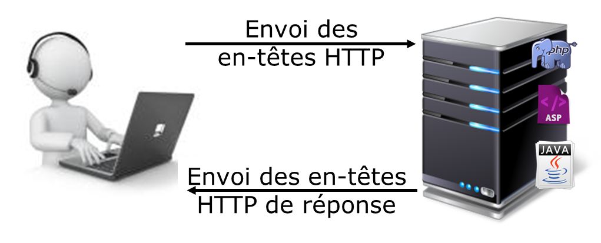
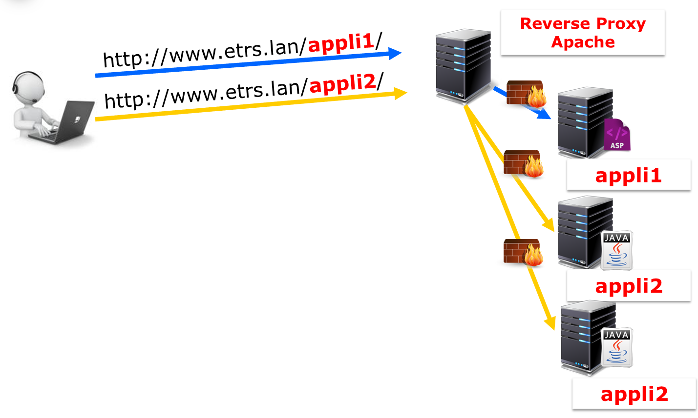
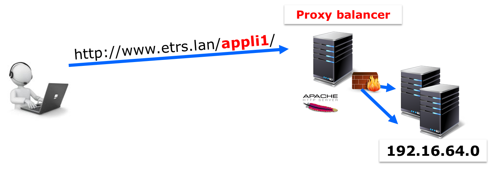

////
Les supports de Formatux sont publiés sous licence Creative Commons-BY-SA et sous licence Art Libre.
Vous êtes ainsi libre de copier, de diffuser et de transformer librement les œuvres dans le respect des droits de l’auteur.

    BY : Paternité. Vous devez citer le nom de l’auteur original.
    SA : Partage des Conditions Initiales à l’Identique.

Licence Creative Commons-BY-SA : https://creativecommons.org/licenses/by-sa/3.0/fr/
Licence Art Libre : http://artlibre.org/

Auteurs : Patrick Finet, Xavier Sauvignon, Antoine Le Morvan
////
= Apache - haute disponibilité

Objectifs de ce cours :

* paramétrer Apache en serveur frontal
* répartir la charge entre plusieurs serveurs applicatifs
* paramétrer Apache pour la tolérance de panne

== Introduction

Apache est un serveur **modulaire** web (protocole HTTP).

Il peut :

* Gérer un cache de données ;
* Faire office de serveur mandataire ;
* Compresser les données envoyées aux clients ;
* et plein d'autres choses encore...

== Serveur Applicatif

Un serveur applicatif héberge des applications dynamiques développées dans un langage de programmation web : Php / Asp / Java / Python ...

== Reverse proxy

Un serveur reverse proxy (ou serveur mandataire) est mandaté par des clients pour interroger les serveurs applicatifs.

Aux yeux du client, un seul serveur est en ligne pour lui répondre. La complexité
du SI lui est masqué.

Les serveurs applicatifs sont isolés derrière un (ou plusieurs) pare-feu. Leurs
ressources sont dédiées aux processus métiers (SQL, Web-services, etc.).

Le reverse proxy se charge de la compression, de la mise en cache, du chiffrement,
et de la répartition de charge et/ou tolérance de panne.

=== Le module mod_proxy

Le module *indexterm2:[mod_proxy]* est une extension d'apache pour faire office de serveur mandataire / Passerelle HTTP.

* La directive **ProxyPreserveHost On** utilise l’en-tête de requête entrante Host pour la requête du mandataire

* La directive **ProxyPass chemin url** référence des serveurs distants depuis l’espace
d’URLs du serveur local

* La directive **ProxyPassReverse chemin url** ajuste l’URL dans les réponses HTTP envoyées par le mandataire en inverse

Les différentes fonctionnalités de mandataire d’Apache sont réparties entre plusieurs modules complémentaires :

* mod_proxy_http,
* mod_proxy_ftp,
* mod_proxy_ajp,
* mod_proxy_balancer
* et mod_proxy_connect.

Apache peut être configuré comme mandataire directe (proxy) ou comme mandataire inverse (reverse proxy ou mode passerelle).

Pour la configuration d’un mandataire direct, reportez vous à la documentation du serveur SQUID.

Un mandataire inverse apparaît au client comme un serveur web standard. Aucune configuration du client n’est nécessaire. Le client adresse ses demandes de contenus ordinaires dans l’espace de nommage du mandataire inverse. Ce dernier décide alors où envoyer ces requêtes et renvoie le contenu au client comme s’il l’hébergeait lui-même.

L’accès des utilisateurs à un serveur situé derrière un pare-feu est une utilisation
typique du mandataire inverse.

.Configuration exemple d'un VirtualHost avec reverse-proxy 
[source,apache]
----
<VirtualHost 127.0.0.1:8080>
  ProxyPreserveHost On
  ProxyVia On
  <Proxy *>
    Order deny,allow
    Allow from all
  </Proxy>

  ProxyPass /pagebleue http://127.0.0.1:8080/pagebleue
  ProxyPassReverse /pagebleue http://127.0.0.1:8080/pagebleue
</VirtualHost>
----

* La directive **ProxyPreserveHost on**, lorsqu’elle est activé, va transmettre l’en-tête Host: de la requête entrante vers le serveur mandaté au lieu du nom d’hôte spécifié par la directive ProxyPass.

* La directive **ProxyVia On** permet de contrôler l’utilisation de l’en-tête http **Via:**. Définie à On, chaque requête ou réponse se verra ajouter une ligne d’en-tête Via: pour le serveur courant.

Des solutions spécialisées, comme *HaProxy* ou des équipements physiques comme les **Citrix NetScaler**, existent sur le marché, et sont plus puissantes qu'Apache. Au moment de choisir la solution de mandataire inverse, il faudra prendre en compte les éléments du tableau suivant :

[width="100%",options="header"]
|====================
|  | Points positifs |  Points négatifs
| HaProxy | Plus rapide |  Spécifique au reverse proxy (pas de cache, nécessite Varnish ou Memcached)
|  | Développement actif |  La syntaxe est différente des autres logiciels utilisés (NginX, Varnish, etc.)
| Apache  | Grand nombre de fonctionnalités, il peut tout faire |  Performances moindres
|   | Solution unique pour tout le SI |  
|   | Facilité de maintenance |  
|====================

== Simuler la charge

La commande *ab* (Apache Benchmark) permet d'envoyer des requêtes http à un client

.Syntaxe de la commande ab
[source,bash]
----
ab –n X –c Y url
----

Exemple :

.Exemple d'utilisation de la commande ab
[source,bash]
----
ab –n 5000 –c 2 http://127.0.0.1:8080/page1
----

.Options de la commande ab
[width="100%",options="header"]
|====================
| Options |  Commentaires
| -n |  Nombre de requêtes à envoyer
| -c |  Nombre de requêtes à envoyer par paquets
|====================

== Répartir la charge

Pourquoi répartir la charge ?

* Améliorer les performances
* Accueillir plus de clients
* Gérer la maintenance
* Faire de la tolérance de panne

[TIP]
====
Plusieurs petits serveurs seront plus puissants qu'un gros pour un coût moindre.
====

Pour répartir la charge, Apache utilise un proxy-balancer.

=== Le module mod_proxy_balancer

Le module **indexterm2:[mod_proxy_balancer]** est une extension pour la répartition de charge.

* La directive **BalancerMember url [clé=valeur]** ajoute un membre à un groupe de répartition de charge

* La directive **loadfactor=X** est un facteur de charge entre 1 et 100

* La directive **ProxySet url [clé=valeur]** défini les différents paramètres relatifs à la répartition de charge

* La directive **lbmethod=byrequests|bytraffic|bybusyness** spécifie la méthode de répartition de charge (par défaut à byrequests). Les 3 méthodes de répartition de charge sont :

** byrequests : réparti la charge entre les membres du cluster en fonction du nombre de
requêtes traitées

** bytraffic : réparti la charge entre les membres du cluster en fonction du trafic traitées
** bybusyness : réparti la charge entre les membres du cluster en fonction de la charge
actuelle

* La directive **stickysession=JSESSIONID|PHPSESSIONID** spécifie un nom de session persistant du répartiteur et dépend du serveur d'applications d'arrière plan.

[source,apache]
----
<Proxy balancer://mycluster>
  BalancerMember http://192.16.164.1:8080/pages loadfactor=50
  BalancerMember http://192.16.164.2:8080/pages loadfactor=50

  ProxySet lbmethod=bytraffic
</Proxy>

ProxyPass /monsite balancer://mycluster
ProxyPassReverse /monsite balancer://mycluster
----

=== Le module mod_status

Le module **mod_status** permet de suivre l’état du load-balancer.

* La directive **ProxyStatus On** affiche l’état du répartiteur de charge du mandataire

* La directive **SetHandler balancer-manager** force le traitement par le gestionnaire balancer-manager

[source,apache]
----
ProxyStatus On

<Location /balancer-manager>
  SetHandler balancer-manager
  Allow from all
</Location>
----

[TIP]
====
Vous pouvez maintenant visiter la page /balancer-manager
====

== Tolérance aux pannes

Apache peut réagir en cas de panne du serveur métier et exclure du cluster le service qui ne répond plus.

[source,apache]
----
<Proxy balancer://mycluster>
  BalancerMember http://127.0.0.1:8080/pagebleue loadfactor=50 retry=30
  BalancerMember http://127.0.0.1:8080/pageverte loadfactor=50 retry=30

  ProxySet lbmethod=byrequests failonstatus=404

</Proxy>
----
