////
Les supports de Formatux sont publiés sous licence Creative Commons-BY-SA et sous licence Art Libre.
Vous êtes ainsi libre de copier, de diffuser et de transformer librement les œuvres dans le respect des droits de l’auteur.

    BY : Paternité. Vous devez citer le nom de l’auteur original.
    SA : Partage des Conditions Initiales à l’Identique.

Licence Creative Commons-BY-SA : https://creativecommons.org/licenses/by-sa/3.0/fr/
Licence Art Libre : http://artlibre.org/

Auteurs : Patrick Finet, Xavier Sauvignon, Antoine Le Morvan
////

= Serveur de messagerie indexterm2:[Postfix]

== Généralités

Le courrier électronique est apparu sur le réseau **ARPANET** dans les années 1970, ce qui fait du protocole **indexterm2:[SMTP]** un des plus anciens protocoles de **TCP/IP**.

Avec Internet, les systèmes de messagerie ont pris de l'importance et en 1980, **indexterm2:[Sendmail]** a été développé. Sendmail est devenu le premier serveur de messagerie important et utilisait déjà le protocole SMTP.

**Postfix**, dont le développement a été aidé par IBM, est apparu dès **1998**, afin de résoudre les problèmes de sécurité de Sendmail, tout en offrant une **administration beaucoup plus souple et modulaire**.

Le **indexterm2:[MTA]** (**Mail Transfer Agent**) par défaut de la distribution RedHat (Sendmail) est remplacé par Postfix sur la RedHat 6 (Novembre 2010).

.Historique  des serveurs de messagerie sous Linux
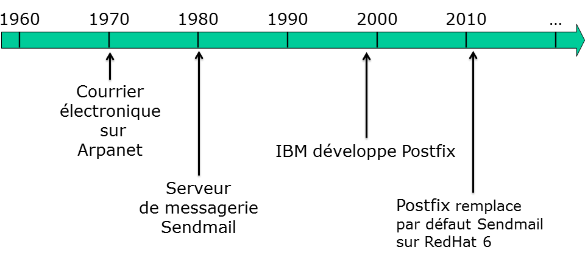

Les systèmes de messagerie électronique reposent sur plusieurs standards et protocoles, définissant la façon dont sont composés les messages et leur acheminement, du rédacteur au destinataire.

L'**envoi de message** est assuré par le protocole **Simple Mail Transfer Protocol** (SMTP). SMTP est un protocole de communication de type texte. 

[NOTE]
====
Le fait que le protocole SMTP soit de type texte est intéressant. En effet, cela permet de tester son bon fonctionnement avec la commande **telnet**.
====

Les ports utilisés sont :

* **25** (sans authentification) ;
* **587** (avec authentification) ;
* **465** (SSL).

**Local Mail Transfer Protocol** (**indexterm2:[LMTP]**) est une variante de **indexterm2:[ESMTP]**, l'extension de SMTP. LMTP est défini dans la RFC 2033. LMTP a été conçu comme alternative aux échanges SMTP normaux dans les situations où la partie réceptrice ne possède pas de file d'attente des messages reçus. C'est le cas par exemple d'un agent de transfert de courrier agissant en tant qu'agent de distribution du courrier.

La **réception de message** peut se faire à l'aide de deux protocoles :

* **Internet Message Access Protocol** (**indexterm2:[IMAP]**) ;
* **Post Office Protocol** (**indexterm2:[POP]**).

**IMAP** est un protocole permettant de récupérer les courriers électroniques déposés sur des serveurs de messagerie. Les messages sont conservés sur le serveur, ses fonctionnalités avancées en font le protocole de préférence (accès **multipostes**, accès via **webmail**, etc.).

IMAP utilise le port **143** en clair ou via **STARTTLS** et le port **993** via **IMAPS** (déprécié) en SSL.

**POP** est également un protocole permettant de récupérer les courriers électroniques de l'utilisateur. En règle générale, POP se connecte sur le serveur, récupère le courrier, efface le courrier sur le serveur et se déconnecte. Ce fonctionnement par défaut ne permet pas l'accès aux mails depuis plusieurs postes, ni l'itinérance.

POP utilise le port **110** en clair ou via **STARTTLS** et le port **995** (déprécié) en SSL. 

Le langage indexterm2:[Sieve] a été conçu pour permettre de filtrer des messages directement sur les serveurs. 

.Les protocoles de messagerie mis en oeuvre
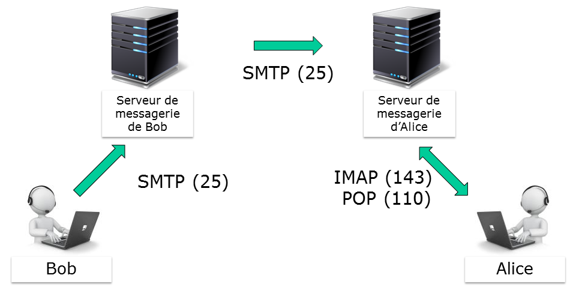

=== Les agents de messagerie

==== Mail User Agent

Un **Mail User Agent** (**indexterm2:[MUA]**), ou client de messagerie, est un logiciel servant à **lire** et à **envoyer** des courriers électroniques. Ce sont en général des clients lourds, mais il existe aussi des applications Web : les **webmails**. Les webmails tentent d'offrir les mêmes fonctionnalités qu'un client lourd.

Ces logiciels prennent en charge le protocole **SMTP** pour l'envoi de messages et les protocoles **POP** et **IMAP** pour leur réception.

Parmi les MUA les plus connus, citons : Thunderbird (Mozilla), Evolution (Novell), Outlook et Windows Mail (Microsoft), Kmail, Lotus Notes, Apple Mail, Opéra Mail, etc. 

==== Mail Tranfer Agent

Lorsqu'un message est envoyé depuis un client de messagerie **MUA**, il est transféré au serveur de courrier, le **Mail Transfer Agent** (**MTA**). Un MTA implémente à la fois le **client** (tranfert de mail) et le **serveur** (réception) du protocole SMTP.

Les termes Mail Server, Mail Exchanger, Mail Relay et MX Hosts peuvent aussi faire référence à un serveur MTA.

Le système de nom de domaine **DNS** associe à un domaine un ou plusieurs serveur de messagerie (Mail Exchanger - indexterm2:[MX]) par ordre de priorité (la plus haute priorité étant la plus faible valeur). Un MTA peut donc transférer un mail pour lequel il n'est pas destinataire soit à un serveur relais (si configuré), soit au serveur désigné par l'enregistrement MX du système DNS (le saut suivant - Next Hop).

Les MTA font donc en sorte qu'un message soit délivré d'un système à un autre. Si le MTA ne peut ni accepter, ni relayer un message, il le renvoie à son expéditeur.

Le message arrive au MTA responsable du domaine qui le stocke dans la boîte aux lettres de l'utilisateur.

Parmi les MTA les plus connus, citons : Postfix, Sendmail, Exim, Exchange, Qmail, Lotus Notes. 

.Le transfert de message entre MTA
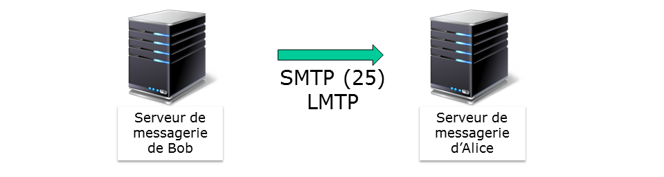

==== Mail Delivery Agent

Le **Mail Delivery Agent** (**indexterm2:[MDA]**), agent de **distribution du courriel**, est le logiciel qui intervient dans la dernière étape du processus de distribution d'un courrier électronique. Il est responsable de la **disposition du message dans la boîte aux lettres** de l'utilisateur. Il peut également être appelé **Local Delivery Agent** (**indexterm2:[LDA]**).

C'est le MDA qui est chargé de gérer les problèmes comme un disque plein, une corruption de la boîte aux lettres, etc. et de signaler au MTA toute erreur de distribution.

Le MTA communique avec le MDA par l'intermédiaire des canaux d'entrées-sorties standards ou par un protocole spécialisé comme LMTP ou indexterm2:[UUCP].

Parmi les MDA les plus connus, citons : Dovecot, Cyrus, Procmail, Local. 

.Le rôle de MDA
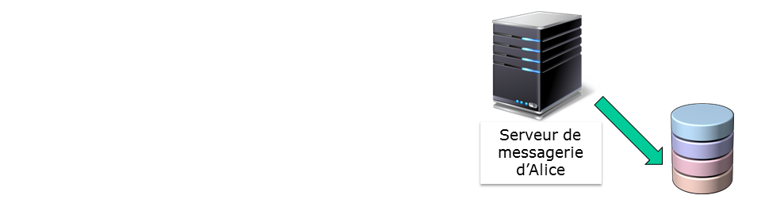

==== Mail Access Agent

Le **Mail Access Agent** (**indexterm2:[MAA]**), permet à l'utilisateur final, après **authentification**, de récupérer le message. Le MUA de l'utilisateur communique avec le MAA par le protocole IMAP ou POP.

Parmi les MAA les plus connus, citons : Dovecot, Cyrus, Courier, Exchange.

.Le rôle de MAA
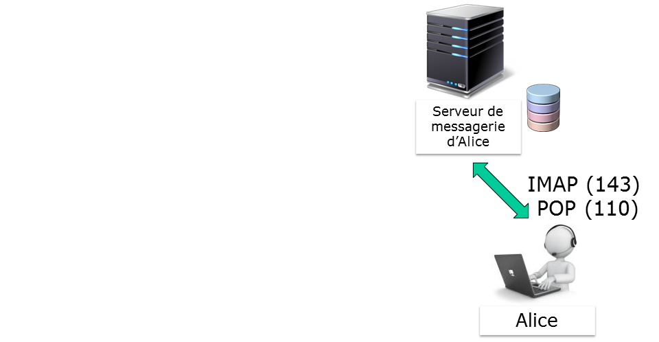

.Les agents de transmission de message
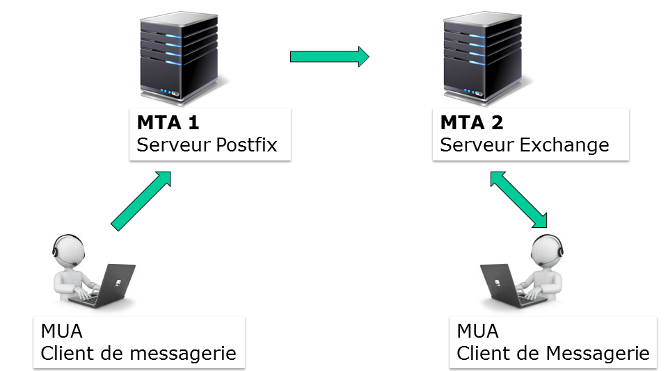

=== Les relais SMTP

Le terme de “**relais de messagerie**” est couramment utilisé, dans le cas d'un MTA qui n'assurerait pas lui même la livraison du message au MTA final, mais qui se contenterait de servir d'intermédiaire entre le MUA du client et le MTA qui prend réellement l'acheminement du message en charge.

Cette fonctionnalité de relais est courante. Elle est par exemple présente dans nos box internet, qui acheminent l'ensemble des messages émis par un domicile vers un des serveurs MTA centraux. Les messages peuvent ensuite être filtrés (lutte anti-spam ou surveillance ?). Les fournisseurs d'accès à Internet évitent, en bloquant le port 25 en sortie des box, que des serveurs SMTP soient directement sollicités. 

.Système de messagerie avec relais
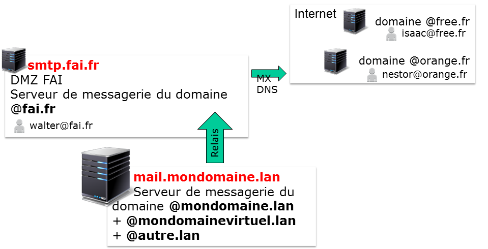

=== Les formats de stockage

Le format **indexterm2:[mbox]** est un format ouvert de stockage de courrier. Il repose sur le principe d'attribuer un fichier à chaque dossier (au lieu d'un fichier par message ou d'un répertoire par dossier).

Le format mbox permet un **affichage rapide d'une liste de mail**, puisqu'il ne nécessite l'ouverture que d'un seul fichier. La suppression ou l'ajout de mail est plus long et plus complexe à réaliser d'un point de vue système. L'accès concurrent à la même boîte aux lettres n'est pas possible car un verrou est positionné sur le fichier lors d'une action d'ajout ou de suppression. 

Le format mbox est le format par défaut de postfix 

Le format **indexterm2:[Maildir]** est une **structure de répertoires particulière**. Les courriels sont sauvegardés dans un fichier séparé, au sein d'une arborescence spécifique, ce qui lève le problème de verrou du format mbox.

De par son architecture, le format **Maildir est performant et fiable**. Il est plus adapté au protocole IMAP. À noter toutefois que l'affichage d'une liste de mails sera moins rapide qu'avec le format mbox.

Chaque répertoire Maildir contient au moins 3 sous-répertoires : **tmp**, **new**, **cur**. Les mails sont placés dans le répertoire tmp, puis déplacés par le MTA 
dans le répertoire new, pour enfin être déplacés après accès par un MUA dans le répertoire cur. 

=== Synoptique

Un **MTA** pourra assurer les fonctionnalités suivantes :

* **Serveur de messagerie local** pour les comptes systèmes locaux comme root, bob, alice, etc.
* **Serveur d'un ou de plusieurs domaines de messagerie**, pour des comptes root@mondomain.lan, bob@mondomaine.lan, etc.
* **Serveur relais pour les domaines extérieurs** à son périmètre de gestion.

Un MTA peut également posséder des **routes spéciales**, contenues dans une **table de routage**, pour délivrer des messages à des serveurs de messagerie sans prendre en compte le chemin standard (par le relais ou par le serveur MX désigné lors d'une requête DNS). 

.Synoptique global du système de messagerie
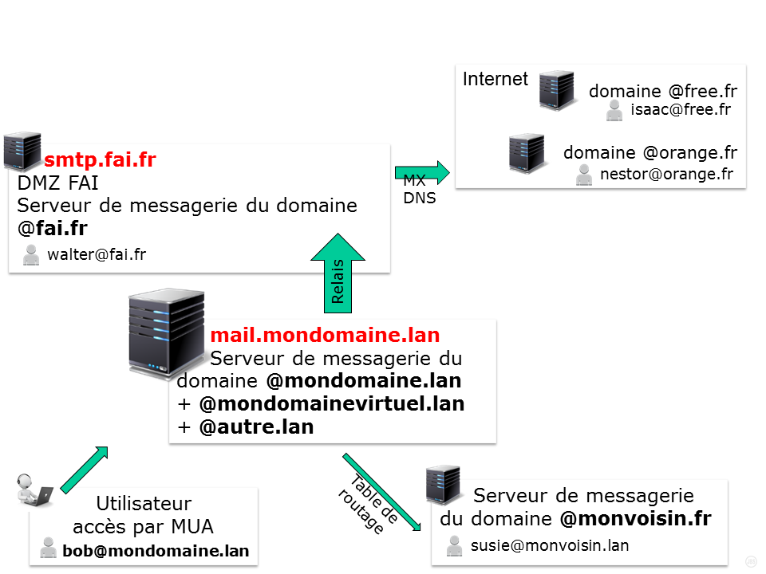

== Installation du service

Postfix devrait normalement être installé par défaut sur une RedHat/CentOS 6 ou 7.

[source,bash]
----
[root]# yum install postfix
----

Postfix nécessite bien évidemment que le service network soit correctement configuré. 

L'installation de postfix ajoute un utilisateur postfix, membre du groupe postfix. 

[source,bash]
----
[root]# grep postfix /etc/passwd
postfix:x:89:89::/var/spool/postfix:/sbin/nologin

[root]# grep postfix /etc/group
postfix:x:89:x
----

Postfix étant un service réseau, il faut le paramétrer pour un démarrage à minima aux niveaux 3 et 5, puis le démarrer. 

L'installation d'un nouveau service sur les distributions RedHat/CentOS n'implique pas leur démarrage automatique. 

Après toute installation d'un service, il ne faut pas oublier de le démarrer avec la commande service, et d'automatiser le démarrage au reboot avec la commande chkconfig. 

Tout service dépendant du réseau devrait être démarré comme le service network (chkconfig --list network).

[source,bash]
----
[root]# chkconfig postfix on
[root]# service postfix start
----

== Arborescence et fichiers

.Arborescence et fichiers du serveur postfix
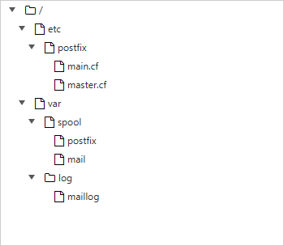

////
.Arborescence et fichiers du serveur postfix
[tree,file="./images/SVR-070-arborescence.png",height="+40",width="+100"]
--
#/
##etc
### postfix
#### main.cf
#### master.cf
## var
### spool
#### postfix
#### mail
### log
#### maillog
--
////
* Le fichier de configuration du serveur Postfix : /etc/postfix/main.cf ;
* Les files d'attente sont groupées dans le répertoire : /var/spool/postfix/ ;
* Les boîtes de messagerie mbox sont stockées dans /var/spool/mail/ ;
* Les logs sont dans le fichier : /var/log/maillog.

Le fichier /etc/postfix/main.cf contient les paramètres de configuration de Postfix. Les paramètres qui n'y sont pas explicitement renseignés sont initialisés avec leur valeur par défaut. Seule la dernière occurence du paramètre compte lorsque ce paramètre est défini plusieurs fois.

En cas de besoin, un fichier commenté de main.cf existe sous /usr/share/postfix/main.cf.

Les directives sont modifiables avec un éditeur de texte, mais la commande postconf permet l'édition en limitant le risque d'erreur. 

Dans le fichier /etc/postfix/main.cf :

* Chaque instruction doit être en début de ligne (pas d'espace avant).
* Les espaces autour du signe “=” sont ignorés, comme ceux situés à la fin de la ligne logique.
* Une ligne démarrant avec un espace continue la ligne logique précédente. 

== Mise en oeuvre

La commande **telnet** est particulièrement adaptée pour tester des protocoles en mode texte tel SMTP.

Sa syntaxe est la suivante :

[source,bash]
----
[root]# telnet localhost 25
----

Pour communiquer avec le serveur, il faut respecter les étapes attendues par le service.

Déroulé d'une session telnet sur le port 25 :

1. HELO
2. MAIL FROM:
3. RCPT TO:
4. DATA

Pour terminer la rédaction du mail, il conviendra de saisir un . sur une ligne seule. 

=== Déroulé d'une session SMTP

Lancer dans un terminal la commande telnet localhost 25. Voici le déroulé de la session :

[source,bash]
----
[root]# telnet localhost 25
Trying ::1...
Connected to localhost.
Escape character is '^]'.
220 mail.mondomaine.lan ESMTP Postfix
HELO mail.mondomaine.lan
250 mail.mondomaine.lan
MAIL FROM: bob
250 2.1.0 Ok
RCPT TO: alice
250 2.1.5 Ok
DATA
354 End data with<CR><LF>.<CR><LF>
From: test
To: monalice
Subject: Test de message

Ceci est un test.
Merci de votre coopération

.
250 2.0.0 Ok: queued as 642A59F6E8
QUIT
221 2.0.0 Bye
Connection closed by foreign host.
----

Les champs From: et To: du contenu du mail (après DATA) ne sont pas vérifiés par le serveur SMTP. Ils peuvent différer des valeurs fournies au service SMTP, un peu comme l'adresse du destinataire d'un courrier postal peut différer de l'adresse affichée dans le courrier.

Le message se termine lorsque le serveur reçoit une ligne ne contenant qu'un point.

==== Suivi du mail

Le traitement du mail par les différents agent peut être suivi dans le fichier **/var/log/maillog**. Dans ce cas, l'utilisation de la commande __tail -f nomdufichier__ est particulièrement bien adaptée. L'utilisation de la commande **indexterm2:[ccze]**, qui permet la coloration syntaxique des fichiers de log, peut également être utilisée via un **grep** : __tail -f /var/log/maillog | grep ccze__.

Voici un extrait du fichier de log, généré par la session telnet précédente :

[source,bash]
----
[root]# tail -f /var/log/maillog  | grep ccze
postfix/smtpd[19747]: connect from localhost[::1]
postfix/smtpd[19747]: 642A59F6E8: client=localhost[::1]
postfix/cleanup[19828]: 642A59F6E8: message-id=<...>
postfix/qmgr[19742]: 642A59F6E8: from=<bob@mail.mondomaine.lan>, size=462, nrcpt=1 (queue active)
postfix/local[20100]: 642A59F6E8: to=<alice@mail.mondomaine.lan>, orig_to=<alice>, 
   relay=local, ..., status=sent (delivered to mailbox)
postfix/qmgr[19742]: 642A59F6E8: removed
postfix/smtpd[19747]: disconnect from localhost[::1]
----

L'agent **indexterm2:[smtpd]** a pris en charge la connexion du client par le réseau en passant par **telnet** sur le port **25**. Si la connexion avait été faîte via un outil local, c'est l'agent **indexterm2:[pickup]** qui aurait alors pris en charge le message, comme nous le verrons à la section suivante.

L'agent **indexterm2:[cleanup]** a ensuite pris en charge le message. Le destinataire d'origine, bob, n'étant pas **pleinement qualifié** et non conforme à la norme **RFC 822**, **cleanup** l'a fourni au démon **indexterm2:[trivial-rewrite]** (évènement qui est non journalisé) pour permettre la réécriture de l'adresse de messagerie d'origine.

L'agent **cleanup** a ensuite déposé le message dans la file d'attente **incoming**, en attendant que l'agent **indexterm2:[qmgr]** le déplace dans la file **active** (queue active).

Le message ayant une portée locale (**orig_to=<alice>**), l'agent **trivial-rewrite** est de nouveau appelé pour rendre conforme cette adresse (**to=mailto:alice@mail.mondomaine.lan[alice@mail.mondomaine.lan]**) par l'agent **qmgr**, qui le délivre à l'agent **indexterm2:[local]** pour stockage dans la boîte aux lettres d'**Alice**.

L'agent qmgr supprime alors le message de la file active. 

=== La commande indexterm2:[mailx]

La commande mailx est une commande de traitement du courrier (un MUA) dont nous n'étudierons que la partie envoi du courrier.

[source,bash]
----
mailx [-iInv] [-s sujet] [-a en-tete] [-c adresses cc] [-b adresses bcc] adresse[s]
----

Le tableau suivant récapitule les principales options :

.Options principales de la commande mailx
[cols="1,4",options="header"]
|====
| Options	 | Information 
| -v	 |  Affiche les détails de la livraison sur le terminal 
| -s	 |  Spécifie le sujet
 en ligne de commande (seul le premier argument après le flag -s est 
utilisé en tant que sujet ; pensez à mettre des guillemets autour des 
sujets contenant des espaces). 
| -c liste  |  Liste les destinataires en copie carbone. 'liste' doit être une liste de noms séparés par des virgules. 
| -b	 |  Liste les destinataires en copie cachée (Blind Carbon Copy). 
|====

Quelques options supplémentaires :

.Options supplémentaires de la commande mailx
[cols="1,4",options="header"]
|====
| Options	 | Information 
| -i	 |  Ignore les 
signaux d'interruption du terminal. Cela est particulièrement utile lors
 de l'utilisation de mail sur des lignes téléphoniques à bruit. 
| -l	 |  Force mailx à se 
lancer en mode interactif même losque l'entrée n'est pas un terminal. En
 particulier, le caractère de commande spécial ~, utilisé lors de 
l'envoi d'un courrier, est seulement disponible interactivement. 
|  -N  |  Désactive l'affichage 
initial des en-têtes du message lors de la lecture d'un courrier ou de 
l'édition d'un dossier de courriers. 
|  -a  |  Spécifie des champs 
d'en-tête additionnels dans la ligne de commande comme “X-Loop: 
foo@bar”, etc. Vous devez utiliser des guillemets si la chaîne contient 
des espaces. Cet argument peut être spécifié plus d'une fois, les 
en-têtes étant dans ce cas concaténés. 
|  -e  |  N'envoie pas de courrier vide. Si le corps est vide, le message est sauté. 
|  -f nom  |  Procède à la lecture 
du contenu de votre boîte aux lettres (ou le fichier spécifié nom) ; 
lorsque vous quittez, mail réécrit les messages non supprimés dans ce 
fichier. 
|  -u utilisateur  |  Est équivalent à “mail -f /var/mail/utilisateur” sauf qu'il y a verrouillage. 
|====

Exemples :

[source,bash]
----
[stagiaire]$ less corps
    Bonjour
    Au revoir
[stagiaire]$ mailx -s "coucou" "alice,bob" < corps
----

[source,bash]
----
[stagiaire]$ mailx -s "coucou" alice@mail.formatux.lan
    ->Bonjour
    ->Au revoir
    ->. (ou ctrl+d)
----

==== Suivi du mail

Voici un extrait du fichier de log, généré par la session mailx précédente :

[source,bash]
----
[root]# tail -f /var/log/maillog 
postfix/pickup[19741]: 5707A9F8A: uid=1000 from=<stagiaire>
postfix/cleanup[22647]: 5707A9F8A: message-id=<...>
postfix/qmgr[19742]: 5707A9F8A: from=<stagiaire@mail.mondomaine.lan>, size=549, nrcpt=2 (queue active)
postfix/local[22649]: 5707A9F8A: to=<alice@mail.mondomaine.lan>, orig_to=<alice>, 
   relay=local, ..., status=sent (delivered to mailbox)
postfix/local[22650]: 5707A9F8A: to=<bob@mail.mondomaine.lan>, orig_to=<bob>, 
   relay=local, ..., status=sent (delivered to mailbox)
postfix/qmgr[19742]: 5707A9F8A: removed
----

Les messages générés **localement** (mailx, php, scripts, etc.) sont placés par **sendmail** dans la file d'attente **indexterm2:[maildrop]**.

Le message ayant été émis par la commande local mailx, c’est l’agent **indexterm2:[pickup]** qui a pris en charge le message placé dans maildrop.

L’agent **cleanup** a ensuite pris en charge le message, notamment en le fournissant au démon **trivial-rewrite** (non journalisé par défaut) pour permettre la réécriture des adresses de messagerie locale (FROM: root et TO: alice et TO: bob) en adresses conformes à la norme RFC 822 (FROM: root@mail.formatux.lan, TO: alice@mail.formatux.lan et TO: bob@mail.formatux.lan).

**Cleanup** a ensuite déposé le message dans la file d’attente **incoming**. De la file d’attente **incoming**, le message est passé dans la file active (**queue active**) par l’agent **qmgr**.

Le message ayant une portée local, il est transmis à l’agent **local** pour stockage dans la boîte aux lettres d’Alice puis de nouveau transmis à l’agent **local** pour stockage dans la boîte aux lettres de Bob.

**qmgr** supprime alors le message de la file **active**.

==== Utilisation interactive de mailx

[source,bash]
----
[alice]$ mailx
Heirloom Mail version 12.4 7/29/08. Type ? for help.
"/var/spool/mail/alice": 2 messages 2 new
>N 1 test@mail.formatux.lan ...    ... "Test de mail"
 N 2 stagiaire                     "coucou"
& _
----

La première ligne identifie la version de mail utilisée.

La deuxième désigne la boite aux lettres.

Le N (new) placé au début de la ligne indique qu’il s’agit d’un nouveau message, tandis que la lettre U (unread) indique qu’elle n’a pas encore été lue lors de la session précédente du programme mailx.

Pour lire le mail, il faut saisir après l’esperluette (et commercial) le numéro du mail à lire.

Pour quitter, simplement saisir la lettre q.

Lorsque la touche q est saisie, mailx sauvegarde le contenu de la boîte aux lettres dans le fichier mbox du répertoire personnel de l’utilisateur, ainsi que les éventuelles modifications ou suppressions effectuées.

Le fichier /home/alice/mbox doit maintenant contenir les messages qui ont été lus.

.Gestion des mails avec mailx
[cols="1,4",options="header"]
|====
| Options	 | Information 
| num	 |  Affiche le mail n° num 
| d num	 |  Supprime le mail num 
| h |  Affiche la liste des mails 
| q |  Quitte mailx 
|====

=== La commande indexterm2:[swaks]

La commande swaks (SWiss Army Knife for Smtp) est un outil de test orienté transaction pour SMTP.

.Syntaxe de la commande swaks
[source,bash]
----
swaks --to user@formatux.lan --server smtp.formatux.lan
----

== Configuration du serveur

La commande **indexterm2:[postconf]** permet la configuration de Postfix.

.Syntaxe de la commande postconf
[source,bash]
----
postconf [-d] [-e] [-n] ['directive']
----

Exemple :

[source,bash]
----
postconf -e 'myhostname = mail.formatux.fr'
----

.Options principales de la commande postconf
[cols="1,4",options="header"]
|====
| Options	 | Information 
| -d  |  Affiche les valeurs par défaut des paramètres 
| -e  |  Modifie le fichier main.cf avec le paramètre précisé. 
| -n  |  Affiche seulement les valeurs qui ne sont pas celles par défaut. 
|====

Utilisé sans option ni argument, la commande postconf affiche la configuration courante de Postfix.

La commande postfix check vérifie la configuration du fichier **main.cf** :

----
[root]# postfix check
----

Lorsque la configuration est correcte, la commande ne retourne aucune information.

=== Les alias

Comment rediriger une adresse vers une autre ? Comment créer une liste de diffusion ? Comment créer une adresse en prenom.nom ? En utilisant les **alias** !

Les alias sont contenus dans le fichier /etc/aliases :

./etc/aliases
[source,bash]
----
...
postmaster:    root
...
# Person who shold get root's mail
root:          bob
# Alias locaux
bob.leponge:   bob
# Liste de diffusion
admins:        bob,alice
----

Les modifications sont prises en compte avec la commande **newaliases** :

[source,bash]
----
[root]# newaliases
----

==== Suivi des mails

Suivi d'un mail généré avec mailx à root :

[source,bash]
----
postfix/local[25354]: 12C969F84F: to=<bob@mail.formatux.lan>, orig_to=<root>, relay=local, ..., status=sent (delivered to mailbox)
----

Suivi d'un mail généré avec mailx à admins :

[source,bash]
----
postfix/local[25639]: 8DD1A9F84F: to=<bob@mail.formatux.lan>, orig_to=<admins>, relay=local, ..., status=sent (delivered to mailbox)
postfix/local[25639]: 8DD1A9F84F: to=<alice@mail.formatux.lan>, orig_to=<admins>, relay=local, ..., status=sent (delivered to mailbox)
----

Suivi d'un mail généré avec mailx à bob.leponge :

[source,bash]
----
postfix/local[25920]: 0CD8B9F84F: to=<bob@mail.formatux.lan>, orig_to=<bob.leponge>, relay=local, ..., status=sent (delivered to mailbox)
----

=== Configurer un serveur relais

Mon serveur est protégé par une DMZ ! Mon fournisseur d'accès bloque le protocole SMTP ! Comment faire ?

Lorsque le serveur n'est pas directement connecté à Internet, il faut utiliser un serveur relais !

Les messages à destination d'utilisateurs non locaux sont relayés par le serveur MTA de la DMZ ou le MTA du fournisseur d'accès.

==== Configuration du relais

[source,bash]
----
[root]# postconf -e 'relayhost = [svrmail.formatux.lan]'
[root]# service postfix reload
[root]# mailx bob.leponge@free.fr
----

Suivi du mail :

./var/log/maillog
[source,bash]
----
postifx/smtp[26595]: 0D7809F84F: to=<bob.leponge@free.fr>,relay=svrmail.formatux.lan[XXX.XXX.XXX.XXX]:25, …, status=sent (250 2.0.0 Ok: queued as 2997B686008)
----

Lorsqu'un serveur n'est pas **directement** connecté à l'Internet, les mails qu'il émet devront être envoyés à un serveur intermédiaire : un **MTA relais**.

Il faut alors renseigner la directive **indexterm2:[relayhost]**.

[IMPORTANT]
====
Pour ne pas utiliser de résolution DNS sur le champ MX du domaine, il convient de mettre le FQDN ou l'adresse IP du serveur relais entre crochets.
====

Dans l'exemple au dessus, le serveur 'svrmail.formatux.lan' étant le serveur de messagerie pointé par l'enregistrement MX du DNS pour le domaine 'formatux.lan', les deux configurations suivantes sont identiques, mais la deuxième affranchit le serveur d'une requête DNS :

[source,bash]
----
[root]# postconf -e 'relayhost = formatux.lan'
----

est identique à :

[source,bash]
----
[root]# postconf -e 'relayhost = [svrmail.formatux.lan]'
----

Le message est cette fois-ci transmis par l'agent **mgr** au démon **smtp**, chargé de transférer le message via le protocole **SMTP**.

=== Prendre en compte un domaine

Je veux transformer mon serveur de messagerie, je voudrais centraliser les messages pour tout le domaine formatux.lan !

Il faut configurer les directives mydomain et mydestination !

Avant de modifier la configuration du serveur, envoyer un mail à bob@formatux.lan :

[source,bash]
----
[root]# mailx bob@formatux.lan
----

Suivi du message :

[source,bash]
----
postifx/smtp[27446]: B522C9F84F: to=<bob@formatux.lan>,relay=svrmail.formatux.lan[172.16.160.7]:25, …, status=sent (250 2.0.0 Ok: queued as CB201686008)
----

Le serveur ne sait pas pour l'instant qu'il doit délivrer à l'agent local ce message.

==== Les directives mydomain et mydestination

La directive **mydomain** contient le nom de domain internet du système de messagerie. Par défaut, $mydomain vaut $myhostname oté de son premier composant.

Si $myhostname vaut serveur.formatux.lan alors $mydomain vaut formatux.lan.

La directive **mydestination** liste les domaines livrés par l'agent local.

Pour visualiser la valeur par défaut de la directive mydestination :

[source,bash]
----
[root]# postconf 'mydestination'
mydestination = $myhostname, localhost.$mydomain, localhost
----

Le serveur transmettra donc à l'agent local tous les mails correspondant à @serveur.formatux.lan, @localhost.formatux.lan et @localhost.

Pour ajouter le domaine formatux.lan à la liste des domaines gérés localement :

[source,bash]
----
[root]# postconf -e 'mydestination = $myhostname, localhost.$mydomain, localhost, $mydomain'
[root]# postconf -e 'mydomain = formatux.lan'
[root]# service postfix reload
----

Le même test que précédement peut être rejoué :

[source,bash]
----
mailx bob@formatux.lan
----

Suivi du mail :

./var/log/maillog
[source,bash]
----
postfix/local[28603]: AE6D99F84F: to=<bob@formatux.lan>, relay=local, …, status=sent delivered to mailbox)
----

Le message est cette fois-ci pris en compte par le serveur est délivré à une boîte aux lettres locale via le démon **local**.

=== La directive mynetworks

Par défaut, le serveur postfix refuse de prendre en compte des messages provenant du réseau (excepté depuis sa loopback localhost), ce qui aurait pour effet de devenir un serveur OpenRelay à la merci des spammers.

Maintenant que les clients du réseau local disposent d'une boîte mails, ils vont devoir envoyer leur messages au serveur. Ils doivent donc avoir accès à postfix via le réseau. 

Il faut configurer postfix pour qu'il accepte les connexions réseaux, tout en prenant soin de le limiter aux connexions du réseau local.

Dans un premier temps, il convient d'autoriser postfix à écouter sur toutes les interfaces réseaux :

[source,bash]
----
[root]# postconf -e 'inet_interfaces = all'
----

Dans un second temps, il faut vérifier que le firewall autorise les connexions (au moins sur le port 25).

La directive **mynetworks** précise les réseaux autorisés à envoyer des messages sur le serveur.

[source,bash]
----
mynetworks = 192.168.96.0/19
----

La directive **mynetworks_style** est ignorée si **mynetworks** est définie. Sinon elle précise le type d'hôtes autorisés à envoyer des messages au serveur (host, subnet ou class).

[source,bash]
----
# autoriser tous les hôtes de mon sous-réseau
mynetworks_style = subnet
----

[IMPORTANT]
====
Attention à ne pas devenir un serveur “open-relay”, et ainsi servir de serveur relais pour les spammeurs.
====

=== Le format de stockage

Par défaut, postfix stocke les mails au format mbox.

Pour passer du format mbox au format maildir :

[source,bash]
----
[root]# postconf –e 'home_mailbox = Maildir/'
[root]# service postfix reload
----

Le changement pourra être vérifié :

[source,bash]
----
[root]# mailx bob@formatux.lan
[root]# ls /home/bob/Maildir/new/
----

=== La table de routage

J'aimerais que les messages vers monvoisin.fr ne passe pas par le serveur relais. Il faudrait définir une route spécifique !

La table de routage définit un serveur relais pour un domaine donné en renseignant la directive **transport_maps** du fichier par défaut /etc/postfix/transport.

./etc/postfix/transport
[source,bash]
----
monvoisin.fr        smtp:[172.16.96.100]:25
----

Postfix doit prendre en compte cette nouvelle route :

[source,bash]
----
[root]# postmap /etc/postfix/transport
[root]# service postfix reload
----

Dans ce cas, le serveur de messagerie transmettra les messages directement au serveur indiqué, sans tenir compte d’une requête DNS ou du serveur relais par défaut.

Après avoir modifié la table des transports, il est nécessaire de lancer la commande **indexterm2:[postmap]**.

Cette commande permet de transformer le fichier en base de données type clef:valeur interprétable par postfix.

N’oubliez pas de relancer le service postfix.

== Protocoles POP/IMAP

Le serveur indexterm2:[Dovecot] est un serveur POP3/IMAP orienté vers la sécurité.

Installer le serveur dovecot :

[source,bash]
----
[root]# yum install dovecot
[root]# chkconfig dovecot on
----

La configuration de dovecot est répartie entre de nombreux fichiers de configuration.

* Activer le protocole IMAP.
* Le serveur dovecot écoutera sur toutes les interfaces réseaux.

./etc/dovecot/dovecot.conf
[source,bash]
----
protocols = imap
listen= *
----

*   Spécifier à dovecot que le serveur Postfix stocke les mails au format Maildir (maildir:) dans le répertoire Maildir du répertoire de connexion de l’utilisateur (~/).

./etc/dovecot/conf.d/10-mail.conf
[source,bash]
----
mail_location = maildir:~/Maildir
----

*   L’authentification plaintext permet de gérer l’authentification des clients par login et mot de passe qui transitent en clair sur le réseau. Cette option n’est pas sécurisée si elle n’est pas couplée avec un moyen de chiffrement du flux imap (IMAPs) ce qui explique sa désactivation par défaut.
 
./etc/dovecot/conf.d/10-auth.conf
[source,bash]
----
disable_plaintext_auth = no # signifie authentification plaintext enable
----

Redémarrer le service

[source,bash]
----
[root]# service dovecot restart
----

== Architecture de postfix

Postfix est un serveur modulaire basé sur des boîtes aux lettres et régi par le démon principal **master**.

Chaque démon assume une fonction, chaque fonction correspondant à une tâche distincte. Les démons sont gérés par le démon master, qui est le premier a être lancé.

Les messages sont stockés dans des files d'attente, où ils sont récupérés par les démons.

.Synoptique global de postfix
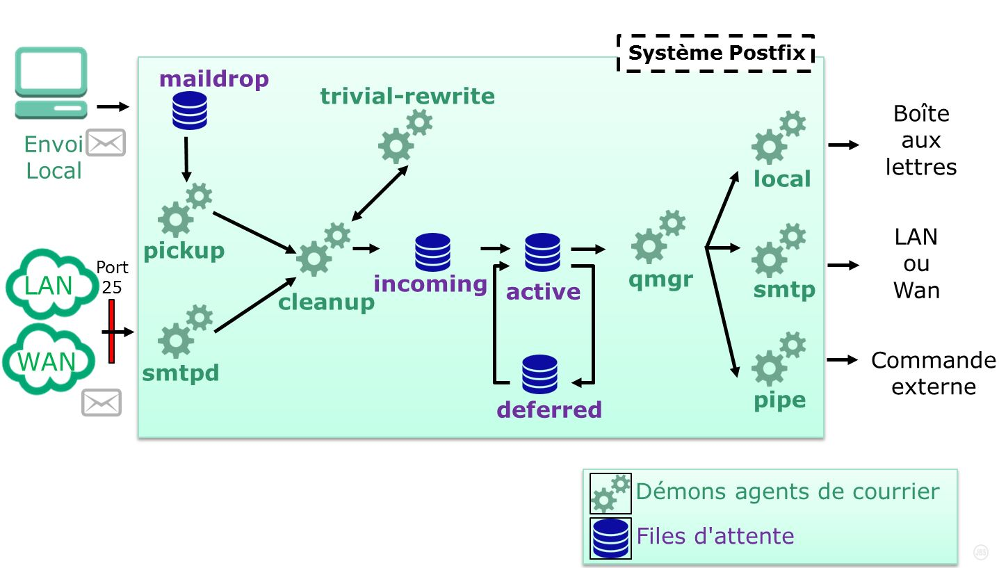

Postfix accepte des messages provenant de plusieurs sources :

* Source locale : envoyé par un utilisateur du serveur via un logiciel local (mailx, php, etc.) ;
* En provenance du réseau connecté au serveur ;
* Produit par Postfix lui-même ;
* Un message ressoumis pour être transféré à une autre adresse.

.Synoptique de postfix partie réception des messages
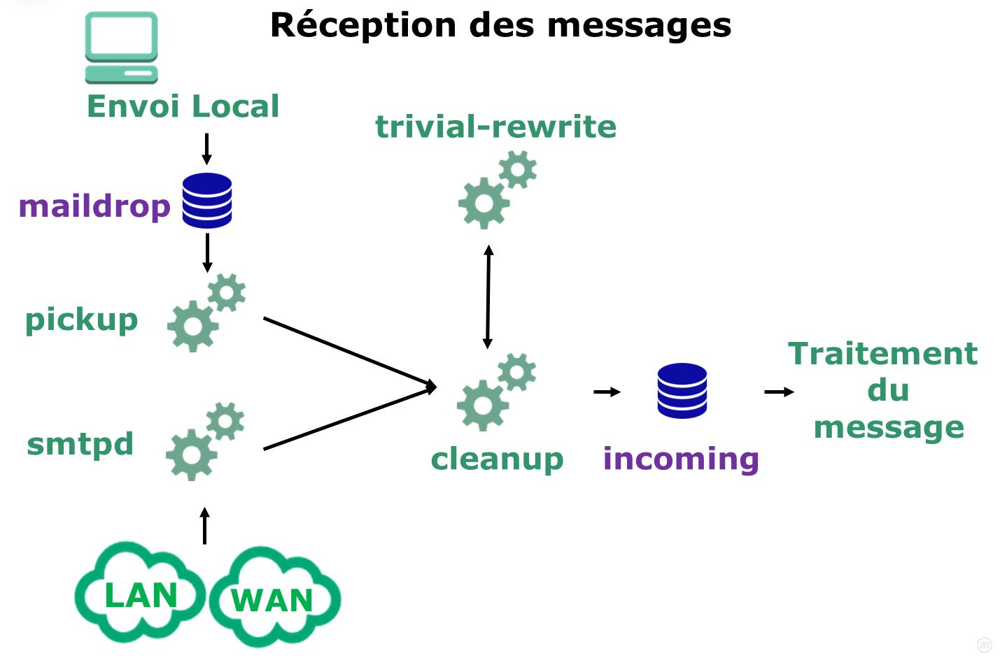

.Synoptique de postfix partie émission des messages
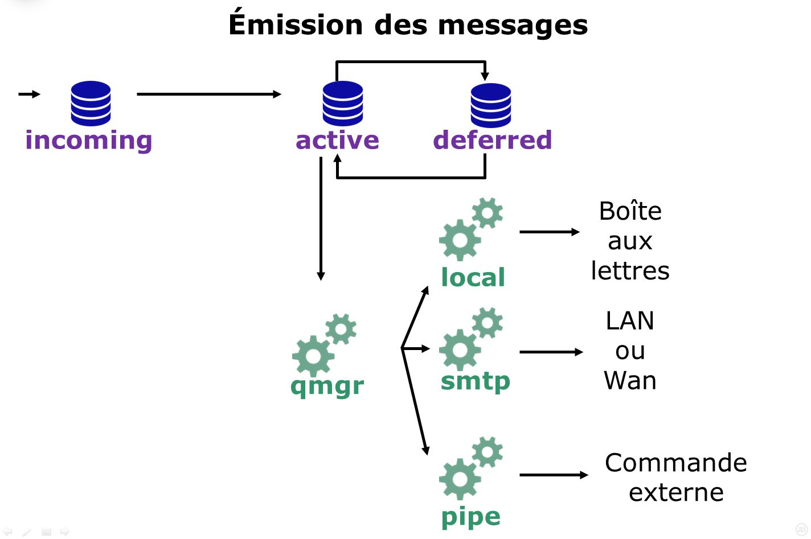

Postfix produit lui-même les messages de service pour indiquer la non-réception d'un message ou son report. Ces messages suivent le même cheminement que les messages locaux.

Les messages locaux sont déposés dans la file d'attente maildrop.

Le démon pickup prend les messages dans la file d'attente et les passe à cleanup.

Les messages provenant du réseau sont pris en charge par le démon smtpd. Ce dernier vérifie qu'ils vont pouvoir être traités par le serveur et ensuite il les transfère à cleanup.

Un message se doit de respecter certaines normes de formatage. Les adresses de provenance ou de destination doivent être pleinement qualifiées, il ne doit pas manquer d’en-têtes, etc. Un message ne respectant pas ces règles sera reformaté (remis en forme) par trivial-rewrite. Une fois corrigé, il sera de nouveau pris en charge par cleanup qui le placera dans la file incoming et préviendra le gestionnaire qmgr.

Le gestionnaire de file d'attente qmgr effectue l'essentiel du traitement du courrier. Il gère les files d'attente incoming, active et deferred.

Après traitement par cleanup, les messages sont placés dans la file incoming. Si les ressources systèmes sont disponibles, qmgr déplace alors le message dans la file active et appelle l'un des agents de distribution pour le délivrer.

Les messages qui ne peuvent pas être distribués sont mis dans la file deferred où ils attendent que qmgr tente de nouveau de les distribuer.

Si le message n'est pas à destination d'un utilisateur géré par le serveur, qmgr le transfère au démon smtp qui l'expédie au MTA concerné.

Si le destinataire fait bien partie du domaine géré par le serveur Postfix, le démon qmgr achemine le message vers local.

Le démon local dépose les messages dans l'espace de stockage local des messages. Il contrôle également les alias et vérifie si les messages doivent être délivrés ailleurs.

Le message peut être délivré à un autre processus, comme un gestionnaire de liste de diffusion, ou tout autre processus.

=== Démons agents de courrier

* **http://www.postfix.org/pickup.8.html[pickup]** : indexterm:[pickup] collecteur de messages locaux acheminés par __maildrop__. Il fournit à l'agent cleanup les messages déposés dans la file maildrop.

* **http://www.postfix.org/smtpd.8.html[smtpd]** : indexterm:[smtpd] collecteur de messages reçus du réseau. L'agent smtpd accepte les connexions réseaux et effectue les transactions SMTP pour fournir les messages à l'agent cleanup.

* **http://www.postfix.org/trivial-rewrite.8.html[trivial-rewrite]** : indexterm:[trivial-rewrite] agent de résolution et de réécriture des adresses (en lien avec le domaine). L'agent trivial-rewrite offre 3 types de services aux requêtes des clients :
** Réécriture du contexte d'adresse vers une forme standard : ajoute le nom de domaine spécifié par $myorigin ou par $mydomain aux adresses incomplètes des messages postés localement,
** Résolution de l'adresse en un quadruple (transport, saut suivant, récipient, drapeaux) :

*** Le transport correspond à l'agent de délivrance à utiliser,
*** Le MTA suivant à qui délivrer le mail,
*** L'adresse du destinataire à fournir au prochain MTA,
*** Les drapeaux : la classe d'adresse, si l'adresse nécessite un relais, si l'adresse a un problème ou si la requête a échoué.

** Résolution de l'adresse de l'envoyeur (pour des besoins de vérifications).

* **http://www.postfix.org/cleanup.8.html[cleanup]** : indexterm:[cleanup] agent de formatage des messages selon la norme RFC822. Il traite les messages entrant, les insère dans la file d'attente incoming puis informe qmgr de leur arrivée.
** L'agent cleanup opère toujours ces transformations :
*** Ajout des en-têtes manquantes : From:, To:, Message-Id: et Date:.
*** Transforme au besoin les adresses de l'enveloppe et des en-têtes au standard utilisateur@fqdn qui est attendu par les autres agents postfix. Cette tâche est déléguée à l'agent trivial-rewrite.
*** Supprime les adresses dupliquées de l'enveloppe,
*** Supprime les en-têtes : Bcc:, Content-Length:, Resent-Bcc, Return-Path:.
** Optionnellement, les adresses peuvent être transformées en fonction de la table canonical ou virtual et du paramètre masquerade_domains,

* **http://www.postfix.org/qmgr.8.html[qmgr]** : indexterm:[qmgr] agent de gestion des files d'attente __active__ et __deferred__. L'agent qmgr attend l'arrivée de message entrant et s'assure de leur livraison via un des agents de livraison. La stratégie de routage des messages est délégué au démon trivial-rewrite.

** qmgr maintient les files d'attente incoming, active, deferred, corrupt et hold.
**   qmgr surveille les rapports de livraison par message dans les répertoires suivant et demande aux agent concernés d'envoyer les rapports :
*** bounce : rapport des messages refusés. Cette file est maintenue par l'agent bounce.
*** defer : rapport des messages retardés. Cette file est maintenue par l'agent bounce.
*** trace : rapport des messages suivis. Cette file est maintenue par l'agent trace.

* **http://www.postfix.org/local.8.html[local]** : indexterm:[local] agent de livraison des messages locaux, MDA. L'agent local met à jour les files d'attente des messages et marque les messages si finis ou informe qmgr si les messages doivent être retraités plus tard. Les messages de livraison sont transmis à l'agent approprié (bounce, defer ou trace).

* **http://www.postfix.org/smtp.8.html[smtp]** : indexterm:[smtp] agent de livraison des messages vers le réseau. Il implémente les protocoles SMTP et LMTP. Il procède à la livraison des messages à la demande de qmgr. L'agent met à jour les files d'attente des messages et marque les messages si finis ou informe qmgr si les messages doivent être retraités plus tard. Les messages de livraison sont transmis à l'agent approprié (bounce, defer ou trace).
** L'agent smtp interroge le service DNS pour obtenir une liste d'adresses de serveurs de messagerie MX du domaine du destinataire de message, les trie par ordre de préférence et tente une connection vers chacun jusqu'à ce qu'il en trouve un qui réponde.

* **http://www.postfix.org/pipe.8.html[pipe]** : indexterm:[pipe] agent de livraison des messages vers une commande externe.

* **http://www.postfix.org/bounce.8.html[bounce]** : indexterm:[bounce] agent de suivi des messages (informations sur la délivrance des messages). Ce démon procède à deux types de requêtes :
** Ajoute un enregistrement de (non-)délivrance à un fichier de suivi de message (un fichier par message).
**  Génère un message de notification de délivrance, avec une copie du fichier de suivi du message correspondant. Lorsque le message est correctement généré, le fichier de suivi est supprimé.

=== Files d'attente

* **indexterm2:[maildrop]** : messages locaux postés par __sendmail__.
* **indexterm2:[incoming]** : messages après formatage en attente de traitement. Tous les messages entrant dans le système Postfix sont écrits par l'agent cleanup dans la file incoming. Les nouveaux fichiers sont créés avec comme propriétaire l'utilisateur “postfix” avec des droits à 0600. Une fois que le fichier est prêt a être traité, l'agent cleanup change les droits à 0700 et notifie qmgr d'une nouvelle arrivée. Les messages qui n'ont pas les droits à 0700 sont tout simplement ignorés car considérés comme en cours d'écriture par cleanup.
* **indexterm2:[active]** : messages prêts a être acheminés. La file d'attente active n'est pas uniquement un ensemble de fichiers sur le disque. La file d'attente “réelle” active comprend également un ensemble de structures de données dans la mémoire de l'agent gmgr, ce qui explique que la quantité de message traités dans la file active soit limitée, pour éviter un dépassement de mémoire libre.
* **indexterm2:[deferred]** : messages n'ayant pas pu être livrés et pour lesquels un envoi ultérieur pourrait réussir.

== Boites aux lettres virtuelles

Est-il vraiment utile de créer un compte système Linux pour chaque adresse de messagerie ?

Il est possible d'héberger la messagerie de différents domaines sans associer les boîtes aux lettres à des comptes système.

Les boîtes seront stockées (par exemple) sous /var/mail/vmail et gérées par l’utilisateur vmail (uid=5000, gid=5000).

Créer l’utilisateur virtual mailbox:

[source,bash]
----
[root]# groupadd –g 5000 vmail
[root]# useradd vmail –u 5000 –g 5000 –s /sbin/nologin –d /var/mail/vmail
----

./etc/postfix/main.cf
[source,bash]
----
virtual_mailbox_domains = mondomaine.com, autre.com
virtual_mailbox_base = /var/mail/vmail
virtual_mailbox_maps = hash:/etc/postfix/vmailbox
virtual_minimum_id = 100
virtual_uid_maps = static:5000
virtual_gid_maps = static:5000
virtual_alias_maps = hash:/etc/postfix/virtual
----

[CAUTION]
====
Ne jamais lister ici un domaine renseigné dans la directive mydestination ou virtual_alias_domain.
====

./etc/postfix/vmailbox
[source,bash]
----
bob@mondomaine.com		mondomaine.com/bob/
alice@mondomaine.com		mondomaine.com/alice/
bob@autre.com			autre.com/bob/
----

Le / à la fin des chemins vers les boîtes aux lettres précise qu'ici le format de stockage est Maildir.

./etc/postfix/vmailbox
[source,bash]
----
postmaster@mondomaine.com	postmaster
----

Postfix ne peut pas traiter directement les fichiers vmailbox et virtual dans leur format humain. Il a besoin de générer une base de données au format clé-valeur, plus couramment appelée hash-table.

Générer les tables clés/valeurs (hachées) :

[source,bash]
----
[root]# postmap /etc/postfix/vmailbox
[root]# postmap /etc/postfix/virtual
----

Ce rôle est rempli par la commande postmap, qui dans notre exemple, générera deux fichiers : vmailbox.db et virtual.db.

Créer les répertoires de stockage :

[source,bash]
----
[root]# su – vmail –s /bin/bash
[vmail]$ mkdir /var/mail/vmail/mondomaine.com/
[vmail]$ mkdir /var/mail/vmail/autre.com/
----

Authentification des utilisateurs :

./etc/dovecot/users
[source,bash]
----
bob@mondomaine.com:{PLAIN}password:5000:5000::/var/mail/vmail/mondomaine.com/bob/
alice@mondomaine.com:{PLAIN}password:5000:5000::/var/mail/vmail/mondomaine.com/alice/
----

Authentification par fichier plat :

./etc/dovecot/conf.d/10-auth.conf
[source,bash]
----
disable_plaintext_auth = no
!include auth-passwdfile.conf.ext
----

Nouvel emplacement de stockage :

./etc/dovecot/conf.d/10-mail.conf
[source,bash]
----
mail_location = maildir:/var/mail/vmail/%d/%n
----

Les macros dovecot :

Dovecot est capable de remplacer dynamiquement des valeurs renseignées dans ses fichiers de configuration.

Dans notre exemple, le %d sera remplacé par le domaine de messagerie et le %n par le nom de la boîte aux lettres. Par exemple, un mail destiné à bob@mondomaine.lan sera stocké dans le sous-dossier mondomaine.lan/bob/.

Les comptes de messagerie ne nécessitent plus de compte système, ce qui facilite l’administration et améliore la sécurité.

Les fichiers plats utilisés dans nos exemples peuvent facilement être remplacés par une table mysql ou un annuaire LDAP.

[TIP]
====
Pourquoi ne pas utiliser uniquement des utilisateurs virtuels dans ce cas ?
====

== Suivi des messages à des fins légales

Il peut être demandé de conserver le sujet, le rédacteur et le destinataire d'un message.

Pour cela, le processus cleanup doit vérifier les entêtes des messages et générer un log lorsqu'il rencontre la valeur attendue. 
Ces valeurs sont stockées dans le fichier /etc/postfix/header_checks sous forme de regex :

./etc/postfix/header_checks
[source,bash]
----
/^subject:/     WARN
/^Subject:/     WARN
/^to:/          WARN
/^To:/          WARN
/^from:/        WARN
/^From:/        WARN
----

Postfix utilise la directive **header_checks** :

[source,bash]
----
postconf -e 'header_checks = regexp:/etc/postfix/header_checks'
service postfix restart
----

Un message généré avec la commande swaks :

[source,bash]
----
swaks --to alice@formatux.lan --from bob@formatux.lan --header "Subject: test test test" --server 127.0.0.1
----

Générera les logs suivants :

[source,bash]
----
tail -f /var/log/maillog | grep warning
postfix/cleanup[13423]: 125D162F88: warning: header To: alice@formatux.lan [...]
postfix/cleanup[13423]: 125D162F88: warning: header From: bob@formatux.lan [...]
postfix/cleanup[13423]: 125D162F88: warning: header Subject: test test test [...]
----

