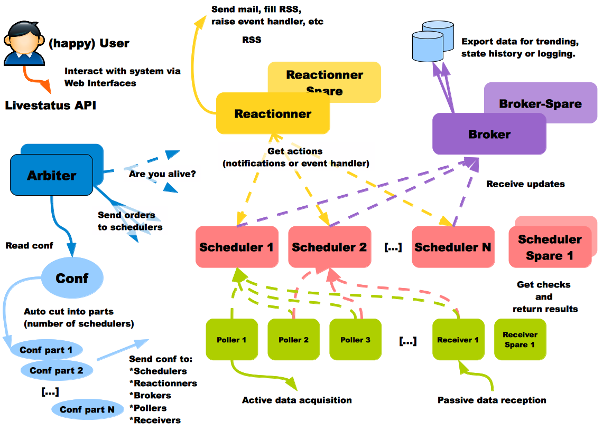

////
Les supports de Formatux sont publiés sous licence Creative Commons-BY-SA et sous licence Art Libre.
Vous êtes ainsi libre de copier, de diffuser et de transformer librement les œuvres dans le respect des droits de l’auteur.

    BY : Paternité. Vous devez citer le nom de l’auteur original.
    SA : Partage des Conditions Initiales à l’Identique.

Licence Creative Commons-BY-SA : https://creativecommons.org/licenses/by-sa/3.0/fr/
Licence Art Libre : http://artlibre.org/

Auteurs : Patrick Finet, Xavier Sauvignon, Antoine Le Morvan
////

= Installation d'un serveur Shinken

== Généralités

Shinken est un logiciel de supervision créé en 2009 par Jean Gabes. Il est une réécriture de Nagios en Python et en reprend complètement l'esprit. Il va cependant permettre de répondre à des contraintes techniques auxquelles Nagios ne pouvait pas. 

Shinken dépend essentiellement de Pyro, librairies Python. Son code est ouvert, libre et communautaire.

Son architecture est décentralisée et se base sur plusieurs processus. Elle prévoit également la haute disponibilité et de hautes performances.

.Architecture

== Prérequis

L'installation est effectuée sur un serveur CentOS 7 minimal.
Il est nécessaire de posséder un serveur correctement configuré (nom et adressage IP).

Ajouter l'utilisateur *shinken* qui sera utilisé pour le déploiement, lui configurer un mot de passe et l'ajouter au groupe *wheel* pour l'utilisation de sudo.
[source,bash]
----
[root@srv-shinken ~]# useradd shinken
[root@srv-shinken ~]# passwd shinken
[root@srv-shinken ~]# usermod -aG wheel shinken
----

Vérifier ou activer si besoin %wheel avec la commande visudo et désactiver requiretty :
[source,bash]
----
	Defaults    !requiretty
	%wheel      ALL=(ALL)       ALL
----

Se connecter ensuite avec l'utilisateur shinken pour poursuivre l'installation.
[source,bash]
----
[root@localhost ~]# su - shinken
----

Configurer un premier dépôt epel :
[source,bash]
----
[shinken@srv-shinken ~]$ sudo yum install epel-release
----

Puis un second dépôt pour mongodb :
[source,bash]
----
[shinken@srv-shinken ~]$ sudo vim /etc/yum.repos.d/mongodb.repo
    [mongodb]
    name=MongoDB Repository
    baseurl=http://downloads-distro.mongodb.org/repo/redhat/os/x86_64/
    gpgcheck=0
    enabled=1
----

== Installation

=== Installation des composants nécessaires à Shinken

Installation des composants Python :
[source,bash]
----
[shinken@srv-shinken ~]$ sudo yum install -y python-pip python-pycurl python-setuptools git python-pymongo python-cherrypy
----

Installation d'une base de données nécessaire à WebUI qui sera utilisé pour l'affichage graphique. Ici, mongodb sera utilisé mais d'autres bases de données peuvent être utilisées.
[source,bash]
----
[shinken@srv-shinken ~]$ sudo yum -y install mongodb-org mongodb-org-server
----

Activation et démarrage :
[source,bash]
----
[shinken@srv-shinken ~]$ sudo chkconfig mongod on
[shinken@srv-shinken ~]$ sudo systemctl start mongod
----

Revenir en tant que root pour installer pyro.
[source,bash]
----
[shinken@srv-shinken ~]$ exit
[root@srv-shinken ~]#
----

Installation de Pyro :
[source,bash]
----
[root@srv-shinken ~]# easy_install pyro
----

=== Installation de shinken
De nouveau avec l'utilisateur shinken, récupérer les sources sur le dépôt github :
[source,bash]
----
[root@srv-shinken ~]# su - shinken
[shinken@srv-shinken ~]$ git clone https://github.com/naparuba/shinken.git
----

Se déplacer dans le dossier shinken et lancer l'installation:
[source,bash]
----
[shinken@srv-shinken ~]$ cd shinken
[shinken@srv-shinken shinken]$ sudo python setup.py install
----

Installation du package shinken. Ce package installe seulement un outil d'administation et d'installation de modules supplémentaires pour shinken.
[source,bash]
----
[shinken@localhost shinken]$ sudo yum install -y shinken
----

Donner les droits nécessaires à l'utilisateur shinken :
[source,bash]
----
[shinken@srv-shinken ~]$ sudo chown -R shinken:shinken /var/lib/shinken/
[shinken@srv-shinken ~]$ sudo chown -R shinken:shinken /var/log/shinken/
[shinken@srv-shinken ~]$ sudo chown -R shinken:shinken /var/run/shinken/
----

Activer tous les services shinken au démarrage :
[source,bash]
----
[shinken@srv-shinken ~]$ sudo chkconfig shinken on
[shinken@srv-shinken ~]$ sudo chkconfig shinken-arbiter on
[shinken@srv-shinken ~]$ sudo chkconfig shinken-broker on
[shinken@srv-shinken ~]$ sudo chkconfig shinken-poller on
[shinken@srv-shinken ~]$ sudo chkconfig shinken-reactionner on
[shinken@srv-shinken ~]$ sudo chkconfig shinken-receiver on
[shinken@srv-shinken ~]$ sudo chkconfig shinken-scheduler on
----

Initialisation de shinken. Création d'un fichier *.shinken.ini* caché dans la home directory de l'utilisateur shinken.
[source,bash]
----
[shinken@srv-shinken ~]$ shinken --init
----

=== Installation et configuration des modules

  * Module permettant d'initialiser l'interface graphique *webui2*

[source,bash]
----
[shinken@srv-shinken ~]$ shinken install webui2
Grabbing : webui2
OK webui2
----

Il faut alors modifier le fichier */etc/shinken/brokers/broker-master.cfg* afin de définir le module *webui2*.

[source,bash]
----
[shinken@srv-shinken ~]$ vim /etc/shinken/brokers/broker-master.cfg
    ...
    modules webui2
    ...
----

Pour que *webui2* fonctionne, il faut également installer les dépendances suivantes avec *easy_install* en tant que root.
[source,bash]
----
[shinken@srv-shinken ~]$ exit
[root@srv-shinken ~]#
[root@srv-shinken ~]# easy_install bottle
[root@srv-shinken ~]# easy_install pymongo
[root@srv-shinken ~]# easy_install requests
[root@srv-shinken ~]# easy_install arrow
[root@srv-shinken ~]# easy_install passlib
----

Se reconnecter ensuite avec l'utilisateur shinken.
[source,bash]
----
[root@srv-shinken ~]# su - shinken
[shinken@srv-shinken ~]$
----

  * Module utilisé comme moyen d'authentification.

[source,bash]
----
[shinken@srv-shinken ~]$ shinken install auth-cfg-password
Grabbing : auth-cfg-password
OK auth-cfg-password
----

  * Module utilisé pour la base de données mongodb.

[source,bash]
----
[shinken@srv-shinken ~]$ shinken install mod-mongodb
Grabbing : mod-mongodb
OK mod-mongodb
----

Il faut ensuite modifier le fichier */etc/shinken/modules/webui2.cfg* afin de définir les deux modules précédemment installés.
[source,bash]
----
[shinken@srv-shinken ~]$ vim /etc/shinken/modules/webui2.cfg
    ...
    modules auth-cfg-password,mongodb
    ...
----

Le module *auth-cfg-password* étant utilisé, il faut modifier le mot de passe dans le fichier */etc/shinken/contacts.admin.cfg*. Ce sont les identifiants définis dans ce fichier (contact_name et password) qui seront utilisés pour s'authentifier.
[source,bash]
----
[shinken@srv-shinken ~]$ vim /etc/shinken/contacts/admin.cfg
    ...
    password    **********
    ...
----

== Démarrage de shinken

Afin d'accéder a l'URL de shinken http://srv-shinken:7767, il est nécessaire de configurer le pare-feu en créant une nouvelle règle et de redémarrer le service.
[source,bash]
----
[shinken@srv-shinken ~]$ sudo vim /etc/sysconfig/iptables
    ...
    -A INPUT -p tcp -m state --state NEW -m tcp --dport 7767 -j ACCEPT
    ...
[shinken@srv-shinken ~]$ sudo systemctl restart iptables
----

Démarrer ensuite le service shinken afin de prendre en compte la configuration.
[source,bash]
----
[shinken@srv-shinken ~]$ sudo systemctl start shinken
----

L'URL donnée ici n'est bien sûr valable que si une résolution de noms permet de définir le nom du serveur (srv-shinken). Il est également possible d'utiliser l'adresse IP (http://@IP:7767).

Le port 7767 est le port de fonctionnement par défaut.

.Fenêtre de connexion

== Références

https://shinken.readthedocs.io/en/latest/index.html

https://www.it-connect.fr/installer-shinken-3-0-sur-centos-7-en-10-etapes/