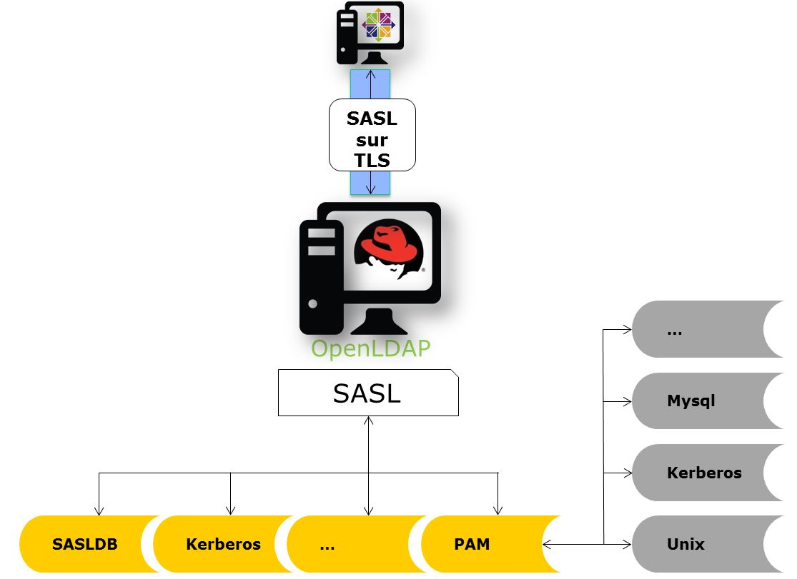
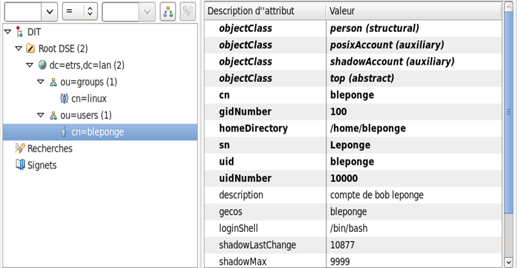
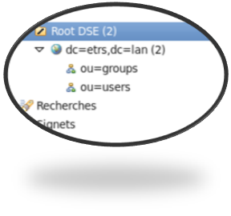

////
Les supports de Formatux sont publiés sous licence Creative Commons-BY-SA et sous licence Art Libre.
Vous êtes ainsi libre de copier, de diffuser et de transformer librement les œuvres dans le respect des droits de l’auteur.

    BY : Paternité. Vous devez citer le nom de l’auteur original.
    SA : Partage des Conditions Initiales à l’Identique.

Licence Creative Commons-BY-SA : https://creativecommons.org/licenses/by-sa/3.0/fr/
Licence Art Libre : http://artlibre.org/

Auteurs : Patrick Finet, Xavier Sauvignon, Antoine Le Morvan
////

= Serveur d'annuaire OpenLDAP

== Généralités

Le protocole **indexterm2:[LDAP]** (**LightWeight Directory Access Protocol**) est une suite **standardisée** de protocoles permettant l'accès à un annuaire centralisé. Cet annuaire centralisé stocke des informations diverses comme :

*   des noms ;
*   des adresses ;
*   des numéros de téléphone ;
*   des utilisateurs ;
*   des groupes ;
*   etc.

La version actuelle de ce protocole est la version 3.

Le protocole LDAP s'inspire de la spécification **X.500** mais de manière moins complexe. La norme X.500 désigne l'ensemble des normes informatiques sur les services d'annuaires définies par l'IUT (International Union Telecommunication). Il s'agit donc d'un annuaire version électronique dont l'organisation est hiérarchique, à la manière du DNS, qui correspond généralement à l'organisation de l'entreprise. Le terme Lightweight ne doit pas être compris comme "allégé", ce qui signifierait qu'il serait amputé de certaines fonctionnalités, mais bien dans ce cas de "simplifié", car la spécification X.500 est très lourde.

Le système LDAP est né en 1993 à l'université du Michigan. Le dérivé libre **indexterm2:[OpenLDAP]** est lui apparu en 1998.

Une base de données LDAP, de part sa nature, est optimisée pour la lecture d'informations :

*   authentification ;
*   recherche dans l'annuaire.

Les ports utilisés par le protocole LDAP sont les ports **389** (en clair comme en chiffré par **indexterm2:[startTLS]**) et **636** pour une connexion en TLS (solution dépréciée).

L'implémentation la plus célèbre du protocole LDAP sous Windows est l'Active Directory.

Sous Linux, les choix sont nombreux :

*   OpenLDAP ;
*   RedHat Directory Studio ;
*   Samba4 qui intègre un serveur LDAP ;
*   LinID de Linagora ;
*   389 DS ;
*   IBM Tivoli ;
*   …

[NOTE]
====
À noter que la suite OpenLDAP au sein de RedHat 6 (et versions supérieures) n'utilise plus OpenSSL. Elle utilise à la place l'implémentation de Mozilla de **indexterm2:[NSS]** (Network Security Services).
====

=== La DIT

Un annuaire LDAP est **un arbre de données**. Cette **structure hiérarchique** est appelée **indexterm2:[DIT]** (**Directory Information Tree**).

Une entrée de l'arbre est un ensemble d'**attributs**.

Chaque entrée dispose d'un identifiant unique : son **indexterm2:[DN]** (**Distinguished Name**).

=== L'OLC

OpenLDAP est le serveur d'annuaire de référence pour les distributions Linux.

Dans les versions récentes d'OpenLDAP (>2.4), sa configuration n'est plus stockée dans un fichier de configuration.

La configuration réside directement dans la base de données elle-même, au sein d'une **DIT** spécifique : c'est la fonctionnalité **indexterm2:[OLC]** (**On-Line Configuration**), aussi connue sous le nom **cn=config**.

L'approche consistant à stocker 'en ligne' la configuration LDAP peut paraître complexe, mais est justifiée par la criticité du service LDAP. Stocker la configuration dans des fichiers plats imposait un redémarrage du service à chaque modification, ce qui représentait beaucoup de temps d'arrêt pour de grosses bases de données.

[NOTE]
====
Il n'y a plus de fichiers .conf à modifier dans les versions récentes d'OpenLDAP.
====

=== Le schéma

Le contenu des entrées d'un annuaire est régi par des schémas. Les schémas définissent les types d'attributs d'une entrée regroupés par classe d'objets.

*    schéma : ensemble des classes et des attributs disponibles.
*   objectClass : une classe objet rassemble un ensemble d'attributs obligatoires ou facultatifs (par exemple la classe inetOrgPerson).
*   attribut : exemple
**   mail: john.doe@formatux.lan ;
**   preferredLanguage: french.
        
=== Couche d'Authentification et de Sécurité Simple SASL

**indexterm2:[SASL]** (**Couche d'Authentification et de Sécurité Simple**) est une méthode pour ajouter le support d'**authentification** aux **protocoles basés sur la connexion** (LDAP, SMTP, IMAP, XMPP, IRC, etc.). Pour utiliser SASL, un protocole inclut une **commande d'identification et d'authentification** d'un utilisateur sur un serveur et la **négociation éventuelle de la protection** des interactions consécutives du protocole.

Si son utilisation est négociée, **une couche de sécurité est insérée entre le protocole et la connexion**.

Séparer ainsi la couche d'authentification de la couche applicative 
permet en théorie à n'importe quel mécanisme d'authentification pris en 
charge par SASL d'être employé à partir de n'importe quel protocole 
d'application capable d'utiliser SASL.

Les mécanismes principaux SASL sont :

*    **EXTERNAL** : l'authentification est dérivée du contexte (authentification système);
*   **ANONYMOUS** : accès anonyme sans authentification ;
*   **PLAIN** : mot de passe en clair ;
*   **OTP** : mot de passe unique (One Time Password) ;
*   **CRAM-MD5** et **DIGEST-MD5** : basés sur MD5 ;
*   **NTLM** : authentification pour réseau local NT ;
*   **GSSAPI** : authentification Kerberos via GSSAPI.

=== Le format LDIF

Le format **indexterm2:[LDIF]** (LDAP Data Interchange Format) est un format de fichier texte utilisé lors des échanges d'informations en client/serveur ou entre serveurs.

.Exemple de fichiers LDIF :
[source,ldif]
----
dn: cn=John Doe,dc=example,dc=com
  objectClass: top
  objectClass: person
  objectClass: inetOrgPerson
  objectClass: organizationalPerson
  cn: John Doe
  givenName: John
  sn: Doe
  mail: john.doe@example.com
----

Dans cette entrée, nous retrouvons, outre le Distinguished Name (DN) de l'objet :

*   4 objectClass : inetOrgPerson, organizationPerson, person et top ;
*   4 attributs : cn, givenName, sn et mail.

Les objectClass permettent d'inclure des attributs obligatoires ou 
optionnels dans une entrée. Toujours dans notre exemple, c'est l'ajout 
de l'objectClass inetOrgPerson qui va permettre d'ajouter un attribut 
mail.

L'ensemble des objectClass et des attributs sont définis dans des 
schémas, qu'il conviendra d'ajouter en fonction du rôle du serveur. Par 
exemple, pour permettre l'authentification Samba depuis le serveur LDAP,
 il faudra ajouter le schéma samba.schema à la configuration du serveur.
 
[IMPORTANT]
====
Le format LDIF a des caractéristiques très importantes :

*   les séries d'entrées sont séparées par des lignes vides ;
*   la dernière ligne doit être vide, sinon la dernière entrée pourrait ne pas être prise en compte.
====

=== Les outils clients LDAP

Des outils en ligne de commande permettent l'administration du serveur en utilisant en entrée des fichiers LDIF ou la console.

*   **indexterm2:[ldapadd]** : ajouter des entrées ;
*   **indexterm2:[ldapdelete]** : supprimer des entrées ;
*   **indexterm2:[ldapmodify]** : modifier des entrées ;
*   **indexterm2:[ldappasswd]** : modifier un mot de passe ;
*   **indexterm2:[ldapsearch]** : rechercher dans l'annuaire.

== Installation du serveur

Prérequis à l'installation :

* disposer des droits root ou sudo ;
* disposer d'un dépôt yum configuré ;
* avoir ouvert les ports 389 et 636 sur le pare-feu local et sur les éléments actifs

Installation :

[source,bash]
----
[root]# yum install openldap-servers openldap-clients
[root]# cp /usr/share/openldap-servers/DB_CONFIG.example /var/lib/ldap/DB_CONFIG
[root]# chown ldap:ldap /var/lib/ldap/DB_CONFIG
[root]# chkconfig slapd on
[root]# service slapd start
----

LDAP a besoin d'un fichier de configuration (/var/lib/ldap/DB_CONFIG) 
pour sa base de données. Le fichier fourni en exemple lors de 
l'installation convient parfaitement.

Le fichier /etc/openldap/ldap.conf contient la configuration pour les clients openldap comme ldapsearch, ldapadd, etc. Toutes les informations inscrites dans ce fichier allégeront d'autant les lignes de commande interactives, puisqu'il ne sera plus nécessaire de préciser les options positionnées ici.

.Le fichier /etc/openldap/ldap.conf
[source,bash]
----
#
# LDAP Defaults
#

#BASE dc=example,dc=com
#URI ldap://ldap.example.com ldaps://ldap.example.com:666

#SIZELIMIT 12
#TIMELIMIT 15
#DEREF     never

TLS_CACERTDIR /etc/openldap/certs
----

Le répertoire /etc/openldap/slapd.d/ contient les bases de données et le schéma :

.Arborescence du service OpenLDAP
[source,bash]
----
# /etc/openldap/slapd.d/
|-- cn=config
|   |-- cn=schema # les schémas disponibles
|   |   |-- cn={10}ppolicy.ldif
|   |   |-- cn={1}core.ldif
|   |   |-- cn={2}cosine.ldif
|   |   |-- cn={5}inetorgperson.ldif
|   |   |-- cn={8}nis.ldif
|   |   |-- cn={9}openldap.ldif
|   |-- cn=schema.ldif # le schéma du serveur
|   |-- olcDatabase={0}config.ldif
|   |-- olcDatabase={-1}frontend.ldif
|   |-- olcDatabase={1}monitor.ldif
|   |-- olcDatabase={2}bdb.ldif # la DIT principale au format BDB
|-- cn=config.ldif # configuration globale du serveur
----

[WARNING]
====
Les bases de données du serveur LDAP ne doivent jamais être modifiées manuellement !!!
====

== Configuration du serveur

Avant de pouvoir utiliser les outils en ligne de commande, il convient de configurer les options par défaut :

[source,bash]
----
BASE dc=formatux,dc=lan
URI ldap://localhost
----

[WARNING]
====
En version TLS sécurisée, l'URI doit impérativement correspondre au FQDN renseigné dans le certificat !
====

Pour la suite du cours, nous retiendrons que :

*   le dn de base est : dc=formatux,dc=lan ;
*   l'administrateur LDAP est cn=admin,dc=formatux,dc=lan ;
*   les utilisateurs sont stockés dans l'unité d'organisation : ou=users,dc=formatux,dc=lan.

Il est intéressant à ce stade de visualiser la configuration par défaut avec la commande slapcat :

[source,bash]
----
[root]# slapcat -b cn=config | less
...
dn: olcDatabase={2}bdb,cn=config # base de données de l'annuaire
...
olcSuffix: dc=my-domain,dc=com # suffix par défaut
olcRootDN: cn=Manager,dc=my-domain,dc=com # administrateur par défaut
...
----

[NOTE]
====
À noter que l'administrateur n'a pas de mot de passe (olcRootPW)
====

=== Le suffixe

Le suffixe représente la racine de l'organisation. C'est l'identité même
 de l'entreprise. Elle correspond habituellement au suffixe DNS.

Nous allons le changer avec la commande ldapmodify :

[source,bash]
----
[root]# ldapmodify -Y EXTERNAL -H ldapi:///
dn: olcDatabase={2}bdb,cn=config
changetype: modify
replace: olcSuffix
olcSuffix: dc=formatux,dc=lan
----

[NOTE]
====
Le suffixe étant défini à l'installation, il faut le modifier !
====

=== Le RootDN et son mot de passe

L'entrée **indexterm2:[RootDN]** contient le DN de l'utilisateur autorisé à faire des modifications de l'annuaire.

Son mot de passe est défini par **indexterm2:[RootPW]**.

Nous allons le configurer avec la commande ldapmodify :

[source,bash]
----
[root]# ldapmodify -Y EXTERNAL -H ldapi:///
dn: olcDatabase={2}bdb,cn=config
changetype: modify
replace: olcRootDN
olcRootDN: cn=admin,dc=formatux,dc=lan
----

[NOTE]
====
Le suffixe étant défini à l'installation, il faut le modifier !
====

Pour définir un mot de passe utilisable par openldap, il faut utiliser la commande slappasswd.

Ajouter le RootPW :

[source,bash]
----
[root]# ldapmodify -Y EXTERNAL -H ldapi:///
dn: olcDatabase={2}bdb,cn=config
changetype: modify
add: olcRootPW
olcRootPW: {SSHA}Eke0fnWgD90xZWPT/UivZEBjzBgC/Z+
----

[NOTE]
====
Cette fois-ci, le RootPW n'ayant pas été défini à l'installation, il faudra l'ajouter!
====

Les trois commandes auraient pu être regroupées en une seule. Dans ce 
cas, il faut séparer chaque modification de l'objet par une ligne 
contenant un ”-“.

[source,bash]
----
[root]# ldapmodify -Y EXTERNAL -H ldapi:///
dn: olcDatabase={2}bdb,cn=config
changetype: modify
replace: olcSuffix
olcSuffix: dc=formatux.lan
-
replace: olcRootDN
olcRootDN: cn=admin,dc=formatux,dc=lan
-
add: olcRootPW
olcRootPW: {SSHA}Eke0fnWgD90xZWPT/UivZEBjzBgC/Z+
----

=== Connexion avec le RootDN

Un RootDN et son mot de passe ayant maintenant été définis dans la DIT dc=formatux,dc=lan, il est possible de les utiliser pour se connecter :

[source,bash]
----
[root]# ldapmodify -x -D cn=admin,dc=formatux,dc=lan -W
----

[TIP]
====
Il n'est pas nécessaire de préciser ici le serveur à contacter (options 
-H ou -h), la commande ldapmodify utilisera les informations du fichier 
/etc/openldap/ldap.conf qui a été renseigné précédemment.
====

=== La commande slapcat

Exporter le contenu de l'annuaire au format LDIF avec la commande **indexterm2:[slapcat]**.

.Syntaxe de la commande slapcat
----
slapcat -b suffix
----

Exemple : 

[source,bash]
----
[root]# slapcat -b cn=config | less
...
dn: olcDatabase={2}bdb,cn=config
...
olcSuffix: dc=my-domain,dc=com
olcRootDN: cn=Manager,dc=my-domain,dc=com
...
----

[cols="1,4",options="header"]
|====
|  Option  |  Description 
| -b | Détermine quelle base de données est exportée. 
|====

=== La commande ldapmodify

La commande **indexterm2:[ldapmodify]** permet de modifier le contenu de l'annuaire.

==== Authentification (binding) par SASL

.Syntaxe de la commande ldapmodify avec authentification SASL
----
ldapmodify [-y SASLMecanisme] [-H host] [-v] [-f fichier.ldif]
----

Exemple :

[source,bash]
----
[root]# ldapmodify -Y EXTERNAL -H ldapi:/// -v -f modldap.ldif
----

[cols="1,4",options="header"]
|====
| Option  |  Description
| -Y| Mécanisme SASL à utiliser pour l'authentification.
| -v| Mode verbeux pour diagnostique. 
| -H| Spécifier un serveur. Le protocole **ldapi** permet une communication sécurisée via une socket UNIX (nécessaire pour utiliser SASL).  
|====

==== Authentification (binding) simple

.Syntaxe de la commande ldapmodify avec authentification simple
----
ldapmodify [-x] [-D RootDN] [-W|-w pwd] [-H host] [-f fichier.ldif]
----

Exemple :

----
[root]# ldapmodify -x -D cn=admin,dc=formatux,dc=lan -W
----

[cols="1,4",options="header"]
|====
| Option  |  Description 
|  -x | Utiliser l'authentification simple au lieu de SASL  
|  -D |BindDN à utiliser pour la connexion à la base.  
| -W ou -w   |  Demander le mot de passe (interactif ou non).  
|  -f | Lire les modifications à effectuer depuis un fichier 
|====

[TIP]
====
Il n'est pas nécessaire de préciser le serveur à contacter (options -H 
ou -h) si celui-ci est renseigné dans le fichier /etc/openldap/ldap.conf
====

==== Exemples

Il faut séparer les cas suivants :

* Ajouter/Supprimer un objet. Supprimer bleponge ou ajouter asaglisse.
* Modifier un objet en lui ajoutant, supprimant ou modifiant un attribut.

===== Ajouter un objet

[source,bash]
----
[root]# ldapmodify -Y EXTERNAL -H ldapi:///
dn:dndelobjetaajouter
changetype: add
...
----

===== Supprimer un objet

[source,bash]
----
[root]# ldapmodify -Y EXTERNAL -H ldapi:///
dn:dndelobjetasupprimer
changetype: delete
----

===== Modifier un objet

*    Ajouter un attribut :

[source,bash]
----
[root]# ldapmodify -Y EXTERNAL -H ldapi:///
dn: dndelobjetamodifier
changetype: modify
add: nomdelatrribut
nomdelattribut: nouvellevaleur
----

*   Supprimer un attribut

[source,bash]
----
[root]# ldapmodify -Y EXTERNAL -H ldapi:///
dn: dndelobjetamodifier
changetype: modify
delete: nomdelattribut
----

*   Modifier un attribut

[source,bash]
----
[root]# ldapmodify -Y EXTERNAL -H ldapi:///
dn: dndelobjetamodifier
changetype: modify
replace: nomdelattribut
nomdelattribut: nouvellevaleur
----

=== La structure de la DIT

Les données de l'arbre de l'annuaire doivent être rangées dans des unités d'organisation (**indexterm2:[OU]**).

Les OU **users** et **groups** sont généralement utilisées.

Commencer par ajouter une entrée dans l'annuaire correspondant à l'organisation de l'entité :

[source,bash]
----
[root]# ldapmodify -x -D cn=admin,dc=formatux,dc=lan -W
Enter LDAP Password:
dn: dc=formatux,dc=lan
changetype: add
objectClass: dcObject
objectClass: organization
dc: formatux
o: formatux
description: Serveur formatux
----

Puis les deux OU concernées :

.Le fichier /root/structure.ldif
[source,bash]
----
dn: ou=users,dc=formatux,dc=lan
changetype: add
objectClass: top
objectClass: organizationalUnit
ou: users
description: Utilisateurs de Formatux

dn: ou=groups,dc=formatux,dc=lan
changetype: add
objectClass: top
objectClass: organizationalUnit
ou: groups
description: Groupes d'utilisateurs de Formatux
----

[source,bash]
----
[root]# ldapmodify -x -D cn=admin,dc=formatux,dc=lan -W -f /root/structure.ldif
----

=== Activation des logs

Dans certains cas, il sera intéressant d'activer la journalisation dans la base cn=config. 

Celle-ci étant très verbeuse, elle sera activée ou désactivée au besoin.

[source,bash]
----
[root]# ldapmodify -Y EXTERNAL -H ldapi:///
dn: cn=config
changeType: modify
replace: olcLogLevel
olcLogLevel: stats
----

Il faut paramétrer le service syslog pour qu'il accepte les logs (niveau local4).

.Le fichier /etc/rsyslog.conf
----
local4.* /var/log/slapd.log
----

sans oublier de redémarrer le démon syslog :

[source,bash]
----
[root]# service rsyslogd restart
----

[TIP]
====
Le logLevel 4 permet de journaliser les requêtes effectuées sur la base.
====

=== Activation du TLS

Avant de pouvoir configurer le **indexterm2:[TLS]** sous OpenLDAP, il convient de disposer du certificat et de la clef pour le serveur ainsi que le certificat de l'autorité de certification, qui est indispensable au bon fonctionnement d'OpenLDAP.

Pour créer ces certificats, il est possible d'utiliser easy-rsa, qui sera abordé dans la quatrième partie du document.

Une autre méthode est d'utiliser l'outil **indexterm2:[certtool]** du paquet **indexterm2:[gnutls-utils]**.

[IMPORTANT]
====
Si l'accès au serveur LDAP se fait via le FQDN ldap.formatux.lan, il faudra impérativement créer le certificat qui répondra à ce nom. Il ne sera plus possible par la suite de se connecter en LDAPS ou en indexterm2:[starttls] via l'adresse de loopback localhost.
====

==== Création des certificats avec certtools

Installer le paquet gnutls-utils :

[source,bash]
----
[root]# yum install gnutls-utils
----

Dans le cas d'un certificat auto-signé, il faut dans un premier temps créer une clef privée pour l'autorité de certification :

[source,bash]
----
[root]# certtool --generate-privkey --outfile /etc/pki/CA/private/ca-key.key
----

et décliner cette clef privée en certificat public.

[source,bash]
----
[root]# certtool --generate-self-signed --load-privkey /etc/pki/CA/private/ca-key.key --outfile /etc/pki/CA/certs/ca-cert.pem
----

Il faut ensuite générer un certificat privé pour le serveur (ldap.formatux.lan par exemple)

[source,bash]
----
[root]# certtool --generate-privkey --outfile /etc/pki/tls/private/ldap.key
----

Puis son certificat public signé par la clef privée de l'autorité de certification créée ci-dessus :

[source,bash]
----
[root]# certtool --generate-certificate --load-privkey /etc/pki/tls/private/ldap.key --outfile /etc/pki/tls/certs/ldap.pem --load-ca-certificate /etc/pki/CA/certs/ca-cert.pem --load-ca-privkey /etc/pki/CA/private/ca-key.key
----

==== Prise en compte des certificats

.Le fichier /root/tls.ldif
[source,bash]
----
dn: cn=config
changetype: modify
replace: olcTLSCertificateFile
olcTLSCertificateFile: /etc/pki/certs/ldap.pem
-
replace: olcTLSCertificateKeyFile
olcTLSCertificateKeyFile: /etc/pki/private/ldap.key
-
replace: olcTLSCACertificateFile
olcTLSCACertificateFile: /etc/pki/CA/certs/ca-cert.pem
----

----
[root]# ldapmodify -Y EXTERNAL -H ldapi:/// -f /root/tls.ldif
----

La chaîne de connexion du fichier /etc/openldap/ldap.conf doit également être mise à jour :

.Le fichier /etc/openldap/ldap.conf
[source,bash]
----
BASE dc=formatux,dc=lan
URI ldaps://ldap.formatux.lan

TLS_CACERTDIR /etc/openldap/certs
TLS_REQCERT try
----

La commande **indexterm2:[cacertdir_rehash]** permet de créer un lien 
symbolique vers le certificat de la CA dont le nom correspond au hash de
 ce certificat. Ceci est nécessaire au fonctionnement d'openLDAP en TLS !

[source,bash]
----
[root]# cacertdir_rehash /etc/pki/CA/certs
[root]# ls -l /etc/pki/CA/certs
-rw-r--r--. 1 root root 1281 4 déc. 10:52 ca-cert.pem
lrwxrwxrwx. 1 root root 11   4 déc. 10:54 ce6a8cab.0 -> ca-cert.pem
----

Par défaut, le service slapd n'écoute pas sur le port 636 (ldaps) et il faut privilégier le startTLS sur le port 389.
Pour activer le ldaps :

.Le fichier /etc/sysconfig/ldap
----
SLAPD_LDAPS=yes
----

sans oublier de relancer le serveur :

[source,bash]
----
[root]# service slapd restart
----

==== Tester la connexion

La commande openssl permet de tester la connexion uniquement sur le port 636 :

[source,bash]
----
[root]# openssl s_client -connect ldap.formatux.lan:636 -showcerts
----

==== Le certificat de la CA

De nombreuses applications auront besoin du certificat de la **indexterm2:[CA]**.

Il est recommandé de le mettre à disposition des utilisateurs sur le serveur web du serveur LDAP :

[source,bash]
----
[root]# cp /etc/pki/CA/certs/ca-cert.pem /var/www/html/
----

Le certificat est ainsi accessible via l'adresse http://ldap.formatux.lan/cacert.pem.

==== Configuration du PAM

PAM peut être configuré pour utiliser le service openldap avec la commande authconfig :

[source,]
----
[root]# yum install nss-pam-ldapd
----

[source,bash]
----
[root]# authconfig --enableldap --enableldapauth --ldapserver=ldap://ldap.formatux.lan --ldapbasedn="ou=users,dc=formatux,dc=lan" --enableldaptls --ldaploadcacert=http://ldap.formatux.lan/ca-cert.pem --enablemkhomedir --update
----

==== Création des utilisateurs

Création du fichier pour l'utilisateur :

[source,]
----
vim /root/antoine.ldif

dn: cn=alemorvan,ou=users,dc=formatux,dc=lan
objectClass: top
objectClass: person
objectClass: posixAccount
objectClass: shadowAccount
cn: alemorvan
sn: Le Morvan
uid: alemorvan
uidNumber: 10000
gidNumber: 500
homeDirectory: /home/alemorvan
loginShell: /bin/bash
userPassword: {crypt}password
gecos: alemorvan
shadowWarning: 7
----

[source,]
----
ldapadd -x -D cn=admin,dc=formatux,dc=lan -W -f /root/antoine.ldif
----

