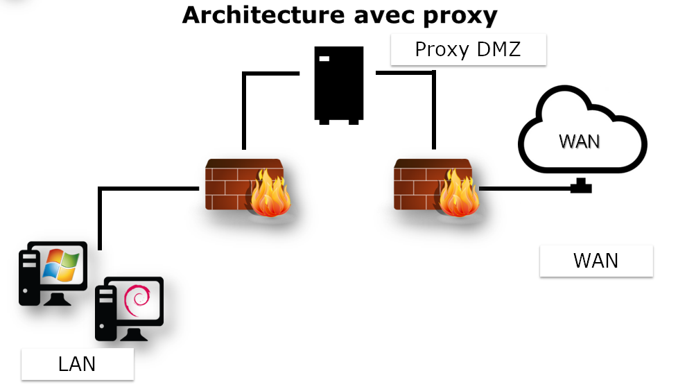
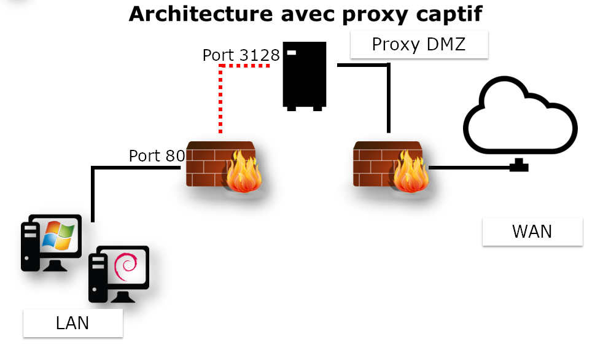
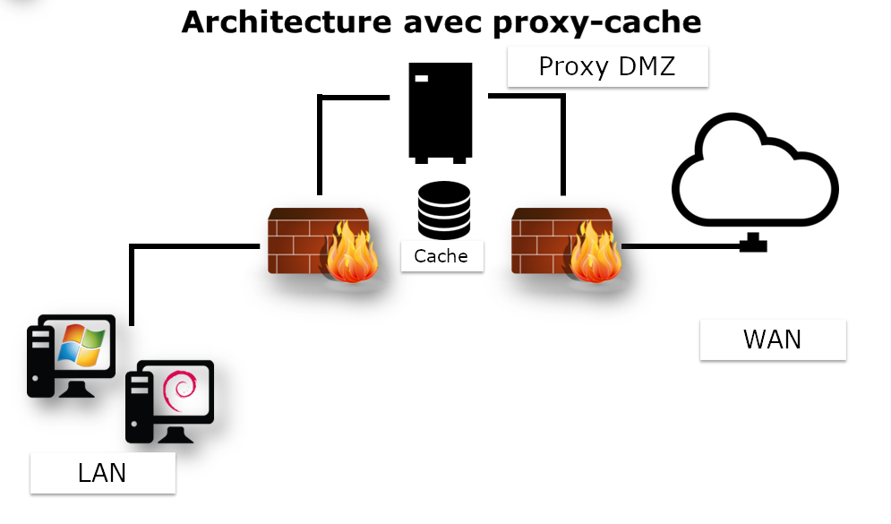
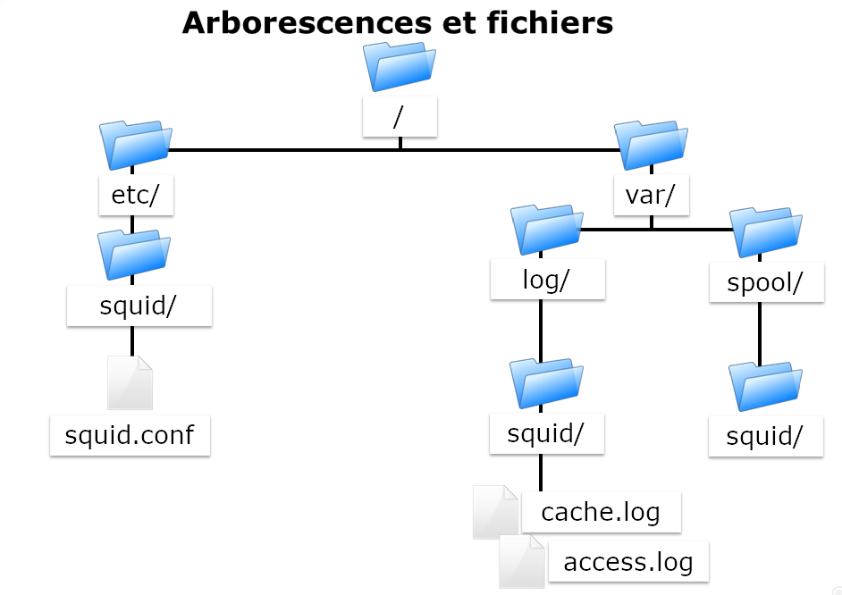

////
Les supports de Formatux sont publiés sous licence Creative Commons-BY-SA et sous licence Art Libre.
Vous êtes ainsi libre de copier, de diffuser et de transformer librement les œuvres dans le respect des droits de l’auteur.

    BY : Paternité. Vous devez citer le nom de l’auteur original.
    SA : Partage des Conditions Initiales à l’Identique.

Licence Creative Commons-BY-SA : https://creativecommons.org/licenses/by-sa/3.0/fr/
Licence Art Libre : http://artlibre.org/

Auteurs : Patrick Finet, Xavier Sauvignon, Antoine Le Morvan
////

= Serveur proxy SQUID

== Principes de fonctionnement 

La mise en place d’un serveur proxy nécessite de choisir entre deux types d’architectures :

* Une architecture proxy standard, qui nécessitera une configuration spécifique de chaque client et de leurs navigateurs internet,
* Une architecture dite proxy captif, qui nécessitera l’interception des trames émises par le client et de les réécrire vers le serveur proxy.

Dans un cas comme dans l’autre, il y a rupture au niveau du réseau.

Un client ne peut physiquement plus s’adresser directement à un serveur distant, sans passer par un mandataire, appelé plus couramment serveur proxy.

Le poste client est protégé par deux pare-feux et ne communique jamais directement vers le réseau extérieur.

[NOTE]
====
Cette architecture nécessite la configuration du navigateur sur le poste client.
====

Dans le cas du proxy captif, il n’y a pas de nécessité de configurer l’ensemble des postes clients.

La configuration se passe au niveau de la passerelle, qui reçoit les demandes des clients, et qui va, de manière totalement transparente, réécrire les trames pour les envoyer vers le proxy.

[NOTE]
====
Cette architecture nécessite une configuration spécifique sur le routeur.
====

Dans le cas de l’architecture proxy standard ou du proxy captif, l’un des premiers intérêts de ce genre de service est bien évidemment de faire office de cache.

Ainsi, un fichier qui aura été téléchargé une première fois depuis le WAN (et donc potentiellement une liaison plus lente que le LAN), sera conservé en mémoire par le proxy-cache pour être resservi au profit des clients suivants. Ainsi, la bande passante de la liaison lente est optimisée.

Comme nous le verrons dans la suite de ce chapitre, ce n’est bien évidemment pas la seule utilité d’un proxy.

Un proxy pourra être déployé pour :

* Interdire l’accès à certaines ressources en fonction de différents paramètres,
* Mettre en place une authentification et un suivi des activités sur internet des clients,
* Mettre en place une hiérarchie de cache distribués,
* Masquer l’architecture du LAN d’un point de vue WAN (combien y a-t-il de clients sur le LAN ?).

Les intérêts sont multiples :

* Anonymat sur Internet ;
* Authentification ;
* Journaliser les activités des clients ;
* Filtrage ;
* Limiter les accès ;
* Optimisation de la bande passante ;
* Sécurité.

[NOTE]
====
Mettre en place l'authentification bloque une grande partie des effets malveillants des virus sur le LAN.
====

[CAUTION]
====
Le service proxy devient un service critique nécessitant une haute disponibilité.
====

Durant l’exploitation d’un serveur Proxy Squid, l’administrateur est amené à exploiter les logs. Il est donc primordiale de connaitre les principaux codes réponses HTTP.

.Les codes réponses HTTP
[width="100%",options="header"]
|====================
| Code | Catégories
| 1XX | Info 
| 2XX | Succès
| 3XX | Redirection 
| 4XX | Erreur de requête client 
| 5XX | Erreur sur le serveur
|====================

Exemples :

* 200 : ok
* 301 : Moved Permanently
* 302 : Moved Temporatly
* 304 : Not modified
* 400 : Bad request
* 401 : Unauthorized
* 404 : Not found

== Le serveur SQUID

Squid prend en charge les protocoles http et ftp.

Les intérêts d'installer une solution basée sur le serveur Squid :

* Les solutions matérielles sont coûteuses ;
* Il est développé depuis 1996 ;
* Il est publié sous licence GNU/GPL.

=== Dimensionnement

* Prévoir des solutions de haute disponibilité ;
* Privilégier des disques durs rapides pour le cache ;
* Mémoire vive et CPU correctement dimensionnés.

[NOTE]
====
Il faut prévoir 14Mo de RAM par Go de cache sur le disque.
====

=== Installation

L’installation du serveur Squid se fait avec le paquet squid.

[source,bash]
----
yum install squid
chkconfig squid on
----

[TIP]
====
Attention à ne pas démarrer le service tant que le cache n’a pas été initialisé !
====

=== Arborescence et fichiers du serveur Squid

Le fichier de configuration unique est le fichier */etc/squid/squid.conf*.

Les logs du service (arrêt et relance) sont enregistré dans le fichier */var/log/squid.cache.log* tandis que les requêtes des clients **/var/log/squid/access.log**.
Les fichiers de cache seront par défaut stockés dans **/var/spool/squid/**.

.Arborescence et fichiers du serveur Squid

=== La commande squid

Commande squid permet de contrôler le serveur squid.

.Syntaxe de la commande squid
[source,]
----
squid [-z|-s|-k parse|-k rotate]
----

[cols="1,4",options="header"]
|====
| Option  |  Description 
| -z | Initialise les répertoires du cache
| -s | Active la journalisation syslog
| -k parse | Test le fichier de configuration
| -k rotate | Effectue une rotation des logs
|====

Journaliser les requêtes clientes peut rapidement entraîner le stockage des volumes conséquents de données.

Il est opportun de régulièrement créer un nouveau fichier de log et d’archiver l’ancien dans un format compressé.

Cette action peut être effectuée manuellement avec l’option *–k rotate* de la commande squid ou via le service Linux dédié **Logrotate**.

== Configuration basique

La configuration de Squid se fait dans le fichier de configuration */etc/squid/squid.conf*.

* Numéro de port du proxy (port d'écoute)

.Syntaxe de la directive http_port
[source,]
----
http_port num_port
----

[NOTE]
====
Par défaut, le numéro de port est fixé à 3128 mais il est fréquemment changé à 8080. Il faudra penser à ouvrir le port correspondant du pare-feu !
====

Par exemple :
[source,]
----
http_port 8080
----

Au redémarrage du service, le serveur Squid se mettra en écoute sur le port défini par la directive http_port.

* Réservation de la mémoire vive

.Syntaxe de la directive cache_mem
[source,]
----
cache_mem taille KB|taille MB|taille GB
----

Par exemple :

[source,]
----
cache_mem 1 GB
----

[TIP]
====
Bonne pratique : 1/3 du total de la mémoire vive allouée
====

* Protocole de Cache Internet (ICP)

Le protocole ICP (Internet Cache Protocol) permet aux serveurs Squid voisins de s'échanger des requêtes. Il est courant de proposer une hiérarchie de proxy qui se partagent leurs bases d’informations.

La directive icp_port permet de définir le numéro de port sur lequel Squid envoie et reçoit les requêtes ICP des serveurs Squid voisins.

Par exemple :

[source,]
----
icp_port 3130
----

[TIP]
====
Positionner à 0 pour le désactiver.
====

* Utilisateur FTP anonyme

La directive ftp_user permet d'associer un utilisateur FTP aux connexions FTP anonymes. L'utilisateur dit être une adresse de messagerie valide.

[source,]
----
ftp_user bob@formatux.lan
----

* Mettre en place des Access Control List

.Syntaxe des ACL
[source,]
----
acl nom type argument
http_access allow|deny nomacl
----

Exemple :

[source,]
----
acl REPAS time 12:00-14:00
http_access deny REPAS
----

Les ACL sont étudiées plus en détail dans la partie "Configuration avancée".

* Taille maximum d’un objet en cache

.Syntaxe de la directive maximum_object_size
[source,]
----
maximum_object_size size
----

Exemple :

[source,]
----
maximum_object_size 32 MB
----

Si la taille de l’objet est supérieur à la limite maximum_object_size, l’objet n’est pas conservé en cache.

* Nom du serveur proxy

.Syntaxe de la directive visible_hostname
[source,]
----
visible_hostname nom
----

Exemple :

[source,]
----
visible_hostname proxysquid
----

[NOTE]
====
La valeur fournie peut être différente du nom d’hôte.
====

* Définir un cache pour squid

[source,]
----
cache_ufs format chemin taille nbDossierNiv1 nbDossierNiv2
----

Plusieurs caches peuvent être définis sur différents systèmes de fichiers pour optimiser les temps d’accès.

Exemple :

[source,]
----
cache_dir ufs /var/spool/squid/ 100 16 256
----

[cols="1,4",options="header"]
|====
| Option  |  Description 
| ufs | Unix File System
| 100 | Taille en méga
| 16  | 16 dossiers de premier niveau
| 256 | 256 dossiers de second niveau
|====

Au premier lancement du service, il faut initialiser le dossier de cache :

[source,]
----
[root]# squid -z
[root]# service squid start
----

== Configurations avancées

=== Les Access Control List (ACL)

.Syntaxe de la directive http_access
[source,]
----
http_access allow|deny [!]nom_acl
----

Exemple :
[source,]
----
http_access allow REPAS
http_access deny !REPAS
----

[NOTE]
====
L’ACL !nom_acl est le contraire de l’ACL nom_acl.
====

.Syntaxe de la directive acl 
[source,]
----
acl nom type argument
----

L’ordre des ACL est cumulatif. Plusieurs ACL de même nom représentent une seule ACL.

Exemples :

* Autoriser à l’heure des repas :
[source,]
----
acl REPAS time 12:00-14:00
http_access allow REPAS
----

* Interdire les vidéos :
[source,]
----
acl VIDEOS rep_mime_type video/mpeg
acl VIDEOS rep_mime_type video/avi
http_access deny VIDEOS
----

* Gestion des adresses IP :
[source,]
----
acl XXX src 192.168.0.0/255.255.255.0
acl XXX dst 10.10.10.1
----

* Gestion des FQDN :
[source,]
----
acl XXX srcdomain .formatux.lan
acl XXX dstdomain .linux.org
----

* Gestion des ports :
[source,]
----
acl XXX port 80 21
----

* Gestion des protocoles :
[source,]
----
acl XXX proto HTTP FTP
----

=== Les algorithmes de cache

Il existe différents algorithmes de cache qui disposent de caractéristiques différentes :

* LRU - *Least Recently Used* : supprime les objets les plus anciens de la mémoire vive.
* LRU-THOLD : copie en fonction de sa taille un objet dans le cache.
* MRU : *Most Recently Used* : les données les moins demandées sont supprimées. 
* GDSF : *Greedy Dual Size Frequency* : supprime en fonction de la taille et du temps d’accès d’origine. Les plus petits sont conservés.
* LFUDA : *Least Frequently Used With Dynamic Aging* : idem que GDSF sans notion de taille. Utile pour les caches avec des fichiers de grande taille.

== Authentification des clients

Squid s’appuie sur des programmes externes pour gérer l’authentification. Il peut ainsi s’appuyer sur un simple fichier plat type htpasswd ou sur un service LDAP, SMB, PAM, etc.

L’authentification peut être une nécessité juridique : pensez à faire signer une charte d’usage à vos utilisateurs !

== Outils

=== La commande squidclient

La commande squidclient permet de tester une requête vers le serveur squid.

.Syntaxe de la commande squidclient
[source,]
----
squidclient [–s] [-h cible] [-p port] url
----

Exemple :
[source,]
----
squidclient –s –h localhost –p 8080 http://localhost/
----

[cols="1,4",options="header"]
|====
| Option  |  Description 
| -s | Mode silencieux (n’affiche rien dans la console)
| -h | Définir un proxy cible
| -p | Port d’écoute (par défaut 3128)
| -r | Forcer le serveur à recharger l’objet
|====

=== Analyser les logs

Les enregistrements du journal de Squid peuvent être suivi avec la commande :

[source,]
----
tail –f /var/log/squid/access.log
----

* Décomposition d’une ligne de log

[cols="1,4",options="header"]
|====
| Option  |  Description 
| Date | Horodatage du log
| Tps reponse | Temps de réponse pour la requête
| @ client | Adresse IP du client
| Code status | Code HTTP de la réponse
| Taille | Taille du transfert
| Méthode | Méthode HTTP (Put / Get / Post / etc.)
| URL | URL de la requête
| Peer Code | Code de réponse inter-proxy
| Type fichier | Type mime de la cible de la requête
|====

=== La commande sarg

La commande sarg (*Squid Analysis Report Generator*) permet de générer un rapport au format HTML.

.Syntaxe de la commande sarg
[source,]
----
sarg -x
----

* Installer sarg :
[source,]
----
[root]# yum install httpd
[root]# yum install sarg
----

* Configurer sarg :
[source,]
----
[root]# vim /etc/sarg/sarg.conf
access_log /var/log/squid/access.log
----

Le rapport est généré sous **/var/www/html/squid_reports/**.

=== SquidGuard

SquidGuard permet de filtrer les URLs à partir de blacklists (éventuellement disponibles sur Internet).

Sa mise en œuvre dépasse toutefois le cadre de ce support.