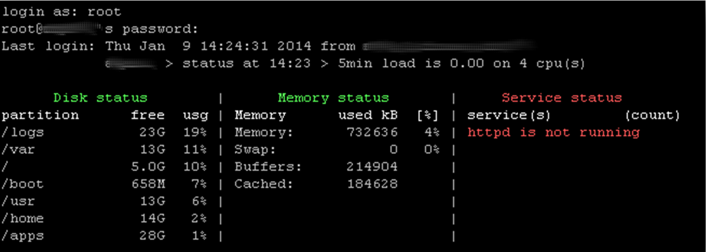
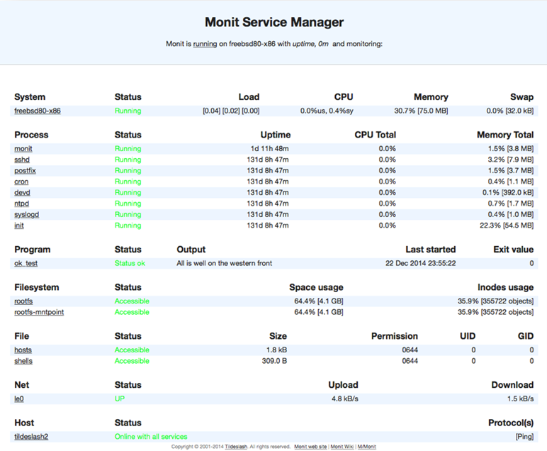

= Supervision informatique

Objectifs de ce cours :

* choisir un logiciel de supervision autonome ;
* centraliser les logs des serveurs ;
* mettre en oeuvre les principales technologies utilisées dans le domaine de la supervision.

== Introduction

Si la fonctionnalité première de la supervision est de pouvoir détecter un fonctionnement anormal d’un service ou d’être pro-actif, c’est-à-dire d’intervenir avant que la panne n’arrive, ce qui est possible par exemple pour un système de fichiers qui se rempli anormalement, ou pour un service qui consommerait trop de mémoire vive, de nouvelles applications sont également apparues :

* La réalisation de tableaux de bord à destination des décideurs,
* Le stockage de métriques permettant la métrologie mais également la détection de fonctionnement anormaux (flux anormaux, etc.),
* La cartographie des flux et l’inventaire des parcs.

Dans tous les cas, la mise en place d’une supervision permettra une meilleur qualité de service et donc d’un meilleur service aux clients.

Pourquoi vouloir superviser mes serveurs ?

* Faciliter l'administration,
* Détecter un fonctionnement anormal,
* Service aux clients,
* Cartographie des flux,
* Inventaire du parc,
* Amélioration continue,
* Etre pro-actif,
* Métrologie,
* Qualité de serivce,
* Tableau de bord.

[CAUTION]
====
"Mieux vaut prévenir que guérir" **mais attention** : "Trop d'information, tue l'information !"
====

Que peut-on superviser ?

* Le CPU,
* La consommation de la mémoire,
* L'espace disque,
* Les processus,
* La température,
* Le matériel,
* Les protocoles,
* La bande passante,
* Les onduleurs,
* Les services,
* ...

=== Les acteurs de la supervision

Le monde libre offre de nombreuses solutions éprouvées :

* Shinken,
* Centreon,
* Nagvis,
* Naemon,
* Monit,
* Zabbix,
* Munin,
* Icinga,
* Cacti,
* Nagios (logiciel historique),
* ELK (Elasticsearch Logstash and Kibana),
* Dashing.io
* Loganalyser,
* MotdStats,
* ...

=== Les protocoles et logiciels clients de supervisions

* Windows : NSClient++
* Linux : Nrpe
* SNMP :
** Check actif
** Trap SNMP

*indexterm2:[SNMP]* (Simple Network Management Protocol) est un protocole de couche applicative de supervision de réseaux, conçu par l’IETF en 1988, reposant sur UDP (port 161). 

Ce protocole a évolué pour des raisons de sécurité : 

* la version 2 utilise un nom de communauté comme mot de passe ;
* la version 3 ajoute un système de chiffrement ;

Entre les agents et le serveur, il existe 3 opérations :

* La requête d’un serveur vers un agent (check actif) ;
* La réponse du client vers le serveur ;
* L’alarme générée par le client (Traps).

Il existe 4 types de requêtes du serveur :

* *GetRequest* : demande la valeur d’une variable à un agent
* *GetNextRequest* : demande la valeur suivante de la variable
* *GetBulk* : demande un ensemble de variables regroupées
* *SetRequest* : demande la modification de la valeur d’une variable sur un agent.

SNMP utilisant des noms de variables devant être identiques sur l’ensemble des agents, une base de données a été créé : la *indexterm2:[MIB]* (Managed Information Base). Chaque information est identifiée par un *indexterm2:[OID]* (Object IDentifier).

*indexterm2:[NRPE]* est un agent de supervision.

1) Le plugin installé sur le serveur Nagios initie une connexion vers le démon NRPE distant.
2) Le démon NRPE exécute le plugin demandé.
3) Le démon retourne au serveur Nagios le code de retour de l’exécution du plugin ainsi que la sortie standard.

*indexterm2:[NSClient++]* est un service pour toutes versions de Windows qui combine les fonctionnalités d’un agent de supervision et les fonctions de transport NRPE.

Il est considéré comme l’agent de supervision standard pour la supervision Nagios, via le plugin appelé chech_nt.

== Supervision locale

=== Le script **MOTDStats** (Message Of The Day)

[source,bash]
----
/usr/bin/motdstat --generate
----

* Affiché à la connexion (Message Of The Day),
* Superviser les disques, la mémoire, les processus,
* Visualisation de l'état global du système.

Avant de mettre en place des solutions lourdes en administration, de petits outils permettent déjà d’assurer un minimum de supervision.

C’est le cas de MOTDStats (MOTD = Message Of The Day), qui est un script bash venant mettre à jour cycliquement le contenu du fichier MOTD. Le contenu du fichier MOTD peut être affiché à la connexion d’un utilisateur SSH.

En prenant la main sur un serveur, un administrateur dispose d’une synthèse de l’état du système, ce qui peut le guider dans son dépannage (Système de fichiers plein ? Service tombé ? etc.).

Dans l’exemple présenté, l’administrateur constatera rapidement que le service httpd n’est pas lancé.

Dans la même catégorie que MOTDStats, l’administrateur pourra choisir **Glances**.

=== Le service Monit

Le service indexterm2:[Monit] est un outil libre de supervision pour Linux. En plus d’une interface CLI (Command Line Interface), Monit propose une interface Web native qui permet de configurer des réactions face à un évènement (arrêt ou relance automatique de services, etc.).

Monit est spécialisé dans la maintenance automatique de services.

Monit peut effectuer la maintenance et la réparation automatique des services, en effectuant par exemple des actions causales dans des situations d’erreurs.

Sur un serveur d’application Java, Monit pourra relancer automatiquement le service Tomcat, Glassfish ou Jboss en cas de dépassement de mémoire.

=== Rediriger les messages du système

Le système génère des mails vers root ou vers les utilisateurs systèmes (oracle, glassfish, etc.). Ces mails doivent être lus avec attention.

.Configuration de la redirection des messages du système par le fichier /etc/aliases
[source,]
----
root: bob@formatux.lan
oracle: alice@formatux.lan
----

=== Le logiciel logwatch

Le système génère des logs qu’il faut surveiller. Le logiciel indexterm2:[logwatch] les analyse et génère un rapport quotidien qu'il envoie à l'administrateur.

[source,bash]
----
[root]# yum install logwatch
----

Logwatch va lire quotidiennement les logs de votre serveur pour en extraire les informations du jour, les trie et vous envoie un résumé par mail.

Les logs des services étant généralement très copieux, un outil tel Logwatch (couplé avec la redirection des mails) est nécessaire pour rester informer en un seul coup d’œil.

Voici un exemple de rapport :

[source,]
----
 ################### Logwatch 7.3.6 (05/19/07) #################### 
        Processing Initiated: Fri Oct 23 10:10:04 2015
        Date Range Processed: yesterday
                              ( 2015-Oct-22 )
                              Period is day.
      Detail Level of Output: 0
              Type of Output: unformatted
           Logfiles for Host: srv-instructeurs.etrs.lan
  ################################################################## 
 
 --------------------- Selinux Audit Begin ------------------------ 

 
 ---------------------- Selinux Audit End ------------------------- 

 
 --------------------- Automount Begin ------------------------ 

  
 ---------------------- Automount End ------------------------- 

 
 --------------------- Cron Begin ------------------------ 

 
 ---------------------- Cron End ------------------------- 

 
 --------------------- httpd Begin ------------------------ 

 
 Requests with error response codes
    403 Forbidden
       /: 1 Time(s)
    404 Not Found
       /favicon.ico: 2 Time(s)
 
 ---------------------- httpd End ------------------------- 

 
 --------------------- Init Begin ------------------------ 

 
 ---------------------- Init End ------------------------- 

 
 --------------------- Named Begin ------------------------ 

 
 Received control channel commands
    reload: 8 Time(s)
    stop: 7 Time(s)
  
 ---------------------- Named End ------------------------- 

 
 --------------------- pam_unix Begin ------------------------ 

 su-l:
    Authentication Failures:
    Sessions Opened:
       pupitre -> root: 1 Time(s)
 
 sudo:
    Authentication Failures:
 
 
 ---------------------- pam_unix End ------------------------- 

 
 --------------------- Postfix Begin ------------------------ 

    3.957K  Bytes accepted                             4,052
    3.957K  Bytes delivered                            4,052
 ========   ================================================
 
        4   Accepted                                 100.00%
 --------   ------------------------------------------------
        4   Total                                    100.00%
 ========   ================================================
 
        4   Removed from queue    
        2   Sent via SMTP         
        2   Forwarded             
 
        6   Postfix start         
        6   Postfix stop          
        1   Postfix waiting to terminate 
 
 
 ---------------------- Postfix End ------------------------- 

 
 --------------------- Connections (secure-log) Begin ------------------------ 

 New Users:
    postgres (26)
 
 New Groups:
    postgres (26)

 
    groupadd: group added to /etc/group: name=postgres, GID=26: 1 Time(s)
    groupadd: group added to /etc/gshadow: name=postgres: 1 Time(s)
    webmin: Successful login as pupitre from 172.16.96.232: 1 Time(s)
 
 ---------------------- Connections (secure-log) End ------------------------- 

 
 --------------------- SSHD Begin ------------------------ 

 
 ---------------------- SSHD End ------------------------- 

 
 --------------------- Sudo (secure-log) Begin ------------------------ 

 

 ---------------------- Sudo (secure-log) End ------------------------- 

 
 --------------------- yum Begin ------------------------ 

 
 Packages Installed:
    postgresql-libs-8.4.20-3.el6_6.x86_64
    postgresql-server-8.4.20-3.el6_6.x86_64
    postgresql-8.4.20-3.el6_6.x86_64
    1:mod_ssl-2.2.15-47.el6.centos.x86_64
    1:net-snmp-libs-5.5-54.el6_7.1.x86_64
    policycoreutils-python-2.0.83-24.el6.x86_64
 
 ---------------------- yum End ------------------------- 

 
 --------------------- Disk Space Begin ------------------------ 

 Filesystem            Size  Used Avail Use% Mounted on
 /dev/mapper/vg_root-lv_root
                        27G  3.7G   22G  15% /
 /dev/sda1             485M   34M  426M   8% /boot
 /dev/sdb1             488M  154M  310M  34% /BoiteAOutils
 
 
 ---------------------- Disk Space End ------------------------- 

 
 ###################### Logwatch End ######################### 
----

== Centraliser les logs

== Le protocole SNMP

== Supervision centralisée