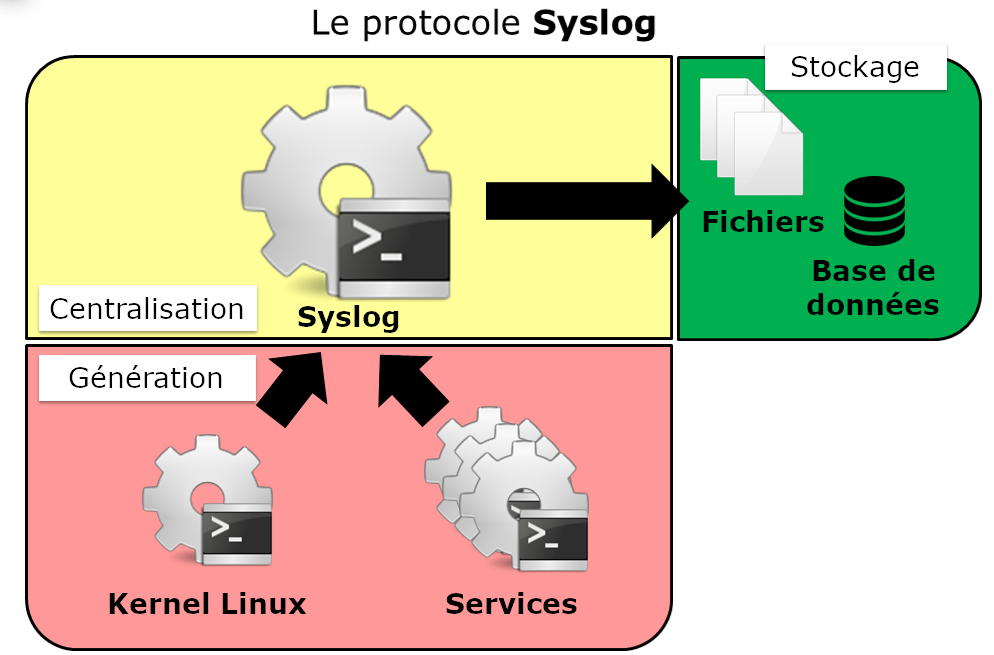
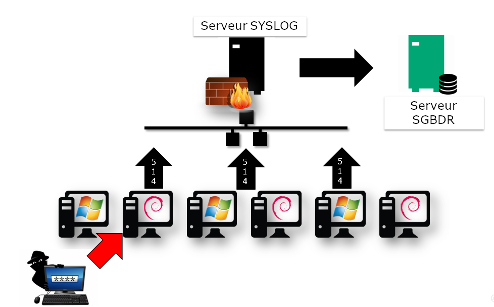
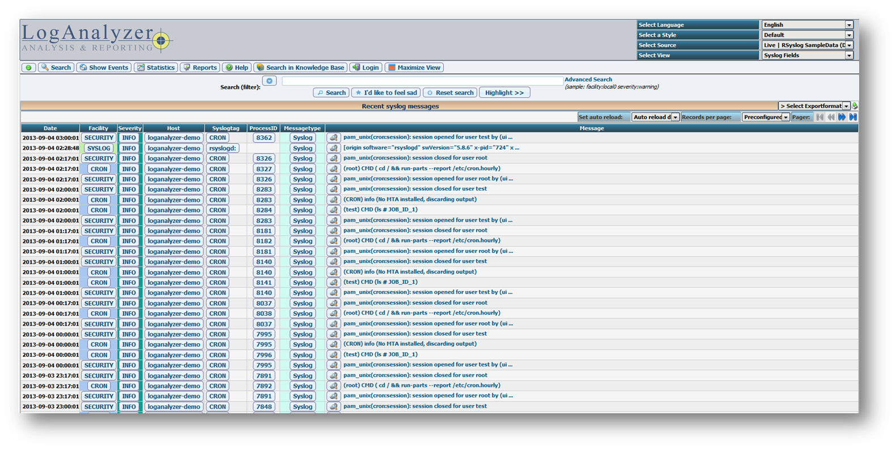

////
Les supports de Formatux sont publiés sous licence Creative Commons-BY-SA et sous licence Art Libre.
Vous êtes ainsi libre de copier, de diffuser et de transformer librement les œuvres dans le respect des droits de l’auteur.

    BY : Paternité. Vous devez citer le nom de l’auteur original.
    SA : Partage des Conditions Initiales à l’Identique.

Licence Creative Commons-BY-SA : https://creativecommons.org/licenses/by-sa/3.0/fr/
Licence Art Libre : http://artlibre.org/

Auteurs : Patrick Finet, Xavier Sauvignon, Antoine Le Morvan
////

= Serveur de log Syslog

Le système génère des logs qu’il faut surveiller pour la sécurité du système ou pour réagir avant la panne.

Sous Linux, c'est le rôle du protocole Syslog.

== Généralités

Syslog est le protocole de journalisation standard sous Linux. Syslog gère le journal d’événement Linux, que ce soit pour le noyau Linux ou pour les services hébergés sur la station.

* Les logs peuvent être archivés localement (dans ce cas il faut prévoir une rotation des logs). 
* Syslog peut également fonctionner en local en mode client/serveur. Syslog utilise le port 514 en UDP ou TCP pour sa communication réseau.

Exemple de fichier /var/log/messages :
[source,]
----
Nov 23 08:30:00 centos6 dhcp service[warning] 110 message
----

Sous CentOS 6, c'est le logiciel rsyslog qui est utilisé pour gérer les logs du système. A noter que la syntaxe rsyslog est compatible avec les clients syslog standard (syslog, syslog-ng), mais l’inverse n’est pas vrai.

Un journal au format syslog comporte dans l'ordre les informations suivantes : 

* la date à laquelle a été émis le log,
* le nom de l'équipement ayant généré le log (hostname),
* une information sur le processus qui a déclenché cette émission,
* le niveau de priorité du log,
* un identifiant du processus ayant généré le log
* le corps de message.

Certaines de ces informations sont optionnelles.

.Fonctionnement du protocole Syslog

Le serveur Syslog centralise les messages du kernel Linux ou des services dans des fichiers. Des modules existent pour rediriger les logs vers une base de données.

En mode client/serveur, les clients envoient leurs logs vers un serveur syslog sur le port 514. Ce serveur peut ensuite stocker les logs de ses clients vers un serveur de base de données.

.Mise en réseau du protocole Syslog

Ainsi, un attaquant ne peut pas effacer ces traces qui sont déportées sur un serveur distant.

=== Les catégories de messages

Les messages sont orientés selon leur origine et leur gravité (origine.gravité).

.Origine des messages Syslog
[cols="1,1,4",options="header"]
|====
| Code | Mot-clé | Description
| 0 | kern | kernel messages
| 1 | user | user-level messages
| 2 | mail | mail system
| 3 | daemon | system daemons
| 4 | auth   | security/authorization messages
| 5 | syslog | messages generated internally by syslogd
| 6 | lpr    | line printer subsystem
| 7 | news   | network news subsystem
| 8 | uucp   | UUCP subsystem
| 9 |        | clock daemon
| 10 | authpriv | security/authorization messages
| 11 | ftp   |   FTP daemon
| 12 | -   |   NTP subsystem
| 13 | -   |   log audit
| 14 | -   |   log alert
| 15 | cron   |   clock daemon
| 16 | local0   |   local use 0 (local0)
| 17 | local1   |   local use 1 (local1)
| 18 | local2   |   local use 2 (local2)
| 19 | local3   |   local use 3 (local3)
| 20 | local4   |   local use 4 (local4)
| 21 | local5   |   local use 5 (local5)
| 22 | local6   |   local use 6 (local6)
| 23 | local7   |   local use 7 (local7)
|====

.Gravité des messages syslog
[cols="1,1,1,3",options="header"]
|====
|   Code   |   Gravité |   Mot-clé	|	Description
| 0	| Emergency     | emerg (panic)	| Système inutilisable.
| 1	| Alert	        | alert	        | Une intervention immédiate est nécessaire.
| 2	| Critical      | crit		    | Erreur critique pour le système.
| 3	| Error	        | err (error)	| Erreur de fonctionnement.
| 4	| Warning	    | warn (warning)| Avertissement (une erreur peut intervenir si aucune action n'est prise).
| 5	| Notice	    | notice		| Événement normal méritant d'être signalé.
| 6	| Informational	| info		    | Pour information.
| 7	| Debugging		| debug		    | Message de mise au point.
|====

== Client Syslog

La configuration du client et du serveur rsyslog est centralisée dans le fichier */etc/rsyslog.conf*.

Après toute modification il faut redémarrer le service :

[source,]
----
service rsyslog restart
----

La commande logger génère une ligne de log.

.Syntaxe de la commande logger
[source,]
----
logger texte
----

Exemple :

[source,]
----
logger "====> Marqueur"
----

.Fichier /var/log/messages après exécution de la commande logger
[source,]
----
Nov 23 08:30:00 centos6 stagiaire ====> Marqueur
----

Il est possible de rediriger les logs du client vers le serveur :

.Modification du fichier /etc/rsyslog.conf pour envoyer les logs vers le réseau
[source,]
----
*.* 	@IPServeur:514
----

[source,]
----
service rsyslog restart
logger test
----

Le message test est envoyé vers le serveur.

[TIP]
====
@IPServeur = UDP
@IPServeur = TCP 
====

Pour différentier une redirection en TCP d’une redirection en UDP, il faudra doubler l’arobase présent devant l’adresse IP du serveur.

Par exemple :

[source,]
----
mail.err* @@172.16.96.203 
----

Après avoir ajouté cette ligne, le service syslog enverra les logs de la catégorie mail d’un niveau de gravité supérieur à erreur vers le serveur syslog 172.16.96.203 en TCP.

=== La commande logwatch

La commande logwatch effectue une synthèse journalière des logs et l'envoie par message.

Installation : 
[source,]
----
yum install logwatch
----

LogWatch analyse pour vous quotidiennement les logs pour en extraire les informations du jour, les trie et vous envoie une synthèse quotidienne.

Les logs des services étant généralement très copieux, un outil tel Logwatch (couplé avec la redirection des mails) est nécessaire pour rester informé en un seul coup d’œil.

Voici un exemple de rapport :

[source,]
----
 ################### Logwatch 7.3.6 (05/19/07) #################### 
        Processing Initiated: Fri Oct 23 10:10:04 2015
        Date Range Processed: yesterday
                              ( 2015-Oct-22 )
                              Period is day.
      Detail Level of Output: 0
              Type of Output: unformatted
           Logfiles for Host: srv-instructeurs.formatux.lan
  ################################################################## 
 
 --------------------- Selinux Audit Begin ------------------------ 

 
 ---------------------- Selinux Audit End ------------------------- 

 
 --------------------- Automount Begin ------------------------ 

  
 ---------------------- Automount End ------------------------- 

 
 --------------------- Cron Begin ------------------------ 

 
 ---------------------- Cron End ------------------------- 

 
 --------------------- httpd Begin ------------------------ 

 
 Requests with error response codes
    403 Forbidden
       /: 1 Time(s)
    404 Not Found
       /favicon.ico: 2 Time(s)
 
 ---------------------- httpd End ------------------------- 

 
 --------------------- Init Begin ------------------------ 

 
 ---------------------- Init End ------------------------- 

 
 --------------------- Named Begin ------------------------ 

 
 Received control channel commands
    reload: 8 Time(s)
    stop: 7 Time(s)
  
 ---------------------- Named End ------------------------- 

 
 --------------------- pam_unix Begin ------------------------ 

 su-l:
    Authentication Failures:
    Sessions Opened:
       pupitre -> root: 1 Time(s)
 
 sudo:
    Authentication Failures:
 
 
 ---------------------- pam_unix End ------------------------- 

 
 --------------------- Postfix Begin ------------------------ 

    3.957K  Bytes accepted                             4,052
    3.957K  Bytes delivered                            4,052
 ========   ================================================
 
        4   Accepted                                 100.00%
 --------   ------------------------------------------------
        4   Total                                    100.00%
 ========   ================================================
 
        4   Removed from queue    
        2   Sent via SMTP         
        2   Forwarded             
 
        6   Postfix start         
        6   Postfix stop          
        1   Postfix waiting to terminate 
 
 
 ---------------------- Postfix End ------------------------- 

 
 --------------------- Connections (secure-log) Begin ------------------------ 

 New Users:
    postgres (26)
 
 New Groups:
    postgres (26)

 
    groupadd: group added to /etc/group: name=postgres, GID=26: 1 Time(s)
    groupadd: group added to /etc/gshadow: name=postgres: 1 Time(s)
    webmin: Successful login as pupitre from 172.16.96.232: 1 Time(s)
 
 ---------------------- Connections (secure-log) End ------------------------- 

 
 --------------------- SSHD Begin ------------------------ 

 
 ---------------------- SSHD End ------------------------- 

 
 --------------------- Sudo (secure-log) Begin ------------------------ 

 

 ---------------------- Sudo (secure-log) End ------------------------- 

 
 --------------------- yum Begin ------------------------ 

 
 Packages Installed:
    postgresql-libs-8.4.20-3.el6_6.x86_64
    postgresql-server-8.4.20-3.el6_6.x86_64
    postgresql-8.4.20-3.el6_6.x86_64
    1:mod_ssl-2.2.15-47.el6.centos.x86_64
    1:net-snmp-libs-5.5-54.el6_7.1.x86_64
    policycoreutils-python-2.0.83-24.el6.x86_64
 
 ---------------------- yum End ------------------------- 

 
 --------------------- Disk Space Begin ------------------------ 

 Filesystem            Size  Used Avail Use% Mounted on
 /dev/mapper/vg_root-lv_root
                        27G  3.7G   22G  15% /
 /dev/sda1             485M   34M  426M   8% /boot
 /dev/sdb1             488M  154M  310M  34% /BoiteAOutils
 
 
 ---------------------- Disk Space End ------------------------- 

 
 ###################### Logwatch End ######################### 

----

== Serveur Syslog

L’architecture de rsyslog est modulaire. Pour activer son mode serveur, il faut charger le module UDP ou TCP et le mettre en écoute sur le port 514 sans oublier de relancer le service.

.Activer les serveurs UDP et TCP rsyslog
[source,bash]
----
vim /etc/rsyslog.conf
$ModLoad imudp
$UDPServerRun 514

$ModLoad imtcp
$InputTCPServerRun 514
----

[source,bash]
----
service rsyslog restart

netstat –tapn | grep 514
udp  0  0  0.0.0.0:514  0.0.0.0:*  LISTEN 3172/rsyslog
----

=== Stocker les logs dans des fichiers différenciés

Les modifications a apporter au fichier /etc/rsyslog.conf sont les suivantes :

[source,bash]
----
## Rules
$template syslog,"/var/log/%fromhost%.log"

mail.* ?syslog
----

Explications :

* *$template* : définir un template qui s'appelera *syslog*
* la variable *%fromhost%* contient le nom du client à l'origine du message
* *mail.** correspond à tout les messages d'origine mail qui seront redirigés vers le template que nous avons appelé syslog (?syslog)

== Stockage en base de données

Il est particulièrement intéressant de stocker les enregistrements syslog en base de données. Il est ensuite possible de visualiser les logs dans des interfaces web spécialisées (ici LogAnalyzer) :

.Interface du logiciel LogAnalyzer

Installer le module MySQL :

[source,bash]
----
yum install rsyslog-mysql
----

Configurer le module dans /etc/rsyslog.conf :

[source,]
----
$ModLoad MySQL
*.* > @IPServeur,base,USERMYSQL,PWDMYSQL
----

[NOTE]
====
La création de la base MySQL sort du cadre de ce support.
====

[source,]
----
service rsyslog restart
----
