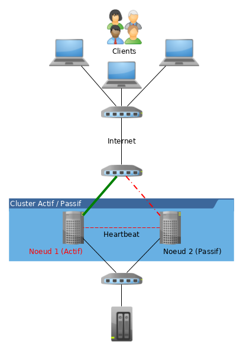
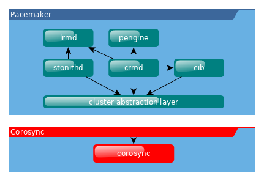

////
Les supports de Formatux sont publiés sous licence Creative Commons-BY-SA et sous licence Art Libre.
Vous êtes ainsi libre de copier, de diffuser et de transformer librement les œuvres dans le respect des droits de l’auteur.

    BY : Paternité. Vous devez citer le nom de l’auteur original.
    SA : Partage des Conditions Initiales à l’Identique.

Licence Creative Commons-BY-SA : https://creativecommons.org/licenses/by-sa/3.0/fr/
Licence Art Libre : http://artlibre.org/

Auteurs : Patrick Finet, Xavier Sauvignon, Antoine Le Morvan
////

= La mise en cluster sous Linux

[quote,wikipedia]
____
La *haute disponibilité* est un terme souvent utilisé en informatique, à propos d'architecture de système ou d'un service pour désigner le fait que cette architecture ou ce service a un taux de disponibilité convenable.
____

Cette disponibilité est une mesure de performance exprimée en pourcentage obtenue par le ration *Durée de fonctionnement* / **Durée total de fonctionnement souhaité**.

.Taux de disponibilité
[width="100%",options="header"]
|====================
| Taux     | Temps d'arrêt annuel
| 90%      | 876 heures
| 95%      | 438 heures
| 99%      | 87 heures et 36 minutes
| 99,9%    | 8 heures 45 minutes 36 secondes
| 99,99%   | 52 minutes, 33 secondes
| 99,999%  | 5 minutes, 15 secondes
| 99,9999% | 31,68 secondes
|====================

La "Haute Disponibilité" (en anglais "**High Availability**" - **indexterm2:[HA]**) concerne donc toutes les mesures prises visant à garantir la plus haute disponibilité d'un service, c'est à dire son bon fonctionnement 24H/24H.

== Généralités

Un *indexterm2:[cluster]* est une **__"grappe d'ordinateurs"__**, un groupe de deux machines ou plus.

.Schéma d'un cluster actif/passif

Un cluster permet :

* le *calcul distribué* utilisant la puissance de calcul de l'ensemble des noeuds,
* la **haute disponibilité**, la continuité de service et le basculement automatique des services en cas de panne d'un noeud.

=== Les types de services

* Services Actif / Passif

L'installation d'un cluster avec deux noeuds actif/passif utilisant Pacemaker et DRBD est une solution à faible coût pour de nombreux cas de figure nécessitant un système de haute disponibilité.

* Services N+1

Grâce à plusieurs noeuds, Pacemaker peut réduire le coût matériel en permettant à plusieurs clusters actif/passif de se combiner et de partager un noeud de secours.

* Services N TO N

Avec un stockage partagé, chaque noeud peut potentiellement être utilisé pour la tolérance de panne. Pacemaker peut également faire fonctionner plusieurs copies des services pour répartir la charge de travail.

* Services Sites Distants

Pacemaker inclus des améliorations pour simplifier la création de clusters sur plusieurs sites.

=== Les VIP

La **indexterm2:[VIP]** est une adresse IP virtuelle. Cette adresse est attribuée à un cluster Actif/Passif. Elle est assignée au noeud du cluster qui est actif. En cas de rupture de service, la VIP est désactivée sur le noeud en échec et activée sur le noeud prenant le relais : c'est la *tolérance de panne* (ou **failover**).

Les clients s'adressent toujours au cluster en utilisant la VIP, ce qui rend transparent à leurs yeux les bascules de serveur actif.

=== Le split-brain

Le _**indexterm2:[split-brain]**_ est le risque principal que peut rencontrer un cluster. Cet état arrive lorsque plusieurs nœuds d'un cluster pense son voisin inactif. Le noeud tente alors de démarrer le service redondant et plusieurs noeuds fournissent alors le même service, ce qui peut entraîner des effets de bords génant (VIP en double sur le réseau, accès concurrent aux données, etc.).

Les solutions techniques possibles pour éviter ce problème sont :

* de séparer le trafic réseau public du trafic réseau du cluster,
* d'utiliser un agrégat de lien (bonding) réseau.

== La gestion des ressources : Pacemaker

*Pacemaker* est la partie logicielle du cluster qui gère ses ressources (les VIP, les services, les données). Il est chargé de faire démarrer, arrêter et superviser les ressources du cluster.
Il est le garant de la haute disponibilité des noeuds.

Pacemaker utilise la couche de message fournit par *corosync* (par défaut) ou par **Heartbeat**.

Pacemaker est composé de *5 composants clés* :

* La base d'information du cluster (Cluster Information Base - **CIB**)
* Le démon de gestion des ressources du cluster (Cluster Resource Management daemon - **CRMd**)
* Le démon de gestion des ressources locales (Local Resource Management daemon - **LRMd**)
* Le moteur de stratégie (Policy Engine - *PEngine* ou **PE**)
* Le démon de protection (Fencing daemon - **STONITHd**)

.Les composants logiciels du cluster

La *CIB* représente la configuration du cluster et l'état en cours de toutes les ressources du cluster. Le contenu de la CIB est automatiquement synchronisé sur le cluster complet et est utilisé par le *PEngine* pour calculer l'état idéal du cluster et comment il doit être obtenu.

La liste des instructions est alors fournie au controlleur désigné (**Designated Controller** - **DC)**. Pacemaker centralise toutes les décisions du cluster en élisant en tant que maître une des instances de **CRMd**.

Le *DC* execute dans l'ordre requis les instructions du *PEngine* en les transmettant soit au *LRMd* local ou aux *CRMd* des autres noeuds via *Corosync* ou **Heartbeat**.

Dans certains cas, il est nécessaire de stopper des noeuds pour protéger les données partagées ou permettre leur récupération. Pour cela, Pacemaker est livré avec **STONITHd**.

=== Stonith

Stonith est un composant de Pacemaker. Il est l'acronyme de *Shoot-The-Other-Node-In-The-Head*, une pratique recommandée pour que le noeud dysfonctionnant soit le plus rapidement isolé (éteint ou au moins déconnecté des ressources partagées), ce qui évite la corruption des données.

Un nœud qui ne répond pas ne signifie pas qu'il n'accède plus aux données. La seule solution pour s'assurer qu'un nœud n'accède plus aux données avant de donner la main à un autre nœud et d'utiliser STONITH, qui va soit éteindre, soit redémarrer le serveur en échec.

STONITH a également un rôle à jouer dans le cas où un service en cluster n'arrive pas à s'arrêter. Dans ce cas, Pacemaker utilise STONITH pour forcer le nœud entier à s'arrêter.

=== La gestion du quorum

Le *quorum* représente le nombre de *noeuds minimum* en fonctionnement qui permettent de valider une décision, comme décider quel noeud de secours doit prendre le relais lorsqu'un des noeuds est en erreur. Pacemaker, par défaut, exige que [underline]#plus de la moitié# des nœuds soient en ligne.

Lorsque des problèmes de communication séparent un cluster en plusieurs groupes de noeuds, le quorum est alors utilisé pour prévenir le démarrage des ressources sur plus de noeuds que prévu. Un cluster a le quorum lorsque plus de la moitié de tous les noeuds étant connus en ligne se retrouvent dans son groupe (noeuds_actifs_groupe > noeuds_total_actifs / 2 )

La décision par défaut lorsque le quorum n'est pas atteint est de désactiver toutes les ressources.

 Exemple de cas :

* Sur un cluster à **deux noeuds**, le quorum ne pouvant *jamais être atteint* en cas de panne d'un noeud, il doit donc être ignoré sous peine que le cluster complet soit stoppé.
* Si un cluster à 5 noeuds est coupé en 2 groupes de 3 et 2 noeuds, le groupe de 3 noeuds disposera du quorum et continuera à gérer les ressources.
* Si un cluster à 6 noeuds est coupé en 2 groupes de 3 noeuds alors aucun groupe ne disposera du quorum. Dans ce cas, le comportement par défaut de pacemaker est de stopper toutes les ressources pour éviter la corruption de données.

== Communication du clusters

Pacemaker s'appuie au choix sur *Corosync* ou *Heartbeat* (du projet linux-ha) pour assurer la communication entre les nœuds et la gestion du cluster.

=== Corosync

*Corosync Cluster Engine*  est une couche de messagerie entre les membres du cluster et intègre des fonctionnalités additionnelles pour l'implémentation de la haute disponibilité au sein des applications. Le projet Corosync est dérivé du projet OpenAIS.

La communication entre les noeuds se fait en mode Client/Serveur via le protocole UDP.

Il permet de gérer des cluster composés de plus de 16 noeuds dans les modes Actif/Passif ou Actif/Actif.

=== Heartbeat

La technologie Heartbeat est plus limitée que Corosync. Il n'est pas possible de créer un cluster de plus de 2 noeuds et les règles de gestion sont moins abouties que son concurrent.

[NOTE]
====
Le choix de pacemaker/corosync aujourd'hui semble plus opportun, c'est le choix par défaut des distributions RedHat, Debian et Ubuntu.
====

== La gestion des données

=== Le raid en réseau drdb

*DRDB* est un driver de périphérique de type *bloc* qui permet la mise en oeuvre de *RAID 1* (mirroir) **via le réseau**.

La mise en oeuvre de DRDB peut être intéressante lorsque des technologies NAS ou SAN ne sont pas disponibles mais que les données doivent tout de même être synchronisées.

=== GFS2

== Ateliers Dirigés Cluster

Ces ateliers dirigés s'appuient sur une infrastructure à deux noeuds :

* Noeud 1 :
** Nom de machine : node1.formatux.fr
** Disque système 10G ou plus
** Disque 2 : 1G (pour DRDB)
** Distribution CentOS7 à jour
** Adresse IP publique : 192.168.1.100
** Adresse IP privée : 192.168.100.100

* Noeud 2 :
** Nom de machine : node2.formatux.fr
** Disque système 10G ou plus
** Disque 2 : 1G (pour DRDB)
** Distribution CentOS7 à jour
** Adresse IP publique : 192.168.1.101
** Adresse IP privée : 192.168.100.101

=== Préparation des hôtes

Sur chaque hôte sera configuré :

* Le fichier /etc/hosts pour assurer la résolution de nom dès le démarrage de la machine et en toute indépendance du serveur DNS
* Le service Corosync
* Le service Pacemaker

A l'issue de cette configuration, les mises en oeuvre de clusters avec VIP, avec services puis avec DRDB pourront être envisagés.

==== Configuration du fichier /etc/hosts

Le fichier _/etc/hosts_ doit permettre la résolution des adresses IP publiques et des adresses IP privées.

Le fichier /etc/hosts ressemblera à l'exemple ci-dessous sur l'ensemble des noeuds du cluster :

.Fichier /etc/hosts
[source,bash]
----
127.0.0.1   localhost localhost.localdomain localhost4 localhost4.localdomain4
::1         localhost localhost.localdomain localhost6 localhost6.localdomain6

192.168.1.100           node1.formatux.fr       node1
192.168.1.101           node2.formatux.fr       node2
192.168.100.100         node1-priv.formatux.fr  node1-priv
192.168.100.101         node2-priv.formatux.fr  node2-priv
----

Depuis le noeud 1, le noeud 2 peut être joint soit par son nom publique ou son nom privé :

[source,bash]
----
$ ping -c 4 node2
$ ping -c 4 node2-priv
----

=== Informations sur les paquets Pacemaker et corosync

Quelques informations sur le paquet pacemaker :

[source,bash]
----
$ yum info pacemaker
Paquets disponibles
Nom                 : pacemaker
Résumé              : Scalable High-Availability cluster resource manager
URL                 : http://www.clusterlabs.org
Licence             : GPLv2+ and LGPLv2+
Description         : Pacemaker is an advanced, scalable High-Availability
                    : cluster resource manager for Corosync, CMAN and/or
                    : Linux-HA.
                    :
                    : It supports more than 16 node clusters with significant
                    : capabilities for managing resources and dependencies.
                    :
                    : It will run scripts at initialization, when machines go up
                    : or down, when related resources fail and can be configured
                    : to periodically check resource health.
----

Grâce à la commande repoquery (voir le chapitre commandes avancées), il est possible de connaître les dépendances du paquet pacemaker :

[source,bash]
----
$ sudo yum install yum-utils
$ repoquery --requires pacemaker
corosync
pacemaker-cli = 1.1.15-11.el7_3.5
resource-agents
...
----

L'installation de pacemaker installera donc automatiquement corosync et une interface CLI pour pacemaker.

Quelques informations sur le paquet corosync :

[source,bash]
----
yum info corosync
Paquets disponibles
Nom                 : corosync
Résumé              : The Corosync Cluster Engine and Application Programming
                    : Interfaces
URL                 : http://corosync.github.io/corosync/
Licence             : BSD
Description         : This package contains the Corosync Cluster Engine
                    : Executive, several default APIs and libraries, default
                    : configuration files, and an init script.
----

=== Installation des logiciels corosync et pacemaker

[source,]
----
# yum install pacemaker
----

* Ouverture du firewall :

[source,]
----
# firewall-cmd --permanent --add-service=high-availability
success
# firewall-cmd --reload
success
----

Les services peuvent maintenant être activés pour le prochain démarrage :

[source,bash]
----
# systemctl enable corosync
# systemctl enable pacemaker
----

=== Gestion du cluster

Le paquet *pcs* fournit des outils la gestion du cluster. La commande *pcs* est une interface en ligne de commande pour gérer la *stack* de haute disponibilité de Pacemaker.

La configuration du cluster pourrait éventuellement être faite à la main, mais le paquet pcs facilite grandement la gestion (création, configuration et dépannage) d'un cluster !

[NOTE]
====
Il existe des alternatives à pcs.
====

==== Installation de pcs

Installer le paquet sur l'ensemble des noeuds et activer le démon :

[source,]
----
# yum install pcs
# systemctl start pcsd
# systemctl enable pcsd
----

L'installation du paquet a créé un utilisateur *hacluster* avec un mot de passe vide. Pour effectuer les tâches de synchronisation des fichiers de configuration de corosync ou redémarrer les noeuds distants, un mot de passe doit lui être attribué.

Sur tous les noeuds, attribuer un mot de passe identique à l'utilisateur hacluster :

[source,]
----
# echo "mdphacluster" | passwd --stdin hacluster
----

====  Administration du cluster

Depuis n'importe quel noeud, il est possible de s'authentifier comme utilisateur hacluster sur l'ensemble des noeuds, puis d'utiliser les commandes pcs sur ceux-ci :

[source,]
----
pcs cluster auth node1-priv node2-priv
Username: hacluster
Password:
node2-priv: Authorized
node1-priv: Authorized
----

Depuis le noeud sur lequel pcs est authentifié, lancer la configuration du cluster :

[source,]
----
pcs cluster setup --name moncluster node1-priv node2-priv
----

Le cluster peut maintenant être démarré :

[source,]
----
pcs cluster start --all
node1-priv: Starting Cluster...
node2-priv: Starting Cluster...
----

[NOTE]
====
La commande *pcs cluster setup* prend en charge le problème du quorum des clusters à deux noeuds. Un tel cluster fonctionnera donc correctement en cas de panne d'un des deux noeuds. Si vous configurez manuellement corosync ou utilisez un autre shell de gestion du cluster, vous devrez configurer corosync correctement par vous-même.
====

==== Vérifications

La commande *pcs cluster setup* a eu pour effet de générer un fichier */etc/corosync/corosync.conf* :

[source,bash]
----
totem {
    version: 2
    secauth: off
    cluster_name: moncluster
    transport: udpu
}

nodelist {
    node {
        ring0_addr: node1-priv
        nodeid: 1
    }

    node {
        ring0_addr: node2-priv
        nodeid: 2
    }
}

quorum {
    provider: corosync_votequorum
    two_node: 1
}

logging {
    to_logfile: yes
    logfile: /var/log/cluster/corosync.log
    to_syslog: yes
}
----

[NOTE]
====
Des exemples de fichiers de configuration plus complets se trouvent sous /etc/corosync.
====

La commande *pcs status* renseigne sur l'état global du cluster :

[source,]
----
pcs status
Cluster name: moncluster
WARNING: no stonith devices and stonith-enabled is not false
Stack: corosync
Current DC: node1-priv (version 1.1.15-11.el7_3.5-e174ec8) - partition with quorum
Last updated: Wed Jul  5 18:22:47 2017		Last change: Wed Jul  5 17:56:27 2017 by hacluster via crmd on node2-priv

2 nodes and 0 resources configured

Online: [ node1-priv node2-priv ]

No resources

Daemon Status:
  corosync: active/enabled
  pacemaker: active/enabled
  pcsd: active/enabled
----

Comme vous pouvez le constater dans le retour de la commande, le processus *stonith* est activé mais non configuré :

[source,]
----
WARNING: no stonith devices and stonith-enabled is not false
----

Dans un premier temps, nous allons désactiver stonith en attendant d'apprendre à le configurer :

[source,]
----
pcs property set stonith-enabled=false
----

[IMPORTANT]
====
Attention à ne pas laisser stonith désactivé sur un environnement de production !!!
====

La commande *pcs status corosync* nous renseigne sur l'état des noeuds corosync :

[source,]
----
pcs status corosync

Membership information
----------------------
    Nodeid      Votes Name
         1          1 node1-priv (local)
         2          1 node2-priv
----

Les outils standards peuvent également être utilisés :

* La commande *crm_mon* renvoie une configuration correcte du cluster :

[source,]
----
# crm_mon -1
Stack: corosync
Current DC: node2-priv (version 1.1.15-11.el7_3.5-e174ec8) - partition with quorum
Last updated: Wed Jul  5 15:57:18 2017		Last change: Wed Jul  5 16:08:39 2017 by hacluster via crmd on node2-priv

2 nodes and 0 resources configured

Online: [ node1-priv node2-priv ]

No active resources
----

* La commande *corosync-cfgtool* verifie si la configuration est correcte et si la communication avec le cluster se fait bien:

[source,]
----
$ corosync-cfgtool -s

Printing ring status.
Local node ID 1
RING ID 0
        id      = 192.168.122.100
        status  = ring 0 active with no faults
----

* La commande *corosync-cmapctl* est un outil pour accéder à la base d'objets. Elle permet, par exemple, de vérifier le status des noeuds membres du cluster :

[source,]
----
corosync-cmapctl  | grep members
runtime.totem.pg.mrp.srp.members.1.config_version (u64) = 0
runtime.totem.pg.mrp.srp.members.1.ip (str) = r(0) ip(192.168.100.100)
runtime.totem.pg.mrp.srp.members.1.join_count (u32) = 1
runtime.totem.pg.mrp.srp.members.1.status (str) = joined
runtime.totem.pg.mrp.srp.members.2.config_version (u64) = 0
runtime.totem.pg.mrp.srp.members.2.ip (str) = r(0) ip(192.168.100.101)
runtime.totem.pg.mrp.srp.members.2.join_count (u32) = 2
runtime.totem.pg.mrp.srp.members.2.status (str) = joined
----

=== TD Configuration d'une VIP

La première ressource que nous allons créer sur notre cluster est une VIP.

Cette VIP, correspondant à l'adresse IP utilisée par les clients pour accéder aux futurs services du cluster, sera attribuée à un des noeuds, puis, en cas de défaillance, le cluster basculera cette ressource d'un noeud à l'autre pour assurer la continuité du service.

[source,]
----
pcs resource create monclusterVIP ocf:heartbeat:IPaddr1 ip=192.168.1.99 cidr_netmask=24 op monitor interval=30s
----

L'argument *ocf:heartbeat:IPaddr2* est composé de 3 champs qui fournissent à pacemaker :

1. le standard qui est suivi par le script de ressource (ici ocf),
2. l'espace de nom du script,
3. le nom du script de la ressource

Les ressources standards disponibles sont fournies par la commande *pcs resource standards* :

[source,]
----
pcs resource standards
ocf
lsb
service
systemd
stonith
----

Le résultat est l'ajout d'une adresse IP virtuelle sur un des noeuds :

[source,]
----
pcs status
Cluster name: moncluster
Stack: corosync
Current DC: node1-priv (version 1.1.15-11.el7_3.5-e174ec8) - partition with quorum
Last updated: Wed Jul  5 18:30:54 2017		Last change: Wed Jul  5 18:29:50 2017 by root via cibadmin on node1-priv

2 nodes and 1 resource configured

Online: [ node1-priv node2-priv ]

Full list of resources:

 monclusterVIP	(ocf::heartbeat:IPaddr2):	Started node1-priv

Daemon Status:
  corosync: active/enabled
  pacemaker: active/enabled
  pcsd: active/enabled
----

Dans le cas présent, la VIP est active sur le noeud 1, ce qui est vérifiable avec la commande *ip* :

[source,]
----
node1 # ip add sh enp0s3
2: enp0s3: <BROADCAST,MULTICAST,UP,LOWER_UP> mtu 1500 qdisc pfifo_fast state UP qlen 1000
    link/ether 08:00:27:83:83:11 brd ff:ff:ff:ff:ff:ff
    inet 192.168.1.100/24 brd 192.168.1.255 scope global enp0s3
       valid_lft forever preferred_lft forever
    inet 192.168.1.99/24 brd 192.168.1.255 scope global secondary enp0s3
       valid_lft forever preferred_lft forever
----

==== Tests de bascule

* Depuis un poste du réseau, lancer la commande ping sur la VIP :

[source,]
----
ping 192.168.1.99
----

* Redémarrer le noeud 1 :

[source,]
----
node1 # reboot
----

* Sur le noeud 2 :

Constater que le noeud 1 est offline et que la bascule de la ressource s'est correctement effectuée :

[source,]
----
# pcs status
Cluster name: moncluster
Stack: corosync
Current DC: node2-priv (version 1.1.15-11.el7_3.5-e174ec8) - partition with quorum
Last updated: Wed Jul  5 18:34:19 2017		Last change: Wed Jul  5 18:29:51 2017 by root via cibadmin on node1-priv

2 nodes and 1 resource configured

Online: [ node2-priv ]
OFFLINE: [ node1-priv ]

Full list of resources:

 monclusterVIP	(ocf::heartbeat:IPaddr2):	Started node2-priv

Daemon Status:
  corosync: active/enabled
  pacemaker: active/enabled
  pcsd: active/enabled
----

* Vérifier avec la commande ip sur le noeud 2 :

[source,]
----
node2 # ip add show enp0s3
2: enp0s3: <BROADCAST,MULTICAST,UP,LOWER_UP> mtu 1500 qdisc pfifo_fast state UP qlen 1000
    link/ether 08:00:27:55:3d:ca brd ff:ff:ff:ff:ff:ff
    inet 192.168.1.101/24 brd 192.168.1.255 scope global enp0s3
       valid_lft forever preferred_lft forever
    inet 192.168.1.99/24 brd 192.168.1.255 scope global secondary enp0s3
       valid_lft forever preferred_lft forever
----

* Depuis le poste du réseau, constater qu'aucun ping n'a été perdu durant la bascule.

* Noter qu'une fois le noeud 1 redémarré, le cluster retrouve son état normal, la ressource n'est toutefois pas rebasculée vers le noeud 1 : elle reste sur le noeud 2.

[source,]
----
node2 # pcs status
Cluster name: moncluster
Stack: corosync
Current DC: node2-priv (version 1.1.15-11.el7_3.5-e174ec8) - partition with quorum
Last updated: Wed Jul  5 18:37:23 2017		Last change: Wed Jul  5 18:29:51 2017 by root via cibadmin on node1-priv

2 nodes and 1 resource configured

Online: [ node1-priv node2-priv ]

Full list of resources:

 monclusterVIP	(ocf::heartbeat:IPaddr2):	Started node2-priv

Daemon Status:
  corosync: active/enabled
  pacemaker: active/enabled
  pcsd: active/enabled

----

=== TD Configuration d'un service Apache

L'objectif de cet atelier est d'installer le service Apache sur les deux noeuds de notre cluster. Ce service ne sera démarré que sur le noeud actif est basculera de noeud en même temps que la VIP en cas de panne du noeud actif.

==== Installation et configuration d'Apache

L'installation doit être faîte sur les 2 noeuds :

[source,]
----
# yum install -y httpd
# firewall-cmd --permanent --add-service=http
# firewall-cmd --reload
----

Une page HTML contenant le nom du serveur sera affichée par défaut :

[source,]
----
echo "<html><body>Noeud $(hostname -f)</body></html>" > "/var/www/html/index.html"
----

L'agent de ressource de Pacemaker utilise la page /server-status (voir chapitre apache) pour déterminer son état de santé. Il doit être activé en créant le fichier _**/etc/httpd/conf.d/status.conf**_ :

.Activation du server-status Apache
[source,bash]
----
<Location /server-status>
  SetHandler server-status
  Require local
</Location>
----

[WARNING]
====
Le service ne doit pas être démarré ni activé. La main est totalement laissé à Pacemaker, qui au démarrage du serveur prendra en charge le démarrage du service sur l'un des noeuds !
====

==== Configuration du service dans le cluster

Pour créer une ressource que nous appelerons "SiteSeb", nous allons faire appel au script apache de la ressource OCF et dans l'espace de nom de heartbeat.

[source,]
----
# pcs resource create SiteWeb ocf:heartbeat:apache configfile=/etc/httpd/conf/httpd.conf statusurl="http://localhost/server-status" op monitor interval=1min
----

Le cluster va vérifier l'état de santé d'Apache toutes les minutes (*op monitor interval=1min*).

Enfin, pour que le service Apache soit démarré sur le même noeud que l'adresse VIP, il faut ajouter une contrainte au cluster :

[source,]
----
# pcs constraint colocation add SiteWeb with monclusterVIP INFINITY
----

Le service Apache peut également être configuré pour démarrer après la VIP, ce qui peut être intéressant si les VHosts Apache sont configurés pour écouter l'adresse de la VIP (**Listen 192.168.1.99**) :

[source,]
----
pcs constraint order monclusterVIP then SiteWeb
----

La page Apache affichée est gérée par le noeud 1 :

.Le service Apache pris en charge par le noeud 1

Après le redémarrage du noeud 1, le service est pris en charge par le noeud 2 :

[source,]
----
pcs status
Cluster name: moncluster
Stack: corosync
Current DC: node2-priv (version 1.1.15-11.el7_3.5-e174ec8) - partition with quorum
Last updated: Thu Jul  6 15:31:45 2017		Last change: Thu Jul  6 15:13:56 2017 by root via cibadmin on node1-priv

2 nodes and 2 resources configured

Online: [ node2-priv ]
OFFLINE: [ node1-priv ]

Full list of resources:

 moncluster	(ocf::heartbeat:IPaddr2):	Started node2-priv
 SiteWeb	(ocf::heartbeat:apache):	Started node2-priv

Daemon Status:
  corosync: active/enabled
  pacemaker: active/enabled
  pcsd: active/enabled
----

Et la page affichée provient du noeud 2 :

.Le service Apache après bascule sur le noeud 2

== Répliquer les données avec DRDB

DRDB permet la synchronisation, en l'absence de stockage partagé type NAS ou SAN, de données entre deux serveurs.

DRDB peut être vu comme un mirroir Réseau de type RAID 1.

=== Installation

Le module DRBD est inclu dans le noyau Linux, mais il est nécessaire d'installer des outils pour le contrôler.

Les outils sont disponibles depuis le dépôt *el* :

[source,]
----
# yum install http://www.elrepo.org/elrepo-release-7.0-2.el7.elrepo.noarch.rpm
# yum install kmod-drbd84 drbd84-utils
----

Rendre SELinux permissif uniquement pour DRBD :

[source,]
----
# yum install policycoreutils-python
# semanage permissive -a drbd_t
----

et configurer le pare-feu :

[source,]
----
firewall-cmd --permanent --add-port="7789/tcp"
firewall-cmd --reload
----

=== Configuration des disques

A l'aide de *cfdisk*, créer une partition sur le disque (ou éventuellement la partition) dédiée sur les 2 noeuds :

[source,]
----
# cfdisk /dev/sdb
----

Créer le fichier de configuration /etc/drbd.d/siteweb.res sur les 2 noeuds :

[source,]
----
# vim /etc/drbd.d/siteweb.res
resource siteweb {
 protocol C;
 meta-disk internal;
 device /dev/drbd1;
 syncer {
  verify-alg sha1;
 }
 net {
  allow-two-primaries;
 }
 on node1 {
  disk   /dev/sdb1;
  address  192.168.100.100:7789;
 }
 on node2 {
  disk   /dev/sdb1;
  address  192.168.100.101:7789;
 }
}
----

Initialiser et activer le disque sur les 2 noeuds :

[source,]
----
# drbdadm create-md siteweb
initializing activity log
NOT initializing bitmap
Writing meta data...
New drbd meta data block successfully created.
success

# modprobe drbd
# drbdadm up siteweb
----

Comme les disques ne sont pas encore initialisés, il faut dire à drbd lequel des deux noeuds est la référence (le primary). Depuis le noeud 1 :

[source,]
----
drbdadm primary --force website
----

La synchronisation des disques peut être suivie avec la commande :

[source,]
----
cat /proc/drbd
version: 8.4.9-1 (api:1/proto:86-101)
GIT-hash: 9976da086367a2476503ef7f6b13d4567327a280 build by akemi@Build64R7, 2016-12-04 01:08:48

 1: cs:SyncSource ro:Primary/Secondary ds:UpToDate/Inconsistent C r-----
    ns:1120 nr:0 dw:0 dr:2032 al:16 bm:0 lo:0 pe:0 ua:0 ap:0 ep:1 wo:f oos:1047356
	[>....................] sync'ed:  0.4% (1047356/1048476)K
	finish: 0:14:32 speed: 1,120 (1,120) K/sec
----

Lorsque la synchronisation est finie :

[source,]
----
cat /proc/drbd
version: 8.4.9-1 (api:1/proto:86-101)
GIT-hash: 9976da086367a2476503ef7f6b13d4567327a280 build by akemi@Build64R7, 2016-12-04 01:08:48

 1: cs:Connected ro:Primary/Secondary ds:UpToDate/UpToDate C r-----
    ns:0 nr:1065560 dw:1065560 dr:0 al:8 bm:0 lo:0 pe:0 ua:0 ap:0 ep:1 wo:f oos:0
----

Le formatage des disques en ext4 ne permettrait pas de monter le système de fichiers  en même temps sur les deux noeuds.

Pour monter le même système de fichiers sur deux noeuds en même temps, il faut utiliser des systèmes de fichiers spécialisés, type ocfs ou gfs2, ainsi qu'un gestionnaire de verroux distribués **dlm** (**Distributed Lock Manager**) qu'il faut installer sur les 2 noeuds :

[source,bash]
----
yum install gfs2-utils dlm
----

La partition peut être formatée en gfs2 :

[source,bash]
----
mkfs.gfs2 -p lock_dlm -j 2 -t moncluster:siteweb /dev/drbd1
It appears to contain an existing filesystem (ext4)
This will destroy any data on /dev/drbd1
Are you sure you want to proceed? [y/n]y
Discarding device contents (may take a while on large devices): Done
Adding journals: Done
Building resource groups: Done
Creating quota file: Done
Writing superblock and syncing: Done
Device:                    /dev/drbd1
Block size:                4096
Device size:               1,00 GB (262119 blocks)
Filesystem size:           1,00 GB (262117 blocks)
Journals:                  2
Resource groups:           5
Locking protocol:          "lock_dlm"
Lock table:                "moncluster:siteweb"
UUID:                      23405f79-cc0c-3dfa-8554-a0cb6dce40ad
----

.Options de la commande mkfs.gfs2
[cols="1,4"]
|====
| Options  |  Commentaires
| -j n |  Le nombre de journaux à créer. Un journal est nécessaire par noeuds qui monteront simultanément le système de fichiers. Il est préférable de bien réfléchir à choisir le bon nombre de noeuds maximum dès la création plutôt que d'ajouter des journaux par la suite.
| -p lock_type | Spécifier le protocole de verroux à utiliser lorsqu'aucun protocole n'est spécifié au moment du montage : soit lock_dlm, soit lock_nolock.
| -t clustername:lockspace | La table de verroux utilisée pour identifier le système de fichiers dans le cluster. Le clustername doit correspondre au nom donné à votre cluster durant la configuration. Les seuls membres du cluster sont autorisés à utiliser le système de fichiers. Le lockspace est un nom unique pour le système de fichiers gfs2.
|====

== Sources

* http://clusterlabs.org/doc/en-US/Pacemaker/1.1/html/Clusters_from_Scratch/
* https://binbash.fr/2011/09/19/des-clusters-avec-pacemaker/
* https://binbash.fr/2011/10/27/cluster-pacemaker-apache-actif/passif/
* https://www.sebastien-han.fr/blog/2011/07/04/introduction-au-cluster-sous-linux/
* https://www.yanx.eu/tag/pacemaker/
